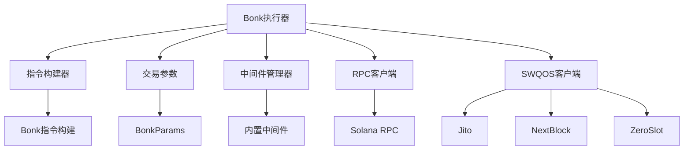
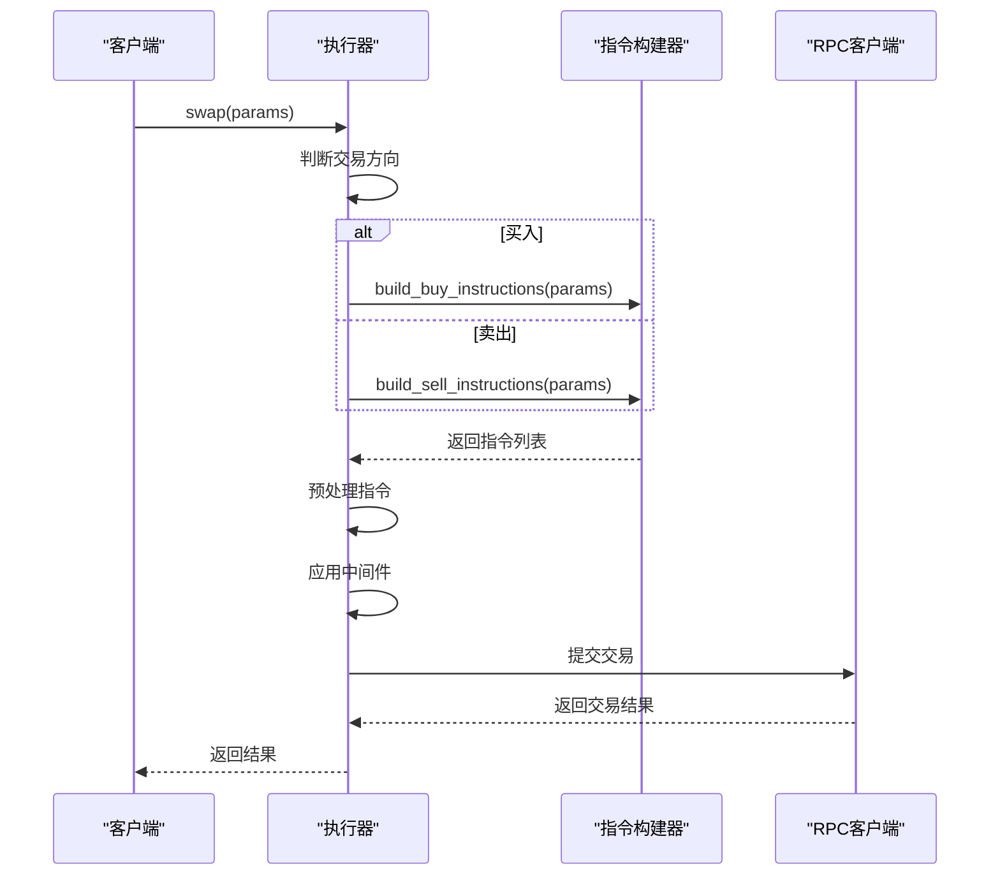
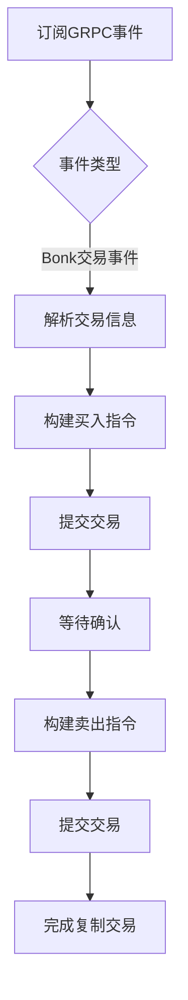
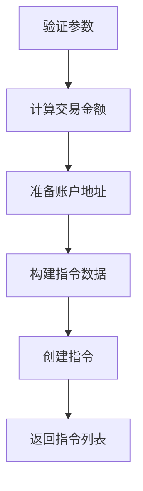
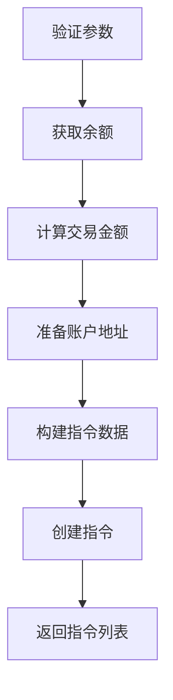
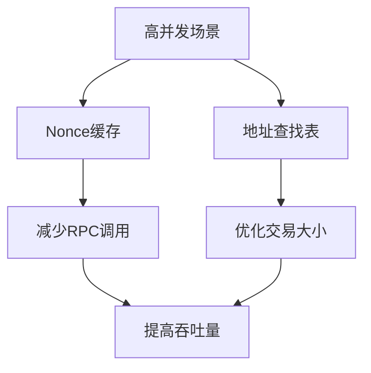

# Bonk 执行器

<cite>
**本文档中引用的文件**   
- [executor.rs](file://src/trading/core/executor.rs)
- [bonk.rs](file://src/instruction/bonk.rs)
- [bonk_types.rs](file://src/instruction/utils/bonk_types.rs)
- [bonk_utils.rs](file://src/instruction/utils/bonk.rs)
- [params.rs](file://src/trading/core/params.rs)
- [transaction_builder.rs](file://src/trading/common/transaction_builder.rs)
- [compute_budget_manager.rs](file://src/trading/common/compute_budget_manager.rs)
- [nonce_cache.rs](file://src/common/nonce_cache.rs)
- [address_lookup.rs](file://src/common/address_lookup.rs)
- [fast_fn.rs](file://src/common/fast_fn.rs)
- [main.rs](file://examples/bonk_copy_trading/src/main.rs)
- [NONCE_CACHE_CN.md](file://docs/NONCE_CACHE_CN.md)
- [TRADING_PARAMETERS_CN.md](file://docs/TRADING_PARAMETERS_CN.md)
</cite>

## 目录
1. [引言](#引言)
2. [Bonk执行器架构](#bonk执行器架构)
3. [交易执行逻辑](#交易执行逻辑)
4. [复制交易策略实现](#复制交易策略实现)
5. [指令构建机制](#指令构建机制)
6. [价格监控与实时跟随](#价格监控与实时跟随)
7. [高并发优化](#高并发优化)
8. [配置示例](#配置示例)
9. [交易确认失败分析](#交易确认失败分析)
10. [结论](#结论)

## 引言

Bonk执行器是Solana交易SDK中的核心组件，专门设计用于在Bonk协议上执行高效的交易操作。该执行器不仅支持基本的买卖交易，还特别优化了复制交易（Copy Trading）策略，能够实时跟随目标交易并快速执行。通过集成价格监控模块、Nonce缓存和地址查找表等高级功能，Bonk执行器能够在高并发场景下保持卓越的性能和可靠性。

**Section sources**
- [executor.rs](file://src/trading/core/executor.rs#L1-L288)
- [bonk.rs](file://src/instruction/bonk.rs#L1-L332)

## Bonk执行器架构

Bonk执行器采用模块化设计，主要由以下几个核心组件构成：



**Diagram sources**
- [executor.rs](file://src/trading/core/executor.rs#L30-L44)
- [params.rs](file://src/trading/core/params.rs#L344-L379)

## 交易执行逻辑

Bonk执行器的交易执行逻辑主要通过`GenericTradeExecutor`结构体实现。该结构体实现了`TradeExecutor` trait，提供了`swap`方法来执行交易。`swap`方法首先判断交易方向（买入或卖出），然后调用相应的指令构建方法，最后提交交易。



**Diagram sources**
- [executor.rs](file://src/trading/core/executor.rs#L45-L177)
- [transaction_builder.rs](file://src/trading/common/transaction_builder.rs#L18-L122)

## 复制交易策略实现

复制交易策略通过监听GRPC事件来实现。当检测到目标交易时，执行器会立即构建并提交相应的交易指令。`bonk_copy_trading`示例展示了如何使用Yellowstone GRPC订阅Bonk交易事件，并在事件触发时执行复制交易。



**Diagram sources**
- [main.rs](file://examples/bonk_copy_trading/src/main.rs#L85-L236)
- [executor.rs](file://src/trading/core/executor.rs#L132-L150)

## 指令构建机制

Bonk执行器通过`BonkInstructionBuilder`结构体构建与Bonk协议兼容的指令。`build_buy_instructions`和`build_sell_instructions`方法根据交易参数生成相应的指令列表。这些方法处理Bonk协议独特的代币经济模型和交易费用结构，确保交易的正确性和高效性。

### 买入指令构建



**Diagram sources**
- [bonk.rs](file://src/instruction/bonk.rs#L30-L173)

### 卖出指令构建



**Diagram sources**
- [bonk.rs](file://src/instruction/bonk.rs#L176-L329)

## 价格监控与实时跟随

Bonk执行器通过集成价格监控模块实现对目标交易的实时跟随。价格监控模块使用Yellowstone GRPC订阅交易事件，并在事件触发时立即执行相应的交易指令。这种实时跟随机制确保了执行器能够在最短时间内响应市场变化，提高交易成功率。

**Section sources**
- [main.rs](file://examples/bonk_copy_trading/src/main.rs#L32-L82)
- [swqos/mod.rs](file://src/swqos/mod.rs#L1-L344)

## 高并发优化

在高并发场景下，Bonk执行器利用Nonce缓存和地址查找表优化交易吞吐量。Nonce缓存通过`fetch_nonce_info`函数从RPC获取Nonce信息，并在交易中复用，减少RPC调用次数。地址查找表通过`fetch_address_lookup_table_account`函数获取，用于优化交易大小和执行速度。



**Diagram sources**
- [nonce_cache.rs](file://src/common/nonce_cache.rs#L1-L42)
- [address_lookup.rs](file://src/common/address_lookup.rs#L1-L18)

## 配置示例

以下是一个配置示例，展示如何设置交易参数以适应Bonk网络的波动性：

```rust
let gas_fee_strategy = GasFeeStrategy::new();
gas_fee_strategy.set_global_fee_strategy(
    150000,
    150000,
    500000,
    500000,
    0.001,
    0.001,
    256 * 1024,
    0,
);
```

此配置设置了计算单元价格、计算单元限制和小费等参数，以确保交易在高波动性网络中仍能成功执行。

**Section sources**
- [main.rs](file://examples/bonk_copy_trading/src/main.rs#L129-L139)
- [TRADING_PARAMETERS_CN.md](file://docs/TRADING_PARAMETERS_CN.md#L1-L188)

## 交易确认失败分析

交易确认失败的常见原因包括网络拥堵、Nonce冲突和余额不足。恢复策略包括重试交易、更新Nonce和检查余额。通过合理配置Gas费用和使用Nonce缓存，可以显著降低交易失败的概率。

**Section sources**
- [executor.rs](file://src/trading/core/executor.rs#L171-L172)
- [NONCE_CACHE_CN.md](file://docs/NONCE_CACHE_CN.md#L1-L74)

## 结论

Bonk执行器通过其高效的指令构建机制、实时价格监控和高并发优化，为在Bonk协议上执行交易提供了强大的支持。通过合理配置交易参数和使用高级功能，用户可以在高波动性网络中实现稳定和高效的交易。