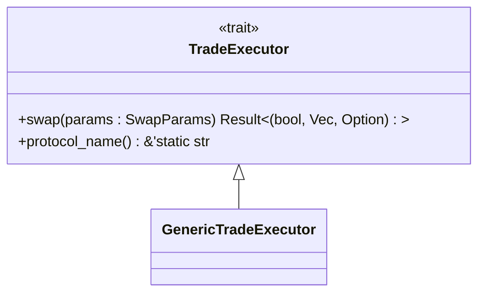
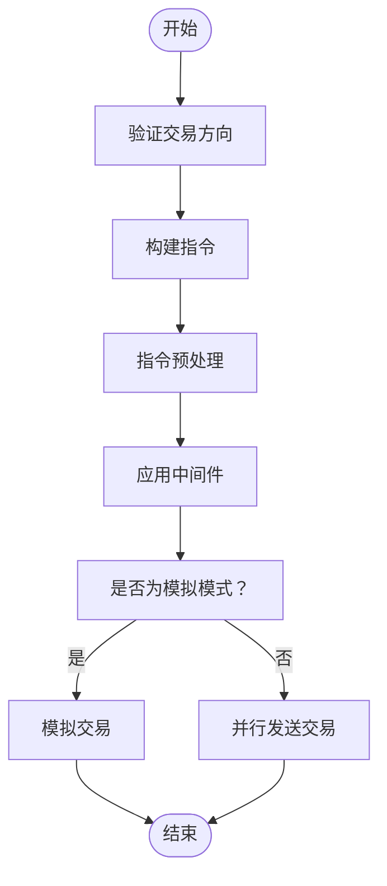
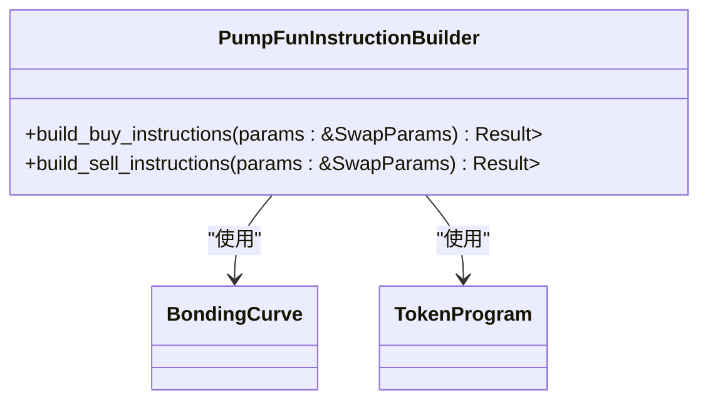
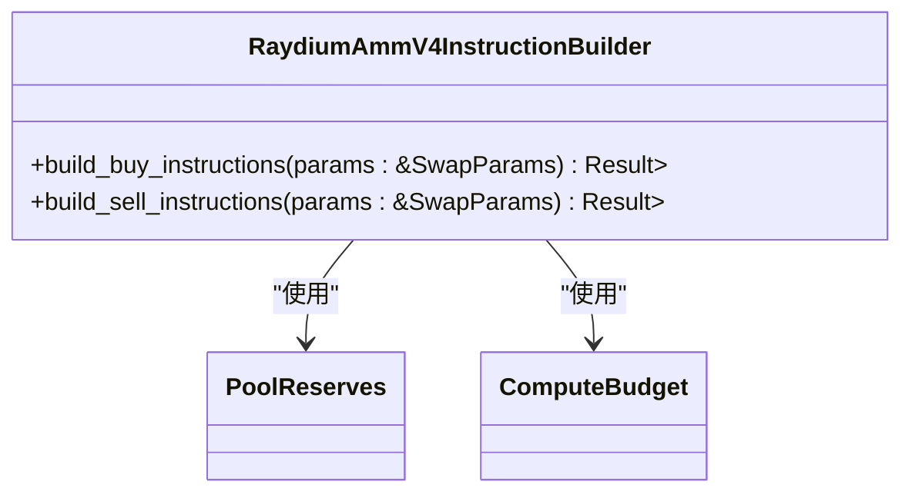
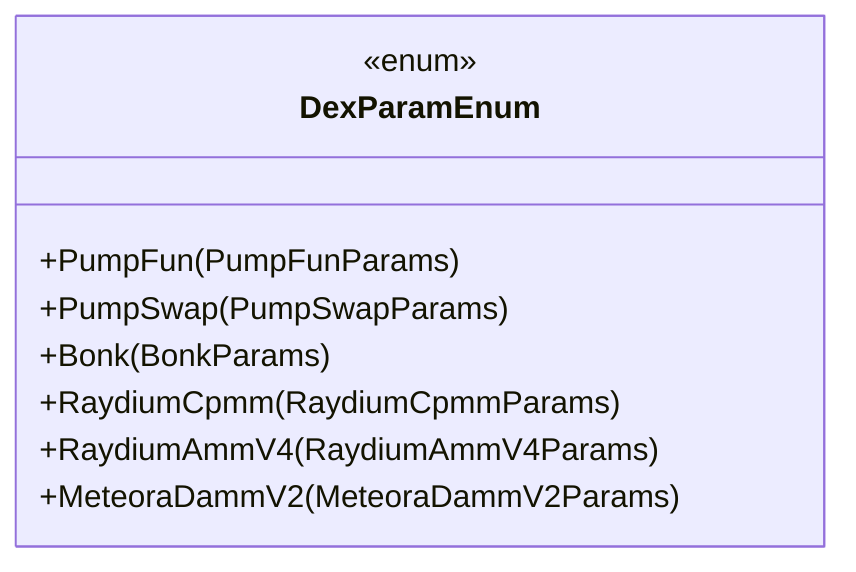
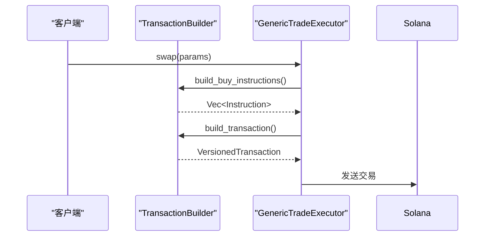
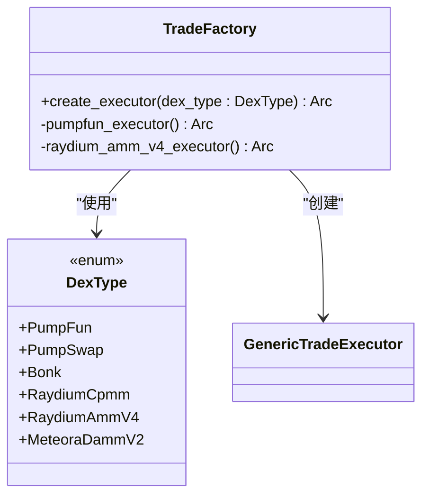
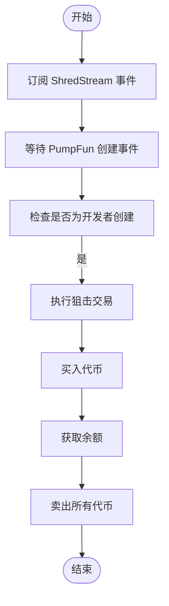
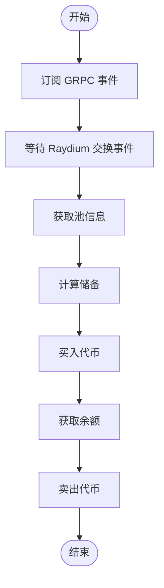

# DexExecutor 执行器接口

<cite>
**本文档引用的文件**  
- [traits.rs](file://src/trading/core/traits.rs)
- [executor.rs](file://src/trading/core/executor.rs)
- [transaction_builder.rs](file://src/trading/common/transaction_builder.rs)
- [pumpfun.rs](file://src/instruction/pumpfun.rs)
- [raydium_amm_v4.rs](file://src/instruction/raydium_amm_v4.rs)
- [params.rs](file://src/trading/core/params.rs)
- [factory.rs](file://src/trading/factory.rs)
- [pumpfun_sniper_trading/src/main.rs](file://examples/pumpfun_sniper_trading/src/main.rs)
- [raydium_amm_v4_trading/src/main.rs](file://examples/raydium_amm_v4_trading/src/main.rs)
</cite>

## 目录
1. [接口定义](#接口定义)
2. [执行流程](#执行流程)
3. [具体实现](#具体实现)
4. [交易参数](#交易参数)
5. [指令构建](#指令构建)
6. [执行器工厂](#执行器工厂)
7. [使用示例](#使用示例)
8. [调试提示](#调试提示)

## 接口定义

`DexExecutor` 接口在代码库中通过 `TradeExecutor` trait 实现，定义了所有 DEX 执行器必须实现的核心方法。该 trait 提供了异步的 swap 方法，用于执行交易操作。

**接口规范**：
- `swap` 方法接收 `SwapParams` 参数，返回一个元组，包含交易成功状态、交易签名列表和可能的错误信息
- `protocol_name` 方法返回协议名称，用于标识执行器类型

**接口来源**
- [traits.rs](file://src/trading/core/traits.rs#L5-L15)

## 执行流程

`GenericTradeExecutor` 是 `TradeExecutor` trait 的通用实现，负责协调整个交易执行流程。它通过组合 `InstructionBuilder` 来构建特定于协议的指令。

执行流程包括以下步骤：
1. 判断买卖方向
2. 构建指令（调用 `InstructionBuilder`）
3. 指令预处理
4. 应用中间件处理
5. 提交交易或模拟交易

**执行流程来源**
- [executor.rs](file://src/trading/core/executor.rs#L45-L177)

## 具体实现

### PumpFunExecutor 实现

`PumpFunInstructionBuilder` 为 PumpFun 协议提供特定的指令构建逻辑。它实现了 `InstructionBuilder` trait，负责构建买入和卖出指令。

**买入逻辑**：
- 计算购买代币数量
- 验证输入金额
- 构建关联代币账户（如果需要）
- 创建购买指令

**卖出逻辑**：
- 计算 SOL 收益
- 处理滑点
- 可选择关闭代币账户

**PumpFun 实现来源**
- [pumpfun.rs](file://src/instruction/pumpfun.rs#L23-L291)

### RaydiumAmmV4Executor 实现

`RaydiumAmmV4InstructionBuilder` 为 Raydium AMM V4 协议提供指令构建。与 PumpFun 不同，它需要处理流动性池的储备计算。

**核心特点**：
- 验证池必须包含 WSOL 或 USDC
- 计算交换金额和最小输出
- 处理 wSOL 的创建和关闭

**RaydiumAmmV4 实现来源**
- [raydium_amm_v4.rs](file://src/instruction/raydium_amm_v4.rs#L16-L252)

## 交易参数

`SwapParams` 结构体定义了交易所需的所有参数，包括通用参数和特定于协议的参数。

### 通用参数
| 参数 | 类型 | 描述 |
|------|------|------|
| rpc | Option<Arc<SolanaRpcClient>> | RPC 客户端 |
| payer | Arc<Keypair> | 付款人密钥对 |
| trade_type | TradeType | 交易类型（买入/卖出） |
| input_mint | Pubkey | 输入代币 mint 地址 |
| output_mint | Pubkey | 输出代币 mint 地址 |
| input_amount | Option<u64> | 输入金额 |
| slippage_basis_points | Option<u64> | 滑点（基点） |

### 协议特定参数
通过 `DexParamEnum` 枚举支持不同 DEX 的特定参数：

**交易参数来源**
- [params.rs](file://src/trading/core/params.rs#L43-L709)

## 指令构建

`TransactionBuilder` 负责将业务指令转换为符合 Solana 协议的交易。它通过 `build_transaction` 函数实现。

### 构建流程
1. 添加 nonce 指令
2. 添加小费转移指令（如果需要）
3. 添加计算预算指令
4. 添加业务指令
5. 构建版本化交易

**指令构建来源**
- [transaction_builder.rs](file://src/trading/common/transaction_builder.rs#L18-L122)

## 执行器工厂

`TradeFactory` 负责创建不同 DEX 的执行器实例。它使用单例模式确保每个 DEX 类型只有一个执行器实例。

**工厂模式优势**：
- 零运行时开销
- 线程安全
- 懒加载实例

**执行器工厂来源**
- [factory.rs](file://src/trading/factory.rs#L1-L99)

## 使用示例

### PumpFun 狙击交易

**PumpFun 使用示例来源**
- [pumpfun_sniper_trading/src/main.rs](file://examples/pumpfun_sniper_trading/src/main.rs#L1-L166)

### Raydium AMM V4 复制交易

**Raydium 使用示例来源**
- [raydium_amm_v4_trading/src/main.rs](file://examples/raydium_amm_v4_trading/src/main.rs#L1-L222)

## 调试提示

### 常见异常捕获

1. **参数验证异常**：
   - 检查 `input_amount` 是否为零
   - 验证 `mint` 地址是否有效
   - 确认滑点设置是否合理

2. **协议特定异常**：
   - PumpFun：检查 bonding curve 是否有效
   - Raydium：验证池是否包含 WSOL 或 USDC

3. **交易构建异常**：
   - 检查 nonce 配置
   - 验证计算预算设置
   - 确认关联代币账户存在

### 调试策略

1. **模拟模式**：
   - 使用 `simulate: true` 参数测试交易
   - 检查返回的错误信息和日志

2. **性能监控**：
   - 启用 `perf-trace` 特性
   - 监控指令构建和发送时间

3. **日志分析**：
   - 查看交易日志中的 inner instructions
   - 检查计算单元消耗

**调试提示来源**
- [executor.rs](file://src/trading/core/executor.rs#L180-L287)
- [pumpfun.rs](file://src/instruction/pumpfun.rs#L28-L291)
- [raydium_amm_v4.rs](file://src/instruction/raydium_amm_v4.rs#L21-L252)