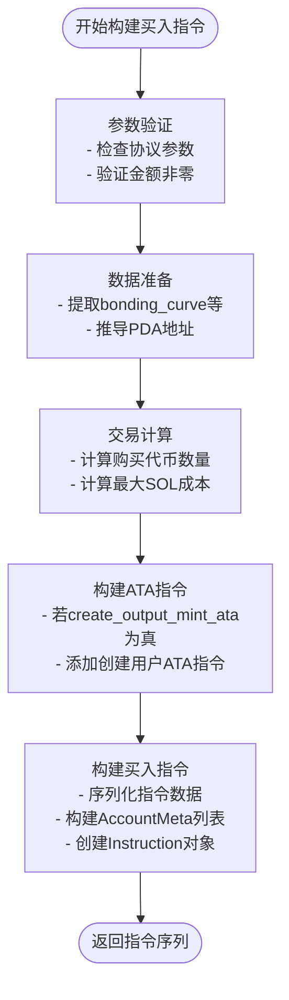
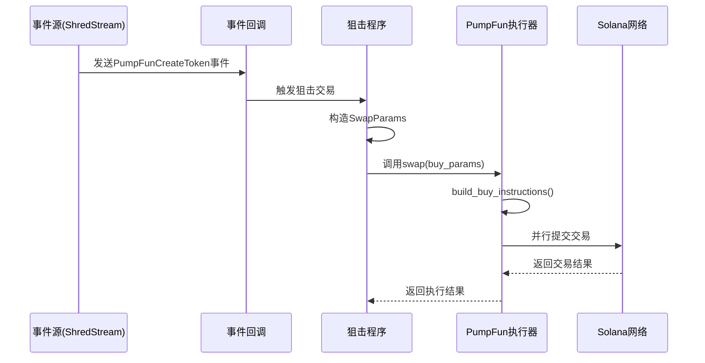

# PumpFun 执行器

<cite>
**本文档引用的文件**  
- [executor.rs](file://src/trading/core/executor.rs)
- [pumpfun.rs](file://src/instruction/pumpfun.rs)
- [pumpfun.rs](file://src/utils/calc/pumpfun.rs)
- [pumpfun.rs](file://src/utils/price/pumpfun.rs)
- [params.rs](file://src/trading/core/params.rs)
- [main.rs](file://examples/pumpfun_sniper_trading/src/main.rs)
- [bonding_curve.rs](file://src/common/bonding_curve.rs)
</cite>

## 目录
1. [简介](#简介)
2. [核心架构与执行流程](#核心架构与执行流程)
3. [PumpFun 指令构建机制](#pumpfun-指令构建机制)
4. [价格计算与最优买入时机](#价格计算与最优买入时机)
5. [狙击交易实战配置](#狙击交易实战配置)
6. [常见问题与调试策略](#常见问题与调试策略)
7. [结论](#结论)

## 简介
本文档深入解析 `PumpFunExecutor` 的实现机制，重点阐述其在狙击交易场景下的特殊逻辑。我们将详细说明 `build_buy_instructions` 方法如何根据 `SwapParams` 构建符合 PumpFun 协议的指令序列，包括创建代币账户、执行买入指令的顺序与参数构造。同时，解释价格计算模块（`pumpfun_price`）如何与执行器协同工作以确定最优买入时机，并描述执行器如何处理 PumpFun 特有的交易限制（如初始流动性创建）。最后提供实际代码示例展示如何配置 `SwapParams` 以实现快速狙击，并说明常见错误（如交易失败、滑点过大）的调试方法与解决方案。

## 核心架构与执行流程
`PumpFunExecutor` 基于通用交易执行器 `GenericTradeExecutor` 实现，通过依赖注入的方式将 `PumpFunInstructionBuilder` 作为指令构建器。其核心执行流程如下：

1. **参数解析与方向判断**：根据 `SwapParams` 中的 `trade_type` 判断是买入还是卖出操作。
2. **指令构建**：调用 `instruction_builder.build_buy_instructions()` 或 `build_sell_instructions()` 生成协议特定的指令序列。
3. **预处理与中间件处理**：对指令进行预处理，并通过中间件链（如手续费优化、地址查找表注入）进行增强。
4. **执行模式选择**：支持模拟模式（simulate）和真实交易模式。模拟模式通过 RPC 验证交易可行性，真实模式则通过多 SWQOS 客户端并行提交交易以提高成功率。
5. **性能监控**：集成系统调用绕过技术（`SystemCallBypassManager`）获取高精度时间戳，用于分析各阶段耗时。

该架构实现了协议无关的执行逻辑与协议相关的指令构建之间的解耦，确保了代码的可扩展性和高性能。

**Section sources**
- [executor.rs](file://src/trading/core/executor.rs#L30-L288)

## PumpFun 指令构建机制

### 买入指令构建流程
`build_buy_instructions` 方法负责构建符合 PumpFun 协议的买入指令序列。其核心逻辑分为三个阶段：

#### 1. 参数验证与数据准备
- 验证 `SwapParams` 中的协议参数是否为有效的 `PumpFunParams`。
- 检查输入金额是否为零，防止无效交易。
- 提取 `bonding_curve`、`creator_vault_pda` 和 `creator` 等关键账户信息。

#### 2. 交易计算与账户地址生成
- **代币数量计算**：根据 `fixed_output_amount` 是否指定，选择直接使用固定输出量或调用 `get_buy_token_amount_from_sol_amount` 计算预期可购买的代币数量。
- **最大成本计算**：使用 `calculate_with_slippage_buy` 计算包含滑点容忍度的最大 SOL 成本。
- **PDA 地址推导**：
  - `bonding_curve_addr`：通过 `get_bonding_curve_pda` 根据代币 Mint 地址推导。
  - `associated_bonding_curve`：通过 `get_associated_token_address_with_program_id_fast` 计算绑定曲线的关联代币账户。
  - `user_token_account`：计算用户钱包的关联代币账户，支持 Seed 优化。
  - `user_volume_accumulator`：通过 `get_user_volume_accumulator_pda` 推导用户交易量累加器 PDA。

#### 3. 指令序列构建
- **创建关联代币账户（ATA）**：如果 `create_output_mint_ata` 为真，则添加创建用户代币账户的指令。
- **构建买入指令**：
  - **数据序列化**：构造 24 字节的指令数据，前 8 字节为方法 ID `[102, 6, 61, 18, 1, 218, 235, 234]`，中间 8 字节为购买的代币数量（小端序），后 8 字节为最大 SOL 成本（小端序）。
  - **账户列表**：构建包含 16 个账户的 `AccountMeta` 数组，涵盖全局账户、费用接收者、代币 Mint、绑定曲线、用户账户、系统程序、代币程序、创建者金库等。
  - **指令创建**：调用 `Instruction::new_with_bytes` 创建最终的买入指令。

**Diagram sources**
- [pumpfun.rs](file://src/instruction/pumpfun.rs#L28-L157)

**Section sources**
- [pumpfun.rs](file://src/instruction/pumpfun.rs#L28-L157)
- [params.rs](file://src/trading/core/params.rs#L82-L203)

### 卖出指令构建流程
`build_sell_instructions` 方法的流程与买入类似，但有以下关键区别：
- **交易计算**：调用 `get_sell_sol_amount_from_token_amount` 计算卖出代币后预期获得的 SOL 数量，并使用 `calculate_with_slippage_sell` 计算最小接收量。
- **指令数据**：方法 ID 为 `[51, 230, 133, 164, 1, 127, 131, 173]`，数据结构为 [方法ID, 卖出代币数量, 最小SOL接收量]。
- **账户列表**：包含 14 个账户，与买入指令略有不同。
- **可选关闭账户**：根据 `close_token_account_when_sell` 参数，可选择在卖出后添加 `close_account` 指令以回收租金。

## 价格计算与最优买入时机

### 价格计算模块
`pumpfun_price` 模块提供了 `price_token_in_sol` 函数，用于计算代币的实时价格。其计算逻辑如下：
- **单位转换**：将虚拟 SOL 储备（`virtual_sol_reserves`）从 Lamports 转换为 SOL（除以 `LAMPORTS_PER_SOL`），将虚拟代币储备（`virtual_token_reserves`）除以 `SCALE`（100,000）。
- **价格计算**：使用公式 `价格 = 虚拟SOL储备 / 虚拟代币储备` 计算每代币的 SOL 价格。

此价格反映了当前市场供需关系，是判断买入时机的重要依据。

### 与执行器的协同工作
执行器本身不直接决定买入时机，而是依赖外部信号（如 ShredStream 事件）来触发交易。然而，价格计算模块为狙击策略提供了关键支持：
1. **事件驱动**：示例代码 `pumpfun_sniper_trading` 使用 `ShredStreamGrpc` 订阅 PumpFun 的 `PumpFunCreateToken` 事件。
2. **即时执行**：一旦捕获到新代币创建事件（`is_dev_create_token_trade` 为真），立即使用 `PumpFunParams::from_dev_trade` 构造参数并执行买入。
3. **最优时机**：在代币创建的瞬间买入，此时价格最低，是获取最大收益的“最优买入时机”。

这种“事件监听 + 即时执行”的模式，结合低延迟的交易通道（SWQOS），构成了高效的狙击策略。

**Diagram sources**
- [pumpfun.rs](file://src/utils/price/pumpfun.rs#L1-L19)
- [main.rs](file://examples/pumpfun_sniper_trading/src/main.rs#L28-L165)

**Section sources**
- [pumpfun.rs](file://src/utils/price/pumpfun.rs#L1-L19)
- [main.rs](file://examples/pumpfun_sniper_trading/src/main.rs#L28-L165)

## 狙击交易实战配置
以下是配置 `SwapParams` 实现快速狙击的关键参数说明：

### 核心参数配置
| 参数 | 说明 | 示例值 |
| :--- | :--- | :--- |
| `dex_type` | 交易类型 | `DexType::PumpFun` |
| `input_token_type` | 输入代币类型 | `TradeTokenType::SOL` |
| `mint` | 目标代币Mint地址 | `trade_info.mint` |
| `input_token_amount` | 输入的SOL金额（Lamports） | `100_000` (0.0001 SOL) |
| `slippage_basis_points` | 滑点容忍度（基点） | `Some(300)` (3%) |
| `extension_params` | 扩展参数 | `DexParamEnum::PumpFun(PumpFunParams::from_dev_trade(...))` |
| `wait_transaction_confirmed` | 是否等待交易确认 | `true` |
| `create_mint_ata` | 是否创建用户代币账户 | `true` |
| `simulate` | 是否为模拟模式 | `false` |

### `PumpFunParams` 构造
- **狙击新代币**：使用 `PumpFunParams::from_dev_trade`，传入从 `PumpFunTradeEvent` 事件中获取的 `mint`、`token_amount`、`max_sol_cost`、`creator`、`bonding_curve` 等信息。
- **常规交易**：使用 `PumpFunParams::from_trade`，传入已知的市场状态信息。

### 性能优化配置
- **手续费策略**：通过 `GasFeeStrategy` 设置高优先费和计算单元价格，确保交易快速上链。
- **地址查找表**：利用 `address_lookup_table_account` 减少交易大小，提高打包效率。
- **种子优化**：启用 `open_seed_optimize` 以加速关联代币账户的创建。

## 常见问题与调试策略

### 常见错误
1. **交易失败**：
   - **原因**：余额不足、无效签名、指令错误、网络拥塞。
   - **调试**：检查 `simulate_transaction` 的返回日志，特别是 `inner_instructions` 和 `logs`，定位具体失败原因。
2. **滑点过大**：
   - **原因**：市场波动剧烈，或 `slippage_basis_points` 设置过低。
   - **调试**：提高 `slippage_basis_points` 的值，或在市场更稳定时执行交易。
3. **账户未找到**：
   - **原因**：未正确创建关联代币账户（ATA）。
   - **调试**：确保 `create_output_mint_ata` 设置为 `true`，或在交易前手动创建 ATA。

### 解决方案
- **启用模拟模式**：在真实交易前，将 `simulate` 设置为 `true` 进行验证。
- **增加日志**：启用 `perf-trace` 特性，获取详细的性能指标和交易日志。
- **重试机制**：对于非致命错误（如网络超时），实现指数退避重试。
- **监控工具**：使用 Solana 区块浏览器（如 Solscan）查询交易哈希，进行链上状态分析。

## 结论
`PumpFunExecutor` 是一个高度优化的交易执行器，专为 Solana 上的 PumpFun 协议设计，尤其适用于低延迟的狙击交易场景。其核心优势在于：
1. **模块化设计**：清晰分离了执行逻辑与指令构建，便于维护和扩展。
2. **高性能**：集成系统调用绕过、并行交易提交等技术，最大限度降低延迟。
3. **灵活性**：通过 `SwapParams` 和 `PumpFunParams` 提供了丰富的配置选项，适应多种交易策略。
4. **健壮性**：内置模拟模式和详细的错误处理，便于开发和调试。

通过结合实时事件流（如 ShredStream）和精心配置的 `SwapParams`，开发者可以构建出高效、可靠的 PumpFun 狙击机器人，在竞争激烈的市场中抢占先机。