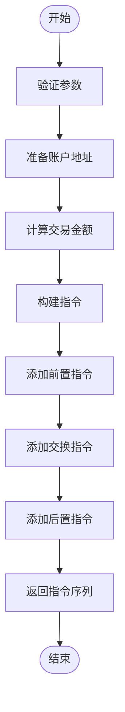
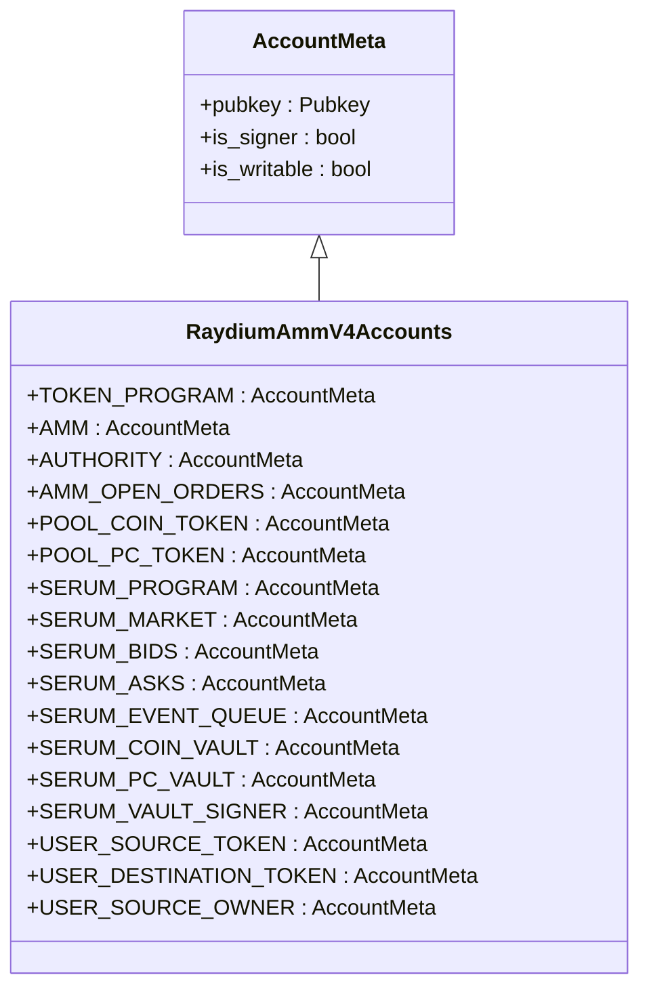
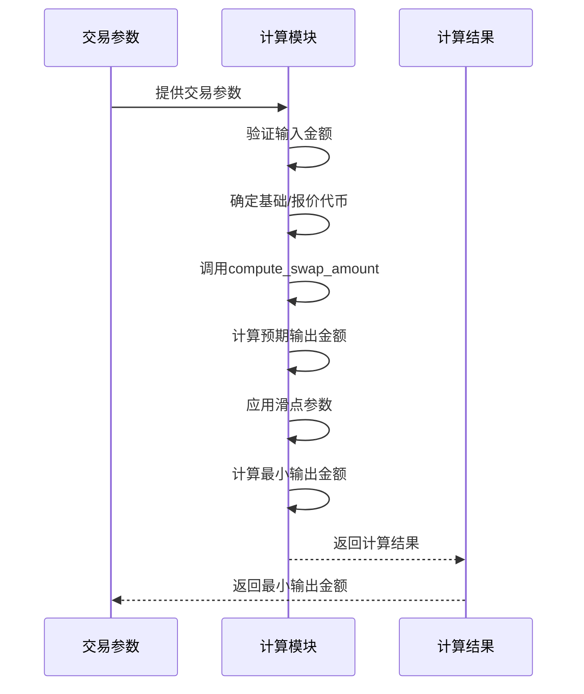
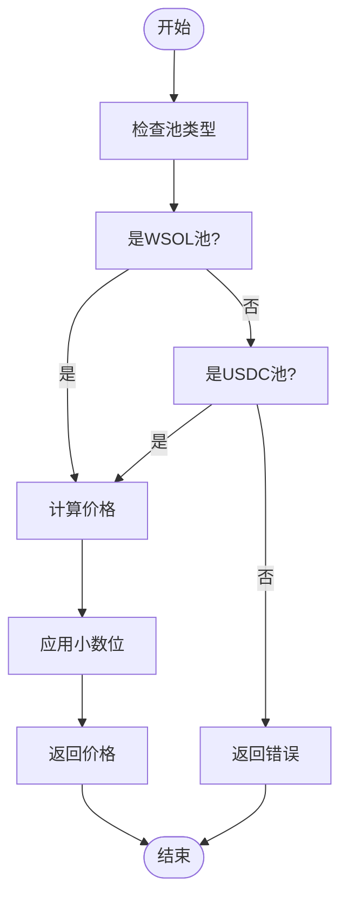
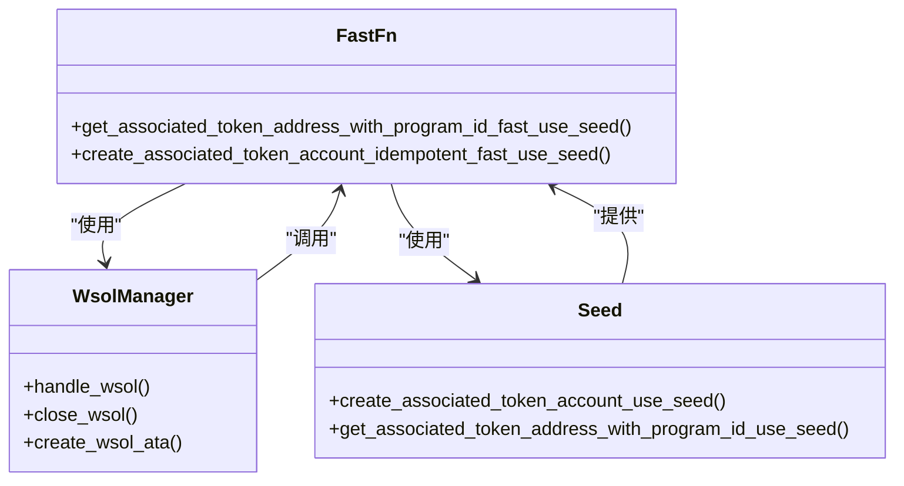
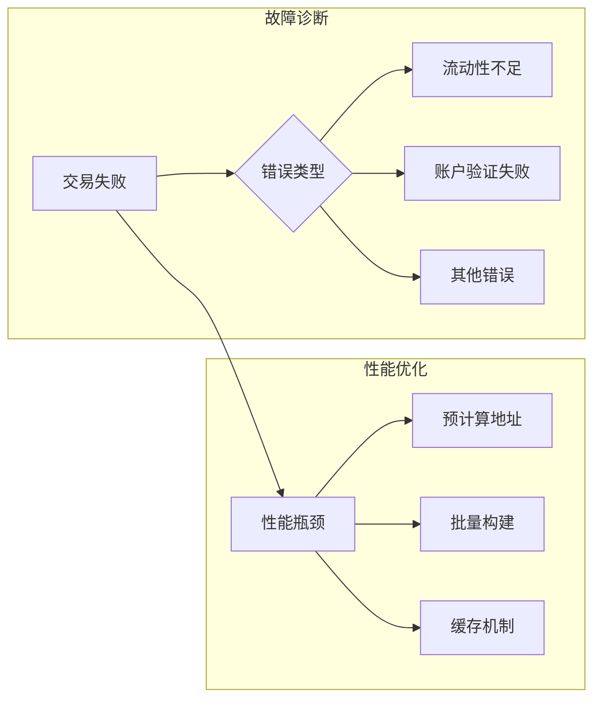

# Raydium AMM V4 执行器

<cite>
**本文档引用的文件**
- [raydium_amm_v4.rs](file://src/instruction/raydium_amm_v4.rs)
- [raydium_amm_v4_types.rs](file://src/instruction/utils/raydium_amm_v4_types.rs)
- [raydium_amm_v4.rs](file://src/instruction/utils/raydium_amm_v4.rs)
- [raydium_amm_v4.rs](file://src/utils/calc/raydium_amm_v4.rs)
- [raydium_amm_v4.rs](file://src/utils/price/raydium_amm_v4.rs)
- [fast_fn.rs](file://src/common/fast_fn.rs)
- [wsol_manager.rs](file://src/trading/common/wsol_manager.rs)
- [params.rs](file://src/trading/core/params.rs)
- [traits.rs](file://src/trading/core/traits.rs)
- [accounts.rs](file://src/constants/accounts.rs)
</cite>

## 目录
1. [介绍](#介绍)
2. [核心组件](#核心组件)
3. [指令构建机制](#指令构建机制)
4. [账户元数据构造逻辑](#账户元数据构造逻辑)
5. [交易金额计算流程](#交易金额计算流程)
6. [价格计算与池校验](#价格计算与池校验)
7. [种子优化与ATA集成](#种子优化与ata集成)
8. [故障诊断与性能优化](#故障诊断与性能优化)

## 介绍
本文档全面文档化Raydium AMM V4执行器的实现机制，详细说明`RaydiumAmmV4InstructionBuilder`如何实现`InstructionBuilder` trait，构建符合Raydium AMM V4协议标准的交换指令。

## 核心组件

`RaydiumAmmV4InstructionBuilder`是Raydium AMM V4协议的核心指令构建器，实现了`InstructionBuilder` trait，负责构建买入和卖出交易指令。该构建器通过`build_buy_instructions`和`build_sell_instructions`方法生成符合协议标准的Solana指令。

**Section sources**
- [raydium_amm_v4.rs](file://src/instruction/raydium_amm_v4.rs#L17-L252)
- [traits.rs](file://src/trading/core/traits.rs#L17-L26)

## 指令构建机制

`RaydiumAmmV4InstructionBuilder`实现了`InstructionBuilder` trait，提供`build_buy_instructions`和`build_sell_instructions`两个核心方法。这两个方法根据交易参数构建完整的交易指令序列，包括必要的前置和后置操作。

**Diagram sources**
- [raydium_amm_v4.rs](file://src/instruction/raydium_amm_v4.rs#L21-L252)

**Section sources**
- [raydium_amm_v4.rs](file://src/instruction/raydium_amm_v4.rs#L21-L252)

## 账户元数据构造逻辑

`RaydiumAmmV4InstructionBuilder`在构建交换指令时，需要构造17个固定顺序的账户元数据（AccountMeta），这些账户按特定顺序排列，每个账户都有明确的角色和功能。

**Diagram sources**
- [raydium_amm_v4.rs](file://src/instruction/raydium_amm_v4.rs#L100-L118)
- [raydium_amm_v4.rs](file://src/instruction/utils/raydium_amm_v4.rs#L14-L32)

**Section sources**
- [raydium_amm_v4.rs](file://src/instruction/raydium_amm_v4.rs#L100-L118)

## 交易金额计算流程

交易金额计算流程通过`compute_swap_amount`函数实现，结合滑点参数生成最小输出金额。该函数首先验证输入金额，然后计算预期输出金额，并根据滑点参数计算最小可接受输出金额。

**Diagram sources**
- [raydium_amm_v4.rs](file://src/instruction/raydium_amm_v4.rs#L50-L60)
- [raydium_amm_v4.rs](file://src/utils/calc/raydium_amm_v4.rs#L120-L150)

**Section sources**
- [raydium_amm_v4.rs](file://src/instruction/raydium_amm_v4.rs#L47-L60)
- [raydium_amm_v4.rs](file://src/utils/calc/raydium_amm_v4.rs#L120-L150)

## 价格计算与池校验

价格计算函数`price_base_in_quote`在AMM V4中用于计算基础代币相对于报价代币的价格。同时，系统对WSOL/USDC主池实施强制校验逻辑，确保交易池包含WSOL或USDC代币。

**Diagram sources**
- [raydium_amm_v4.rs](file://src/instruction/raydium_amm_v4.rs#L34-L42)
- [raydium_amm_v4.rs](file://src/utils/price/raydium_amm_v4.rs#L11-L23)

**Section sources**
- [raydium_amm_v4.rs](file://src/instruction/raydium_amm_v4.rs#L34-L42)
- [raydium_amm_v4.rs](file://src/utils/price/raydium_amm_v4.rs#L11-L23)

## 种子优化与ATA集成

系统通过种子优化（seed optimize）和关联代币账户（ATA）创建/关闭机制实现高效账户管理。`get_associated_token_address_with_program_id_fast_use_seed`函数用于快速获取关联代币账户地址，支持种子优化。

**Diagram sources**
- [fast_fn.rs](file://src/common/fast_fn.rs#L203-L277)
- [wsol_manager.rs](file://src/trading/common/wsol_manager.rs#L1-L67)

**Section sources**
- [fast_fn.rs](file://src/common/fast_fn.rs#L203-L277)
- [wsol_manager.rs](file://src/trading/common/wsol_manager.rs#L1-L67)

## 故障诊断与性能优化

提供典型交易失败场景的诊断方法和性能优化建议。常见失败场景包括流动性不足和账户验证失败，性能优化建议包括预计算账户地址和批量指令构建。

**Diagram sources**
- [raydium_amm_v4.rs](file://src/instruction/raydium_amm_v4.rs#L25-L27)
- [raydium_amm_v4.rs](file://src/instruction/raydium_amm_v4.rs#L149-L151)

**Section sources**
- [raydium_amm_v4.rs](file://src/instruction/raydium_amm_v4.rs#L25-L27)
- [raydium_amm_v4.rs](file://src/instruction/raydium_amm_v4.rs#L149-L151)