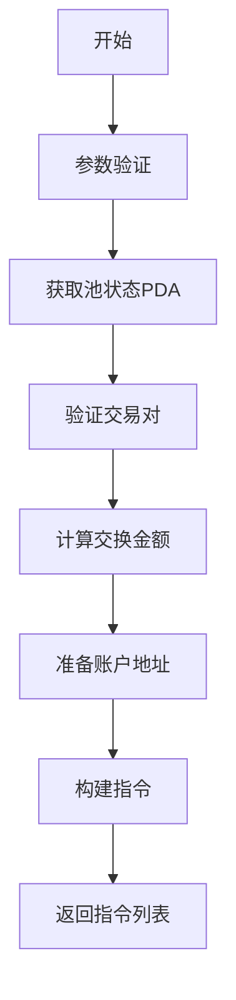
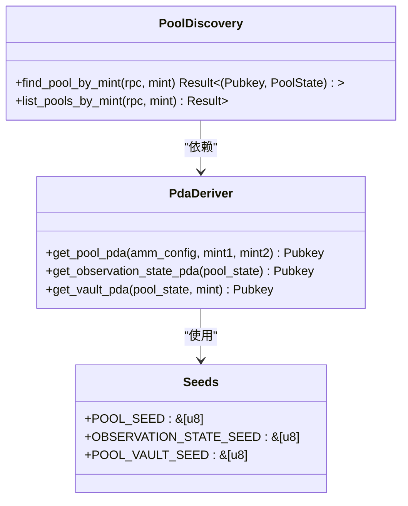
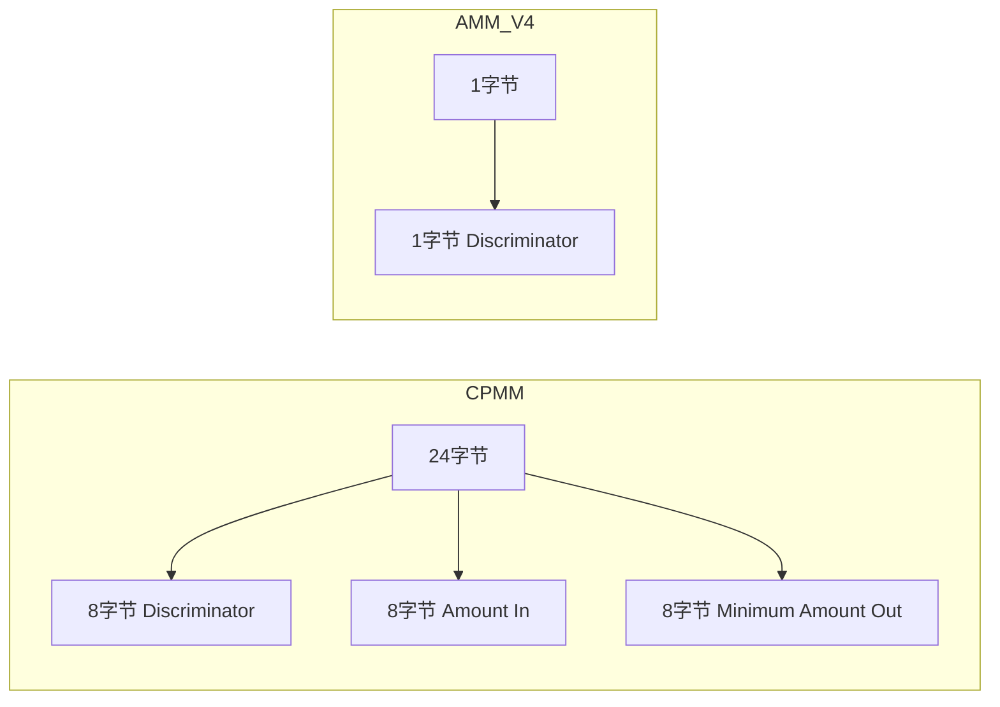
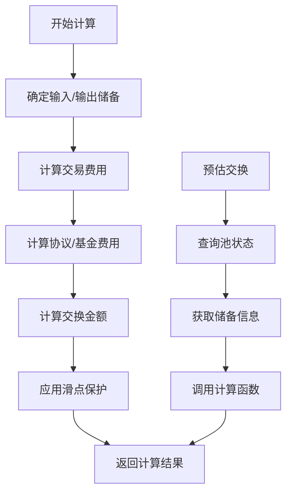
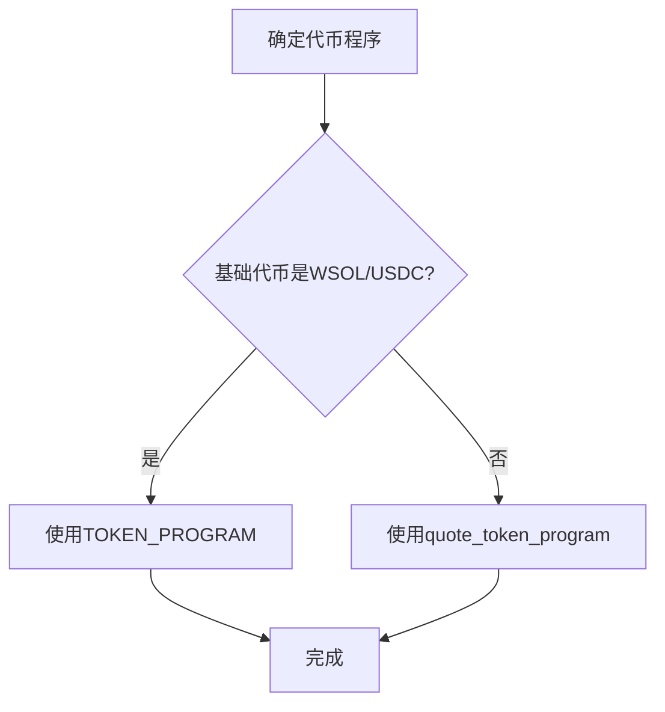
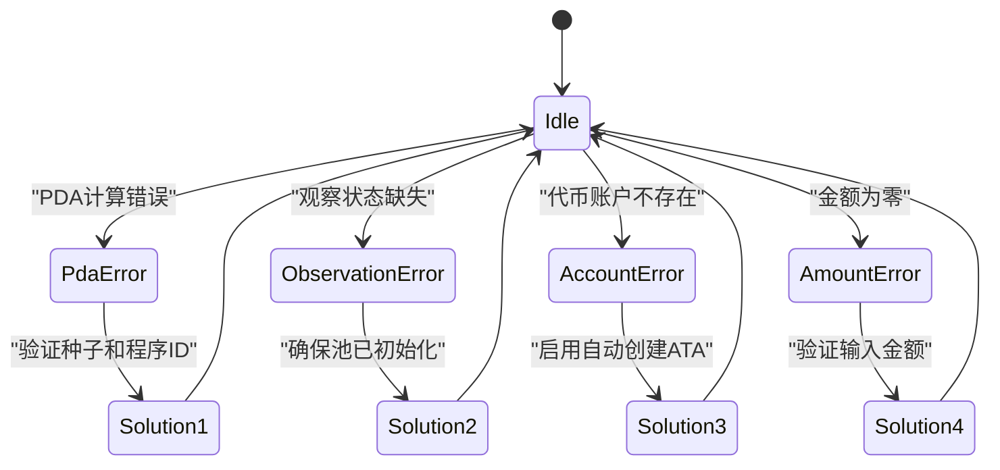

# Raydium CPMM 执行器

<cite>
**本文档引用的文件**
- [raydium_cpmm.rs](file://src/instruction/raydium_cpmm.rs)
- [raydium_cpmm_types.rs](file://src/instruction/utils/raydium_cpmm_types.rs)
- [raydium_cpmm.rs](file://src/instruction/utils/raydium_cpmm.rs)
- [raydium_amm_v4.rs](file://src/instruction/utils/raydium_amm_v4.rs)
- [raydium_amm_v4_types.rs](file://src/instruction/utils/raydium_amm_v4_types.rs)
- [params.rs](file://src/trading/core/params.rs)
- [raydium_cpmm.rs](file://src/utils/calc/raydium_cpmm.rs)
- [accounts.rs](file://src/constants/accounts.rs)
- [trade.rs](file://src/constants/trade.rs)
- [main.rs](file://examples/raydium_cpmm_trading/src/main.rs)
</cite>

## 更新摘要
**已更改内容**
- 新增了池发现功能的详细说明，包括`find_pool_by_mint`和`list_pools_by_mint`函数的实现和使用
- 更新了交换计算逻辑部分，增加了`quote_exact_in`函数的说明
- 扩展了PDA派生逻辑与作用章节，增加了池发现相关的PDA查询机制
- 更新了交换金额计算逻辑部分，增加了链上查询和验证的流程

## 目录
1. [简介](#简介)
2. [核心组件](#核心组件)
3. [指令构建流程](#指令构建流程)
4. [账户元数据构成](#账户元数据构成)
5. [PDA派生逻辑与作用](#pda派生逻辑与作用)
6. [指令数据编码差异](#指令数据编码差异)
7. [交换金额计算逻辑](#交换金额计算逻辑)
8. [双代币程序支持机制](#双代币程序支持机制)
9. [滑点配置建议](#滑点配置建议)
10. [常见错误及解决方案](#常见错误及解决方案)

## 简介
Raydium CPMM执行器是Solana交易SDK中的关键组件，用于构建兼容集中流动性模型的交易指令。该执行器通过`RaydiumCpmmInstructionBuilder`结构体实现，支持买卖操作的指令构建。执行器利用PDA（程序派生地址）机制确保账户安全，并通过精确的数学计算处理交换金额。本文档深入分析其核心实现，包括指令构建、账户管理、PDA派生和错误处理等关键方面。

## 核心组件

`RaydiumCpmmInstructionBuilder`是主要的指令构建器，实现了`InstructionBuilder` trait，提供`build_buy_instructions`和`build_sell_instructions`方法。该构建器依赖多个辅助模块，包括PDA派生函数、交换金额计算和账户管理工具。`RaydiumCpmmParams`结构体封装了协议特定参数，如池状态、配置和储备信息。计算模块`compute_swap_amount`实现了CPMM模型下的交换金额计算逻辑。

**Section sources**
- [raydium_cpmm.rs](file://src/instruction/raydium_cpmm.rs#L21-L308)
- [params.rs](file://src/trading/core/params.rs#L522-L546)

## 指令构建流程

指令构建流程分为三个主要阶段：参数验证、交易计算和指令创建。首先验证输入金额是否为零，并检查协议参数的有效性。然后通过`get_pool_pda`获取池状态PDA，并验证交易对是否包含WSOL或USDC。接着计算交换金额和最小输出金额，准备输入输出代币账户。最后构建包含13个账户元数据的指令，并设置24字节的指令数据。



**Diagram sources**
- [raydium_cpmm.rs](file://src/instruction/raydium_cpmm.rs#L26-L166)

**Section sources**
- [raydium_cpmm.rs](file://src/instruction/raydium_cpmm.rs#L26-L166)

## 账户元数据构成

`build_buy_instructions`方法构建的指令包含13个账户元数据，每个账户都有特定的作用：

1. **Payer**: 交易支付者，签名账户
2. **Authority**: 协议授权账户，只读
3. **Amm Config**: AMM配置账户，只读
4. **Pool State**: 池状态账户
5. **Input Token Account**: 输入代币账户
6. **Output Token Account**: 输出代币账户
7. **Input Vault Account**: 输入金库账户
8. **Output Vault Account**: 输出金库账户
9. **Input Token Program**: 输入代币程序，只读
10. **Output Token Program**: 输出代币程序，只读
11. **Input Token Mint**: 输入代币铸币，只读
12. **Output Token Mint**: 输出代币铸币，只读
13. **Observation State Account**: 观察状态账户

```mermaid
erDiagram
INSTRUCTION ||--o{ ACCOUNT_META : "包含"
ACCOUNT_META {
string role
bool is_signer
bool is_writable
}
ACCOUNT_META }o-- PAYER : "Payer"
ACCOUNT_META }o-- AUTHORITY : "Authority"
ACCOUNT_META }o-- AMM_CONFIG : "Amm Config"
ACCOUNT_META }o-- POOL_STATE : "Pool State"
ACCOUNT_META }o-- INPUT_TOKEN_ACCOUNT : "Input Token Account"
ACCOUNT_META }o-- OUTPUT_TOKEN_ACCOUNT : "Output Token Account"
ACCOUNT_META }o-- INPUT_VAULT_ACCOUNT : "Input Vault Account"
ACCOUNT_META }o-- OUTPUT_VAULT_ACCOUNT : "Output Vault Account"
ACCOUNT_META }o-- INPUT_TOKEN_PROGRAM : "Input Token Program"
ACCOUNT_META }o-- OUTPUT_TOKEN_PROGRAM : "Output Token Program"
ACCOUNT_META }o-- INPUT_TOKEN_MINT : "Input Token Mint"
ACCOUNT_META }o-- OUTPUT_TOKEN_MINT : "Output Token Mint"
ACCOUNT_META }o-- OBSERVATION_STATE_ACCOUNT : "Observation State Account"
```

**Diagram sources**
- [raydium_cpmm.rs](file://src/instruction/raydium_cpmm.rs#L134-L148)

**Section sources**
- [raydium_cpmm.rs](file://src/instruction/raydium_cpmm.rs#L134-L148)

## PDA派生逻辑与作用

### Pool State PDA
`get_pool_pda`函数使用四个种子派生池状态PDA：`"pool"`、AMM配置、基础代币铸币和报价代币铸币。该PDA是池的核心状态账户，存储所有池相关信息。

### Observation State PDA
`get_observation_state_pda`函数使用两个种子派生观察状态PDA：`"observation"`和池状态。该账户用于存储价格观察数据，支持TWAP（时间加权平均价格）计算。

### Vault Account PDA
`get_vault_account`函数使用`get_vault_pda`派生金库账户，种子为`"pool_vault"`、池状态和代币铸币。这些账户存储池中的代币余额。

### 池发现机制
新增了池发现功能，通过`find_pool_by_mint`和`list_pools_by_mint`函数实现。这些函数使用RPC查询在Raydium CPMM程序中查找包含指定代币铸币的池。查询通过`get_program_ui_accounts_with_config`方法执行，使用`DataSize`和`Memcmp`过滤器来定位池状态账户。



**Diagram sources**
- [raydium_cpmm.rs](file://src/instruction/utils/raydium_cpmm.rs#L51-L71)
- [raydium_cpmm.rs](file://src/instruction/utils/raydium_cpmm.rs#L131-L142)
- [raydium_cpmm.rs](file://src/instruction/utils/raydium_cpmm.rs#L134-L239)

**Section sources**
- [raydium_cpmm.rs](file://src/instruction/utils/raydium_cpmm.rs#L51-L71)
- [raydium_cpmm.rs](file://src/instruction/utils/raydium_cpmm.rs#L131-L142)
- [raydium_cpmm.rs](file://src/instruction/utils/raydium_cpmm.rs#L134-L239)

## 指令数据编码差异

CPMM与AMM V4在指令数据编码上有显著差异：

### CPMM指令数据
- **长度**: 24字节
- **Discriminator**: 8字节，值为`[143, 190, 90, 218, 196, 30, 51, 222]`
- **Amount In**: 8字节，小端序
- **Minimum Amount Out**: 8字节，小端序

### AMM V4指令数据
- **长度**: 1字节（仅discriminator）
- **Discriminator**: 1字节，值为`[9]`（买入）或`[11]`（卖出）



**Diagram sources**
- [raydium_cpmm.rs](file://src/instruction/raydium_cpmm.rs#L150-L153)
- [raydium_amm_v4.rs](file://src/instruction/utils/raydium_amm_v4.rs#L34-L35)

**Section sources**
- [raydium_cpmm.rs](file://src/instruction/raydium_cpmm.rs#L150-L153)
- [raydium_amm_v4.rs](file://src/instruction/utils/raydium_amm_v4.rs#L34-L35)

## 交换金额计算逻辑

`compute_swap_amount`函数在集中流动性场景下执行交换金额计算。计算过程考虑交易费用、协议费用和滑点保护。首先确定输入和输出储备，然后调用`swap_base_input`计算交换结果。交易费用使用上限除法计算，而协议和基金费用使用下限除法。最小输出金额通过应用滑点百分比计算得出。

新增了`quote_exact_in`函数，用于在执行交易前预估交换结果。该函数通过RPC查询获取池状态和储备信息，然后调用`compute_swap_amount`进行计算。这为交易者提供了在提交交易前了解预期结果的能力。



**Diagram sources**
- [raydium_cpmm.rs](file://src/utils/calc/raydium_cpmm.rs#L163-L196)
- [raydium_cpmm.rs](file://src/instruction/utils/raydium_cpmm.rs#L104-L132)

**Section sources**
- [raydium_cpmm.rs](file://src/utils/calc/raydium_cpmm.rs#L163-L196)
- [raydium_cpmm.rs](file://src/instruction/utils/raydium_cpmm.rs#L104-L132)

## 双代币程序支持机制

执行器通过动态选择代币程序来支持双代币程序。在买入操作中，如果基础代币是WSOL或USDC，则引用代币程序为`TOKEN_PROGRAM`，否则使用`quote_token_program`。在卖出操作中，根据输出代币类型选择相应的代币程序。这种机制允许执行器处理不同代币标准（如Token和Token-2022）的代币。



**Section sources**
- [raydium_cpmm.rs](file://src/instruction/raydium_cpmm.rs#L64-L70)

## 滑点配置建议

对于高波动性交易，建议采用动态滑点策略：

1. **正常市场**: 使用默认滑点1000（10%）
2. **高波动性**: 将滑点增加到200-500（2-5%）
3. **极端波动**: 可临时提高到1000-2000（10-20%）

滑点值通过`slippage_basis_points`参数传递，如果未指定则使用`DEFAULT_SLIPPAGE`常量。建议在交易前通过市场数据分析确定合适的滑点值，以平衡交易成功率和价格保护。

**Section sources**
- [trade.rs](file://src/constants/trade.rs#L2)
- [raydium_cpmm.rs](file://src/instruction/raydium_cpmm.rs#L78-L79)

## 常见错误及解决方案

### PDA计算错误
**错误**: 池状态PDA计算不正确导致交易失败
**解决方案**: 确保使用正确的种子和程序ID，或通过`RaydiumCpmmParams::from_pool_address_by_rpc`从链上获取正确参数

### 观察状态缺失
**错误**: 观察状态账户不存在或未正确初始化
**解决方案**: 确保池已正确初始化并包含观察状态账户，或使用`get_observation_state_pda`函数正确派生

### 代币账户不存在
**错误**: 输入或输出代币账户未创建
**解决方案**: 设置`create_input_mint_ata`或`create_output_mint_ata`为true，让执行器自动创建关联代币账户

### 金额为零
**错误**: 输入金额为零
**解决方案**: 在构建指令前验证输入金额不为零



**Diagram sources**
- [raydium_cpmm.rs](file://src/instruction/raydium_cpmm.rs#L30-L31)
- [raydium_cpmm.rs](file://src/instruction/raydium_cpmm.rs#L57-L59)

**Section sources**
- [raydium_cpmm.rs](file://src/instruction/raydium_cpmm.rs#L30-L31)
- [raydium_cpmm.rs](file://src/instruction/raydium_cpmm.rs#L57-L59)