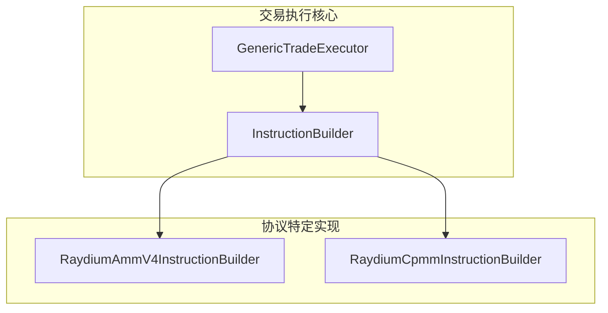
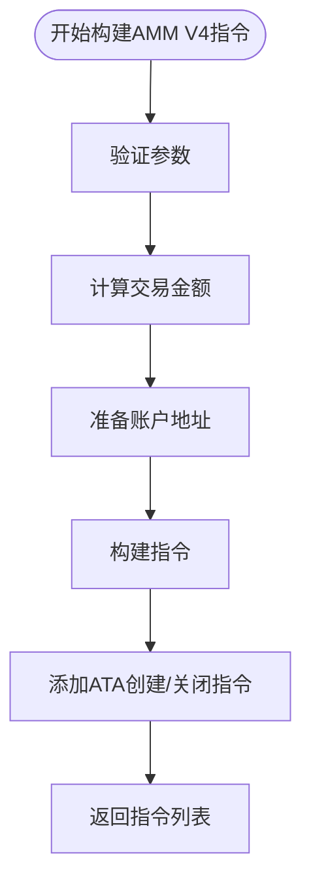
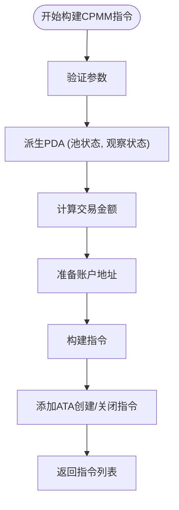
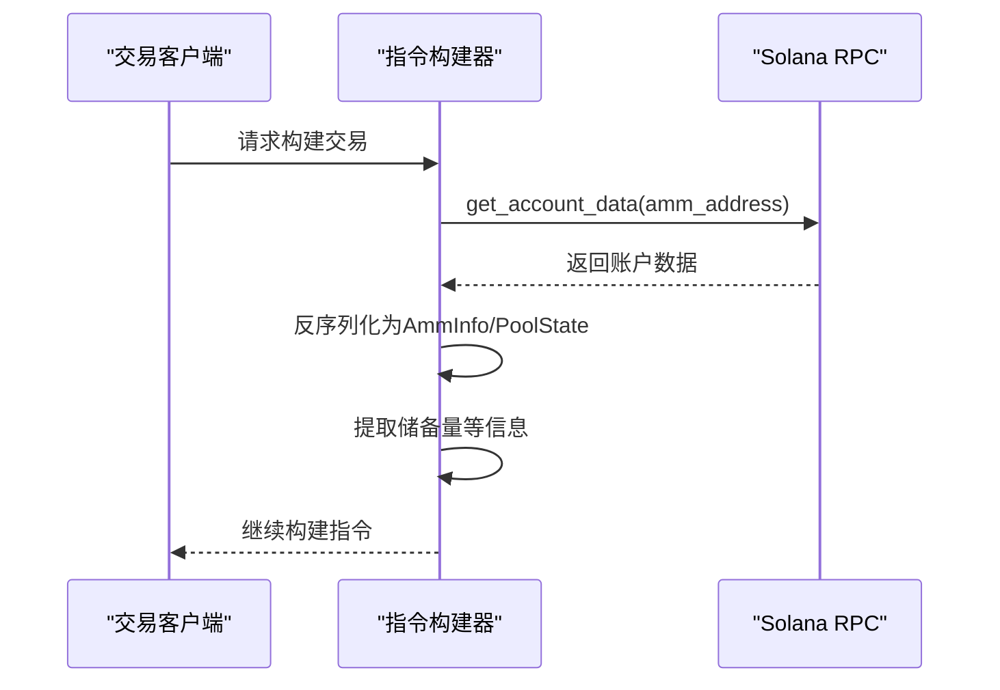
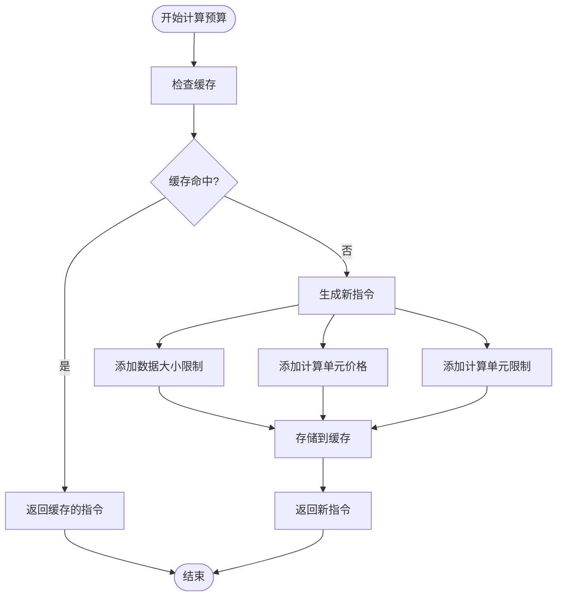

# Raydium 执行器

<cite>
**本文档引用的文件**   
- [raydium_amm_v4.rs](file://src/instruction/raydium_amm_v4.rs)
- [raydium_cpmm.rs](file://src/instruction/raydium_cpmm.rs)
- [executor.rs](file://src/trading/core/executor.rs)
- [transaction_builder.rs](file://src/trading/common/transaction_builder.rs)
- [compute_budget_manager.rs](file://src/trading/common/compute_budget_manager.rs)
- [raydium_amm_v4_types.rs](file://src/instruction/utils/raydium_amm_v4_types.rs)
- [raydium_cpmm_types.rs](file://src/instruction/utils/raydium_cpmm_types.rs)
- [params.rs](file://src/trading/core/params.rs)
- [raydium_amm_v4.rs](file://src/instruction/utils/raydium_amm_v4.rs)
- [raydium_cpmm.rs](file://src/instruction/utils/raydium_cpmm.rs)
- [raydium_amm_v4.rs](file://src/utils/calc/raydium_amm_v4.rs)
- [raydium_cpmm.rs](file://src/utils/price/raydium_cpmm.rs)
- [raydium_amm_v4_trading/main.rs](file://examples/raydium_amm_v4_trading/src/main.rs)
- [raydium_cpmm_trading/main.rs](file://examples/raydium_cpmm_trading/src/main.rs)
</cite>

## 目录
1. [介绍](#介绍)
2. [核心组件](#核心组件)
3. [AMM V4 与 CPMM 协议支持](#amm-v4-与-cpmm-协议支持)
4. [指令构建机制](#指令构建机制)
5. [流动性池状态获取与价格计算](#流动性池状态获取与价格计算)
6. [滑点处理与交易验证](#滑点处理与交易验证)
7. [多跳交易路径支持](#多跳交易路径支持)
8. [计算预算动态调整策略](#计算预算动态调整策略)
9. [性能优化建议](#性能优化建议)
10. [典型交易失败场景诊断](#典型交易失败场景诊断)

## 介绍
本文档全面阐述了Solana交易SDK中Raydium执行器对AMM V4和CPMM协议的支持。文档详细说明了`RaydiumAmmV4Executor`和`RaydiumCpmmExecutor`如何通过`InstructionBuilder`构建符合各自协议标准的交换指令。内容涵盖流动性池状态获取、价格计算（`raydium_amm_v4_price`）与滑点处理的实现细节，以及执行器如何管理多跳交易路径和计算预算（Compute Budget）的动态调整策略。文档还对比了AMM V4与CPMM在指令构建上的关键差异，并提供了性能优化建议和典型交易失败场景的诊断方法。

## 核心组件

本文档分析的核心组件包括`RaydiumAmmV4InstructionBuilder`和`RaydiumCpmmInstructionBuilder`，它们实现了`InstructionBuilder` trait，负责为各自的协议构建交易指令。这些构建器与`GenericTradeExecutor`协同工作，后者是通用的交易执行器，通过组合不同的指令构建器来支持多种DEX协议。

**核心组件来源**
- [raydium_amm_v4.rs](file://src/instruction/raydium_amm_v4.rs#L17-L252)
- [raydium_cpmm.rs](file://src/instruction/raydium_cpmm.rs#L22-L309)
- [executor.rs](file://src/trading/core/executor.rs#L31-L177)

## AMM V4 与 CPMM 协议支持

该SDK通过两个独立的指令构建器为Raydium的AMM V4和CPMM协议提供支持。`RaydiumAmmV4InstructionBuilder`专为AMM V4协议设计，而`RaydiumCpmmInstructionBuilder`则为CPMM（常数乘积做市商）协议设计。这种模块化设计允许SDK灵活地支持不同的交易协议，同时保持代码的清晰和可维护性。

**图示来源**
- [executor.rs](file://src/trading/core/executor.rs#L31-L42)
- [raydium_amm_v4.rs](file://src/instruction/raydium_amm_v4.rs#L17-L252)
- [raydium_cpmm.rs](file://src/instruction/raydium_cpmm.rs#L22-L309)

## 指令构建机制

### AMM V4 指令构建
`RaydiumAmmV4InstructionBuilder`通过`build_buy_instructions`和`build_sell_instructions`方法构建交易指令。其核心流程包括：
1.  **参数验证**：检查输入金额是否为零，并验证协议参数。
2.  **交易计算**：使用`compute_swap_amount`函数计算预期输出金额和最小可接受输出金额（考虑滑点）。
3.  **账户准备**：确定用户输入和输出代币的关联代币账户（ATA）。
4.  **指令构建**：创建一个包含17个账户的`AccountMeta`数组，并将指令数据（包括指令标识符、输入金额和最小输出金额）编码为17字节的数组。

**图示来源**
- [raydium_amm_v4.rs](file://src/instruction/raydium_amm_v4.rs#L21-L249)

### CPMM 指令构建
`RaydiumCpmmInstructionBuilder`的构建流程与AMM V4类似，但存在关键差异：
1.  **PDA派生**：如果未提供，会使用`get_pool_pda`和`get_observation_state_pda`函数派生池状态和观察状态账户。
2.  **账户列表**：其`AccountMeta`数组包含13个账户，与AMM V4的17个不同。
3.  **指令数据**：指令数据编码为24字节的数组，前8字节为指令标识符，而AMM V4仅使用1字节。

**图示来源**
- [raydium_cpmm.rs](file://src/instruction/raydium_cpmm.rs#L26-L308)

### 关键差异对比
| 特性 | AMM V4 | CPMM |
| :--- | :--- | :--- |
| **指令构建器** | `RaydiumAmmV4InstructionBuilder` | `RaydiumCpmmInstructionBuilder` |
| **程序ID** | `675kPX9MHTjS2zt1qfr1NYHuzeLXfQM9H24wFSUt1Mp8` | `CPMMoo8L3F4NbTegBCKVNunggL7H1ZpdTHKxQB5qKP1C` |
| **账户列表长度** | 17 | 13 |
| **指令数据长度** | 17 字节 | 24 字节 |
| **指令标识符长度** | 1 字节 | 8 字节 |
| **PDA派生** | 无 | 有 (`get_pool_pda`, `get_observation_state_pda`) |
| **观察状态账户** | 无 | 有 |

**表来源**
- [raydium_amm_v4.rs](file://src/instruction/raydium_amm_v4.rs#L100-L118)
- [raydium_cpmm.rs](file://src/instruction/raydium_cpmm.rs#L134-L148)
- [raydium_amm_v4.rs](file://src/instruction/utils/raydium_amm_v4.rs#L34)
- [raydium_cpmm.rs](file://src/instruction/utils/raydium_cpmm.rs#L35)

## 流动性池状态获取与价格计算

### 流动性池状态获取
执行器通过RPC客户端获取流动性池的实时状态。对于AMM V4，`fetch_amm_info`函数从RPC获取账户数据并使用Borsh反序列化为`AmmInfo`结构体。对于CPMM，`fetch_pool_state`函数执行相同操作，但反序列化为`PoolState`结构体。这些状态信息包含了代币储备量、金库地址等关键数据。

**图示来源**
- [raydium_amm_v4.rs](file://src/instruction/utils/raydium_amm_v4.rs#L37-L42)
- [raydium_cpmm.rs](file://src/instruction/utils/raydium_cpmm.rs#L38-L48)
- [raydium_amm_v4_types.rs](file://src/instruction/utils/raydium_amm_v4_types.rs#L74-L79)
- [raydium_cpmm_types.rs](file://src/instruction/utils/raydium_cpmm_types.rs#L34-L39)

### 价格计算
价格计算基于池中的代币储备量。对于AMM V4，`compute_swap_amount`函数在计算交易时会隐式地使用储备量来确定价格。对于CPMM，`calculate_price`函数直接计算价格，公式为 `(quote_reserve / 10^quote_decimals) / (base_reserve / 10^base_decimals)`。该函数在`raydium_cpmm.rs`中定义，并通过`price_base_in_quote`函数在`raydium_cpmm.rs`中被调用。

**价格计算来源**
- [raydium_amm_v4.rs](file://src/utils/calc/raydium_amm_v4.rs#L120-L150)
- [raydium_cpmm.rs](file://src/instruction/utils/raydium_cpmm.rs#L106-L119)
- [raydium_cpmm.rs](file://src/utils/price/raydium_cpmm.rs#L11-L23)

## 滑点处理与交易验证

### 滑点处理
滑点处理是通过计算`minimum_amount_out`来实现的。在`compute_swap_amount`函数中，预期的输出金额会根据`slippage_basis_points`参数进行调整。例如，如果滑点设置为100个基点（1%），则`minimum_amount_out`将是预期输出金额的99%。这个值随后被编码到指令数据中，作为交易执行的最低要求。

### 交易验证
在构建指令之前，执行器会进行严格的参数验证。这包括检查输入金额是否为零、验证协议参数类型是否正确，以及确保交易对包含WSOL或USDC。这些验证步骤在`build_buy_instructions`和`build_sell_instructions`方法的开头部分执行，以防止无效交易被提交。

**滑点与验证来源**
- [raydium_amm_v4.rs](file://src/instruction/raydium_amm_v4.rs#L50-L60)
- [raydium_cpmm.rs](file://src/instruction/raydium_cpmm.rs#L73-L83)
- [raydium_amm_v4.rs](file://src/utils/calc/raydium_amm_v4.rs#L138-L139)

## 多跳交易路径支持

根据当前代码分析，`RaydiumAmmV4InstructionBuilder`和`RaydiumCpmmInstructionBuilder`本身专注于单跳交易的指令构建。它们不直接支持多跳交易路径。然而，SDK的架构允许通过外部逻辑实现多跳交易。用户可以依次调用多个`swap`操作，每个操作针对不同的流动性池，并将前一个操作的输出作为下一个操作的输入。`GenericTradeExecutor`的`swap`方法返回交易结果，可以作为后续交易的输入。

**多跳交易来源**
- [executor.rs](file://src/trading/core/executor.rs#L47-L172)

## 计算预算动态调整策略

执行器通过`compute_budget_instructions`函数动态调整计算预算。该函数根据传入的参数（如`unit_price`、`unit_limit`和`data_size_limit`）生成`ComputeBudgetInstruction`。为了优化性能，这些指令被缓存在一个全局的`DashMap`中，使用包含所有参数的`ComputeBudgetCacheKey`作为键。这避免了为相同参数重复创建指令，从而降低了延迟。

**图示来源**
- [compute_budget_manager.rs](file://src/trading/common/compute_budget_manager.rs#L22-L64)

## 性能优化建议

1.  **预取池状态**：在构建交易前，通过RPC异步预取流动性池状态，避免在关键路径上等待网络延迟。
2.  **批量交易构建**：利用`GenericTradeExecutor`的并行执行能力，同时为多个交易构建指令。
3.  **启用种子优化**：使用`open_seed_optimize`参数来优化关联代币账户（ATA）的创建。
4.  **利用计算预算缓存**：SDK已通过`compute_budget_instructions`的缓存机制自动优化了此方面。
5.  **使用零分配交易构建器**：`build_versioned_transaction`函数使用了预分配的交易构建器，以降低延迟。

**性能优化来源**
- [transaction_builder.rs](file://src/trading/common/transaction_builder.rs#L103-L118)
- [raydium_amm_v4_trading/main.rs](file://examples/raydium_amm_v4_trading/src/main.rs#L124-L126)
- [raydium_cpmm_trading/main.rs](file://examples/raydium_cpmm_trading/src/main.rs#L136-L137)

## 典型交易失败场景诊断

1.  **流动性不足**：如果池中的储备量不足以满足交易请求，交易将失败。诊断方法是检查`coin_reserve`和`pc_reserve`的值是否足够。
2.  **价格偏离**：当市场价格在交易构建和执行之间发生剧烈变动，导致实际价格超出`minimum_amount_out`的滑点范围时，交易会失败。诊断方法是监控价格波动并适当增加滑点容忍度。
3.  **账户未初始化**：如果用户的目标代币账户（ATA）不存在且`create_output_mint_ata`为`false`，交易将失败。诊断方法是确保在交易前已创建必要的ATA。
4.  **参数验证失败**：输入金额为零或交易对不包含WSOL/USDC会导致构建阶段失败。诊断方法是检查交易参数是否符合要求。
5.  **计算预算不足**：如果`unit_limit`设置过低，交易可能因超出计算预算而失败。诊断方法是查看交易模拟结果中的`units_consumed`并相应调整`unit_limit`。

**失败场景诊断来源**
- [raydium_amm_v4.rs](file://src/instruction/raydium_amm_v4.rs#L25-L42)
- [raydium_cpmm.rs](file://src/instruction/raydium_cpmm.rs#L30-L59)
- [transaction_builder.rs](file://src/trading/common/transaction_builder.rs#L246-L250)