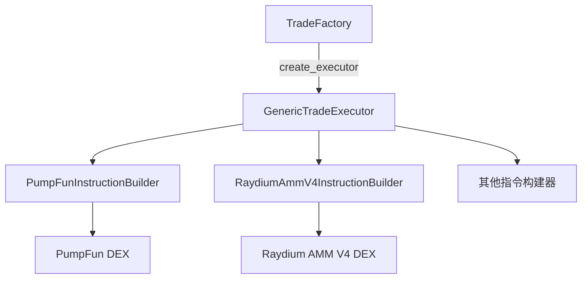
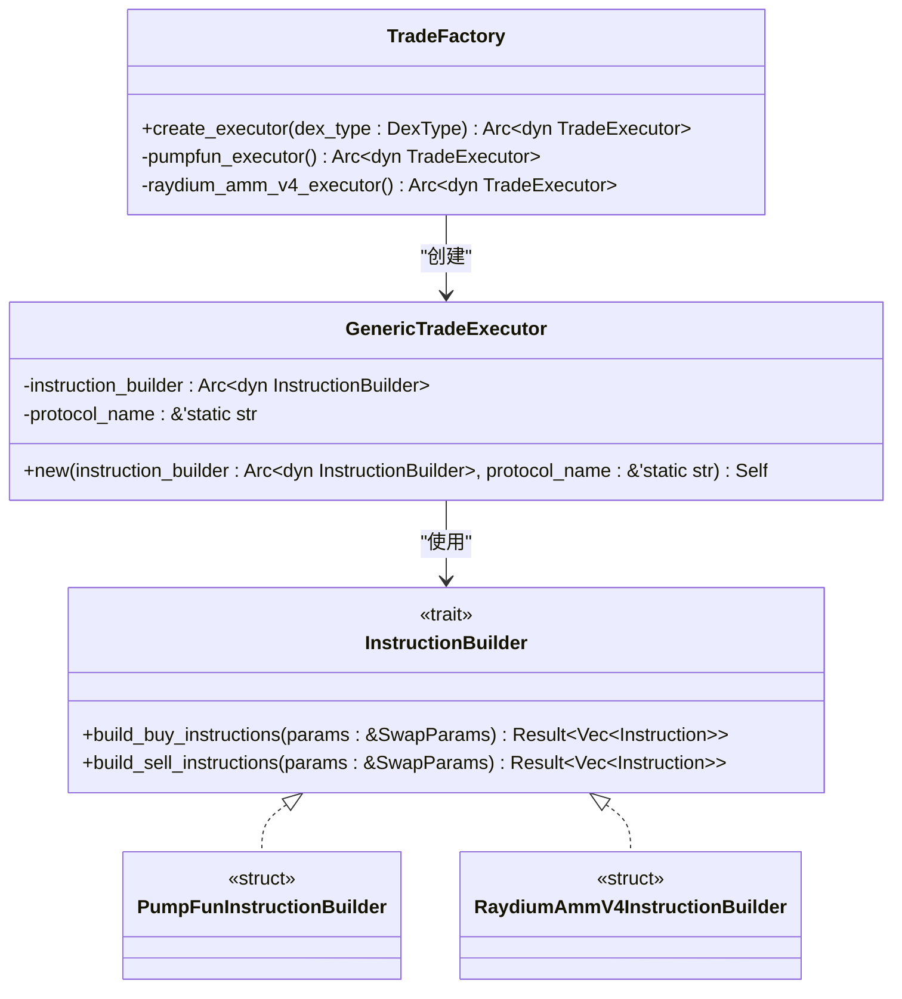
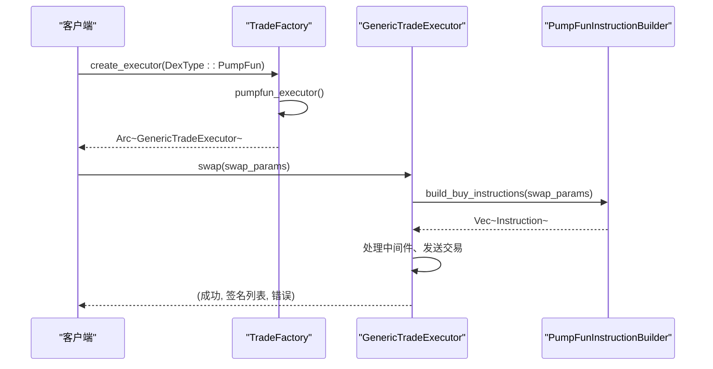
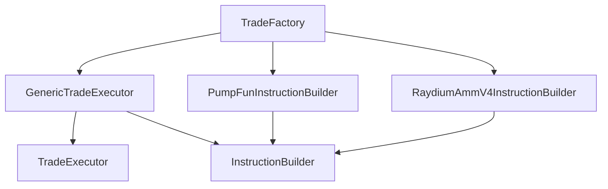

# TradeFactory 工厂模式

<cite>
**本文档引用的文件**   
- [factory.rs](file://src/trading/factory.rs)
- [executor.rs](file://src/trading/core/executor.rs)
- [traits.rs](file://src/trading/core/traits.rs)
- [pumpfun.rs](file://src/instruction/pumpfun.rs)
- [raydium_amm_v4.rs](file://src/instruction/raydium_amm_v4.rs)
- [trade_platform.rs](file://src/constants/trade_platform.rs)
</cite>

## 目录
1. [简介](#简介)
2. [核心组件](#核心组件)
3. [架构概述](#架构概述)
4. [详细组件分析](#详细组件分析)
5. [依赖关系分析](#依赖关系分析)
6. [性能考量](#性能考量)
7. [故障排除指南](#故障排除指南)
8. [结论](#结论)

## 简介
`TradeFactory` 是 Solana 交易 SDK 中的核心组件，作为去中心化交易所（DEX）执行器的创建中枢。该工厂模式实现了基于 `DexType` 枚举动态创建对应 `DexExecutor` 实例的机制，为不同交易平台（如 PumpFun、RaydiumAmmV4）提供统一的接口抽象。通过静态实例和惰性初始化，`TradeFactory` 在保证零运行时开销的同时，实现了高度的可扩展性。本文档深入解析其设计原理与实现细节，并提供实际集成的指导。

## 核心组件

`TradeFactory` 的核心在于其 `create_executor` 方法，该方法根据传入的 `DexType` 枚举值，通过模式匹配调用相应的私有工厂方法（如 `pumpfun_executor`、`raydium_amm_v4_executor`），最终返回一个实现了 `TradeExecutor` trait 的 `Arc<dyn TradeExecutor>` 类型的智能指针。这种设计将对象的创建逻辑与使用逻辑分离，是典型的工厂模式应用。

**Section sources**
- [factory.rs](file://src/trading/factory.rs#L27-L35)

## 架构概述

`TradeFactory` 的架构围绕工厂模式构建，其核心职责是创建 `GenericTradeExecutor` 实例。每个 `GenericTradeExecutor` 实例都持有一个特定于协议的 `InstructionBuilder`（如 `PumpFunInstructionBuilder`），该构建器负责生成具体的 Solana 交易指令。这种分层设计实现了关注点分离：工厂负责创建，执行器负责调度，指令构建器负责协议细节。

**Diagram sources **
- [factory.rs](file://src/trading/factory.rs#L27-L35)
- [executor.rs](file://src/trading/core/executor.rs#L31-L42)

## 详细组件分析

### TradeFactory 与 create_executor 方法分析

`create_executor` 方法是 `TradeFactory` 的公共接口。它接收一个 `DexType` 枚举，该枚举定义了所有支持的 DEX 协议。方法内部通过 `match` 表达式将不同的 `DexType` 映射到对应的私有工厂方法。这些私有方法利用 `std::sync::LazyLock` 创建单例实例，确保了线程安全和零运行时开销。每次调用 `create_executor` 实际上只是返回一个对静态实例的 `Arc` 克隆，性能极高。

#### 对于对象导向组件：

**Diagram sources **
- [factory.rs](file://src/trading/factory.rs#L27-L35)
- [executor.rs](file://src/trading/core/executor.rs#L31-L42)
- [traits.rs](file://src/trading/core/traits.rs#L19-L24)

### 指令构建器与指令模块关联机制

`instruction/` 目录下的模块（如 `pumpfun.rs`、`raydium_amm_v4.rs`）定义了具体的 `InstructionBuilder` 实现。这些实现遵循 `InstructionBuilder` trait，必须提供 `build_buy_instructions` 和 `build_sell_instructions` 方法。`GenericTradeExecutor` 在执行交易时，会根据交易类型调用执行器持有的 `InstructionBuilder` 来生成具体的 Solana 指令。例如，`PumpFunInstructionBuilder` 会根据 `SwapParams` 计算买入数量、准备账户地址，并构造包含特定方法 ID 和参数的指令数据。

#### 对于 API/服务组件：

**Diagram sources **
- [factory.rs](file://src/trading/factory.rs#L40-L47)
- [executor.rs](file://src/trading/core/executor.rs#L47-L62)
- [pumpfun.rs](file://src/instruction/pumpfun.rs#L27-L157)

## 依赖关系分析

`TradeFactory` 的依赖关系清晰且分层。它直接依赖于 `trading::core` 模块中的 `TradeExecutor` trait 和 `GenericTradeExecutor` 结构体，以及 `instruction` 模块中各个协议的 `InstructionBuilder` 实现。这种设计使得 `TradeFactory` 本身非常轻量，其复杂性被下放到了具体的指令构建器中。新增一个 DEX 支持时，只需在 `DexType` 枚举中添加新项，实现对应的 `InstructionBuilder`，并在 `TradeFactory` 中添加一个新的私有工厂方法，即可完成集成，体现了良好的开闭原则。

**Diagram sources **
- [factory.rs](file://src/trading/factory.rs#L3-L7)
- [executor.rs](file://src/trading/core/executor.rs#L9-L11)

**Section sources**
- [factory.rs](file://src/trading/factory.rs#L1-L99)
- [executor.rs](file://src/trading/core/executor.rs#L1-L288)

## 性能考量

`TradeFactory` 的设计充分考虑了性能。通过使用 `LazyLock` 创建静态单例，避免了每次创建执行器时的重复初始化开销。`Arc` 的使用确保了实例的共享是线程安全且高效的。此外，`TradeFactory` 本身不持有任何状态，其 `create_executor` 方法是纯函数式的，这使得它在高并发场景下也能保持卓越的性能。错误处理被推迟到指令构建和执行阶段，工厂创建过程本身是轻量且快速的。

## 故障排除指南

当使用 `TradeFactory` 时，最常见的问题是传入了不支持的 `DexType`。由于 `create_executor` 方法的 `match` 表达式必须是穷尽的，编译器会强制要求处理所有枚举变体，因此在编译时就能发现此类错误。如果在运行时遇到问题，通常源于 `SwapParams` 参数不正确或 `InstructionBuilder` 内部的验证失败。建议检查 `SwapParams` 中的 `protocol_params` 是否与 `DexType` 匹配，例如，为 `DexType::PumpFun` 传递 `PumpFunParams`。

**Section sources**
- [factory.rs](file://src/trading/factory.rs#L28-L35)
- [pumpfun.rs](file://src/instruction/pumpfun.rs#L32-L36)

## 结论

`TradeFactory` 是一个设计精良的工厂模式实现，它作为 DEX 执行器的创建中枢，为 Solana 交易 SDK 提供了灵活、高效且可扩展的架构基础。通过将对象创建逻辑集中化，并利用 Rust 的静态初始化和智能指针，它实现了零运行时开销。其与 `instruction` 模块的松耦合设计，使得新增 DEX 支持变得简单直接。对于开发者而言，理解 `TradeFactory` 的工作原理是有效使用该 SDK 进行自动化交易的关键。