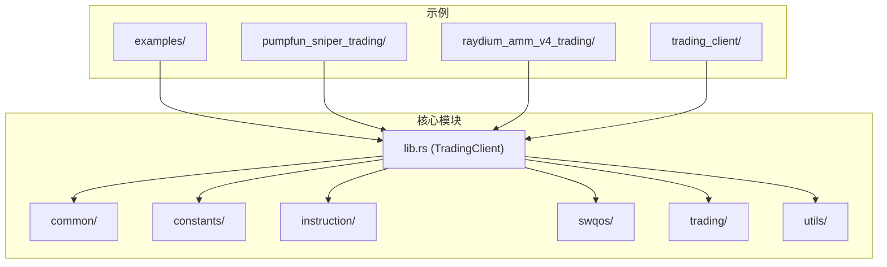
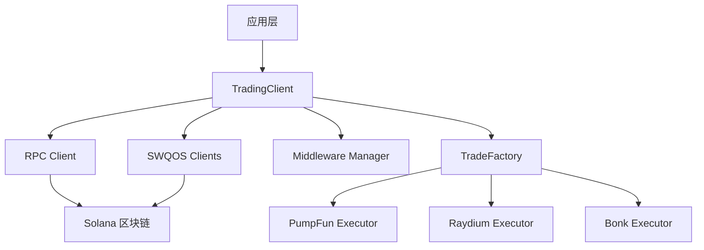
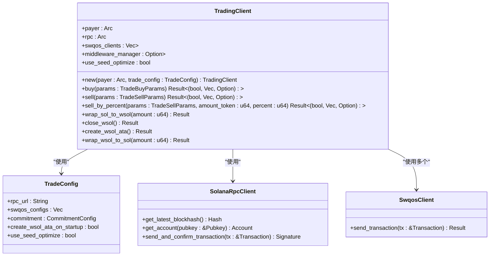
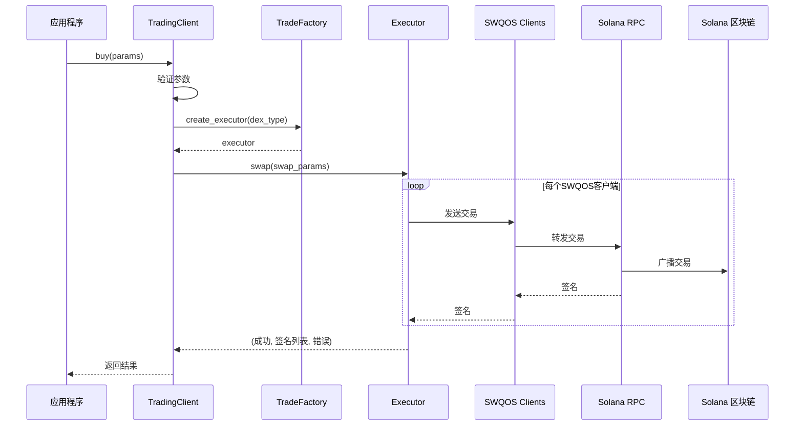
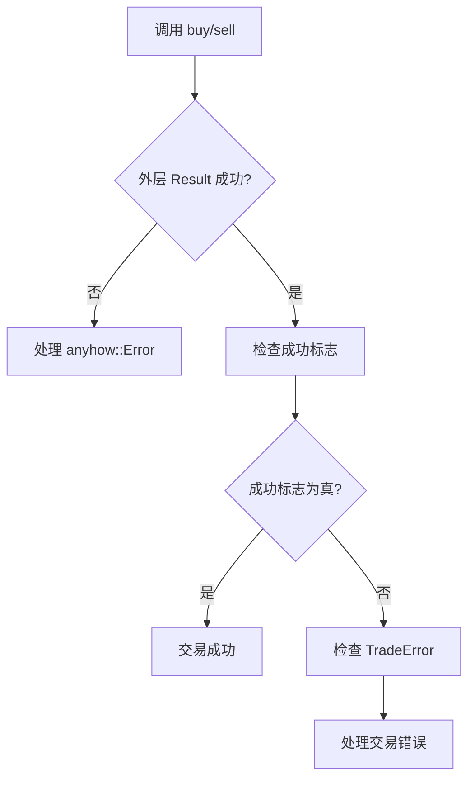
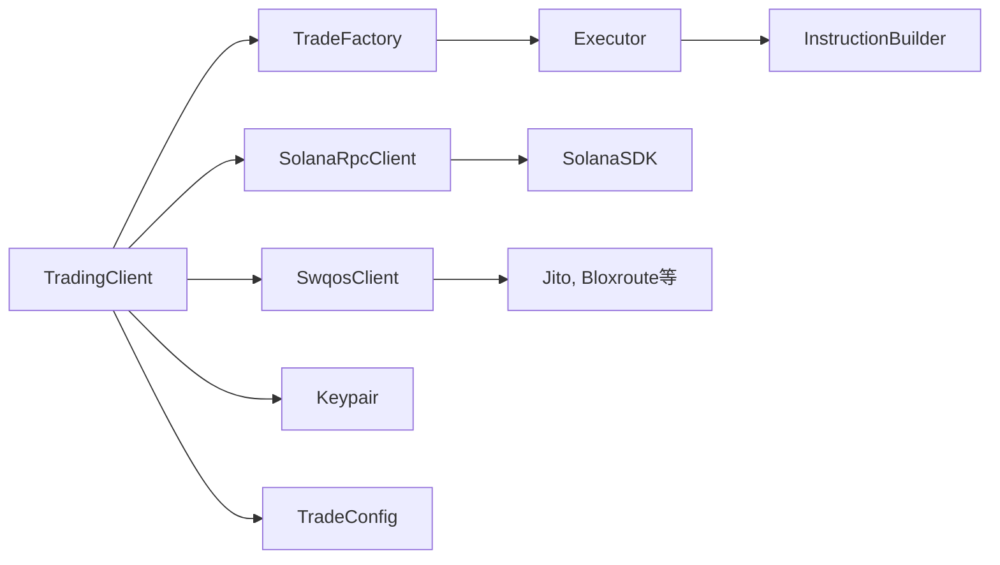

# TradingClient API

<cite>
**本文档中引用的文件**  
- [lib.rs](file://src/lib.rs#L54-L761)
- [main.rs](file://examples/trading_client/src/main.rs#L1-L41)
- [pumpfun_sniper_trading/main.rs](file://examples/pumpfun_sniper_trading/src/main.rs#L1-L166)
- [raydium_amm_v4_trading/main.rs](file://examples/raydium_amm_v4_trading/src/main.rs#L1-L222)
- [constants/trade.rs](file://src/constants/trade.rs)
- [common/types.rs](file://src/common/types.rs)
- [trading/core/params.rs](file://src/trading/core/params.rs)
- [swqos/common.rs](file://src/swqos/common.rs)
</cite>

## 目录
1. [简介](#简介)
2. [项目结构](#项目结构)
3. [核心组件](#核心组件)
4. [架构概述](#架构概述)
5. [详细组件分析](#详细组件分析)
6. [依赖分析](#依赖分析)
7. [性能考虑](#性能考虑)
8. [故障排除指南](#故障排除指南)
9. [结论](#结论)

## 简介
`TradingClient` 是 Solana 去中心化金融（DeFi）协议交易的核心客户端，为开发者提供了一个统一的接口，用于在多个 Solana 去中心化交易所（DEX）上执行交易操作。该 SDK 支持 PumpFun、PumpSwap、Bonk、Raydium AMM V4 和 Raydium CPMM 等主流 DEX 协议，集成了 RPC 连接管理、交易签名、SWQOS（Solana Web Quality of Service）设置等关键功能。`TradingClient` 作为 SDK 的核心入口点，封装了复杂的底层区块链交互逻辑，使开发者能够专注于交易策略的实现，而无需处理繁琐的网络通信和交易构建细节。

**Section sources**
- [lib.rs](file://src/lib.rs#L54-L761)

## 项目结构
该项目采用模块化设计，将功能划分为清晰的目录结构。`src/` 目录下包含核心功能模块：`common` 提供通用工具和类型，`constants` 定义常量，`instruction` 处理不同 DEX 的指令构建，`perf` 包含性能优化代码，`swqos` 管理交易优先级和路由服务，`trading` 实现核心交易逻辑，`utils` 提供各种计算和价格工具。`examples/` 目录包含丰富的使用示例，展示了如何在不同场景下使用 SDK，例如 `pumpfun_sniper_trading` 展示了狙击交易策略，`raydium_amm_v4_trading` 展示了基于 AMM V4 的复制交易。这种结构使得代码易于维护和扩展。

**Diagram sources**
- [lib.rs](file://src/lib.rs#L54-L761)
- [examples/trading_client/src/main.rs](file://examples/trading_client/src/main.rs#L1-L41)

## 核心组件
`TradingClient` 结构体是 SDK 的核心，它持有一个用于交易签名的密钥对（`payer`）、一个用于与区块链交互的 RPC 客户端（`rpc`）、一个或多个用于交易优先级和路由的 SWQOS 客户端列表（`swqos_clients`），以及一个可选的中间件管理器（`middleware_manager`）。该结构体通过 `new()` 构造函数初始化，该函数接收一个 `TradeConfig` 配置对象，用于设置 RPC URL、提交级别和 SWQOS 配置。`TradingClient` 提供了 `buy()` 和 `sell()` 方法来执行交易，并通过 `wrap_sol_to_wsol()` 和 `close_wsol()` 等辅助方法管理 wSOL 资产。

**Section sources**
- [lib.rs](file://src/lib.rs#L54-L761)

## 架构概述
`TradingClient` 的架构是一个分层设计。最上层是 `TradingClient` 本身，作为开发者交互的单一入口。它依赖于 `SolanaRpcClient` 进行底层的区块链通信。交易逻辑由 `trading::factory::TradeFactory` 创建的执行器（`executor`）处理，该执行器根据指定的 DEX 类型（`DexType`）调用相应的协议实现。SWQOS 客户端（如 Jito、Bloxroute）被注入到交易流程中，以优化交易的传播和确认速度。整个系统通过 `middleware_manager` 支持可扩展的中间件，允许在交易执行前后插入自定义逻辑。

**Diagram sources**
- [lib.rs](file://src/lib.rs#L54-L761)
- [trading/factory.rs](file://src/trading/factory.rs)

## 详细组件分析

### TradingClient 结构体分析
`TradingClient` 结构体是 SDK 的核心，其字段定义了客户端的行为和配置。

**Diagram sources**
- [lib.rs](file://src/lib.rs#L54-L761)
- [common/types.rs](file://src/common/types.rs)

### 交易方法分析
`buy()` 和 `sell()` 方法是执行交易的核心。它们接收一个包含所有必要配置的参数结构体（`TradeBuyParams` 或 `TradeSellParams`），并返回一个包含成功标志、所有提交的交易签名和可能错误的元组。

#### 买入交易流程

**Diagram sources**
- [lib.rs](file://src/lib.rs#L369-L456)
- [trading/factory.rs](file://src/trading/factory.rs)
- [trading/core/executor.rs](file://src/trading/core/executor.rs)

#### 交易参数详解
以下是 `TradeBuyParams` 和 `TradeSellParams` 结构体的关键字段说明。

**表：TradeBuyParams 参数说明**

| 参数名称 | 类型 | 必需 | 描述 |
| :--- | :--- | :--- | :--- |
| `dex_type` | `DexType` | 是 | 指定要使用的 DEX 协议类型，如 `PumpFun`、`RaydiumAmmV4` 等。 |
| `input_token_type` | `TradeTokenType` | 是 | 指定用于购买的输入代币类型，如 `SOL`、`WSOL`、`USDC` 或 `USD1`。 |
| `mint` | `Pubkey` | 是 | 要购买的代币的铸币地址（Mint Address）。 |
| `input_token_amount` | `u64` | 是 | 用于购买的输入代币数量（以最小单位表示，如 lamports）。 |
| `slippage_basis_points` | `Option<u64>` | 否 | 滑点容忍度，以基点表示（例如，100 = 1%）。如果未设置，则使用默认值。 |
| `recent_blockhash` | `Option<Hash>` | 否 | 交易的有效性所依赖的最近区块哈希。如果未提供，SDK 会自动获取。 |
| `extension_params` | `DexParamEnum` | 是 | 特定于 DEX 协议的扩展参数，例如 `PumpFunParams` 或 `RaydiumAmmV4Params`。 |
| `address_lookup_table_account` | `Option<AddressLookupTableAccount>` | 否 | 用于优化交易大小的地址查找表账户。 |
| `wait_transaction_confirmed` | `bool` | 否 | 是否在返回前等待交易确认。 |
| `create_input_token_ata` | `bool` | 否 | 是否创建输入代币的关联代币账户（ATA）。 |
| `close_input_token_ata` | `bool` | 否 | 交易后是否关闭输入代币的 ATA。 |
| `create_mint_ata` | `bool` | 否 | 是否创建要购买代币的 ATA。 |
| `durable_nonce` | `Option<DurableNonceInfo>` | 否 | 用于无签名交易的持久化随机数信息。 |
| `fixed_output_token_amount` | `Option<u64>` | 否 | 固定的输出代币数量。如果设置，将直接使用该值，而不是计算。 |
| `gas_fee_strategy` | `GasFeeStrategy` | 是 | 交易的 Gas 费用策略，用于计算优先费用和计算预算。 |
| `simulate` | `bool` | 否 | 是否仅模拟交易而不执行。 |

**表：TradeSellParams 参数说明**

| 参数名称 | 类型 | 必需 | 描述 |
| :--- | :--- | :--- | :--- |
| `dex_type` | `DexType` | 是 | 指定要使用的 DEX 协议类型。 |
| `output_token_type` | `TradeTokenType` | 是 | 指定卖出后获得的输出代币类型。 |
| `mint` | `Pubkey` | 是 | 要卖出的代币的铸币地址。 |
| `input_token_amount` | `u64` | 是 | 要卖出的代币数量。 |
| `slippage_basis_points` | `Option<u64>` | 否 | 滑点容忍度。 |
| `recent_blockhash` | `Option<Hash>` | 否 | 最近的区块哈希。 |
| `with_tip` | `bool` | 否 | 是否包含小费以提高交易优先级。 |
| `extension_params` | `DexParamEnum` | 是 | 特定于 DEX 的扩展参数。 |
| `address_lookup_table_account` | `Option<AddressLookupTableAccount>` | 否 | 地址查找表账户。 |
| `wait_transaction_confirmed` | `bool` | 否 | 是否等待确认。 |
| `create_output_token_ata` | `bool` | 否 | 是否创建输出代币的 ATA。 |
| `close_output_token_ata` | `bool` | 否 | 交易后是否关闭输出代币的 ATA。 |
| `close_mint_token_ata` | `bool` | 否 | 交易后是否关闭卖出代币的 ATA。 |
| `durable_nonce` | `Option<DurableNonceInfo>` | 否 | 持久化随机数信息。 |
| `fixed_output_token_amount` | `Option<u64>` | 否 | 固定的输出数量。 |
| `gas_fee_strategy` | `GasFeeStrategy` | 是 | Gas 费用策略。 |
| `simulate` | `bool` | 否 | 是否仅模拟。 |

**Section sources**
- [lib.rs](file://src/lib.rs#L89-L169)

### 错误处理分析
`TradingClient` 的方法可能返回多种错误，主要通过 `anyhow::Error` 和 `TradeError` 类型表示。`buy()` 和 `sell()` 方法的返回类型为 `Result<(bool, Vec<Signature>, Option<TradeError>), anyhow::Error>`，这表明存在两层错误处理。外层的 `anyhow::Error` 表示在调用过程中发生的严重错误，例如无效的协议参数或网络连接失败。内层的 `Option<TradeError>` 表示交易执行本身可能遇到的问题，例如余额不足或交易失败。开发者应首先检查外层 `Result`，如果成功，则检查内层的 `bool` 标志和 `TradeError` 以确定交易是否成功。

**Diagram sources**
- [lib.rs](file://src/lib.rs#L369-L456)
- [swqos/common.rs](file://src/swqos/common.rs)

## 依赖分析
`TradingClient` 依赖于多个内部和外部模块。它直接依赖于 `SolanaRpcClient` 进行区块链交互，依赖于 `SwqosClient` 实现进行交易加速，依赖于 `TradeFactory` 和 `Executor` 来处理不同 DEX 的交易逻辑。`TradeConfig` 对象是初始化 `TradingClient` 所必需的，它包含了 RPC URL、SWQOS 配置等关键信息。此外，`TradingClient` 还依赖于 `Keypair` 进行交易签名，并通过 `Arc` 智能指针共享这些资源，确保了线程安全。

**Diagram sources**
- [lib.rs](file://src/lib.rs#L54-L761)
- [Cargo.toml](file://Cargo.toml)

## 性能考虑
为了实现高性能交易，`TradingClient` 采用了多种优化策略。首先，它支持多 SWQOS 客户端并发发送交易，这可以显著提高交易被区块生产者接收的概率。其次，SDK 内置了 `seed` 优化功能（`use_seed_optimize`），通过使用派生地址来优化关联代币账户（ATA）的创建，减少交易大小和费用。此外，`gas_fee_strategy` 允许开发者精细控制计算预算和优先费用，以平衡交易速度和成本。对于高频交易场景，建议使用低延迟的 RPC 提供商（如 Helius）和高性能的 SWQOS 服务（如 Jito）。

## 故障排除指南
在使用 `TradingClient` 时，可能会遇到以下常见问题：

1.  **初始化失败**：确保 `payer` 密钥对有足够的 SOL 余额来支付交易费用。检查 RPC URL 是否正确且可访问。
2.  **交易失败**：检查 `slippage_basis_points` 是否设置得过低，导致价格变动超出容忍范围。确认 `mint` 地址正确无误。使用 `simulate` 参数在真实执行前模拟交易以捕获潜在错误。
3.  **余额不足**：在调用 `buy()` 时，确保 `payer` 有足够的 SOL 或 wSOL 余额。在调用 `sell()` 时，确保目标代币的 ATA 中有足够的余额。
4.  **网络超时**：检查网络连接，并考虑更换 RPC 提供商。增加超时设置（如果 SDK 支持）。
5.  **SWQOS 客户端初始化失败**：检查 SWQOS 服务的 API 密钥或 UUID 是否正确。某些 SWQOS 服务可能在特定地区不可用。

**Section sources**
- [lib.rs](file://src/lib.rs#L369-L456)
- [examples/pumpfun_sniper_trading/src/main.rs](file://examples/pumpfun_sniper_trading/src/main.rs#L1-L166)

## 结论
`TradingClient` 是一个功能强大且设计良好的 Solana 交易 SDK 核心组件。它通过提供一个简洁的 API，抽象了与多个 DEX 交互的复杂性，并集成了 SWQOS 等高级功能，极大地简化了自动化交易机器人的开发。通过合理配置 `TradeConfig` 和使用 `TradeBuyParams`/`TradeSellParams`，开发者可以精确控制交易行为。结合 `examples/` 目录中的实际用例，开发者可以快速上手，实现从简单的买入卖出到复杂的狙击和复制交易策略。