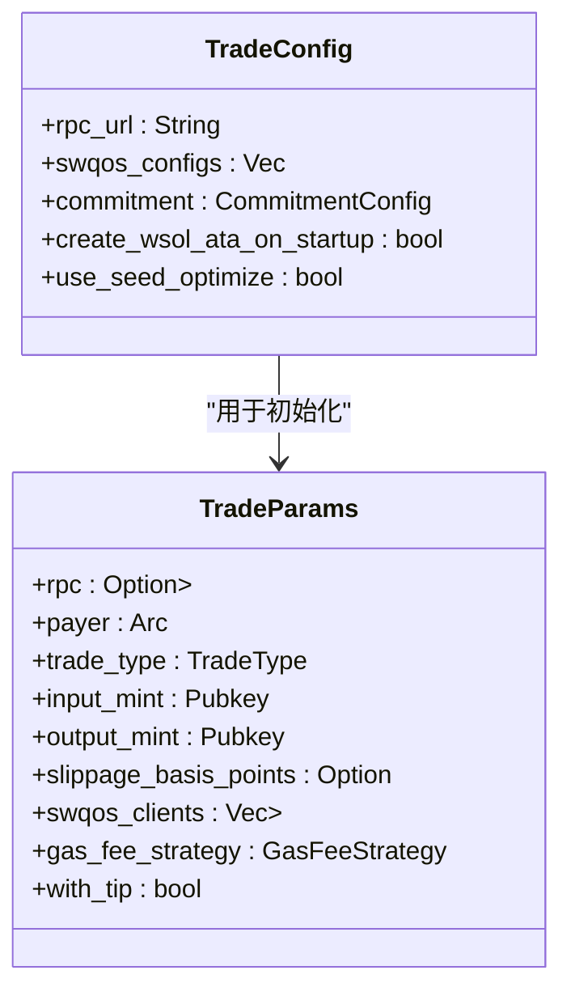

# 交易参数与配置

<cite>
**本文档引用的文件**
- [trade.rs](file://src/constants/trade.rs)
- [swqos.rs](file://src/constants/swqos.rs)
- [params.rs](file://src/trading/core/params.rs)
- [types.rs](file://src/common/types.rs)
- [mod.rs](file://src/swqos/mod.rs)
</cite>

## 目录
1. [简介](#简介)
2. [核心结构体概述](#核心结构体概述)
3. [TradeParams 字段详解](#tradeparams-字段详解)
4. [TradeConfig 字段详解](#tradeconfig-字段详解)
5. [平台特定配置与常量](#平台特定配置与常量)
6. [配置示例](#配置示例)

## 简介
本文档系统化地阐述了 `TradeParams` 和 `TradeConfig` 结构体的所有字段，明确了它们在交易流程中的作用。文档详细解释了关键参数如 `slippage_bps`（滑点基点）、`compute_budget`（计算预算）、`priority_fee`（优先费）的取值范围与默认值。同时，说明了 `TradeConfig` 中 `swqos_enabled`、`use_address_lookup_table` 等开关对交易行为的影响，并结合 `constants/` 目录中的预定义常量，阐述了平台特定配置的来源。最后，提供了配置示例，展示如何为高波动性代币设置宽松滑点，或为低延迟交易启用Jito打包。

**Section sources**
- [params.rs](file://src/trading/core/params.rs#L44-L71)
- [types.rs](file://src/common/types.rs#L5-L14)

## 核心结构体概述
`TradeParams` 和 `TradeConfig` 是 Solana 交易 SDK 中的核心配置结构体。`TradeParams` 定义了一次具体交易的所有参数，而 `TradeConfig` 则定义了交易客户端的全局配置。两者共同决定了交易的执行方式、性能和成功率。



**Diagram sources**
- [types.rs](file://src/common/types.rs#L5-L14)
- [params.rs](file://src/trading/core/params.rs#L44-L71)

## TradeParams 字段详解
`TradeParams` 结构体（在代码中定义为 `SwapParams`）包含了执行单次交易所需的所有参数。

### 交易基础参数
这些参数定义了交易的基本属性。

- **`rpc`**: 可选的 Solana RPC 客户端实例。如果未提供，将使用 `TradeConfig` 中的 `rpc_url` 创建新的客户端。
- **`payer`**: 交易的支付者密钥对，用于签名和支付交易费用。
- **`trade_type`**: 交易类型，枚举值包括 `Create`、`CreateAndBuy`、`Buy`、`Sell`，用于区分不同的交易场景。
- **`input_mint`**: 输入代币的 Mint 地址。
- **`output_mint`**: 输出代币的 Mint 地址。
- **`input_amount`**: 输入代币的数量（可选，用于指定卖出数量）。
- **`fixed_output_amount`**: 固定的输出代币数量（可选，用于指定买入数量）。

**Section sources**
- [params.rs](file://src/trading/core/params.rs#L45-L68)

### 滑点与费用控制
这些参数用于控制交易的滑点和费用。

- **`slippage_basis_points`**: 滑点容忍度，以基点（Basis Points）表示。100 基点等于 1%。例如，1000 基点等于 10%。此参数的默认值来源于 `constants/trade.rs` 中的 `DEFAULT_SLIPPAGE`，为 1000（即 10%）。
- **`data_size_limit`**: 交易数据大小的限制，单位为字节。
- **`gas_fee_strategy`**: 交易费用策略，用于确定计算预算和优先费。
- **`simulate`**: 布尔值，指示是否在发送交易前进行模拟。模拟可以帮助预估费用和检查交易是否成功。

**Section sources**
- [params.rs](file://src/trading/core/params.rs#L53-L57)
- [params.rs](file://src/trading/core/params.rs#L69-L70)
- [trade.rs](file://src/constants/trade.rs#L2)

### 交易优化与高级功能
这些参数用于启用交易优化和高级功能。

- **`address_lookup_table_account`**: 地址查找表账户，用于压缩交易，减少交易大小，从而降低费用并提高成功率。
- **`recent_blockhash`**: 最近的区块哈希，用于交易的时效性验证。如果未提供，SDK 会自动获取。
- **`wait_transaction_confirmed`**: 布尔值，指示是否等待交易被确认。
- **`protocol_params`**: 特定于 DEX 协议的参数，通过 `DexParamEnum` 枚举包装，如 `PumpFunParams`、`RaydiumCpmmParams` 等。
- **`open_seed_optimize`**: 布尔值，指示是否开启种子优化，以加速关联代币账户（ATA）的创建。
- **`durable_nonce`**: 耐久性随机数信息，用于离线交易或高可靠性场景。
- **`with_tip`**: 布尔值，指示是否在交易中包含小费（tip），以激励验证者优先打包交易。
- **`create_input_mint_ata`**: 布尔值，指示是否为输入代币创建关联代币账户（ATA）。
- **`close_input_mint_ata`**: 布尔值，指示是否在交易后关闭输入代币的关联代币账户（ATA）。
- **`create_output_mint_ata`**: 布尔值，指示是否为输出代币创建关联代币账户（ATA）。
- **`close_output_mint_ata`**: 布尔值，指示是否在交易后关闭输出代币的关联代币账户（ATA）。

**Section sources**
- [params.rs](file://src/trading/core/params.rs#L54-L68)
- [params.rs](file://src/trading/core/params.rs#L59-L63)
- [params.rs](file://src/trading/core/params.rs#L64-L67)

## TradeConfig 字段详解
`TradeConfig` 结构体定义了交易客户端的全局配置。

### 核心配置
这些是初始化交易客户端所必需的配置。

- **`rpc_url`**: Solana RPC 节点的 URL 地址。
- **`swqos_configs`**: 一个 `SwqosConfig` 枚举的向量，用于配置一个或多个交易加速服务（如 Jito、NextBlock 等）。每个配置都指定了服务类型、认证令牌和区域。
- **`commitment`**: 交易确认的承诺级别，如 `confirmed`、`finalized`。

**Section sources**
- [types.rs](file://src/common/types.rs#L6-L8)

### 功能开关
这些布尔值字段控制着 SDK 的特定功能。

- **`create_wsol_ata_on_startup`**: 是否在 SDK 启动时检查并自动创建用户的 WSOL（Wrapped SOL）关联代币账户。默认值为 `true`。
- **`use_seed_optimize`**: 是否在所有 ATA 操作中使用种子优化。默认值为 `true`。

**Section sources**
- [types.rs](file://src/common/types.rs#L9-L13)

## 平台特定配置与常量
平台的特定配置和默认值主要来源于 `constants/` 目录下的模块。

### 交易常量
`constants/trade.rs` 模块定义了交易相关的默认常量。

- **`DEFAULT_SLIPPAGE`**: 默认滑点，值为 1000 基点（10%）。
- **`DEFAULT_TIP_UNIT_LIMIT`**: 默认小费计算单元上限，值为 150,000。
- **`DEFAULT_TIP_UNIT_PRICE`**: 默认小费单价，值为 500,000 lamports。
- **`DEFAULT_BUY_TIP_FEE` 和 `DEFAULT_SELL_TIP_FEE`**: 买入和卖出操作的默认小费金额。

**Section sources**
- [trade.rs](file://src/constants/trade.rs#L2-L6)

### SWQOS 常量
`constants/swqos.rs` 模块定义了各种交易加速服务（SWQOS）的端点和小费账户。

- **`JITO_TIP_ACCOUNTS`**: Jito 服务的小费接收账户列表。
- **`SWQOS_ENDPOINTS_JITO`**: Jito 服务在全球不同区域的端点 URL 列表。
- **`SWQOS_MIN_TIP_*`**: 不同 SWQOS 服务的最低小费要求。例如，`SWQOS_MIN_TIP_JITO` 为 0.00001 SOL，而 `SWQOS_MIN_TIP_SOYAS` 为 0.001 SOL。

**Section sources**
- [swqos.rs](file://src/constants/swqos.rs#L5-L14)
- [swqos.rs](file://src/constants/swqos.rs#L142-L151)
- [swqos.rs](file://src/constants/swqos.rs#L263-L275)

## 配置示例
以下是一些常见的配置场景示例。

### 为高波动性代币设置宽松滑点
对于价格波动剧烈的新代币，应设置较高的滑点以确保交易能够成交。

```rust
let trade_params = SwapParams {
    slippage_basis_points: Some(5000), // 50% 滑点
    ..Default::default()
};
```

**Section sources**
- [params.rs](file://src/trading/core/params.rs#L53)

### 为低延迟交易启用Jito打包
为了获得最快的交易打包速度，可以配置 Jito 服务。

```rust
let swqos_config = SwqosConfig::Jito(
    "your-jito-auth-token".to_string(),
    SwqosRegion::NewYork,
    None, // 使用默认端点
);

let trade_config = TradeConfig::new(
    "https://your-rpc-url".to_string(),
    vec![swqos_config],
    CommitmentConfig::confirmed(),
);
```

**Section sources**
- [mod.rs](file://src/swqos/mod.rs#L151)
- [types.rs](file://src/common/types.rs#L18-L31)