# Bonk交易支持

<cite>
**本文档中引用的文件**   
- [bonk.rs](file://src/instruction/utils/bonk.rs)
- [bonk.rs](file://src/instruction/bonk.rs)
- [bonk_types.rs](file://src/instruction/utils/bonk_types.rs)
- [bonk.rs](file://src/utils/price/bonk.rs)
- [bonk.rs](file://src/utils/calc/bonk.rs)
- [main.rs](file://examples/bonk_sniper_trading/src/main.rs)
- [main.rs](file://examples/bonk_copy_trading/src/main.rs)
- [swqos.rs](file://src/constants/swqos.rs)
- [nonce_cache.rs](file://src/common/nonce_cache.rs)
- [nonce_manager.rs](file://src/trading/common/nonce_manager.rs)
- [params.rs](file://src/trading/core/params.rs)
- [trade.rs](file://src/constants/trade.rs)
- [decimals.rs](file://src/constants/decimals.rs)
</cite>

## 目录
1. [简介](#简介)
2. [Bonk交易策略](#bonk交易策略)
3. [Bonk指令构建](#bonk指令构建)
4. [价格与数量计算](#价格与数量计算)
5. [SWQOS集成与性能优化](#swqos集成与性能优化)
6. [事件监听与交易回滚处理](#事件监听与交易回滚处理)
7. [高波动性市场风险控制](#高波动性市场风险控制)
8. [代码示例](#代码示例)

## 简介
sol-trade-sdk为Bonk生态提供了全面的交易支持能力，特别针对Bonk代币的狙击交易和复制交易策略进行了优化。本SDK通过高效的指令构建、精准的价格模型和数量计算函数，实现了对Bonk代币的精确买入卖出控制。系统集成了SWQOS服务以实现亚秒级交易确认，并通过Nonce缓存机制提升并发性能。SDK还提供了完整的事件监听、动态小费设置和交易回滚处理机制，确保在高波动性市场中的稳定交易。

## Bonk交易策略

sol-trade-sdk支持两种主要的Bonk代币交易策略：狙击交易和复制交易。狙击交易策略主要用于在新代币创建时立即进行交易，而复制交易策略则用于跟随其他交易者的操作。

### 狙击交易策略
狙击交易策略通过监听ShredStream事件来实现。系统订阅ShredStream流，当检测到开发者创建新代币的事件时，立即执行交易操作。这种策略利用了亚秒级的交易确认能力，确保在市场反应之前完成交易。

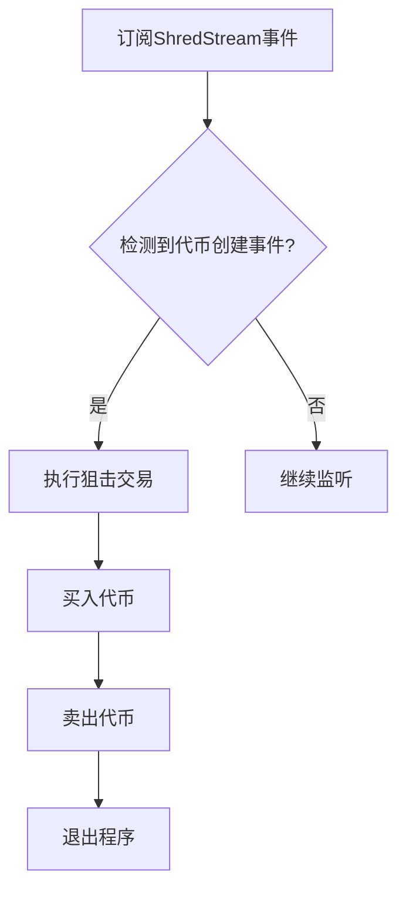

**Diagram sources**
- [main.rs](file://examples/bonk_sniper_trading/src/main.rs#L27-L45)

### 复制交易策略
复制交易策略通过监听GRPC事件来实现。系统订阅Yellowstone GRPC流，当检测到特定的交易事件时，复制相同的交易操作。这种策略允许交易者跟随成功的交易模式。

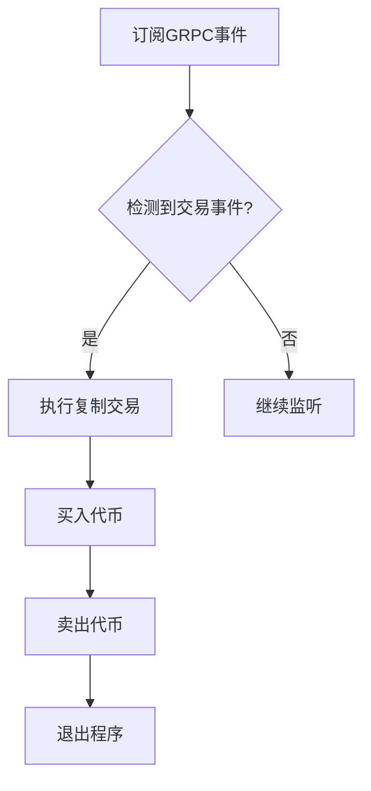

**Diagram sources**
- [main.rs](file://examples/bonk_copy_trading/src/main.rs#L32-L82)

**Section sources**
- [main.rs](file://examples/bonk_sniper_trading/src/main.rs#L27-L45)
- [main.rs](file://examples/bonk_copy_trading/src/main.rs#L32-L82)

## Bonk指令构建

Bonk指令的构建过程包括账户验证、金额计算和交易参数编码三个主要步骤。系统通过精确的PDA（程序派生地址）计算和账户元数据验证确保交易的安全性。

### 账户验证
在构建Bonk指令时，系统首先验证所有相关账户的有效性。这包括验证池状态账户的所有权、计算必要的PDA地址以及验证全局配置。

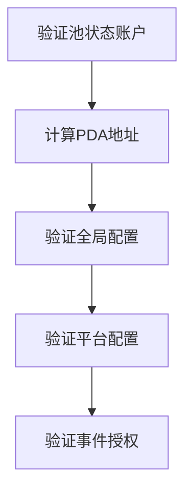

**Diagram sources**
- [bonk.rs](file://src/instruction/utils/bonk.rs#L62-L73)

### 金额计算
金额计算是Bonk指令构建的核心部分。系统根据交易类型（买入或卖出）计算输入和输出金额，同时考虑协议费用、平台费用和分享费用。

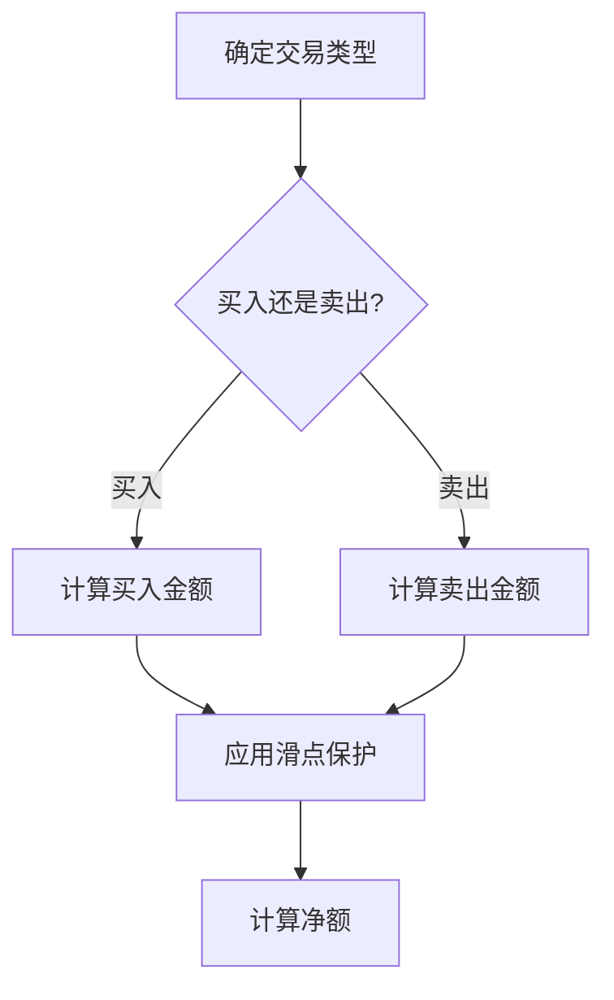

**Diagram sources**
- [bonk.rs](file://src/instruction/bonk.rs#L70-L82)
- [bonk.rs](file://src/instruction/bonk.rs#L194-L201)

### 交易参数编码
交易参数编码将所有计算结果和账户信息编码为指令数据。系统使用预定义的判别器来标识指令类型，并将金额和最小输出金额编码为小端字节序。

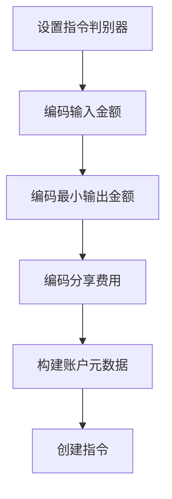

**Diagram sources**
- [bonk.rs](file://src/instruction/bonk.rs#L140-L167)
- [bonk.rs](file://src/instruction/bonk.rs#L287-L314)

**Section sources**
- [bonk.rs](file://src/instruction/utils/bonk.rs#L59-L60)
- [bonk.rs](file://src/instruction/bonk.rs#L140-L167)
- [bonk.rs](file://src/instruction/bonk.rs#L287-L314)

## 价格与数量计算

sol-trade-sdk通过`utils/price/bonk.rs`中的价格模型和`utils/calc/bonk.rs`中的数量计算函数，实现了对Bonk代币的精准价格预测和数量计算。

### 价格模型
价格模型基于AMM（自动做市商）公式计算代币价格。系统考虑虚拟储备和实际储备，同时处理不同代币的小数位数差异。

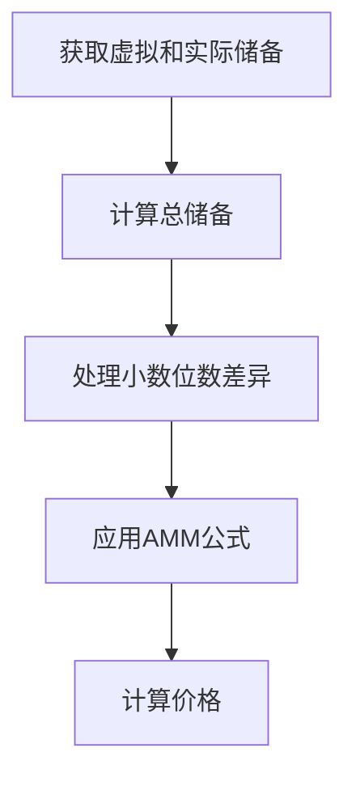

**Diagram sources**
- [bonk.rs](file://src/utils/price/bonk.rs#L41-L71)

### 数量计算
数量计算函数实现了恒定乘积公式（x * y = k），用于计算在给定输入金额下的输出数量。系统考虑了各种费用和滑点保护。

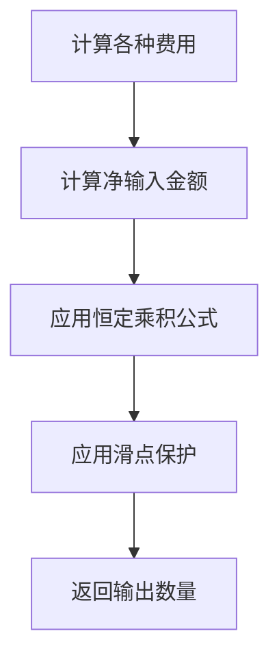

**Diagram sources**
- [bonk.rs](file://src/utils/calc/bonk.rs#L20-L55)
- [bonk.rs](file://src/utils/calc/bonk.rs#L75-L111)

**Section sources**
- [bonk.rs](file://src/utils/price/bonk.rs#L13-L72)
- [bonk.rs](file://src/utils/calc/bonk.rs#L3-L112)

## SWQOS集成与性能优化

sol-trade-sdk集成了多种SWQOS（快速交易服务）提供商，以实现亚秒级交易确认。系统还通过Nonce缓存机制提升并发性能。

### SWQOS集成
系统支持多种SWQOS提供商，包括Jito、NextBlock、ZeroSlot等。每种提供商都有特定的端点和小费账户。

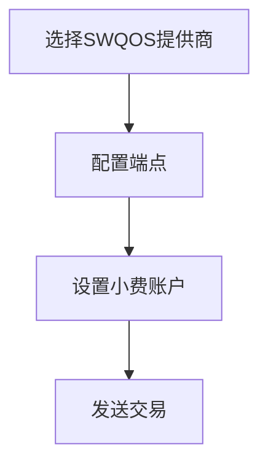

**Diagram sources**
- [swqos.rs](file://src/constants/swqos.rs#L5-L110)
- [mod.rs](file://src/swqos/mod.rs#L27-L38)

### Nonce缓存机制
Nonce缓存机制通过缓存持久Nonce信息来提升并发性能。系统在交易前获取Nonce信息，并在交易中使用。

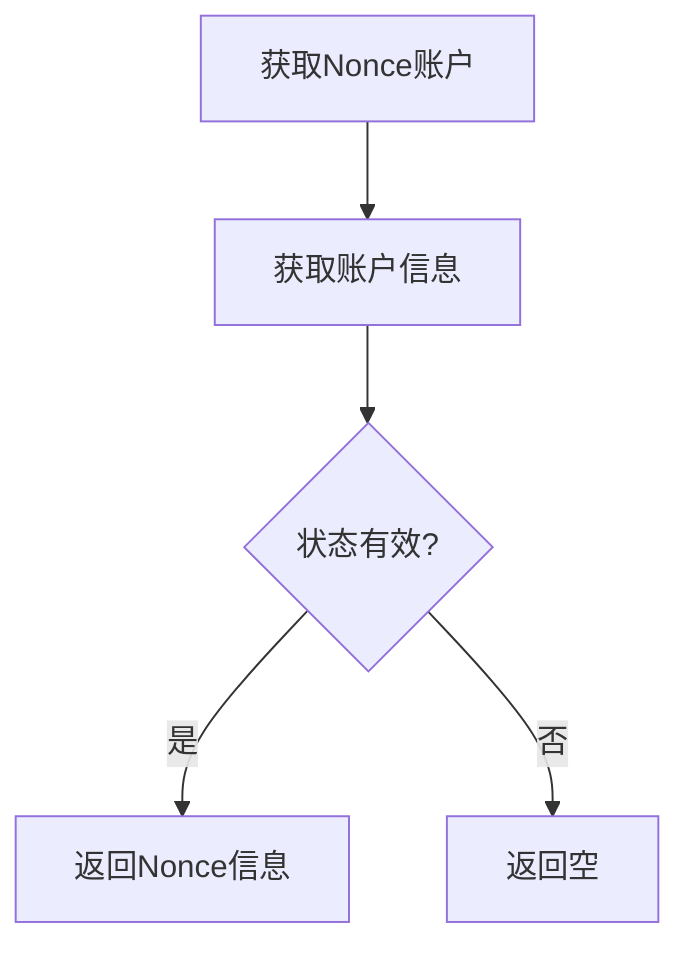

**Diagram sources**
- [nonce_cache.rs](file://src/common/nonce_cache.rs#L18-L41)
- [nonce_manager.rs](file://src/trading/common/nonce_manager.rs#L12-L24)

**Section sources**
- [swqos.rs](file://src/constants/swqos.rs#L5-L276)
- [mod.rs](file://src/swqos/mod.rs#L1-L344)
- [nonce_cache.rs](file://src/common/nonce_cache.rs#L1-L42)
- [nonce_manager.rs](file://src/trading/common/nonce_manager.rs#L1-L41)

## 事件监听与交易回滚处理

sol-trade-sdk提供了完整的事件监听机制和交易回滚处理能力，确保交易的可靠性和稳定性。

### 事件监听
系统通过ShredStream或Yellowstone GRPC订阅事件流，监听特定的Bonk交易事件。当检测到相关事件时，触发相应的交易策略。

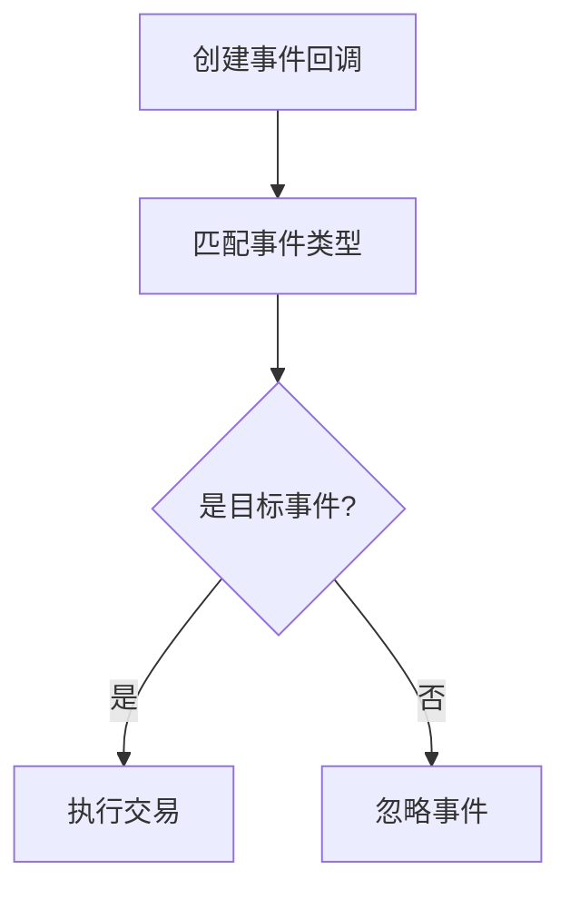

**Diagram sources**
- [main.rs](file://examples/bonk_sniper_trading/src/main.rs#L48-L70)
- [main.rs](file://examples/bonk_copy_trading/src/main.rs#L85-L103)

### 交易回滚处理
系统通过原子标志确保狙击交易只执行一次。当交易失败时，系统会记录错误并退出程序，防止重复交易。

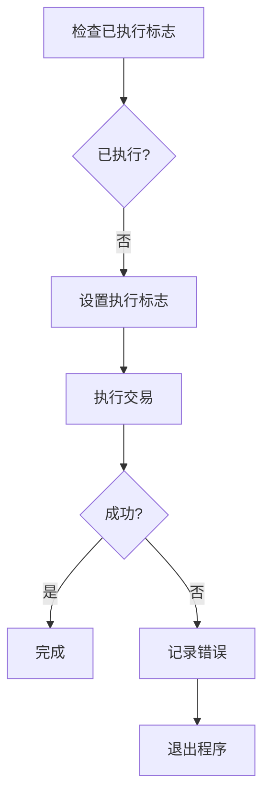

**Diagram sources**
- [main.rs](file://examples/bonk_sniper_trading/src/main.rs#L50-L68)
- [main.rs](file://examples/bonk_copy_trading/src/main.rs#L88-L99)

**Section sources**
- [main.rs](file://examples/bonk_sniper_trading/src/main.rs#L22-L70)
- [main.rs](file://examples/bonk_copy_trading/src/main.rs#L28-L103)

## 高波动性市场风险控制

在高波动性市场中，sol-trade-sdk实现了多种风险控制策略，包括最大交易金额限制和自动止损机制。

### 最大交易金额限制
系统通过配置参数限制最大交易金额，防止在市场剧烈波动时发生过度交易。

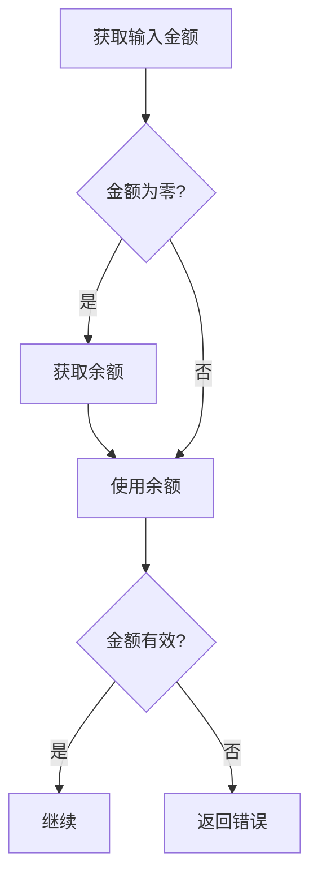

**Diagram sources**
- [bonk.rs](file://src/instruction/bonk.rs#L34-L36)
- [bonk.rs](file://src/instruction/bonk.rs#L195-L204)

### 自动止损机制
系统通过滑点保护参数实现自动止损。当市场价格波动超过设定的滑点时，交易将自动失败，防止重大损失。

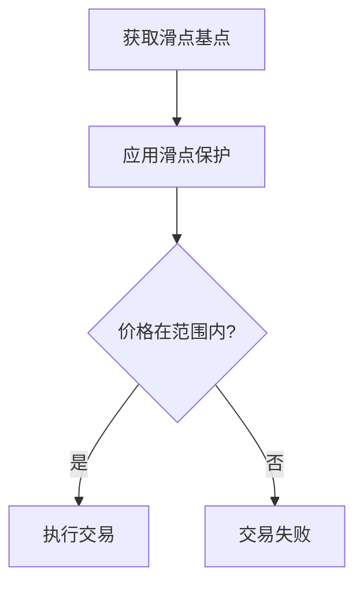

**Diagram sources**
- [bonk.rs](file://src/utils/calc/bonk.rs#L54-L55)
- [bonk.rs](file://src/utils/calc/bonk.rs#L108-L109)

**Section sources**
- [trade.rs](file://src/constants/trade.rs#L2-L9)
- [bonk.rs](file://src/instruction/bonk.rs#L74-L82)
- [bonk.rs](file://src/instruction/bonk.rs#L234-L242)

## 代码示例

以下代码示例展示了如何使用sol-trade-sdk实现Bonk代币的狙击交易和复制交易。

### 狙击交易示例
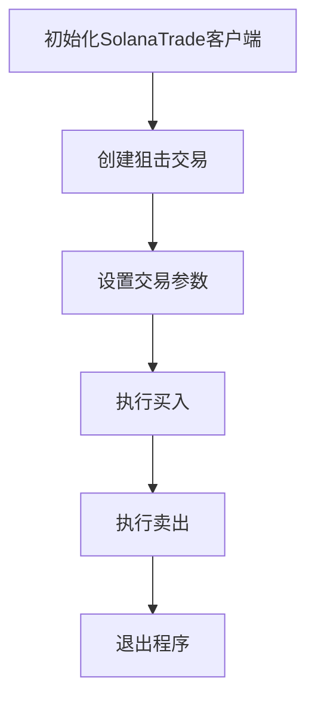

**Diagram sources**
- [main.rs](file://examples/bonk_sniper_trading/src/main.rs#L74-L195)

### 复制交易示例
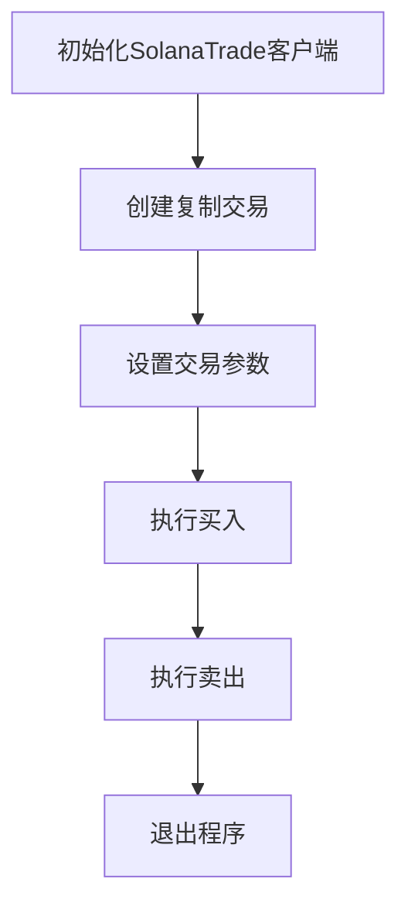

**Diagram sources**
- [main.rs](file://examples/bonk_copy_trading/src/main.rs#L105-L234)

**Section sources**
- [main.rs](file://examples/bonk_sniper_trading/src/main.rs#L74-L195)
- [main.rs](file://examples/bonk_copy_trading/src/main.rs#L105-L234)