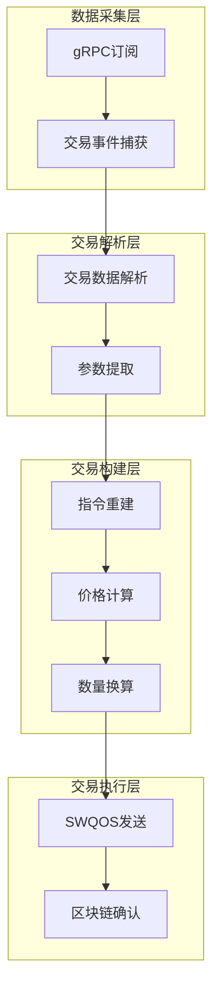
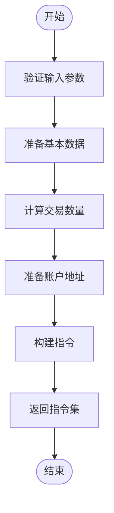
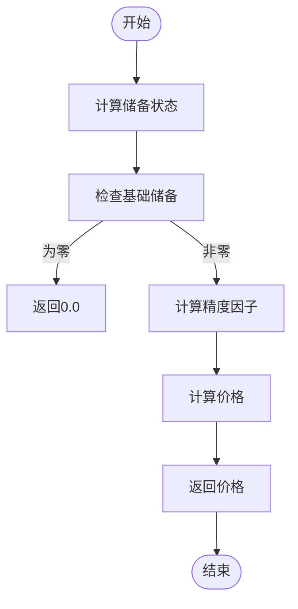
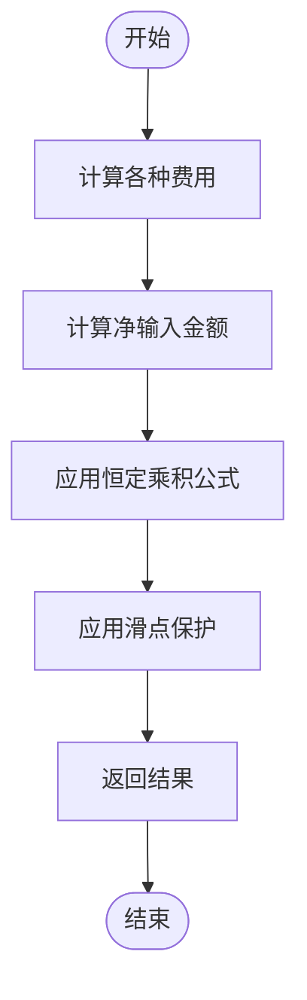
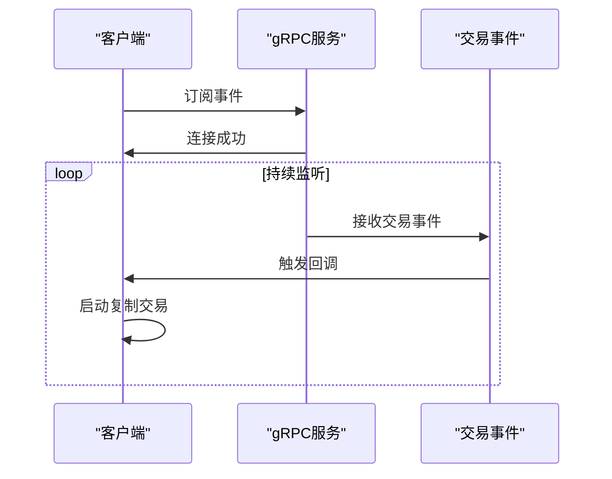
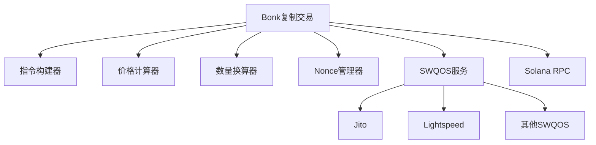

# Bonk复制交易策略

<cite>
**本文档引用文件**   
- [bonk.rs](file://src/instruction/bonk.rs)
- [bonk.rs](file://src/utils/price/bonk.rs)
- [bonk.rs](file://src/utils/calc/bonk.rs)
- [main.rs](file://examples/bonk_copy_trading/src/main.rs)
- [jito.rs](file://src/swqos/jito.rs)
- [lightspeed.rs](file://src/swqos/lightspeed.rs)
- [swqos.rs](file://src/swqos/mod.rs)
- [accounts.rs](file://src/constants/accounts.rs)
- [swqos.rs](file://src/constants/swqos.rs)
- [nonce_cache.rs](file://src/common/nonce_cache.rs)
- [nonce_manager.rs](file://src/trading/common/nonce_manager.rs)
- [NONCE_CACHE_CN.md](file://docs/NONCE_CACHE_CN.md)
- [bonk.rs](file://src/instruction/utils/bonk.rs)
- [params.rs](file://src/trading/core/params.rs)
</cite>

## 目录
1. [介绍](#介绍)
2. [核心组件](#核心组件)
3. [架构概述](#架构概述)
4. [详细组件分析](#详细组件分析)
5. [依赖分析](#依赖分析)
6. [性能考虑](#性能考虑)
7. [故障排除指南](#故障排除指南)
8. [结论](#结论)

## 介绍
sol-trade-sdk为Bonk复制交易策略提供了全面支持，允许用户监听目标钱包地址的交易行为，实时解析其在Bonk生态中的买入或卖出操作，并自动将相同交易逻辑复制到本地账户。该策略基于`src/instruction/bonk.rs`的指令构建机制，能够还原原始交易的账户结构与参数，并结合`utils/price/bonk.rs`的价格计算和`utils/calc/bonk.rs`的数量换算函数，实现按比例或固定金额的复制交易。通过`examples/bonk_copy_trading/src/main.rs`的实例，展示了如何配置监听器、设置复制倍率、延迟偏移和风险控制阈值。系统集成了SWQOS服务以缩短交易延迟，确保复制交易的时效性，并利用Nonce缓存避免因高频交易导致的Nonce冲突。

## 核心组件
Bonk复制交易策略的核心组件包括交易监听器、指令构建器、价格计算器、数量换算器和交易执行器。交易监听器通过Yellowstone gRPC订阅事件，实时捕获Bonk协议的交易数据。指令构建器根据捕获的交易信息重建交易指令，价格计算器和数量换算器分别负责计算交易价格和数量，交易执行器则负责将构建好的交易发送到区块链网络。这些组件协同工作，实现了完整的复制交易流程。

**本节来源**
- [bonk.rs](file://src/instruction/bonk.rs#L1-L332)
- [bonk.rs](file://src/utils/price/bonk.rs#L1-L73)
- [bonk.rs](file://src/utils/calc/bonk.rs#L1-L113)
- [main.rs](file://examples/bonk_copy_trading/src/main.rs#L1-L236)

## 架构概述
Bonk复制交易策略的架构分为数据采集层、交易解析层、交易构建层和交易执行层。数据采集层通过gRPC订阅Bonk协议的交易事件，实时获取交易数据。交易解析层对获取的交易数据进行解析，提取关键交易参数。交易构建层根据解析出的参数重建交易指令，包括账户结构和交易参数。交易执行层负责将构建好的交易通过SWQOS服务发送到区块链网络，确保交易的及时执行。

**图表来源**
- [main.rs](file://examples/bonk_copy_trading/src/main.rs#L28-L78)
- [bonk.rs](file://src/instruction/bonk.rs#L25-L332)
- [bonk.rs](file://src/utils/price/bonk.rs#L1-L73)
- [bonk.rs](file://src/utils/calc/bonk.rs#L1-L113)

## 详细组件分析

### 指令构建器分析
Bonk指令构建器实现了`InstructionBuilder` trait，提供了`build_buy_instructions`和`build_sell_instructions`两个核心方法。在构建买入指令时，首先进行参数验证和基本数据准备，然后计算交易数量和准备账户地址，最后构建交易指令。构建过程包括验证输入金额、获取协议参数、计算最小输出数量、准备用户和金库账户地址等步骤。

**图表来源**
- [bonk.rs](file://src/instruction/bonk.rs#L25-L174)

**本节来源**
- [bonk.rs](file://src/instruction/bonk.rs#L25-L174)

### 价格计算分析
价格计算模块提供了`price_token_in_wsol`和`price_base_in_quote`两个函数，用于计算代币在WSOL中的价格。计算过程考虑了虚拟储备和实际储备的差异，以及代币精度的影响。通过浮点数计算避免了整数除法导致的精度损失，确保了价格计算的准确性。

**图表来源**
- [bonk.rs](file://src/utils/price/bonk.rs#L13-L72)

**本节来源**
- [bonk.rs](file://src/utils/price/bonk.rs#L13-L72)

### 数量换算分析
数量换算模块提供了`get_buy_token_amount_from_sol_amount`和`get_sell_sol_amount_from_token_amount`两个函数，用于计算买入代币数量和卖出SOL数量。计算过程实现了恒定乘积公式(x * y = k)，并考虑了各种费用和滑点保护。对于买入操作，首先计算各种费用，然后计算净输入金额，最后应用恒定乘积公式计算输出数量。

**图表来源**
- [bonk.rs](file://src/utils/calc/bonk.rs#L20-L55)

**本节来源**
- [bonk.rs](file://src/utils/calc/bonk.rs#L20-L55)

### 交易监听器分析
交易监听器通过Yellowstone gRPC订阅Bonk协议的交易事件，实时捕获交易数据。监听器配置了特定的账户过滤器和事件类型过滤器，只关注Bonk程序的交易事件。当捕获到交易事件时，监听器会触发回调函数，启动复制交易流程。

**图表来源**
- [main.rs](file://examples/bonk_copy_trading/src/main.rs#L35-L78)

**本节来源**
- [main.rs](file://examples/bonk_copy_trading/src/main.rs#L35-L78)

## 依赖分析
Bonk复制交易策略依赖于多个核心模块和外部服务。核心模块包括指令构建器、价格计算器、数量换算器和Nonce管理器。外部服务包括SWQOS服务和Solana RPC服务。SWQOS服务用于加速交易发送，支持Jito、Lightspeed等多种服务提供商。Nonce管理器用于处理高频交易中的Nonce冲突问题。

**图表来源**
- [swqos.rs](file://src/swqos/mod.rs#L1-L344)
- [nonce_cache.rs](file://src/common/nonce_cache.rs#L1-L42)
- [nonce_manager.rs](file://src/trading/common/nonce_manager.rs#L1-L41)

**本节来源**
- [swqos.rs](file://src/swqos/mod.rs#L1-L344)
- [nonce_cache.rs](file://src/common/nonce_cache.rs#L1-L42)
- [nonce_manager.rs](file://src/trading/common/nonce_manager.rs#L1-L41)

## 性能考虑
Bonk复制交易策略在设计时充分考虑了性能优化。通过使用缓存PDA地址、优化RPC调用和并行处理等技术，提高了交易处理效率。SWQOS服务的集成显著缩短了交易延迟，确保了复制交易的时效性。Nonce缓存机制避免了因高频交易导致的Nonce冲突，提高了交易成功率。

## 故障排除指南
复制交易中可能遇到的问题包括交易解析失败、滑点偏差和网络拥塞。对于交易解析失败，应检查原始交易数据的完整性和正确性。对于滑点偏差，应调整滑点容忍度参数。对于网络拥塞，应使用SWQOS服务或调整交易费用。当遇到Nonce冲突时，应使用Nonce缓存机制或增加Nonce更新频率。

**本节来源**
- [NONCE_CACHE_CN.md](file://docs/NONCE_CACHE_CN.md#L1-L74)
- [nonce_cache.rs](file://src/common/nonce_cache.rs#L1-L42)
- [nonce_manager.rs](file://src/trading/common/nonce_manager.rs#L1-L41)

## 结论
sol-trade-sdk提供的Bonk复制交易策略是一个完整、高效的解决方案，能够实时监听和复制目标钱包的交易行为。通过精确的指令重建、准确的价格计算和数量换算，以及高效的交易执行机制，确保了复制交易的准确性和时效性。集成的SWQOS服务和Nonce缓存机制进一步提升了交易成功率和执行效率，为用户提供了可靠的复制交易体验。