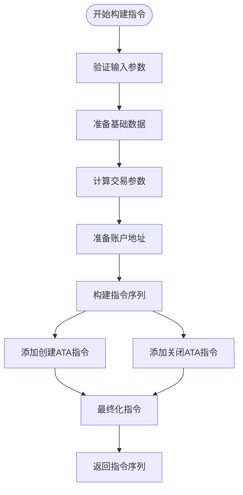
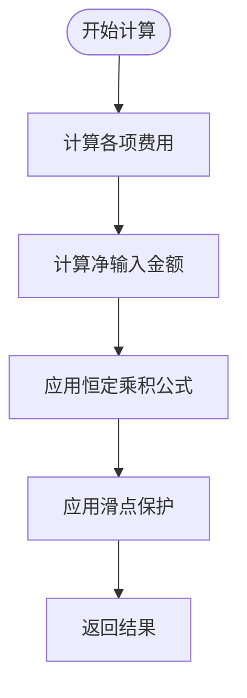
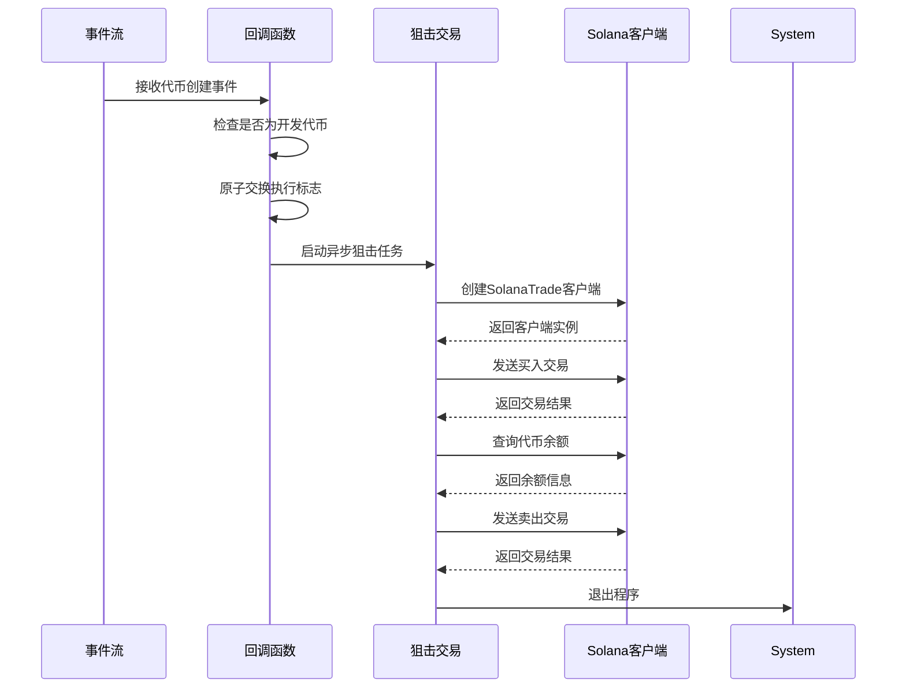
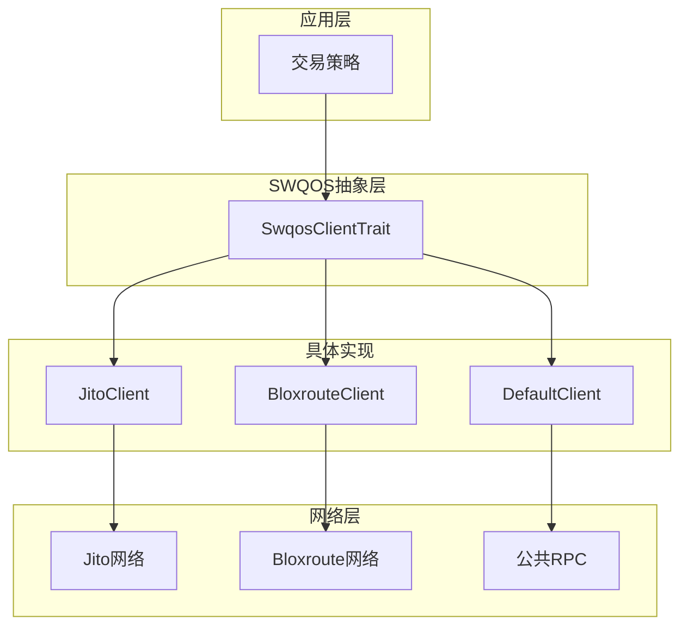
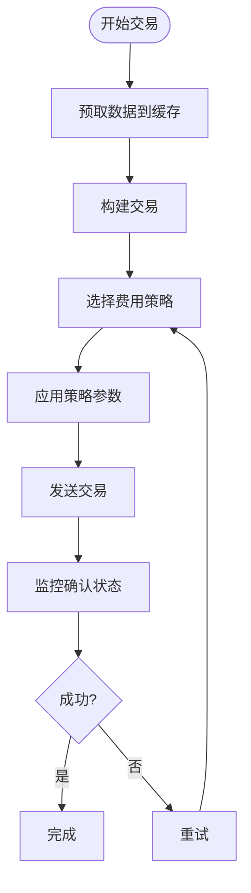

# Bonk狙击交易策略

<cite>
**本文档引用的文件**   
- [bonk.rs](file://src/instruction/bonk.rs)
- [bonk.rs](file://src/instruction/utils/bonk.rs)
- [bonk.rs](file://src/utils/price/bonk.rs)
- [bonk.rs](file://src/utils/calc/bonk.rs)
- [main.rs](file://examples/bonk_sniper_trading/src/main.rs)
- [params.rs](file://src/trading/core/params.rs)
- [swqos.rs](file://src/swqos/mod.rs)
- [jito.rs](file://src/swqos/jito.rs)
- [bloxroute.rs](file://src/swqos/bloxroute.rs)
- [gas_fee_strategy.rs](file://src/common/gas_fee_strategy.rs)
- [types.rs](file://src/common/types.rs)
</cite>

## 目录
1. [引言](#引言)
2. [核心交易指令构造](#核心交易指令构造)
3. [价格与数量计算模型](#价格与数量计算模型)
4. [狙击交易完整示例分析](#狙击交易完整示例分析)
5. [低延迟交易执行与SWQOS集成](#低延迟交易执行与swqos集成)
6. [高并发与Nonce缓存优化](#高并发与nonce缓存优化)
7. [交易失败处理与重试策略](#交易失败处理与重试策略)
8. [风险控制机制](#风险控制机制)

## 引言
Bonk狙击交易策略是一种在Solana区块链上快速识别并交易新上线代币的自动化策略。该策略通过监听链上事件（如PumpFun或相关协议的代币创建事件），在新代币池创建的第一时间构建并广播交易，以实现最优价格买入。本策略利用sol-trade-sdk提供的高性能工具，结合精确的价格计算、滑点控制和低延迟网络服务，实现亚秒级的交易确认。本文档将深入解析该策略的实现机制，涵盖从事件监听、指令构造到风险控制的完整流程。

## 核心交易指令构造
Bonk狙击交易的核心在于高效且准确地构造交易指令。`src/instruction/bonk.rs`文件中的`BonkInstructionBuilder`结构体实现了`InstructionBuilder` trait，提供了`build_buy_instructions`和`build_sell_instructions`两个异步方法来构建买入和卖出指令。

在构建买入指令时，系统首先进行参数验证，确保输入金额不为零，并从协议参数中提取必要的配置信息。接着，根据是否使用USD1稳定币池来确定全局配置和报价代币。系统通过`get_buy_token_amount_from_sol_amount`函数计算最小输出金额，并使用`get_associated_token_address_with_program_id_fast_use_seed`快速生成用户的钱包地址。指令构建过程中，系统会根据需要添加创建或关闭钱包地址的指令，并最终通过`Instruction::new_with_bytes`构造包含18个账户的交易指令。

卖出指令的构建流程类似，但会首先检查用户钱包中的代币余额，并根据余额动态确定卖出数量。系统同样会处理钱包地址的创建和关闭，并在交易完成后选择性地关闭代币账户以回收租金。

**代码片段路径**
- [src/instruction/bonk.rs#L30-L173](file://src/instruction/bonk.rs#L30-L173)
- [src/instruction/bonk.rs#L176-L329](file://src/instruction/bonk.rs#L176-L329)

**本节来源**
- [src/instruction/bonk.rs](file://src/instruction/bonk.rs#L1-L332)

## 价格与数量计算模型
Bonk狙击交易策略依赖于精确的价格和数量计算模型来确保交易的盈利性和安全性。这些模型主要实现在`utils/price/bonk.rs`和`utils/calc/bonk.rs`两个文件中。

价格计算模型通过`price_token_in_wsol`函数实现，该函数基于恒定乘积公式（x * y = k）计算代币相对于WSOL的价格。计算过程考虑了虚拟储备和实际储备的差异，并通过小数位数调整来确保精度。系统首先计算报价代币总储备（虚拟+实际）和基础代币净储备（虚拟-实际），然后应用浮点运算避免整数除法的精度损失。

数量计算模型则通过`get_buy_token_amount_from_sol_amount`和`get_sell_sol_amount_from_token_amount`两个函数实现。买入计算时，系统首先扣除协议费、平台费和分享费，然后应用恒定乘积公式计算可获得的代币数量，最后应用滑点保护。卖出计算采用类似流程，但方向相反，计算从代币卖出可获得的SOL数量。

**代码片段路径**
- [src/utils/price/bonk.rs#L13-L72](file://src/utils/price/bonk.rs#L13-L72)
- [src/utils/calc/bonk.rs#L20-L55](file://src/utils/calc/bonk.rs#L20-L55)
- [src/utils/calc/bonk.rs#L75-L112](file://src/utils/calc/bonk.rs#L75-L112)

**本节来源**
- [src/utils/price/bonk.rs](file://src/utils/price/bonk.rs#L1-L73)
- [src/utils/calc/bonk.rs](file://src/utils/calc/bonk.rs#L1-L113)

## 狙击交易完整示例分析
`examples/bonk_sniper_trading/src/main.rs`提供了一个完整的Bonk狙击交易示例，展示了如何从事件监听到交易执行的完整流程。

示例程序首先创建一个全局原子标志`ALREADY_EXECUTED`，确保狙击交易只执行一次。主函数`main`通过`ShredStreamGrpc`订阅链上事件流，监听Bonk协议的各种事件类型，特别是代币创建事件。当收到事件时，回调函数`create_event_callback`会检查是否为开发者创建代币的交易，如果是，则启动一个异步任务执行狙击交易。

狙击交易函数`bonk_sniper_trade_with_shreds`首先创建SolanaTrade客户端，然后根据事件信息构建买入和卖出参数。买入时，系统设置固定的SOL投入金额和滑点容忍度，并从事件中提取所有必要的协议参数。卖出时，系统先查询用户钱包中的代币余额，然后构建卖出指令。整个交易流程在完成买入和卖出后自动退出程序。

**代码片段路径**
- [examples/bonk_sniper_trading/src/main.rs#L27-L45](file://examples/bonk_sniper_trading/src/main.rs#L27-L45)
- [examples/bonk_sniper_trading/src/main.rs#L49-L67](file://examples/bonk_sniper_trading/src/main.rs#L49-L67)
- [examples/bonk_sniper_trading/src/main.rs#L89-L195](file://examples/bonk_sniper_trading/src/main.rs#L89-L195)

**本节来源**
- [examples/bonk_sniper_trading/src/main.rs](file://examples/bonk_sniper_trading/src/main.rs#L1-L197)

## 低延迟交易执行与SWQOS集成
为了实现亚秒级的交易确认，Bonk狙击策略集成了多种SWQOS（Specialized Web3 Quality of Service）服务，如Jito和Bloxroute。这些服务通过专用网络和优先交易通道，显著降低了交易确认时间。

`src/swqos/mod.rs`定义了`SwqosClientTrait`接口和多种SWQOS客户端实现。系统支持Jito、Bloxroute、NextBlock等多种服务，并通过`SwqosConfig`枚举配置不同服务的参数。在交易执行时，系统会根据配置创建相应的客户端实例，并通过高性能的HTTP客户端发送交易。

以Jito为例，`src/swqos/jito.rs`中的`JitoClient`通过优化的连接池配置（如增加空闲连接数、减少超时时间）和TCP参数调优（如禁用Nagle算法）来降低网络延迟。客户端通过`sendTransaction` API提交交易，并使用`poll_transaction_confirmation`轮询交易确认状态。Bloxroute的实现类似，但使用不同的API端点和认证机制。

**代码片段路径**
- [src/swqos/mod.rs#L124-L343](file://src/swqos/mod.rs#L124-L343)
- [src/swqos/jito.rs#L19-L170](file://src/swqos/jito.rs#L19-L170)
- [src/swqos/bloxroute.rs#L18-L148](file://src/swqos/bloxroute.rs#L18-L148)

**本节来源**
- [src/swqos/mod.rs](file://src/swqos/mod.rs#L1-L344)
- [src/swqos/jito.rs](file://src/swqos/jito.rs#L1-L170)
- [src/swqos/bloxroute.rs](file://src/swqos/bloxroute.rs#L1-L148)

## 高并发与Nonce缓存优化
在高竞争环境下，Bonk狙击交易需要处理高并发场景，避免交易冲突和Nonce重复。系统通过Nonce缓存和预取优化来提升性能。

`src/trading/core/execution.rs`中的`Prefetch`结构体实现了指令、公钥和密钥对的预取功能，利用硬件优化技术将数据预加载到CPU缓存中，减少内存访问延迟。`InstructionProcessor`在预处理指令时会进行分支预测和预取，提高指令处理效率。

`src/common/gas_fee_strategy.rs`中的`GasFeeStrategy`允许动态调整交易费用策略，支持多种费率模式（如正常模式、低小费高计算单元价格、高小费低计算单元价格）。系统可以根据网络状况动态调整小费和计算单元价格，提高交易被打包的概率。

**代码片段路径**
- [src/trading/core/execution.rs#L16-L58](file://src/trading/core/execution.rs#L16-L58)
- [src/common/gas_fee_strategy.rs#L28-L386](file://src/common/gas_fee_strategy.rs#L28-L386)

**本节来源**
- [src/trading/core/execution.rs](file://src/trading/core/execution.rs#L1-L156)
- [src/common/gas_fee_strategy.rs](file://src/common/gas_fee_strategy.rs#L1-L387)

## 交易失败处理与重试策略
在高竞争的区块链环境中，交易失败是常见现象。系统通过完善的失败处理和重试策略来提高成功率。

交易失败可能由多种原因引起，包括超时、优先费不足、Nonce冲突等。系统通过`poll_transaction_confirmation`函数监控交易状态，如果在指定时间内未确认，则视为失败。对于失败的交易，系统可以采用指数退避重试策略，逐步增加小费金额，直到交易成功或达到最大重试次数。

`GasFeeStrategy`提供了动态调整小费的功能，允许在重试时增加小费金额。系统还可以结合多个SWQOS服务，同时通过不同通道提交交易，提高成功概率。此外，通过Nonce缓存避免重复使用相同的Nonce，防止交易冲突。

**本节来源**
- [src/swqos/jito.rs#L114-L125](file://src/swqos/jito.rs#L114-L125)
- [src/swqos/bloxroute.rs#L98-L107](file://src/swqos/bloxroute.rs#L98-L107)
- [src/common/gas_fee_strategy.rs#L320-L346](file://src/common/gas_fee_strategy.rs#L320-L346)

## 风险控制机制
Bonk狙击交易策略内置了多种风险控制机制，以保护用户资金安全。

系统实现了最大投入金额限制，防止因配置错误导致过度投资。通过滑点设置，确保交易价格在可接受范围内，避免因价格剧烈波动造成损失。自动止损机制可以在代币价格下跌到预设阈值时自动卖出，限制潜在亏损。

黑名单过滤功能可以阻止与已知恶意代币或地址的交易。系统还支持模拟交易模式，在真实执行前验证交易逻辑的正确性。此外，通过`create_wsol_ata_on_startup`和`use_seed_optimize`等配置，系统可以在启动时自动创建必要的钱包地址并优化性能。

**本节来源**
- [src/common/types.rs#L9-L14](file://src/common/types.rs#L9-L14)
- [src/instruction/bonk.rs#L34-L36](file://src/instruction/bonk.rs#L34-L36)
- [src/constants/trade.rs#L2](file://src/constants/trade.rs#L2)