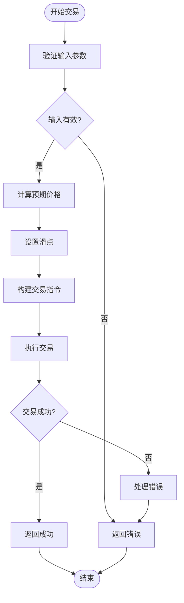

# DEX支持与交易策略

<cite>
**本文档引用的文件**
- [lib.rs](file://src/lib.rs#L1-L762)
- [pumpfun.rs](file://src/instruction/pumpfun.rs#L1-L291)
- [pumpswap.rs](file://src/instruction/pumpswap.rs#L1-L252)
- [raydium_amm_v4.rs](file://src/instruction/raydium_amm_v4.rs#L1-L252)
- [meteora_damm_v2.rs](file://src/instruction/meteora_damm_v2.rs#L1-L240)
- [pumpfun_sniper_trading/main.rs](file://examples/pumpfun_sniper_trading/src/main.rs#L1-L166)
- [pumpfun_copy_trading/main.rs](file://examples/pumpfun_copy_trading/src/main.rs#L1-L227)
- [raydium_amm_v4_trading/main.rs](file://examples/raydium_amm_v4_trading/src/main.rs#L1-L222)
- [meteora_damm_v2_direct_trading/main.rs](file://examples/meteora_damm_v2_direct_trading/src/main.rs#L1-L99)
- [pumpfun.rs](file://src/utils/price/pumpfun.rs#L1-L19)
- [raydium_amm_v4.rs](file://src/utils/price/raydium_amm_v4.rs#L1-L48)
- [pumpfun.rs](file://src/utils/calc/pumpfun.rs#L1-L50)
- [raydium_amm_v4.rs](file://src/utils/calc/raydium_amm_v4.rs#L1-L50)
- [factory.rs](file://src/trading/factory.rs#L1-L99)
</cite>

## 目录
1. [PumpFun狙击与复制交易](#pumpfun狙击与复制交易)
2. [PumpSwap和Raydium AMM V4标准交易](#pumpswap和raydium-amm-v4标准交易)
3. [Meteora DAMM V2直接交易](#meteora-damm-v2直接交易)
4. [指令编码与价格计算](#指令编码与价格计算)
5. [交易延迟与成本比较](#交易延迟与成本比较)

## PumpFun狙击与复制交易

PumpFun交易策略主要分为狙击交易（sniping）和复制交易（copy trading）两种模式。狙击交易通过监听新代币创建事件，在代币刚上线时立即执行买入操作，以获取最佳价格。复制交易则通过监听其他交易者的买卖行为，快速复制其交易策略。

在狙击交易实现中，系统通过ShredStream订阅PumpFun事件，当检测到开发者创建新代币的事件时，立即执行买入操作。`pumpfun_sniper_trading`示例展示了如何配置事件回调函数，创建交易客户端，并执行买入和卖出操作。该策略的关键在于快速响应，通过原子标志`ALREADY_EXECUTED`确保只执行一次交易。

复制交易则通过Yellowstone gRPC订阅PumpFun的买卖事件，当检测到其他用户的交易行为时，立即复制其交易参数并执行。`pumpfun_copy_trading`示例展示了如何从交易事件中提取必要的参数，如流动性曲线、虚拟储备等，并构建相应的交易指令。这种策略允许开发者跟随市场领先者的操作，降低决策风险。

**Section sources**
- [pumpfun_sniper_trading/main.rs](file://examples/pumpfun_sniper_trading/src/main.rs#L1-L166)
- [pumpfun_copy_trading/main.rs](file://examples/pumpfun_copy_trading/src/main.rs#L1-L227)
- [pumpfun.rs](file://src/instruction/pumpfun.rs#L1-L291)

## PumpSwap和Raydium AMM V4标准交易

PumpSwap和Raydium AMM V4的交易策略基于自动化做市商（AMM）模型，通过构建标准交换指令来执行交易。这两种DEX的交易流程相似，都涉及价格计算、滑点设置和路由逻辑。

在PumpSwap交易中，系统首先获取交易对的流动性池信息，包括代币A和代币B的储备量。然后根据当前储备量计算预期价格，并设置合理的滑点容忍度。`pumpswap_trading`示例展示了如何配置交易参数，包括输入代币类型、交易金额、滑点基点等。交易指令的构建过程包括创建关联代币账户（ATA）、构建交换指令和可选的关闭账户指令。

Raydium AMM V4的交易实现类似，但需要处理更复杂的账户结构。`raydium_amm_v4_trading`示例展示了如何从交易事件中提取AMM地址，获取流动性池信息，并构建交换指令。关键区别在于Raydium AMM V4需要处理Serum市场相关的账户，如订单簿、事件队列等。价格计算基于恒定乘积公式，滑点设置确保交易在可接受的价格范围内执行。

**Section sources**
- [raydium_amm_v4_trading/main.rs](file://examples/raydium_amm_v4_trading/src/main.rs#L1-L222)
- [raydium_amm_v4.rs](file://src/instruction/raydium_amm_v4.rs#L1-L252)
- [pumpswap.rs](file://src/instruction/pumpswap.rs#L1-L252)

## Meteora DAMM V2直接交易

Meteora DAMM V2（动态自动化做市商）支持直接交易功能，允许开发者直接与流动性池进行交互。与传统的AMM不同，DAMM V2采用更灵活的定价模型，能够更好地适应市场波动。

Meteora DAMM V2的交易实现要求必须设置`fixed_output_amount`参数，这与其他DEX不同。`meteora_damm_v2_direct_trading`示例展示了如何配置交易参数，包括池地址、代币地址和固定输出金额。交易指令的构建过程包括获取池信息、计算输入金额和构建交换指令。

DAMM V2的指令编码包含特定的判别器（discriminator），用于标识交换操作。账户列表包括池授权、输入和输出代币账户、代币金库等。由于DAMM V2的复杂性，系统需要处理更多的账户验证和参数检查，确保交易的安全性和正确性。

**Section sources**
- [meteora_damm_v2_direct_trading/main.rs](file://examples/meteora_damm_v2_direct_trading/src/main.rs#L1-L99)
- [meteora_damm_v2.rs](file://src/instruction/meteora_damm_v2.rs#L1-L240)

## 指令编码与价格计算

每个DEX的指令编码方式遵循特定的格式，包括方法ID、数据字段和账户列表。PumpFun的买入指令使用8字节的方法ID `[102, 6, 61, 18, 1, 218, 235, 234]`，后跟8字节的代币数量和8字节的最大SOL成本。Raydium AMM V4的交换指令使用1字节的判别器，后跟8字节的输入金额和8字节的最小输出金额。

价格计算模型因DEX而异。PumpFun使用基于虚拟储备的定价模型，价格计算公式为 `虚拟SOL储备 / 虚拟代币储备`。`price_token_in_sol`函数实现了这一计算，将虚拟储备转换为实际价格。Raydium AMM V4使用恒定乘积公式，价格计算基于基础储备和报价储备的比例。

滑点计算是交易策略的重要组成部分。系统使用`calculate_with_slippage_buy`和`calculate_with_slippage_sell`函数来计算可接受的价格范围。滑点基点（basis points）参数允许开发者设置价格容忍度，通常设置为100-300基点（1-3%）。

**Diagram sources**
- [pumpfun.rs](file://src/instruction/pumpfun.rs#L1-L291)
- [raydium_amm_v4.rs](file://src/instruction/raydium_amm_v4.rs#L1-L252)
- [pumpfun.rs](file://src/utils/price/pumpfun.rs#L1-L19)
- [raydium_amm_v4.rs](file://src/utils/price/raydium_amm_v4.rs#L1-L48)

**Section sources**
- [pumpfun.rs](file://src/instruction/pumpfun.rs#L1-L291)
- [raydium_amm_v4.rs](file://src/instruction/raydium_amm_v4.rs#L1-L252)
- [pumpfun.rs](file://src/utils/price/pumpfun.rs#L1-L19)
- [raydium_amm_v4.rs](file://src/utils/price/raydium_amm_v4.rs#L1-L48)
- [pumpfun.rs](file://src/utils/calc/pumpfun.rs#L1-L50)
- [raydium_amm_v4.rs](file://src/utils/calc/raydium_amm_v4.rs#L1-L50)

## 交易延迟与成本比较

不同DEX的交易延迟和成本存在显著差异。PumpFun由于其简单的合约结构和较少的账户验证，通常具有最低的交易延迟。狙击交易可以在几毫秒内完成，使其成为新代币上市时的理想选择。

PumpSwap和Raydium AMM V4的交易延迟稍高，主要由于更复杂的账户结构和验证过程。Raydium AMM V4需要处理Serum市场相关的账户，增加了交易构建的复杂性。然而，这些DEX通常提供更好的流动性和更稳定的价格。

Meteora DAMM V2的交易成本相对较高，因为其动态定价模型需要更多的计算资源。然而，这种模型能够更好地适应市场波动，减少无常损失。开发者应根据目标市场的特点选择合适的DEX策略：对于新代币狙击，PumpFun是最佳选择；对于稳定交易，PumpSwap和Raydium AMM V4提供更好的流动性和价格稳定性。

**Section sources**
- [pumpfun_sniper_trading/main.rs](file://examples/pumpfun_sniper_trading/src/main.rs#L1-L166)
- [raydium_amm_v4_trading/main.rs](file://examples/raydium_amm_v4_trading/src/main.rs#L1-L222)
- [meteora_damm_v2_direct_trading/main.rs](file://examples/meteora_damm_v2_direct_trading/src/main.rs#L1-L99)