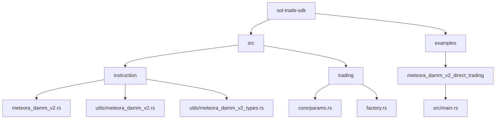
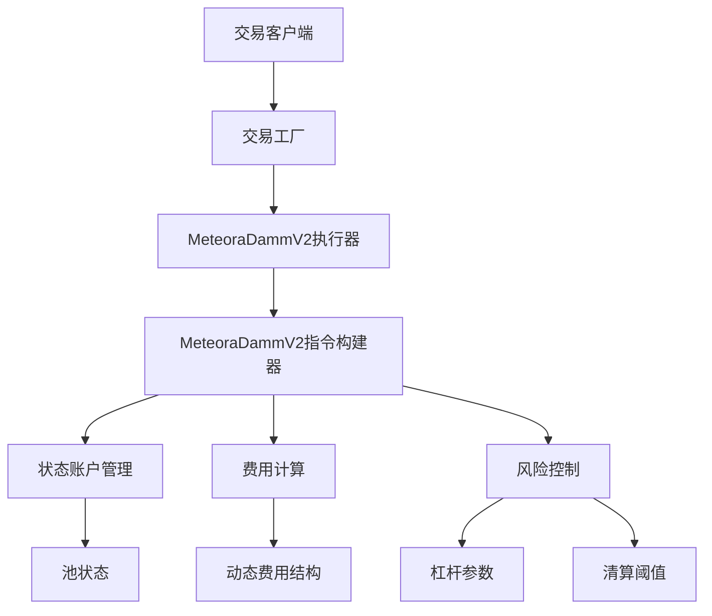
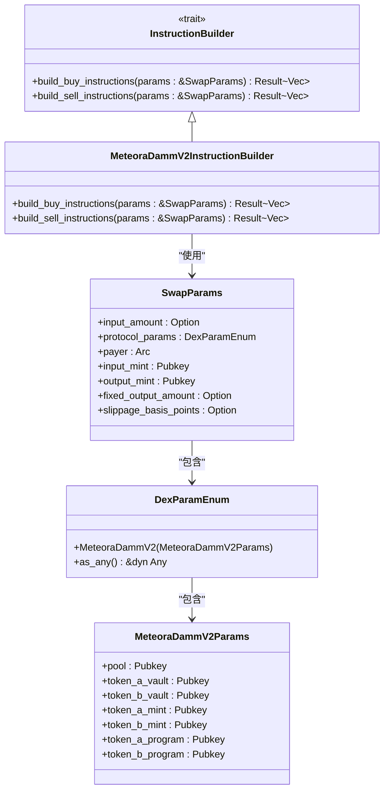
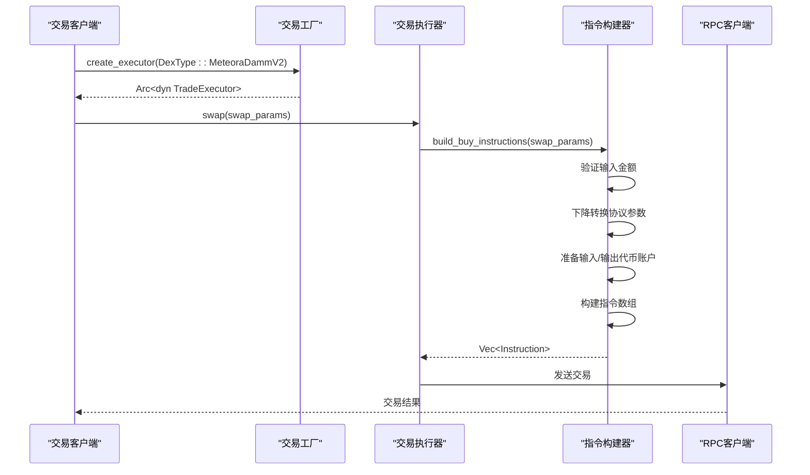
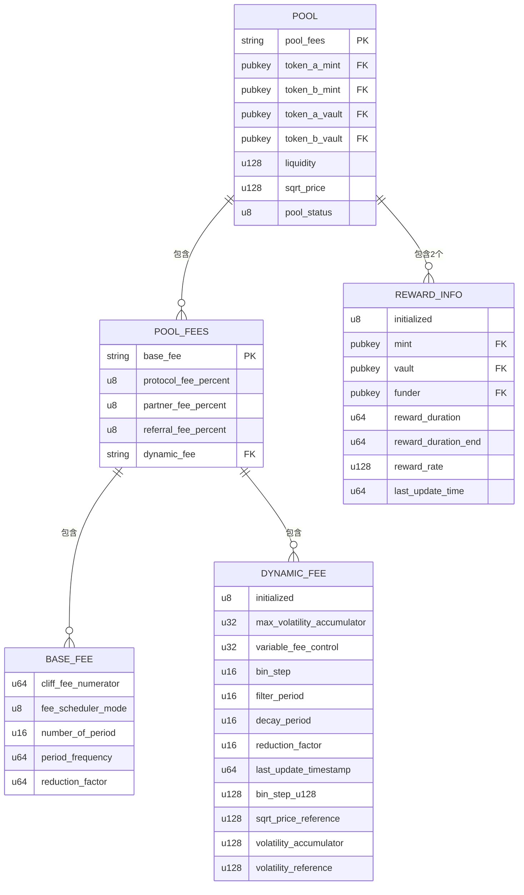
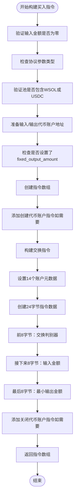
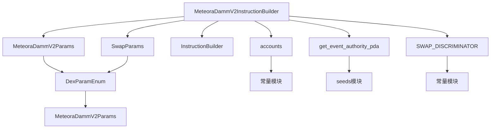

# Meteora DAMM V2交易支持

<cite>
**本文档引用的文件**  
- [main.rs](file://examples/meteora_damm_v2_direct_trading/src/main.rs)
- [meteora_damm_v2.rs](file://src/instruction/meteora_damm_v2.rs)
- [meteora_damm_v2_types.rs](file://src/instruction/utils/meteora_damm_v2_types.rs)
- [meteora_damm_v2.rs](file://src/instruction/utils/meteora_damm_v2.rs)
- [params.rs](file://src/trading/core/params.rs)
- [factory.rs](file://src/trading/factory.rs)
</cite>

## 目录
1. [简介](#简介)
2. [项目结构](#项目结构)
3. [核心组件](#核心组件)
4. [架构概述](#架构概述)
5. [详细组件分析](#详细组件分析)
6. [依赖分析](#依赖分析)
7. [性能考量](#性能考量)
8. [故障排除指南](#故障排除指南)
9. [结论](#结论)

## 简介
sol-trade-sdk为Meteora动态自动做市商V2（DAMM V2）协议提供了直接交易支持，实现了低延迟、高性能的交易执行能力。本SDK通过优化的指令构建、状态账户管理、费用计算和风险控制机制，使开发者能够高效地与Meteora协议交互。Meteora DAMM V2采用创新的动态做市商模型，与传统AMM相比，在价格发现机制、流动性效率和风险控制方面具有显著优势。SDK通过预计算、缓存优化和并行执行策略，最大限度地减少了交易延迟，适用于高频交易和波动性市场环境。

## 项目结构
sol-trade-sdk的项目结构清晰地组织了不同协议的交易功能，其中Meteora DAMM V2的支持位于专门的模块中。核心交易逻辑分布在`src/instruction`和`src/trading`目录下，而示例程序则在`examples`目录中提供。

**图示来源**  
- [meteora_damm_v2.rs](file://src/instruction/meteora_damm_v2.rs)
- [meteora_damm_v2_types.rs](file://src/instruction/utils/meteora_damm_v2_types.rs)
- [params.rs](file://src/trading/core/params.rs)
- [main.rs](file://examples/meteora_damm_v2_direct_trading/src/main.rs)

**本节来源**  
- [src/instruction/meteora_damm_v2.rs](file://src/instruction/meteora_damm_v2.rs)
- [src/trading/core/params.rs](file://src/trading/core/params.rs)
- [examples/meteora_damm_v2_direct_trading/src/main.rs](file://examples/meteora_damm_v2_direct_trading/src/main.rs)

## 核心组件
sol-trade-sdk对Meteora DAMM V2的支持主要由几个核心组件构成：`MeteoraDammV2InstructionBuilder`负责构建交易指令，`MeteoraDammV2Params`封装协议特定参数，`DexParamEnum`提供类型安全的参数抽象，以及`TradeFactory`用于创建交易执行器。这些组件协同工作，实现了对Meteora协议的高效访问。

**本节来源**  
- [meteora_damm_v2.rs](file://src/instruction/meteora_damm_v2.rs#L1-L240)
- [params.rs](file://src/trading/core/params.rs#L657-L708)
- [factory.rs](file://src/trading/factory.rs#L1-L99)

## 架构概述
sol-trade-sdk的架构采用模块化设计，将协议特定的逻辑与通用交易基础设施分离。对于Meteora DAMM V2，SDK通过指令构建器模式实现了协议的解耦，使得交易执行器可以零开销地创建和复用。

**图示来源**  
- [factory.rs](file://src/trading/factory.rs#L1-L99)
- [meteora_damm_v2.rs](file://src/instruction/meteora_damm_v2.rs#L1-L240)
- [meteora_damm_v2_types.rs](file://src/instruction/utils/meteora_damm_v2_types.rs#L1-L115)

## 详细组件分析

### MeteoraDammV2指令构建分析
`MeteoraDammV2InstructionBuilder`是SDK中负责构建Meteora DAMM V2交易指令的核心组件。它实现了`InstructionBuilder` trait，提供了`build_buy_instructions`和`build_sell_instructions`两个异步方法，用于生成买入和卖出交易的指令序列。

#### 指令构建器类图

**图示来源**  
- [meteora_damm_v2.rs](file://src/instruction/meteora_damm_v2.rs#L1-L240)
- [params.rs](file://src/trading/core/params.rs#L43-L709)

### 交易执行流程分析
Meteora DAMM V2的交易执行流程包括参数验证、账户准备、指令构建和交易提交等关键步骤。SDK通过优化的流程设计，确保了交易的高效执行。

#### 买入交易序列图

**图示来源**  
- [meteora_damm_v2.rs](file://src/instruction/meteora_damm_v2.rs#L19-L127)
- [factory.rs](file://src/trading/factory.rs#L27-L35)

#### 卖出交易序列图

**图示来源**  
- [meteora_damm_v2.rs](file://src/instruction/meteora_damm_v2.rs#L130-L238)
- [factory.rs](file://src/trading/factory.rs#L27-L35)

### 状态账户与参数结构分析
Meteora DAMM V2的状态账户结构复杂，包含了池费用、流动性、价格信息和奖励信息等多个部分。SDK通过`Pool`结构体和相关类型安全地表示这些数据。

#### 状态账户数据模型

**图示来源**  
- [meteora_damm_v2_types.rs](file://src/instruction/utils/meteora_damm_v2_types.rs#L5-L115)

### 指令结构与费用计算分析
Meteora DAMM V2的指令结构遵循Solana的指令格式，包含程序ID、账户列表和指令数据。指令数据中包含了交换判别器、输入金额和最小输出金额等关键信息。

#### 指令构建流程图

**图示来源**  
- [meteora_damm_v2.rs](file://src/instruction/meteora_damm_v2.rs#L19-L127)

**本节来源**  
- [meteora_damm_v2.rs](file://src/instruction/meteora_damm_v2.rs#L1-L240)
- [meteora_damm_v2_types.rs](file://src/instruction/utils/meteora_damm_v2_types.rs#L1-L115)
- [meteora_damm_v2.rs](file://src/instruction/utils/meteora_damm_v2.rs#L1-L55)

## 依赖分析
sol-trade-sdk的Meteora DAMM V2支持模块依赖于多个核心组件，形成了清晰的依赖关系图。这些依赖关系确保了代码的模块化和可维护性。

**图示来源**  
- [meteora_damm_v2.rs](file://src/instruction/meteora_damm_v2.rs#L1-L240)
- [meteora_damm_v2.rs](file://src/instruction/utils/meteora_damm_v2.rs#L1-L55)

**本节来源**  
- [meteora_damm_v2.rs](file://src/instruction/meteora_damm_v2.rs#L1-L240)
- [params.rs](file://src/trading/core/params.rs#L1-L709)

## 性能考量
sol-trade-sdk通过多种机制优化Meteora DAMM V2交易的性能。首先，SDK使用`LazyLock`实现了交易执行器的零开销单例模式，避免了重复创建的开销。其次，通过`use_seed_optimize`配置，SDK可以使用种子优化来加速关联代币账户（ATA）的创建。此外，SDK支持预取池状态信息，减少了RPC调用的延迟。

在波动性市场中，SDK的性能优势尤为明显。通过预计算和缓存优化，交易延迟可以显著降低。例如，`MeteoraDammV2Params::from_pool_address_by_rpc`方法可以预先获取池状态，避免在交易执行时进行耗时的RPC调用。同时，SDK的并行执行能力允许多个交易同时提交，提高了吞吐量。

## 故障排除指南
在使用sol-trade-sdk与Meteora DAMM V2协议交互时，可能会遇到一些常见问题。以下是故障排除指南：

1. **交易失败：金额为零** - 确保`input_amount`参数正确设置且不为零。
2. **协议参数类型错误** - 确保`extension_params`正确设置为`DexParamEnum::MeteoraDammV2`。
3. **未设置fixed_output_amount** - Meteora DAMM V2交易必须设置`fixed_output_amount`参数。
4. **池不包含WSOL或USDC** - 验证交易池是否包含WSOL或USDC代币。
5. **RPC连接问题** - 检查RPC URL配置和网络连接。

**本节来源**  
- [meteora_damm_v2.rs](file://src/instruction/meteora_damm_v2.rs#L23-L36)
- [meteora_damm_v2.rs](file://src/instruction/meteora_damm_v2.rs#L45-L46)
- [meteora_damm_v2.rs](file://src/instruction/meteora_damm_v2.rs#L156-L157)

## 结论
sol-trade-sdk为Meteora DAMM V2协议提供了全面、高效的直接交易支持。通过模块化的设计、类型安全的API和性能优化，SDK使开发者能够轻松地与Meteora协议交互，实现低延迟的交易执行。Meteora DAMM V2的动态做市商模型在价格发现和流动性效率方面优于传统AMM，特别适合波动性市场环境。结合SDK的预计算、缓存和并行执行能力，交易者可以获得显著的性能优势。建议在生产环境中使用预取池状态和种子优化等高级功能，以最大化交易性能。