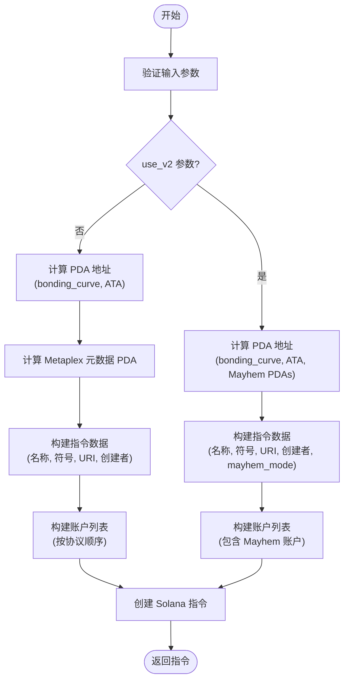

# PumpFun 代币创建功能

<cite>
**本文档引用的文件**   
- [pumpfun.rs](file://src/instruction/pumpfun.rs)
- [pumpfun.rs](file://src/instruction/utils/pumpfun.rs)
- [params.rs](file://src/trading/core/params.rs)
- [bonding_curve.rs](file://src/common/bonding_curve.rs)
- [pumpfun_buy_test/main.rs](file://examples/pumpfun_buy_test/src/main.rs)
- [pumpfun_sniper_trading/main.rs](file://examples/pumpfun_sniper_trading/src/main.rs)
- [pumpfun_copy_trading/main.rs](file://examples/pumpfun_copy_trading/src/main.rs)
</cite>

## 目录
1. [简介](#简介)
2. [项目结构](#项目结构)
3. [核心组件](#核心组件)
4. [代币创建功能详解](#代币创建功能详解)
5. [创建指令构建流程](#创建指令构建流程)
6. [PDA 地址派生机制](#pda-地址派生机制)
7. [交易参数与配置](#交易参数与配置)
8. [性能优化与并发处理](#性能优化与并发处理)
9. [示例应用分析](#示例应用分析)
10. [结论](#结论)

## 简介
本项目是一个高性能的 Solana 交易 SDK，专注于提供低延迟、高效率的交易功能。其核心目标是为开发者提供一个稳定、快速且可扩展的交易基础设施，特别针对 PumpFun 等新兴代币平台的交易需求进行了深度优化。SDK 通过集成多种高级性能优化技术，如零拷贝 I/O、内核旁路、SIMD 指令集优化等，实现了极致的交易速度和可靠性。PumpFun 作为 Solana 生态中一个流行的代币创建和交易协议，允许用户快速创建和交易 meme 代币。本 SDK 提供了完整的 PumpFun 代币创建功能，包括创建传统 SPL 代币和使用 Token2022 标准的高级代币（Mayhem 模式），并支持通过事件流进行狙击交易和跟单交易。

## 项目结构
该项目采用模块化设计，结构清晰，便于维护和扩展。核心功能分布在 `src` 目录下的多个模块中，包括通用工具、常量定义、指令构建、性能优化、QoS 服务和交易核心逻辑。`examples` 目录提供了丰富的使用示例，涵盖了从基础交易到高级策略的各种场景。

```mermaid
graph TD
A[项目根目录] --> B[docs]
A --> C[examples]
A --> D[src]
A --> E[test_latency.sh]
A --> F[Cargo.toml]
C --> C1[address_lookup]
C --> C2[bonk_copy_trading]
C --> C3[bonk_sniper_trading]
C --> C4[cli_trading]
C --> C5[gas_fee_strategy]
C --> C6[meteora_damm_v2_direct_trading]
C --> C7[middleware_system]
C --> C8[nonce_cache]
C --> C9[pumpfun_buy_test]
C --> C10[pumpfun_copy_trading]
C --> C11[pumpfun_sniper_trading]
C --> C12[pumpswap_direct_trading]
C --> C13[pumpswap_trading]
C --> C14[raydium_amm_v4_trading]
C --> C15[raydium_cpmm_trading]
C --> C16[seed_trading]
C --> C17[trading_client]
C --> C18[wsol_wrapper]
D --> D1[common]
D --> D2[constants]
D --> D3[instruction]
D --> D4[perf]
D --> D5[swqos]
D --> D6[trading]
D --> D7[utils]
D --> D8[lib.rs]
D1 --> D1a[address_lookup.rs]
D1 --> D1b[bonding_curve.rs]
D1 --> D1c[fast_fn.rs]
D1 --> D1d[fast_timing.rs]
D1 --> D1e[nonce_cache.rs]
D1 --> D1f[types.rs]
D3 --> D3a[utils]
D3 --> D3b[bonk.rs]
D3 --> D3c[pumpfun.rs]
D3 --> D3d[pumpswap.rs]
D6 --> D6a[common]
D6 --> D6b[core]
D6 --> D6c[middleware]
D6 --> D6d[factory.rs]
```

**图表来源**
- [pumpfun.rs](file://src/instruction/pumpfun.rs)
- [pumpfun_copy_trading/main.rs](file://examples/pumpfun_copy_trading/src/main.rs)

## 核心组件
本 SDK 的核心组件围绕交易指令的构建、发送和优化展开。`instruction` 模块负责生成特定于协议的 Solana 指令，`trading` 模块管理交易的执行流程，`swqos` 模块集成第三方快速交易服务以提高交易成功率，`perf` 模块则包含一系列底层性能优化技术。`common` 模块提供了跨功能的通用工具，如 PDA 地址计算、快速函数调用和非重复性检查。`utils` 模块则专注于计算和价格相关的辅助功能。这些组件协同工作，确保交易能够以最低的延迟和最高的可靠性执行。

**章节来源**
- [pumpfun.rs](file://src/instruction/pumpfun.rs)
- [params.rs](file://src/trading/core/params.rs)
- [bonding_curve.rs](file://src/common/bonding_curve.rs)

## 代币创建功能详解
PumpFun 代币创建功能是本 SDK 的核心特性之一，它允许用户通过调用 PumpFun 协议的 `create` 和 `create_v2` 指令来创建新的代币。该功能主要在 `src/instruction/pumpfun.rs` 文件中实现，通过 `PumpFunInstructionBuilder` 结构体提供两个静态方法：`build_create_instruction` 和 `build_create_v2_instruction`。前者用于创建基于传统 SPL Token 程序的代币，并使用 Metaplex Token Metadata 程序存储元数据；后者用于创建基于 Token2022 程序的代币，支持 Mayhem 模式，并利用 Token2022 内置的元数据功能。

### 创建传统代币 (build_create_instruction)
此方法用于创建标准的 SPL 代币。它接收一个 `CreateTokenParams` 结构体作为参数，该结构体包含代币的密钥对、名称、符号、元数据 URI 和创建者地址等信息。方法首先验证参数，确保未启用 `use_v2` 模式，然后计算必要的 PDA 地址，包括 bonding curve PDA 和其关联代币账户 (ATA)。接着，它使用 Metaplex 的 PDA 派生规则计算元数据账户地址。最后，它构建指令数据，将代币的名称、符号、URI 和创建者地址序列化，并按照协议要求的顺序组装账户列表，生成一个完整的 Solana 指令。

### 创建高级代币 (build_create_v2_instruction)
此方法用于创建功能更丰富的 Token2022 代币。它同样接收 `CreateTokenParams`，但会检查 `use_v2` 标志是否为真。除了计算 bonding curve PDA 和 ATA 外，它还需要计算 Mayhem 模块相关的多个 PDA，包括全局参数、SOL 金库、代币状态和代币金库 ATA。这些 PDA 使得代币能够支持更复杂的经济模型和功能。指令数据的构建方式与 `create` 类似，但包含了额外的 `is_mayhem_mode` 标志位。账户列表也相应地扩展，包含了 Mayhem 模块所需的程序和账户。

**章节来源**
- [pumpfun.rs](file://src/instruction/pumpfun.rs#L294-L647)

## 创建指令构建流程
构建一个 PumpFun 代币创建指令是一个多步骤的过程，涉及参数验证、地址派生、数据序列化和指令组装。

**图表来源**
- [pumpfun.rs](file://src/instruction/pumpfun.rs#L314-L647)

## PDA 地址派生机制
PDA (Program Derived Address) 是 Solana 上实现无权限账户交互的核心机制。在 PumpFun 代币创建过程中，多个关键账户都是通过 PDA 派生的，以确保它们的安全性和可预测性。

### 主要 PDA 派生
- **Bonding Curve PDA**: 这是代币的核心账户，存储了虚拟和实际的储备量。它使用 `["bonding-curve", mint]` 作为种子，由 PumpFun 程序 (`6EF8...`) 派生。
- **Creator Vault PDA**: 代表代币创建者的金库。它使用 `["creator-vault", creator]` 作为种子，同样由 PumpFun 程序派生。
- **Metaplex Metadata PDA**: 存储代币的名称、符号和图片等元数据。它使用 `["metadata", MPL_TOKEN_METADATA_PROGRAM_ID, mint]` 作为种子，由 Metaplex Token Metadata 程序 (`metaqb...`) 派生。
- **Associated Token Account (ATA)**: 这是每个钱包地址持有的代币余额账户。它由关联代币程序 (`AToken...`) 通过 `find_program_address` 函数派生，种子为 `[owner, token_program_id, mint]`。
- **Mayhem Module PDAs**: 在 `create_v2` 模式下，还会派生多个 Mayhem 模块的 PDA，如 `["global-params"]`、`["sol-vault"]` 和 `["mayhem-state", mint]`，这些都由 Mayhem 程序 (`MAyh...`) 派生。

SDK 通过 `get_bonding_curve_pda`、`get_creator_vault_pda` 等函数封装了这些派生逻辑，并利用缓存 (`get_cached_pda`) 来提高性能，避免重复计算。

**章节来源**
- [pumpfun.rs](file://src/instruction/pumpfun.rs#L351-L364)
- [pumpfun.rs](file://src/instruction/pumpfun.rs#L546-L559)
- [pumpfun.rs](file://src/instruction/utils/pumpfun.rs#L169-L222)

## 交易参数与配置
为了成功创建代币，必须正确配置 `CreateTokenParams` 结构体。该结构体定义了创建代币所需的所有必要信息。

### CreateTokenParams 结构体
| 字段 | 类型 | 描述 |
| :--- | :--- | :--- |
| `mint` | Arc<Keypair> | 代币的密钥对，必须是交易的签名者。 |
| `name` | String | 代币的名称，例如 "MyToken"。 |
| `symbol` | String | 代币的符号，例如 "MTK"。 |
| `uri` | String | 指向代币元数据的 URI，通常是一个 JSON 文件的链接。 |
| `creator` | Pubkey | 代币创建者的公钥，用于接收初始代币和设置创建者权限。 |
| `use_v2` | bool | 是否使用 `create_v2` 指令。设为 `true` 以启用 Token2022 和 Mayhem 模式。 |
| `is_mayhem_mode` | bool | 是否启用 Mayhem 模式，仅在 `use_v2` 为 `true` 时有效。 |

此外，交易的执行还需要配置 `TradeConfig`，其中包括 RPC URL、SWQOS 客户端列表和提交承诺级别。`GasFeeStrategy` 用于设置计算单元限制、价格和小费，以优化交易费用和优先级。

**章节来源**
- [pumpfun.rs](file://src/instruction/pumpfun.rs#L295-L311)

## 性能优化与并发处理
本 SDK 在设计上高度重视性能，集成了多种先进的优化技术。`perf` 模块中的 `zero_copy_io`、`kernel_bypass` 和 `syscall_bypass` 等功能旨在最小化系统调用和内存拷贝开销。`fast_fn` 模块提供了经过高度优化的函数，如 `get_associated_token_address_with_program_id_fast`，用于加速关键路径上的操作。在交易层面，SDK 支持通过配置多个 SWQOS 客户端（如 Jito、Bloxroute）来并发发送交易，极大地提高了交易被快速打包的概率。`transaction_pool` 和 `serialization` 模块通过对象池化技术复用交易构建器和序列化器，减少了内存分配和垃圾回收的压力。

**章节来源**
- [pumpfun_buy_test/main.rs](file://examples/pumpfun_buy_test/src/main.rs#L31-L53)
- [pumpfun_buy_test/main.rs](file://examples/pumpfun_buy_test/src/main.rs#L164-L176)

## 示例应用分析
SDK 提供了多个示例来演示 PumpFun 功能的使用。

### pumpfun_buy_test
此示例展示了如何初始化一个交易客户端并执行一次买入操作。它配置了四个 SWQOS 节点以实现并发发送，并设置了 `GasFeeStrategy`。虽然其主要目的是测试买入延迟，但它清晰地展示了如何构建 `TradeBuyParams` 并调用 `client.buy()` 方法。

### pumpfun_sniper_trading
此示例实现了狙击交易策略。它通过 `ShredStreamGrpc` 订阅实时事件流，监听 `PumpFunCreateToken` 事件。一旦检测到新代币创建，它会立即使用 `create_solana_trade_client()` 创建一个交易客户端，并执行买入和卖出操作，实现快速获利。这展示了 SDK 如何与实时数据源集成以执行自动化策略。

### pumpfun_copy_trading
此示例实现了跟单交易策略。它使用 `YellowstoneGrpc` 订阅事件，当检测到 `PumpFunBuy` 或 `PumpFunSell` 事件时，它会复制该交易，使用相同的参数进行买入或卖出。这证明了 SDK 可以轻松地用于构建复杂的跟单机器人。

**章节来源**
- [pumpfun_buy_test/main.rs](file://examples/pumpfun_buy_test/src/main.rs)
- [pumpfun_sniper_trading/main.rs](file://examples/pumpfun_sniper_trading/src/main.rs)
- [pumpfun_copy_trading/main.rs](file://examples/pumpfun_copy_trading/src/main.rs)

## 结论
本 Solana 交易 SDK 为 PumpFun 代币创建和交易提供了一个强大、高效且易于使用的解决方案。通过深入分析其代码库，我们了解到它不仅实现了标准的 `create` 和 `create_v2` 指令构建，还通过模块化设计、PDA 地址缓存和并发交易发送等机制，确保了高性能和高可靠性。其丰富的示例代码为开发者快速上手和构建高级交易策略（如狙击和跟单）提供了宝贵的参考。该 SDK 是 Solana 生态中进行高速、自动化交易的理想工具。