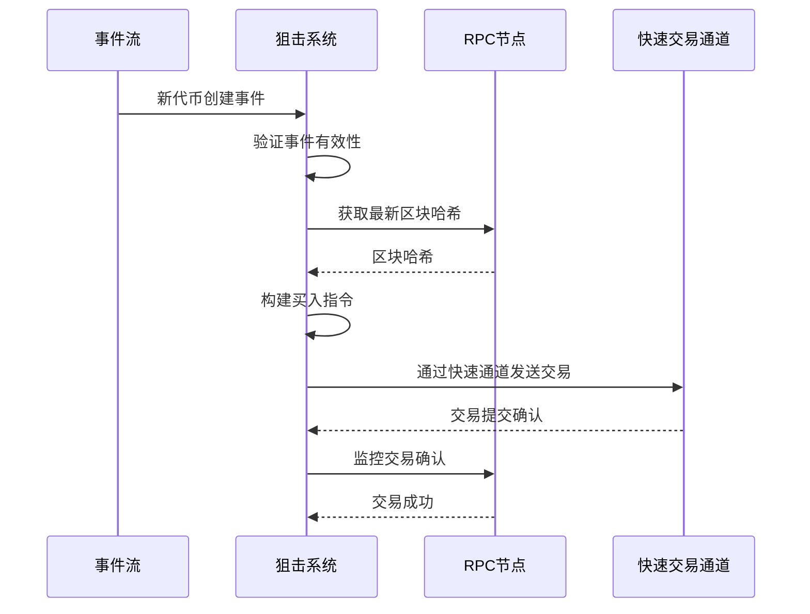
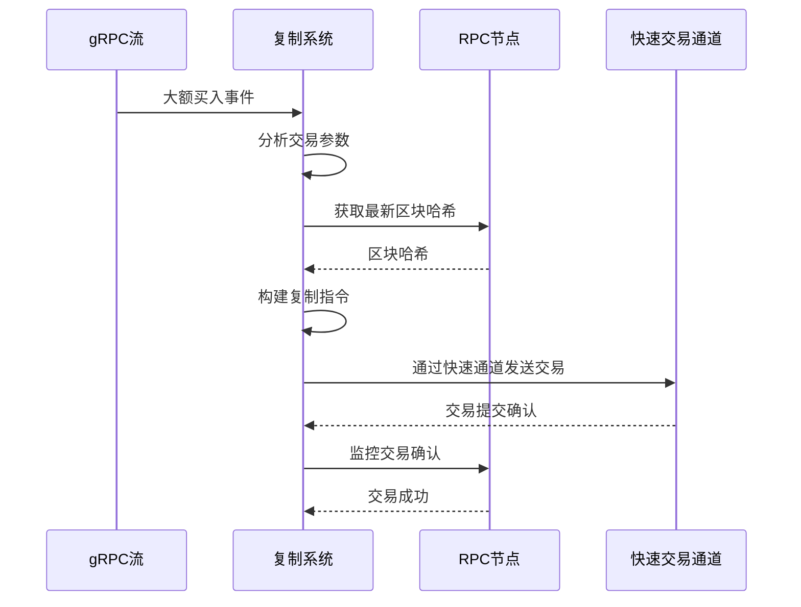
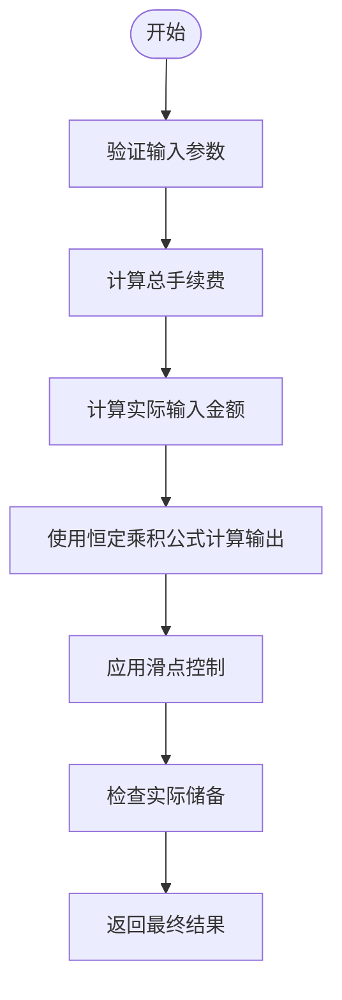
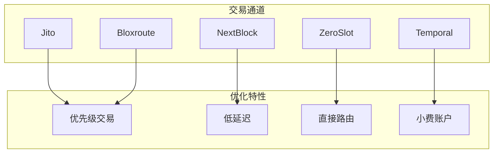
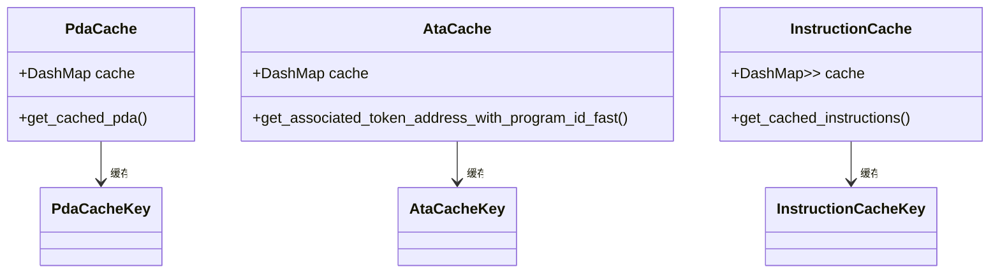

# PumpFun交易支持

<cite>
**本文档引用的文件**   
- [pumpfun.rs](file://src/instruction/pumpfun.rs)
- [pumpfun.rs](file://src/instruction/utils/pumpfun.rs)
- [pumpfun_copy_trading/src/main.rs](file://examples/pumpfun_copy_trading/src/main.rs)
- [pumpfun_sniper_trading/src/main.rs](file://examples/pumpfun_sniper_trading/src/main.rs)
- [price/pumpfun.rs](file://src/utils/price/pumpfun.rs)
- [calc/pumpfun.rs](file://src/utils/calc/pumpfun.rs)
- [params.rs](file://src/trading/core/params.rs)
- [fast_fn.rs](file://src/common/fast_fn.rs)
- [nonce_cache.rs](file://src/common/nonce_cache.rs)
- [swqos.rs](file://src/swqos/mod.rs)
- [NONCE_CACHE_CN.md](file://docs/NONCE_CACHE_CN.md)
- [TRADING_PARAMETERS_CN.md](file://docs/TRADING_PARAMETERS_CN.md)
</cite>

## 目录
1. [PumpFun平台支持概述](#pumpfun平台支持概述)
2. [狙击交易与复制交易机制](#狙击交易与复制交易机制)
3. [交易指令构建流程](#交易指令构建流程)
4. [价格与数量计算模型](#价格与数量计算模型)
5. [快速交易通道配置](#快速交易通道配置)
6. [性能优化策略](#性能优化策略)
7. [常见失败场景应对](#常见失败场景应对)

## PumpFun平台支持概述

sol-trade-sdk为PumpFun平台提供了全面的交易支持，重点实现了狙击交易（sniping）和复制交易（copy trading）两种高级策略。SDK通过监听PumpFun的新代币创建事件，结合超低延迟交易通道（SWQOS），实现了毫秒级的快速买入能力。系统支持完整的交易生命周期管理，包括代币创建、买入、卖出和账户清理等操作。

SDK通过`PumpFunInstructionBuilder`实现了PumpFun协议的指令构建，支持买入和卖出两种操作。在买入操作中，系统会根据提供的SOL金额计算可购买的代币数量，并构建相应的交易指令。在卖出操作中，系统会计算出售代币后可获得的SOL数量，并支持在交易完成后自动关闭代币账户以回收租金。

**Section sources**
- [pumpfun.rs](file://src/instruction/pumpfun.rs#L23-L290)

## 狙击交易与复制交易机制

### 狙击交易实现

狙击交易策略通过监听PumpFun的ShredStream事件来实现。系统订阅PumpFun协议的事件流，重点关注开发者创建新代币的事件。当检测到新代币创建事件时，系统立即执行买入操作，确保在其他交易者之前完成交易。



**Diagram sources**
- [pumpfun_sniper_trading/src/main.rs](file://examples/pumpfun_sniper_trading/src/main.rs#L27-L165)

### 复制交易实现

复制交易策略通过监听PumpFun的Yellowstone gRPC事件来实现。系统监控PumpFun协议的交易事件，当检测到大额买入或卖出交易时，立即复制相同的交易策略。这种策略允许用户跟随市场中活跃的交易者，分享他们的交易成果。



**Diagram sources**
- [pumpfun_copy_trading/src/main.rs](file://examples/pumpfun_copy_trading/src/main.rs#L31-L226)

**Section sources**
- [pumpfun_sniper_trading/src/main.rs](file://examples/pumpfun_sniper_trading/src/main.rs#L27-L165)
- [pumpfun_copy_trading/src/main.rs](file://examples/pumpfun_copy_trading/src/main.rs#L31-L226)

## 交易指令构建流程

### 代币地址解析

交易指令构建的第一步是解析所有相关的代币地址。系统通过PDA（程序派生地址）机制计算各种关键地址，包括：

- **Bonding Curve PDA**：通过`get_bonding_curve_pda`函数计算，使用代币mint地址和固定种子"bonding-curve"生成
- **Creator Vault PDA**：通过`get_creator_vault_pda`函数计算，使用创建者地址和固定种子"creator-vault"生成
- **User Volume Accumulator PDA**：通过`get_user_volume_accumulator_pda`函数计算，使用用户地址和固定种子"user_volume_accumulator"生成

这些PDA地址的计算结果会被缓存，以提高后续交易的性能。

### 交易金额计算

系统根据交易类型执行不同的金额计算：

- **买入计算**：使用`get_buy_token_amount_from_sol_amount`函数，根据SOL输入金额计算可购买的代币数量
- **卖出计算**：使用`get_sell_sol_amount_from_token_amount`函数，根据代币数量计算可获得的SOL金额

### 滑点控制

系统实现了精确的滑点控制机制，确保交易在可接受的价格范围内执行：

- **买入滑点**：使用`calculate_with_slippage_buy`函数，在原始金额基础上增加滑点容忍度
- **卖出滑点**：使用`calculate_with_slippage_sell`函数，从预期金额中减去滑点容忍度

### 手续费优化

系统自动计算并优化交易手续费，包括：

- **协议手续费**：基于`FEE_BASIS_POINTS`常量（95基点）计算
- **创建者手续费**：基于`CREATOR_FEE`常量（30基点）计算
- **总手续费**：协议手续费与创建者手续费之和

**Section sources**
- [pumpfun.rs](file://src/instruction/pumpfun.rs#L28-L289)
- [pumpfun.rs](file://src/instruction/utils/pumpfun.rs#L163-L257)
- [calc/common.rs](file://src/utils/calc/common.rs#L31-L67)

## 价格与数量计算模型

### 价格预测模型

PumpFun的价格预测基于虚拟储备池的比率计算。`price_token_in_sol`函数实现了核心价格计算逻辑：

```rust
pub fn price_token_in_sol(virtual_sol_reserves: u64, virtual_token_reserves: u64) -> f64 {
    let v_sol = virtual_sol_reserves as f64 / LAMPORTS_PER_SOL as f64;
    let v_tokens = virtual_token_reserves as f64 / SCALE as f64;
    if v_tokens == 0.0 {
        return 0.0;
    }
    v_sol / v_tokens
}
```

该模型将虚拟SOL储备和虚拟代币储备转换为实际单位，然后计算它们的比率作为代币价格。这种计算方式反映了PumpFun的恒定乘积做市商模型。

### 数量计算逻辑

#### 买入数量计算

`get_buy_token_amount_from_sol_amount`函数实现了买入数量的计算：

1. 验证输入参数的有效性
2. 计算总手续费基点（协议手续费+创建者手续费）
3. 计算扣除手续费后的实际输入金额
4. 使用恒定乘积公式计算可获得的代币数量
5. 确保结果不超过实际代币储备

#### 卖出数量计算

`get_sell_sol_amount_from_token_amount`函数实现了卖出数量的计算：

1. 验证输入参数的有效性
2. 使用恒定乘积公式计算出售代币可获得的SOL数量
3. 计算交易手续费
4. 从总收入中扣除手续费，得到最终可获得的SOL金额



**Diagram sources**
- [price/pumpfun.rs](file://src/utils/price/pumpfun.rs#L11-L18)
- [calc/pumpfun.rs](file://src/utils/calc/pumpfun.rs#L21-L110)

**Section sources**
- [price/pumpfun.rs](file://src/utils/price/pumpfun.rs#L11-L18)
- [calc/pumpfun.rs](file://src/utils/calc/pumpfun.rs#L21-L110)

## 快速交易通道配置

### SWQOS通道配置

系统支持多种超低延迟交易通道（SWQOS），包括Jito、NextBlock、ZeroSlot等。这些通道通过私有网络直接连接到验证者，绕过公共内存池，实现毫秒级的交易确认。



**Diagram sources**
- [swqos.rs](file://src/swqos/mod.rs#L57-L343)

### 快速交易参数配置

通过`GasFeeStrategy`类配置快速交易参数：

```rust
let gas_fee_strategy = sol_trade_sdk::common::GasFeeStrategy::new();
gas_fee_strategy.set_global_fee_strategy(
    150000, // 基础计算单元
    150000, // 最小计算单元
    500000, // 最大计算单元
    500000, // 预算计算单元
    0.001,  // 最小小费
    0.001,  // 目标小费
    256 * 1024, // 交易大小限制
    0       // 优先级费用
);
```

这些参数优化了交易的执行优先级和成功率。

### 最大买入金额设置

系统支持设置最大买入金额，通过`input_token_amount`参数控制：

```rust
let buy_sol_amount = 100_000; // 0.0001 SOL
let buy_params = sol_trade_sdk::TradeBuyParams {
    input_token_amount: buy_sol_amount,
    // 其他参数...
};
```

### 动态小费策略

系统实现了动态小费策略，根据网络状况自动调整小费金额：

- **基础小费**：基于`SWQOS_MIN_TIP_DEFAULT`常量（0.00001 SOL）
- **通道特定小费**：不同SWQOS通道有不同的最低小费要求
- **动态调整**：根据网络拥堵情况实时调整小费金额

**Section sources**
- [swqos.rs](file://src/swqos/mod.rs#L57-L343)
- [pumpfun_sniper_trading/src/main.rs](file://examples/pumpfun_sniper_trading/src/main.rs#L91-L93)
- [pumpfun_copy_trading/src/main.rs](file://examples/pumpfun_copy_trading/src/main.rs#L123-L133)

## 性能优化策略

### Nonce缓存

系统实现了Nonce缓存机制，通过`fetch_nonce_info`函数获取持久化Nonce信息：

```rust
pub async fn fetch_nonce_info(
    rpc: &SolanaRpcClient,
    nonce_account: Pubkey,
) -> Option<DurableNonceInfo> {
    match rpc.get_account(&nonce_account).await {
        Ok(account) => match account.state() {
            Ok(Versions::Current(state)) => {
                if let State::Initialized(data) = *state {
                    let blockhash = data.durable_nonce.as_hash();
                    return Some(DurableNonceInfo {
                        nonce_account: Some(nonce_account),
                        current_nonce: Some(*blockhash),
                    });
                }
            }
            _ => (),
        },
        Err(e) => {
            error!("Failed to get nonce account information: {:?}", e);
        }
    }
    None
}
```

这种机制允许交易在较长时间内保持有效，不受最近区块哈希150个区块的限制。

### 地址查找表

系统支持地址查找表（Address Lookup Table）优化，通过减少交易中的地址数量来降低交易大小和费用。查找表将长地址映射为短索引，显著提高了交易效率。

### 地址缓存

系统实现了多层地址缓存机制，包括：

- **PDA缓存**：缓存PDA计算结果，避免重复计算
- **ATA缓存**：缓存关联代币账户地址，提高查询速度
- **指令缓存**：缓存常用交易指令，减少构建时间



**Diagram sources**
- [fast_fn.rs](file://src/common/fast_fn.rs#L163-L185)
- [fast_fn.rs](file://src/common/fast_fn.rs#L198-L200)
- [fast_fn.rs](file://src/common/fast_fn.rs#L43-L44)

**Section sources**
- [nonce_cache.rs](file://src/common/nonce_cache.rs#L18-L41)
- [fast_fn.rs](file://src/common/fast_fn.rs#L163-L277)
- [NONCE_CACHE_CN.md](file://docs/NONCE_CACHE_CN.md#L1-L74)

## 常见失败场景应对

### 交易拥堵应对

当网络拥堵时，系统采取以下策略：

1. **提高小费**：动态增加交易小费，提高优先级
2. **重试机制**：实现指数退避重试，避免资源浪费
3. **备用通道**：切换到其他SWQOS通道，寻找最优路径

### 价格剧烈波动应对

针对价格剧烈波动，系统实施：

1. **滑点保护**：设置合理的滑点容忍度，防止不利成交
2. **快速执行**：利用SWQOS通道实现毫秒级交易，减少价格变动风险
3. **实时监控**：持续监控市场价格，及时调整交易策略

### 其他失败场景

| 失败场景 | 原因 | 应对策略 |
|--------|------|--------|
| 余额不足 | 账户SOL余额不足 | 提前检查余额，确保充足资金 |
| 代币账户不存在 | 未创建关联代币账户 | 自动创建ATA，或预创建账户 |
| 交易超时 | 网络延迟过高 | 使用SWQOS通道，减少延迟 |
| 滑点过大 | 市场波动剧烈 | 动态调整滑点设置，分批交易 |
| 验证者拒绝 | 交易费用过低 | 提高小费，增加交易吸引力 |

**Section sources**
- [TRADING_PARAMETERS_CN.md](file://docs/TRADING_PARAMETERS_CN.md#L1-L188)