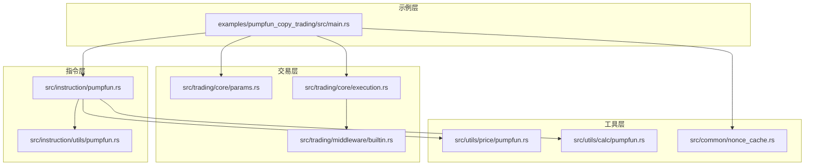
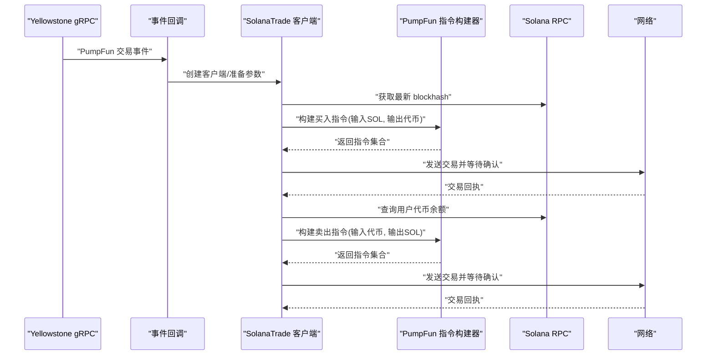
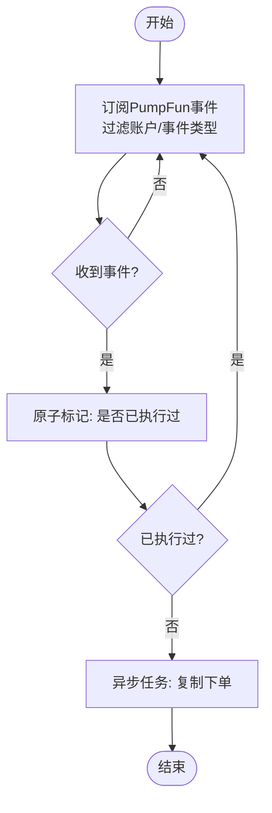
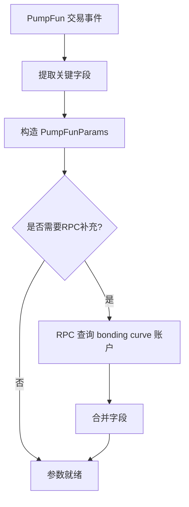
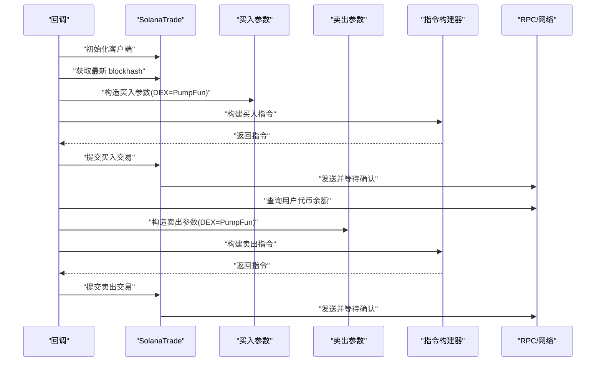
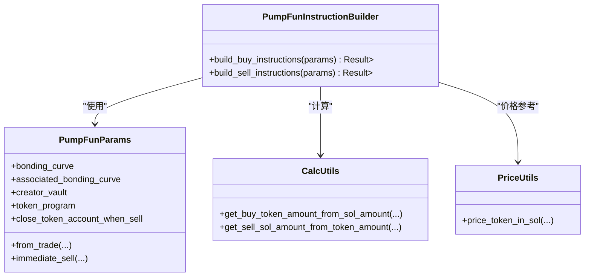
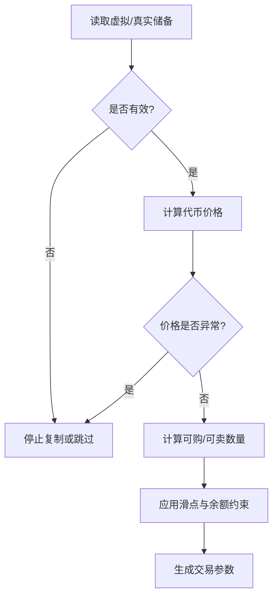
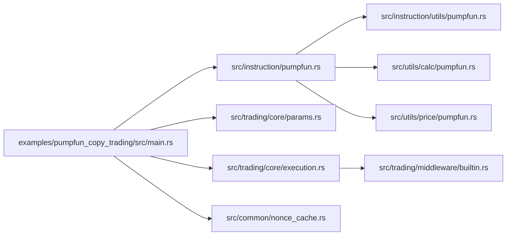

# PumpFun复制交易

<cite>
**本文引用的文件**
- [examples/pumpfun_copy_trading/src/main.rs](file://examples/pumpfun_copy_trading/src/main.rs)
- [src/instruction/pumpfun.rs](file://src/instruction/pumpfun.rs)
- [src/instruction/utils/pumpfun.rs](file://src/instruction/utils/pumpfun.rs)
- [src/utils/price/pumpfun.rs](file://src/utils/price/pumpfun.rs)
- [src/utils/calc/pumpfun.rs](file://src/utils/calc/pumpfun.rs)
- [src/trading/core/params.rs](file://src/trading/core/params.rs)
- [src/common/nonce_cache.rs](file://src/common/nonce_cache.rs)
- [src/trading/core/execution.rs](file://src/trading/core/execution.rs)
- [src/trading/middleware/builtin.rs](file://src/trading/middleware/builtin.rs)
</cite>

## 目录
1. [引言](#引言)
2. [项目结构](#项目结构)
3. [核心组件](#核心组件)
4. [架构总览](#架构总览)
5. [详细组件分析](#详细组件分析)
6. [依赖关系分析](#依赖关系分析)
7. [性能考量](#性能考量)
8. [故障排查指南](#故障排查指南)
9. [结论](#结论)
10. [附录](#附录)

## 引言
本文件系统性阐述sol-trade-sdk对PumpFun复制交易策略的支持，围绕“事件监听—指令反序列化—参数提取—交易重建—发送执行”的完整链路展开，重点说明：
- 如何通过Yellowstone gRPC订阅PumpFun交易事件，实时监控目标钱包的买入/卖出行为；
- 如何从事件中提取必要参数（如bonding curve、creator vault、虚拟/真实储备等），并复用SDK的指令构建逻辑；
- 如何利用价格计算与规模调整工具，保证复制交易的参数准确与风险可控；
- 如何在示例中设置监控钱包列表、复制倍率、延迟窗口以规避前包（front-running）；
- 如何处理Nonce同步、交易去重与速率限制等关键问题，确保复制交易的稳定性与效率。

## 项目结构
围绕PumpFun复制交易，涉及以下关键模块：
- 示例程序：订阅PumpFun事件并触发复制下单
- 指令构建：PumpFun专用指令生成器
- 工具函数：价格与规模计算、常量与账户元数据
- 交易参数：DEX参数封装与协议参数
- 基础设施：Nonce缓存、执行路径优化、内置中间件

图表来源
- [examples/pumpfun_copy_trading/src/main.rs](file://examples/pumpfun_copy_trading/src/main.rs#L1-L227)
- [src/instruction/pumpfun.rs](file://src/instruction/pumpfun.rs#L1-L291)
- [src/instruction/utils/pumpfun.rs](file://src/instruction/utils/pumpfun.rs#L1-L257)
- [src/utils/price/pumpfun.rs](file://src/utils/price/pumpfun.rs#L1-L19)
- [src/utils/calc/pumpfun.rs](file://src/utils/calc/pumpfun.rs#L1-L111)
- [src/trading/core/params.rs](file://src/trading/core/params.rs#L1-L205)
- [src/common/nonce_cache.rs](file://src/common/nonce_cache.rs#L1-L42)
- [src/trading/core/execution.rs](file://src/trading/core/execution.rs#L1-L156)
- [src/trading/middleware/builtin.rs](file://src/trading/middleware/builtin.rs#L1-L54)

章节来源
- [examples/pumpfun_copy_trading/src/main.rs](file://examples/pumpfun_copy_trading/src/main.rs#L1-L227)
- [src/instruction/pumpfun.rs](file://src/instruction/pumpfun.rs#L1-L291)
- [src/instruction/utils/pumpfun.rs](file://src/instruction/utils/pumpfun.rs#L1-L257)
- [src/utils/price/pumpfun.rs](file://src/utils/price/pumpfun.rs#L1-L19)
- [src/utils/calc/pumpfun.rs](file://src/utils/calc/pumpfun.rs#L1-L111)
- [src/trading/core/params.rs](file://src/trading/core/params.rs#L1-L205)
- [src/common/nonce_cache.rs](file://src/common/nonce_cache.rs#L1-L42)
- [src/trading/core/execution.rs](file://src/trading/core/execution.rs#L1-L156)
- [src/trading/middleware/builtin.rs](file://src/trading/middleware/builtin.rs#L1-L54)

## 核心组件
- 事件订阅与回调：通过Yellowstone gRPC订阅PumpFun交易事件，过滤目标账户与事件类型，进入回调后触发复制下单。
- 指令构建器：PumpFun指令构建器负责根据协议参数与滑点计算，生成买入/卖出指令及所需账户元数据。
- 协议参数：PumpFunParams封装bonding curve、creator vault、token program等关键字段，并提供从事件或RPC构造的方法。
- 计算工具：价格计算用于评估当前报价是否有效；规模计算用于根据虚拟/真实储备与费用模型估算可购/可卖数量。
- 执行与中间件：执行路径包含预取与分支优化；内置日志中间件可用于调试与审计。
- 基础设施：Nonce缓存用于持久化nonce账户信息；示例中演示了如何设置延迟窗口与复制倍率。

章节来源
- [examples/pumpfun_copy_trading/src/main.rs](file://examples/pumpfun_copy_trading/src/main.rs#L1-L227)
- [src/instruction/pumpfun.rs](file://src/instruction/pumpfun.rs#L1-L291)
- [src/trading/core/params.rs](file://src/trading/core/params.rs#L1-L205)
- [src/utils/price/pumpfun.rs](file://src/utils/price/pumpfun.rs#L1-L19)
- [src/utils/calc/pumpfun.rs](file://src/utils/calc/pumpfun.rs#L1-L111)
- [src/trading/core/execution.rs](file://src/trading/core/execution.rs#L1-L156)
- [src/trading/middleware/builtin.rs](file://src/trading/middleware/builtin.rs#L1-L54)
- [src/common/nonce_cache.rs](file://src/common/nonce_cache.rs#L1-L42)

## 架构总览
复制交易的整体流程如下：
- 事件监听：订阅PumpFun交易事件，筛选目标账户与事件类型；
- 指令反序列化：从事件中提取mint、bonding curve、creator vault、虚拟/真实储备等参数；
- 参数校验与准备：利用价格计算判断报价有效性，利用规模计算确定复制数量；
- 交易重建：基于PumpFunParams与滑点，调用指令构建器生成买入/卖出指令；
- 发送执行：设置gas fee策略、recent blockhash、等待确认等，提交交易；
- 稳定性保障：Nonce同步、交易去重、速率限制与延迟窗口。

图表来源
- [examples/pumpfun_copy_trading/src/main.rs](file://examples/pumpfun_copy_trading/src/main.rs#L1-L227)
- [src/instruction/pumpfun.rs](file://src/instruction/pumpfun.rs#L1-L291)

## 详细组件分析

### 事件监听与回调
- 使用Yellowstone gRPC订阅PumpFun协议事件，过滤包含PumpFun程序ID的账户与交易，仅接收买入/卖出事件；
- 回调中对同一事件只执行一次复制，避免重复下单；
- 回调异步执行，不影响事件流的吞吐。

图表来源
- [examples/pumpfun_copy_trading/src/main.rs](file://examples/pumpfun_copy_trading/src/main.rs#L1-L120)

章节来源
- [examples/pumpfun_copy_trading/src/main.rs](file://examples/pumpfun_copy_trading/src/main.rs#L1-L120)

### 指令反序列化与参数提取
- 从PumpFun交易事件中提取mint、bonding_curve、associated_bonding_curve、creator、creator_vault、virtual/real token/sol reserves、fee_recipient、token_program等字段；
- 将这些字段封装为PumpFunParams，供后续指令构建使用；
- 可选：直接从RPC拉取bonding curve账户，自动补齐缺失字段。

图表来源
- [examples/pumpfun_copy_trading/src/main.rs](file://examples/pumpfun_copy_trading/src/main.rs#L120-L170)
- [src/trading/core/params.rs](file://src/trading/core/params.rs#L80-L205)
- [src/instruction/utils/pumpfun.rs](file://src/instruction/utils/pumpfun.rs#L220-L236)

章节来源
- [examples/pumpfun_copy_trading/src/main.rs](file://examples/pumpfun_copy_trading/src/main.rs#L120-L170)
- [src/trading/core/params.rs](file://src/trading/core/params.rs#L80-L205)
- [src/instruction/utils/pumpfun.rs](file://src/instruction/utils/pumpfun.rs#L220-L236)

### 交易重建与发送
- 买入阶段：指定输入SOL、输出代币，设置slippage，使用PumpFunParams构建买入指令；
- 卖出阶段：读取用户代币余额，设置输出SOL，使用PumpFunParams构建卖出指令；
- 设置gas fee策略、recent blockhash、等待确认等参数；
- 通过client.buy与client.sell完成发送。

图表来源
- [examples/pumpfun_copy_trading/src/main.rs](file://examples/pumpfun_copy_trading/src/main.rs#L120-L220)
- [src/instruction/pumpfun.rs](file://src/instruction/pumpfun.rs#L1-L291)

章节来源
- [examples/pumpfun_copy_trading/src/main.rs](file://examples/pumpfun_copy_trading/src/main.rs#L120-L220)
- [src/instruction/pumpfun.rs](file://src/instruction/pumpfun.rs#L1-L291)

### 指令构建器（PumpFun）
- 买入指令：计算token数量与最大SOL成本，确定token program、fee recipient（mayhem模式）、关联账户，组装16个账户元数据与方法ID；
- 卖出指令：计算SOL收入与最小SOL输出，确定token program、fee recipient，组装14个账户元数据与方法ID；
- 支持可选关闭token账户（卖出完成后清理）。

图表来源
- [src/instruction/pumpfun.rs](file://src/instruction/pumpfun.rs#L1-L291)
- [src/trading/core/params.rs](file://src/trading/core/params.rs#L80-L205)
- [src/utils/calc/pumpfun.rs](file://src/utils/calc/pumpfun.rs#L1-L111)
- [src/utils/price/pumpfun.rs](file://src/utils/price/pumpfun.rs#L1-L19)

章节来源
- [src/instruction/pumpfun.rs](file://src/instruction/pumpfun.rs#L1-L291)
- [src/trading/core/params.rs](file://src/trading/core/params.rs#L80-L205)
- [src/utils/calc/pumpfun.rs](file://src/utils/calc/pumpfun.rs#L1-L111)
- [src/utils/price/pumpfun.rs](file://src/utils/price/pumpfun.rs#L1-L19)

### 价格验证与规模调整
- 价格验证：通过虚拟SOL/虚拟代币储备计算代币价格，若价格异常（如分母为0或极小），可判定报价无效；
- 规模调整：根据虚拟/真实储备与费用模型，估算可购/可卖数量，避免因流动性不足导致失败或滑点过大。

图表来源
- [src/utils/price/pumpfun.rs](file://src/utils/price/pumpfun.rs#L1-L19)
- [src/utils/calc/pumpfun.rs](file://src/utils/calc/pumpfun.rs#L1-L111)

章节来源
- [src/utils/price/pumpfun.rs](file://src/utils/price/pumpfun.rs#L1-L19)
- [src/utils/calc/pumpfun.rs](file://src/utils/calc/pumpfun.rs#L1-L111)

### 示例中的监控与风控
- 监控钱包列表：示例通过过滤PumpFun程序ID与账户包含条件实现事件过滤；
- 复制倍率：可通过控制买入金额与卖出比例实现倍率效果；
- 延迟窗口：示例中使用原子标志确保同一事件仅执行一次，可扩展为按事件哈希去重与延迟执行策略。

章节来源
- [examples/pumpfun_copy_trading/src/main.rs](file://examples/pumpfun_copy_trading/src/main.rs#L1-L120)

### Nonce同步、交易去重与速率限制
- Nonce同步：通过Nonce缓存获取nonce账户的当前值，确保交易使用有效的durable nonce；
- 交易去重：示例中使用原子布尔值保证同一事件仅执行一次；可进一步引入事件哈希去重；
- 速率限制：可在回调外层增加限速器，控制每秒/每分钟的复制次数，避免被节点限流。

章节来源
- [src/common/nonce_cache.rs](file://src/common/nonce_cache.rs#L1-L42)
- [examples/pumpfun_copy_trading/src/main.rs](file://examples/pumpfun_copy_trading/src/main.rs#L1-L120)

## 依赖关系分析
- 指令构建器依赖协议参数与计算工具，同时依赖账户元数据常量；
- 示例程序依赖指令构建器与参数封装，同时依赖RPC与gRPC事件源；
- 执行层提供预取与分支优化，内置中间件用于日志输出；
- Nonce缓存为交易稳定性提供基础支持。

图表来源
- [examples/pumpfun_copy_trading/src/main.rs](file://examples/pumpfun_copy_trading/src/main.rs#L1-L227)
- [src/instruction/pumpfun.rs](file://src/instruction/pumpfun.rs#L1-L291)
- [src/instruction/utils/pumpfun.rs](file://src/instruction/utils/pumpfun.rs#L1-L257)
- [src/utils/price/pumpfun.rs](file://src/utils/price/pumpfun.rs#L1-L19)
- [src/utils/calc/pumpfun.rs](file://src/utils/calc/pumpfun.rs#L1-L111)
- [src/trading/core/params.rs](file://src/trading/core/params.rs#L1-L205)
- [src/common/nonce_cache.rs](file://src/common/nonce_cache.rs#L1-L42)
- [src/trading/core/execution.rs](file://src/trading/core/execution.rs#L1-L156)
- [src/trading/middleware/builtin.rs](file://src/trading/middleware/builtin.rs#L1-L54)

## 性能考量
- 指令预取与分支优化：执行层对指令数组进行预取与分支优化，减少CPU分支预测失败；
- SIMD内存操作：提供AVX2加速的拷贝、比较与清零，降低内存操作开销；
- 日志中间件：便于在开发/测试阶段观察指令结构，但生产环境建议关闭或降级；
- 交易大小估算：通过累加指令data长度与账户元数据大小估算交易体积，辅助gas策略配置。

章节来源
- [src/trading/core/execution.rs](file://src/trading/core/execution.rs#L1-L156)
- [src/trading/middleware/builtin.rs](file://src/trading/middleware/builtin.rs#L1-L54)

## 故障排查指南
- 事件未触发：检查gRPC连接、过滤条件（程序ID、账户包含/排除）与事件类型；
- 参数缺失：确认事件中是否包含必要字段，必要时通过RPC拉取bonding curve账户；
- 交易失败：检查recent blockhash是否过期、滑点是否过大、余额是否充足；
- Nonce错误：确认nonce账户状态与当前值，避免使用已初始化的nonce；
- 重复执行：确保事件去重逻辑生效，避免同一事件多次复制。

章节来源
- [examples/pumpfun_copy_trading/src/main.rs](file://examples/pumpfun_copy_trading/src/main.rs#L1-L227)
- [src/common/nonce_cache.rs](file://src/common/nonce_cache.rs#L1-L42)

## 结论
sol-trade-sdk为PumpFun复制交易提供了完整的基础设施：事件监听、参数提取、指令构建、价格与规模校验、执行优化与中间件调试。通过示例可快速搭建复制交易流水线，并结合Nonce同步、交易去重与速率限制等机制，提升复制交易的稳定性与效率。建议在生产环境中配合更严格的风控策略（如延迟窗口、滑点上限、余额阈值与限速器）与可观测性方案（日志中间件、指标采集）持续迭代。

## 附录
- 关键参数说明
  - PumpFunParams：包含bonding_curve、associated_bonding_curve、creator_vault、token_program、close_token_account_when_sell等；
  - 计算工具：get_buy_token_amount_from_sol_amount、get_sell_sol_amount_from_token_amount、price_token_in_sol；
  - 执行优化：Prefetch、MemoryOps、ExecutionPath；
  - Nonce缓存：DurableNonceInfo、fetch_nonce_info。

章节来源
- [src/trading/core/params.rs](file://src/trading/core/params.rs#L80-L205)
- [src/utils/calc/pumpfun.rs](file://src/utils/calc/pumpfun.rs#L1-L111)
- [src/utils/price/pumpfun.rs](file://src/utils/price/pumpfun.rs#L1-L19)
- [src/trading/core/execution.rs](file://src/trading/core/execution.rs#L1-L156)
- [src/common/nonce_cache.rs](file://src/common/nonce_cache.rs#L1-L42)