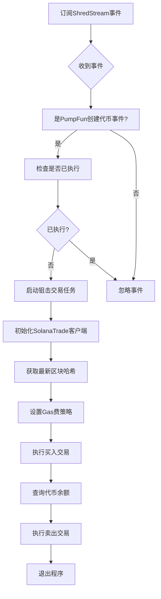
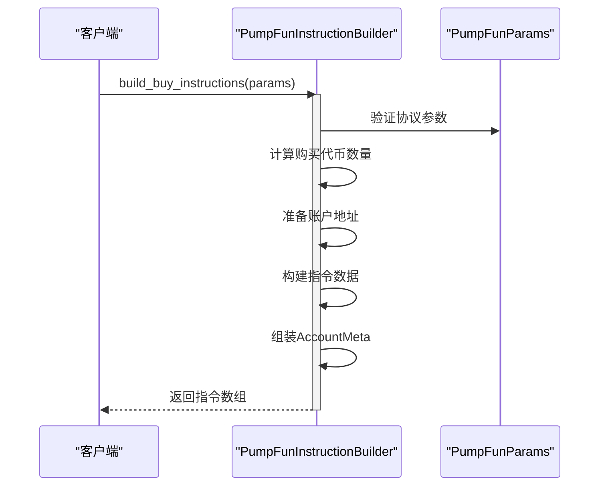

# PumpFun狙击交易

<cite>
**本文档引用的文件**
- [pumpfun_sniper_trading/src/main.rs](file://examples/pumpfun_sniper_trading/src/main.rs)
- [pumpfun.rs](file://src/instruction/pumpfun.rs)
- [pumpfun.rs](file://src/utils/price/pumpfun.rs)
- [pumpfun.rs](file://src/utils/calc/pumpfun.rs)
- [swqos/mod.rs](file://src/swqos/mod.rs)
- [params.rs](file://src/trading/core/params.rs)
- [types.rs](file://src/common/types.rs)
- [pumpfun.rs](file://src/instruction/utils/pumpfun.rs)
- [common.rs](file://src/utils/calc/common.rs)
- [swqos.rs](file://src/constants/swqos.rs)
- [factory.rs](file://src/trading/factory.rs)
- [gas_fee_strategy.rs](file://src/common/gas_fee_strategy.rs)
- [address_lookup.rs](file://src/common/address_lookup.rs)
- [nonce_manager.rs](file://src/trading/common/nonce_manager.rs)
</cite>

## 目录
1. [简介](#简介)
2. [PumpFun狙击交易核心机制](#pumpfun狙击交易核心机制)
3. [交易指令构建流程](#交易指令构建流程)
4. [价格预测与数量计算](#价格预测与数量计算)
5. [示例代码解析](#示例代码解析)
6. [性能优化策略](#性能优化策略)
7. [容错与重试机制](#容错与重试机制)

## 简介
PumpFun狙击交易是一种利用超低延迟通道在新代币创建瞬间进行抢跑交易的策略。本系统通过监听PumpFun协议的实时事件流，结合SWQOS（Superior Web3 Quality of Service）超低延迟网络，实现毫秒级的交易执行。当检测到开发者创建新代币的事件时，系统立即构建并发送买入指令，随后在价格上升后卖出获利。整个流程高度自动化，依赖精确的指令编码、动态的Gas费优化和高效的地址查找表来确保在高竞争环境中成功执行交易。

## PumpFun狙击交易核心机制

PumpFun狙击交易的核心机制基于实时事件监听和超低延迟交易执行。系统通过`ShredStreamGrpc`订阅PumpFun协议的事件流，过滤出代币创建事件（`PumpFunCreateToken`），并在检测到符合条件的事件时立即触发交易流程。为确保交易只执行一次，系统使用原子布尔标志`ALREADY_EXECUTED`进行控制。交易执行通过`SolanaTrade`客户端完成，该客户端配置了SWQOS通道以实现最快的交易传播速度。



**Diagram sources**
- [pumpfun_sniper_trading/src/main.rs](file://examples/pumpfun_sniper_trading/src/main.rs#L23-L65)

**Section sources**
- [pumpfun_sniper_trading/src/main.rs](file://examples/pumpfun_sniper_trading/src/main.rs#L1-L166)

## 交易指令构建流程

### 指令编码逻辑
`PumpFunInstruction::buy`的底层构造过程在`PumpFunInstructionBuilder`中实现。该过程分为三个主要阶段：参数验证与数据准备、交易计算与账户地址准备、指令构建。首先，系统验证输入参数并提取必要的协议参数。然后，根据输入的SOL金额计算可购买的代币数量，并确定所有相关账户的地址，包括绑定曲线账户、关联绑定曲线账户和用户代币账户。最后，系统构建包含方法ID、购买代币数量和最大SOL成本的指令数据，并组装包含16个账户的`AccountMeta`数组，形成最终的`Instruction`。



**Diagram sources**
- [pumpfun.rs](file://src/instruction/pumpfun.rs#L23-L158)

### 交易参数配置
交易参数通过`PumpFunParams`结构体进行配置，该结构体包含绑定曲线、创建者金库、代币程序等关键信息。在狙击交易中，这些参数通常从`PumpFunTradeEvent`事件中获取，并通过`from_dev_trade`方法构建。系统还支持通过RPC动态获取参数，但为了最小化延迟，推荐在事件中直接提供所有必要信息。

**Section sources**
- [pumpfun.rs](file://src/instruction/pumpfun.rs#L82-L134)
- [params.rs](file://src/trading/core/params.rs#L79-L134)

## 价格预测与数量计算

### 初始流动性价格预测
`utils/price/pumpfun.rs`中的`price_token_in_sol`函数实现了初始流动性价格预测模型。该模型基于绑定曲线的虚拟SOL储备和虚拟代币储备，通过简单的除法计算出每个代币的SOL价格。计算时，系统会将储备量从Lamports和代币最小单位转换为标准单位（SOL和代币），以确保结果的准确性。

**Section sources**
- [pumpfun.rs](file://src/utils/price/pumpfun.rs#L3-L18)

### 买入数量计算算法
`utils/calc/pumpfun.rs`中的`get_buy_token_amount_from_sol_amount`函数实现了买入数量计算算法。该算法基于AMM的常数乘积公式，考虑了交易费用后计算实际可获得的代币数量。首先，系统计算扣除总费用后的净输入金额，然后使用公式`tokens_received = (input_amount * virtual_token_reserves) / (virtual_sol_reserves + input_amount)`计算代币数量。算法还包含对极小金额的特殊处理，确保在低金额交易时也能获得合理的代币数量。

```mermaid
flowchart TD
A[开始计算买入数量] --> B{输入金额为0?}
B --> |是| C[返回0]
B --> |否| D{虚拟代币储备为0?}
D --> |是| C
D --> |否| E[计算总费用基点]
E --> F[计算净输入金额]
F --> G[计算分母: virtual_sol_reserves + input_amount]
G --> H[计算代币数量: (input_amount * virtual_token_reserves) / 分母]
H --> I[与实际代币储备取最小值]
I --> J{代币数量 <= 100M?}
J --> |是| K[根据金额设置固定数量]
J --> |否| L[返回计算结果]
K --> L
L --> M[返回结果]
```

**Diagram sources**
- [pumpfun.rs](file://src/utils/calc/pumpfun.rs#L8-L65)

## 示例代码解析

`examples/pumpfun_sniper_trading`示例展示了如何配置和执行PumpFun狙击交易。代码首先创建一个事件回调函数，用于处理`PumpFunTradeEvent`。在回调中，系统检查事件是否为开发者创建代币事件，并使用原子标志确保交易只执行一次。然后，系统初始化`SolanaTrade`客户端，配置交易参数，包括买入金额、滑点容忍度和Gas费策略。买入交易使用`from_dev_trade`方法从事件中提取参数，而卖出交易则使用`immediate_sell`方法快速构建。

**Section sources**
- [pumpfun_sniper_trading/src/main.rs](file://examples/pumpfun_sniper_trading/src/main.rs#L1-L166)

## 性能优化策略

### 动态Gas费优化
系统通过`GasFeeStrategy`实现动态Gas费优化策略。用户可以设置全局费率策略，包括计算单元限制、计算单元价格、小费和数据大小限制。系统支持多种策略类型，如正常策略、低小费高单价策略和高小费低单价策略，以适应不同的网络状况。在高竞争环境中，系统可以动态上调小费，提高交易被打包的优先级。

**Section sources**
- [gas_fee_strategy.rs](file://src/common/gas_fee_strategy.rs#L6-L387)

### 地址查找表与Nonce管理
系统支持使用地址查找表（Address Lookup Table）来减少交易大小，提高执行效率。通过`fetch_address_lookup_table_account`函数，系统可以从RPC获取查找表账户，并在交易中使用。此外，系统还支持持久化Nonce管理，通过`add_nonce_instruction`函数在交易中添加Nonce推进指令，确保交易顺序和防止重放攻击。

**Section sources**
- [address_lookup.rs](file://src/common/address_lookup.rs#L1-L18)
- [nonce_manager.rs](file://src/trading/common/nonce_manager.rs#L1-L41)

## 容错与重试机制

在交易拥堵或价格剧烈波动时，系统通过多种机制确保交易的鲁棒性。首先，通过设置合理的超时控制和重试逻辑，系统可以在交易失败时自动重试。其次，系统支持动态调整小费，通过`update_buy_tip`和`update_sell_tip`方法在检测到网络拥堵时自动上调小费。最后，系统支持备用路由选择，通过配置多个SWQOS提供商，如Jito、Bloxroute等，实现交易路径的冗余和优化。

**Section sources**
- [gas_fee_strategy.rs](file://src/common/gas_fee_strategy.rs#L320-L346)
- [swqos/mod.rs](file://src/swqos/mod.rs#L1-L344)