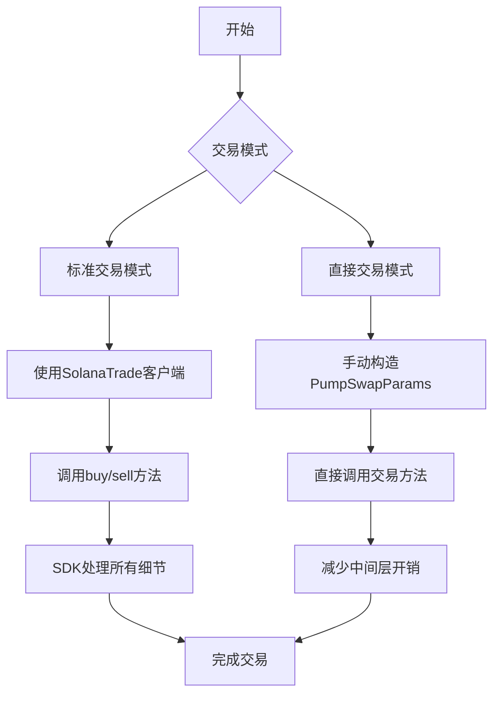
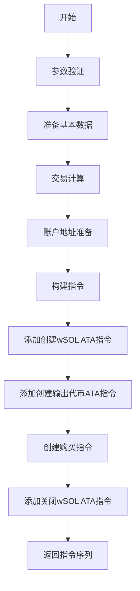
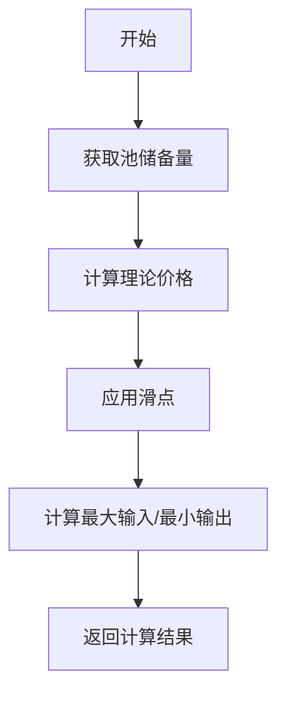
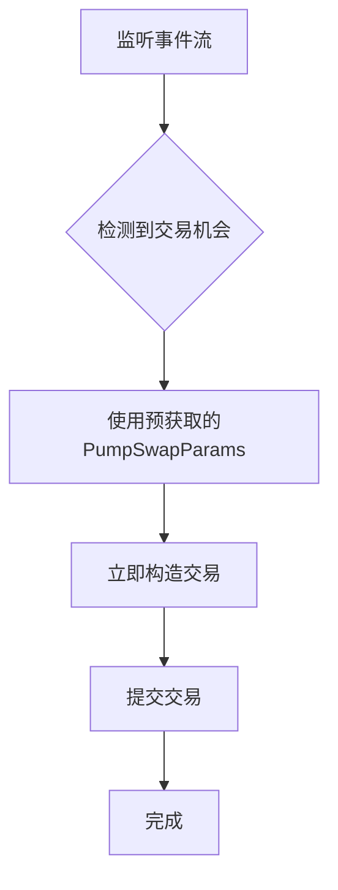
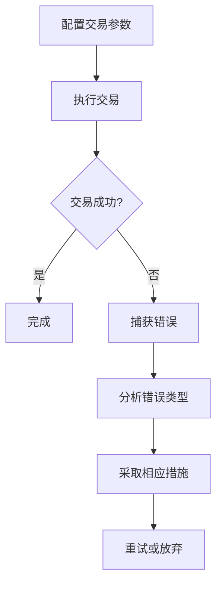
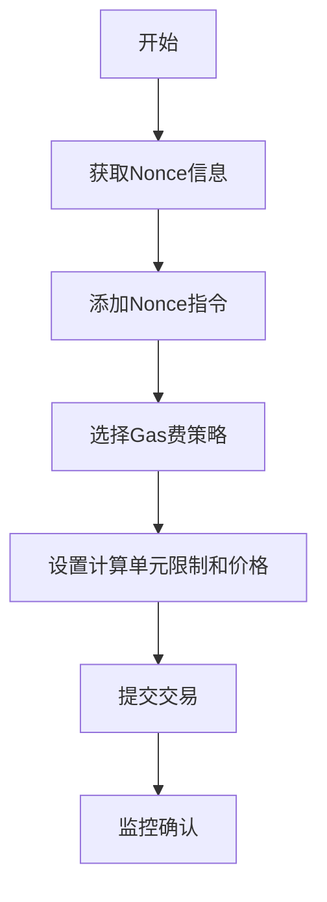
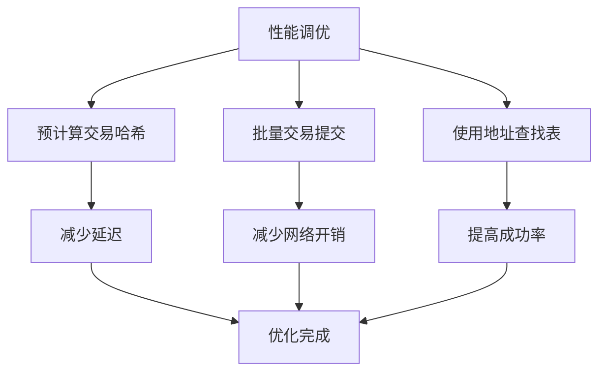

# PumpSwap交易支持

<cite>
**本文档引用的文件**  
- [pumpswap.rs](file://src/instruction/pumpswap.rs)
- [pumpswap_types.rs](file://src/instruction/utils/pumpswap_types.rs)
- [pumpswap.rs](file://src/instruction/utils/pumpswap.rs)
- [price.rs](file://src/utils/price/pumpswap.rs)
- [calc.rs](file://src/utils/calc/pumpswap.rs)
- [params.rs](file://src/trading/core/params.rs)
- [nonce_manager.rs](file://src/trading/common/nonce_manager.rs)
- [gas_fee_strategy.rs](file://src/common/gas_fee_strategy.rs)
- [pumpswap_trading/src/main.rs](file://examples/pumpswap_trading/src/main.rs)
- [pumpswap_direct_trading/src/main.rs](file://examples/pumpswap_direct_trading/src/main.rs)
- [TRADING_PARAMETERS.md](file://docs/TRADING_PARAMETERS.md)
</cite>

## 更新摘要
**已更改内容**  
- 在“PumpSwap交换指令构造”部分新增了“池发现与优先级排序”子章节，详细说明了`find_by_mint`函数的优先级排序逻辑
- 在“价格计算与滑点管理”部分新增了“交换报价功能”子章节，介绍了`quote_exact_in`函数的使用
- 更新了“PumpSwap交易模式”部分的流程图，以反映新的池发现流程
- 更新了相关代码示例的引用

## 目录
1. [简介](#简介)
2. [PumpSwap交易模式](#pumpswap交易模式)
3. [PumpSwap交换指令构造](#pumpswap交换指令构造)
4. [价格计算与滑点管理](#价格计算与滑点管理)
5. [直接交易模式](#直接交易模式)
6. [交易参数配置与错误处理](#交易参数配置与错误处理)
7. [高并发场景下的Nonce与Gas费策略](#高并发场景下的nonce与gas费策略)
8. [性能调优建议](#性能调优建议)

## 简介

sol-trade-sdk为PumpSwap去中心化交易所提供了全面的支持，涵盖标准交易和直接交易两种模式。本SDK通过优化的指令构造、精确的价格计算和灵活的交易参数配置，实现了高效、低延迟的交易执行。PumpSwap作为Solana生态中的重要交易协议，支持基于常数乘积公式（x*y=k）的自动做市商（AMM）模型，允许用户在代币对之间进行无缝交易。sol-trade-sdk通过抽象化复杂的底层细节，为开发者提供了简洁而强大的交易接口。

**Section sources**
- [pumpswap.rs](file://src/instruction/pumpswap.rs#L1-L407)
- [pumpswap_types.rs](file://src/instruction/utils/pumpswap_types.rs#L1-L28)

## PumpSwap交易模式

sol-trade-sdk支持两种主要的PumpSwap交易模式：标准交易和直接交易。

### 标准交易模式

标准交易模式遵循典型的交易流程，通过SDK的高级API进行操作。该模式下，开发者使用`SolanaTrade`客户端，通过`buy`和`sell`方法发起交易。SDK会自动处理所有底层细节，包括指令构造、账户管理、费用计算和交易提交。这种模式适合大多数应用场景，提供了良好的抽象性和易用性。

### 直接交易模式

直接交易模式允许开发者绕过前端路由，直接与PumpSwap协议交互，实现更低延迟的交易执行。在这种模式下，开发者需要手动构造`PumpSwapParams`并直接调用交易方法。这种方式减少了中间层的开销，特别适合高频交易和套利策略。通过直接交易模式，可以更精确地控制交易参数，减少不必要的网络请求和计算。

**Diagram sources**
- [pumpswap_trading/src/main.rs](file://examples/pumpswap_trading/src/main.rs#L1-L263)
- [pumpswap_direct_trading/src/main.rs](file://examples/pumpswap_direct_trading/src/main.rs#L1-L98)

**Section sources**
- [pumpswap_trading/src/main.rs](file://examples/pumpswap_trading/src/main.rs#L1-L263)
- [pumpswap_direct_trading/src/main.rs](file://examples/pumpswap_direct_trading/src/main.rs#L1-L98)

## PumpSwap交换指令构造

PumpSwap交换指令的构造是交易执行的核心环节。指令构造过程包括输入输出代币路径选择、账户准备、费用计算和指令序列生成。

### 输入输出代币路径选择

在PumpSwap中，交易路径的选择基于流动性池的配置。每个池由一个基础代币（base token）和一个报价代币（quote token）组成，通常报价代币是SOL或USDC。SDK通过`find_by_mint`函数根据代币的mint地址查找对应的流动性池。该函数会同时检查基础代币和报价代币的匹配情况，确保找到正确的交易路径。

### 池发现与优先级排序

`find_by_mint`函数实现了多级优先级的池发现机制，确保找到最优的交易池。该函数的优先级排序逻辑如下：

1. **优先级1：查找规范池（Canonical Pool）** - 首先尝试查找规范池（mint/WSOL配对），这是PumpFun迁移代币最常见的场景。通过`calculate_canonical_pool_pda`函数计算规范池的PDA地址，并验证其是否为mint/WSOL池。

2. **优先级2：列出所有池并优先选择WSOL配对** - 如果规范池不存在，则列出指定代币的所有池，并优先选择与WSOL配对的池。这些池按流动性提供者（LP）供应量排序，优先选择流动性最高的WSOL配对池。

3. **优先级3：选择流动性最高的池** - 如果没有找到WSOL配对的池，则返回所有池中流动性最高的池。

4. **后备方案：尝试单独的查找函数** - 作为向后兼容的后备方案，尝试使用`find_by_base_mint`和`find_by_quote_mint`函数。

这种优先级排序机制确保了交易能够优先使用流动性最好的WSOL配对池，从而获得最优的交易执行价格。

### 指令构造流程

指令构造流程从参数验证开始，确保所有必要参数都已正确设置。然后进行交易计算，确定输入输出金额。最后，构造包含多个步骤的指令序列，包括创建关联代币账户（ATA）、执行交换和关闭临时账户。

**Diagram sources**
- [pumpswap.rs](file://src/instruction/pumpswap.rs#L28-L214)

**Section sources**
- [pumpswap.rs](file://src/instruction/pumpswap.rs#L28-L214)
- [pumpswap_types.rs](file://src/instruction/utils/pumpswap_types.rs#L1-L28)
- [pumpswap.rs](file://src/instruction/utils/pumpswap.rs#L355-L408)

## 价格计算与滑点管理

价格计算和滑点管理是确保交易成功和最优执行的关键因素。

### 价格计算

PumpSwap的价格计算基于常数乘积公式。当用户购买代币时，需要支付的报价代币数量通过以下公式计算：
`quote_amount_in = (quote_reserve * base) / (base_reserve - base)`
其中，`base`是购买的基础代币数量，`base_reserve`和`quote_reserve`分别是池中的基础代币和报价代币储备量。SDK提供了`price_base_in_quote`函数来计算代币价格。

### 滑点容忍度设置

滑点容忍度通过`slippage_basis_points`参数设置，以基点（basis points）为单位。例如，500个基点等于5%的滑点容忍度。在指令构造过程中，SDK会根据设置的滑点计算最大可接受的输入金额或最小可接受的输出金额，以保护交易者免受价格剧烈波动的影响。

### 交换报价功能

SDK新增了`quote_exact_in`函数，用于对PumpSwap池进行精确输入的交换报价。该函数可以根据指定的输入金额，预计算出预期的输出金额和交易费用，而无需实际执行交易。这对于交易策略的模拟和优化非常有用。

`quote_exact_in`函数支持两种交换方向：
- 当`is_base_in=true`时，执行基础代币到报价代币的交换（base -> quote）
- 当`is_base_in=false`时，执行报价代币到基础代币的交换（quote -> base）

该函数返回一个`QuoteExactInResult`结构体，包含预计的输出金额、交易费用和额外读取的账户数量等信息。通过使用此功能，开发者可以在提交交易前准确评估交易的执行效果，从而做出更明智的交易决策。

**Diagram sources**
- [calc.rs](file://src/utils/calc/pumpswap.rs#L1-L276)
- [price.rs](file://src/utils/price/pumpswap.rs#L1-L48)
- [pumpswap.rs](file://src/instruction/utils/pumpswap.rs#L522-L572)

**Section sources**
- [calc.rs](file://src/utils/calc/pumpswap.rs#L1-L276)
- [price.rs](file://src/utils/price/pumpswap.rs#L1-L48)
- [pumpswap.rs](file://src/instruction/utils/pumpswap.rs#L522-L572)

## 直接交易模式

直接交易模式通过绕过前端路由，实现更低延迟的交易执行。这种模式特别适合需要快速响应市场变化的高频交易策略。

### 绕过前端路由的优势

直接交易模式的主要优势在于减少了中间层的开销。在标准模式下，可能需要多次RPC调用来获取必要的交易参数，而直接交易模式允许开发者预先获取并缓存这些参数，从而在交易执行时直接使用，大大减少了延迟。

### 实现更低延迟的交易执行

通过直接交易模式，开发者可以预先获取`PumpSwapParams`并将其缓存。当市场条件满足时，可以直接使用这些预获取的参数构造交易，无需等待额外的网络请求。这种方式特别适合与事件流（如Yellowstone gRPC）结合使用，实现近乎实时的交易执行。

**Diagram sources**
- [pumpswap_direct_trading/src/main.rs](file://examples/pumpswap_direct_trading/src/main.rs#L1-L98)

**Section sources**
- [pumpswap_direct_trading/src/main.rs](file://examples/pumpswap_direct_trading/src/main.rs#L1-L98)

## 交易参数配置与错误处理

正确的交易参数配置和有效的错误处理机制是确保交易成功的关键。

### 交易参数配置

交易参数通过`TradeBuyParams`和`TradeSellParams`结构体进行配置。关键参数包括：
- `dex_type`: 设置为`DexType::PumpSwap`
- `input_token_type`/`output_token_type`: 指定输入/输出代币类型（SOL、USDC）
- `mint`: 目标代币的mint地址
- `input_token_amount`: 交易金额
- `slippage_basis_points`: 滑点容忍度
- `extension_params`: 包含`PumpSwapParams`的协议特定参数

### 错误处理

SDK提供了全面的错误处理机制。常见的错误包括：
- 金额为零：`Amount cannot be zero`
- 池必须包含WSOL或USDC：`Pool must contain WSOL or USDC`
- 代币数量未设置：`Token amount is not set`
- 池储备量为零：`Invalid input: 'baseReserve' or 'quoteReserve' cannot be zero`

**Diagram sources**
- [pumpswap_trading/src/main.rs](file://examples/pumpswap_trading/src/main.rs#L1-L263)
- [TRADING_PARAMETERS.md](file://docs/TRADING_PARAMETERS.md#L1-L188)

**Section sources**
- [pumpswap_trading/src/main.rs](file://examples/pumpswap_trading/src/main.rs#L1-L263)
- [TRADING_PARAMETERS.md](file://docs/TRADING_PARAMETERS.md#L1-L188)

## 高并发场景下的Nonce与Gas费策略

在高并发场景下，有效的Nonce管理和Gas费策略协同工作，确保交易的有序和成功执行。

### Nonce管理

Nonce管理通过`DurableNonceInfo`实现，确保每个交易都有唯一的标识。在高并发环境下，SDK使用`add_nonce_instruction`函数为每个交易添加Nonce指令，防止交易重放。`get_transaction_blockhash`函数根据是否有Nonce信息来决定使用哪个blockhash。

### Gas费策略

Gas费策略通过`GasFeeStrategy`类进行管理。开发者可以设置不同的策略类型：
- `Normal`: 标准策略
- `LowTipHighCuPrice`: 低小费高计算单元价格
- `HighTipLowCuPrice`: 高小费低计算单元价格

这些策略可以根据网络状况动态调整，提高交易的确认速度。

**Diagram sources**
- [nonce_manager.rs](file://src/trading/common/nonce_manager.rs#L1-L41)
- [gas_fee_strategy.rs](file://src/common/gas_fee_strategy.rs#L1-L387)

**Section sources**
- [nonce_manager.rs](file://src/trading/common/nonce_manager.rs#L1-L41)
- [gas_fee_strategy.rs](file://src/common/gas_fee_strategy.rs#L1-L387)

## 性能调优建议

为了实现最佳性能，建议采取以下调优措施：

### 预计算交易哈希

在高频率交易场景中，预计算交易哈希可以显著减少交易准备时间。通过提前计算和缓存交易哈希，可以在检测到交易机会时立即提交交易，最大限度地减少延迟。

### 批量交易提交

对于需要执行多个相关交易的场景，建议使用批量提交。通过将多个交易组合成一个批次，可以减少网络开销和RPC调用次数。同时，批量提交还可以更好地利用地址查找表（Address Lookup Table），进一步优化交易大小和执行效率。

### 使用地址查找表

地址查找表可以显著减少交易的大小，提高交易的成功率。在构造复杂交易时，特别是涉及多个账户引用的交易，使用地址查找表可以将交易大小从超过1232字节减少到可接受的范围，从而避免交易失败。

**Diagram sources**
- [pumpswap_trading/src/main.rs](file://examples/pumpswap_trading/src/main.rs#L1-L263)

**Section sources**
- [pumpswap_trading/src/main.rs](file://examples/pumpswap_trading/src/main.rs#L1-L263)