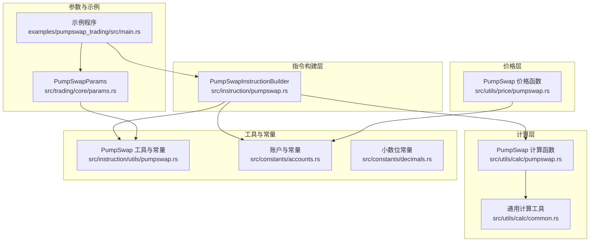
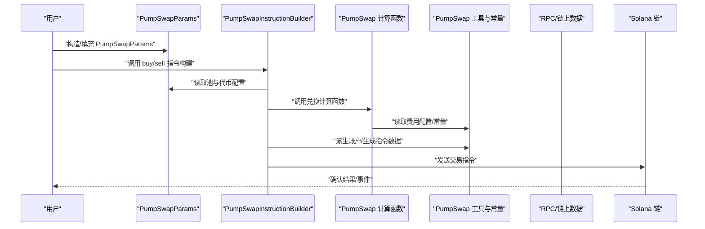
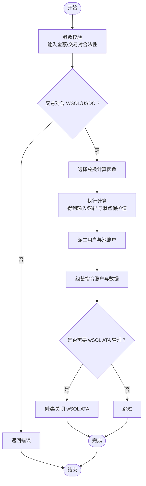
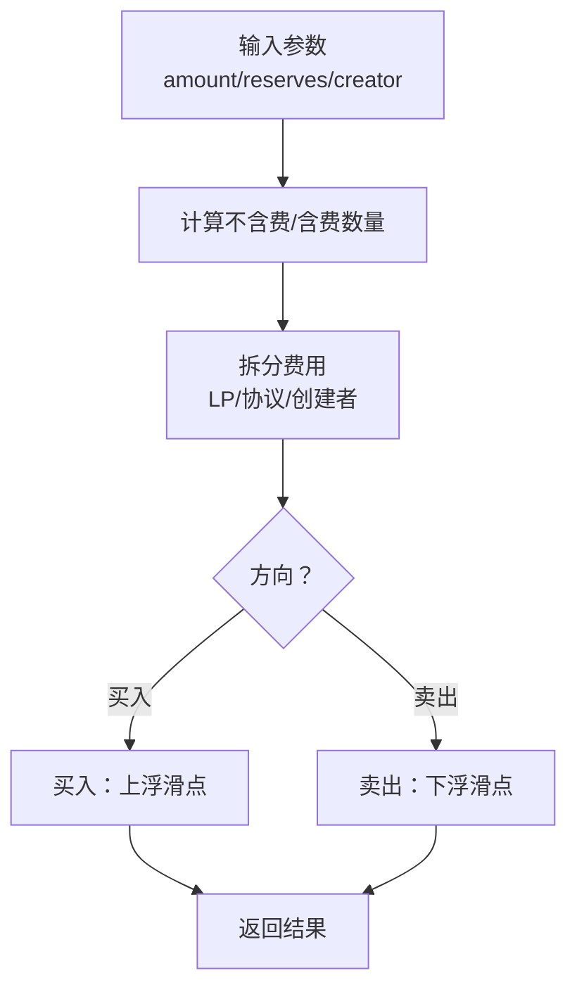
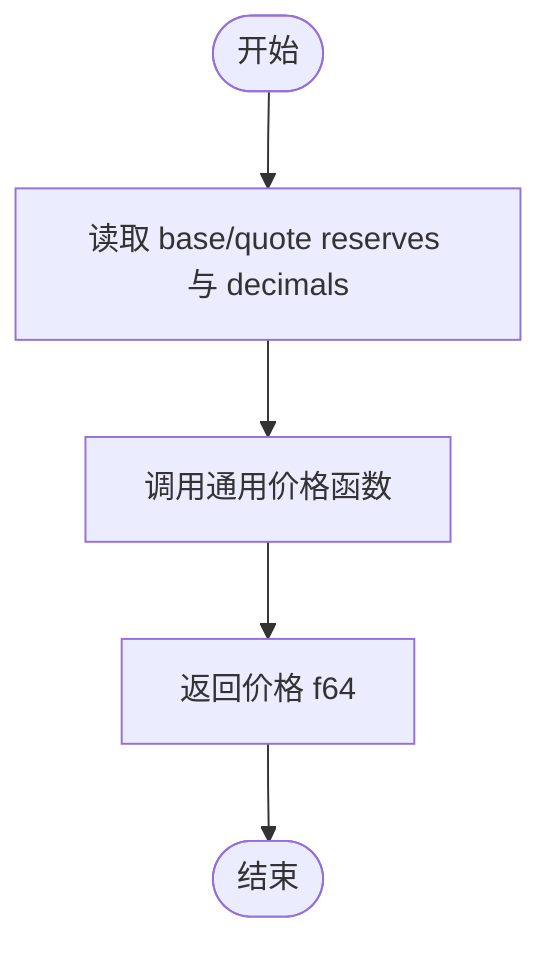
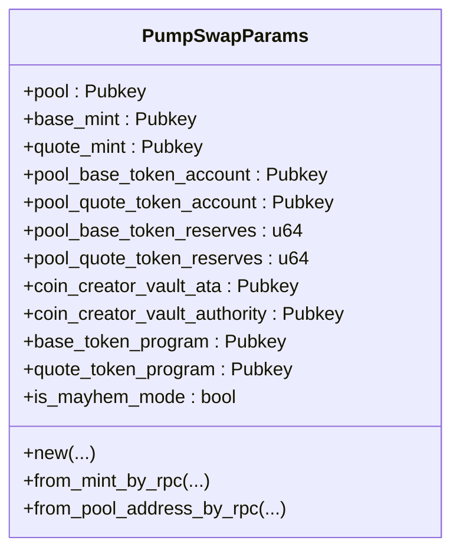
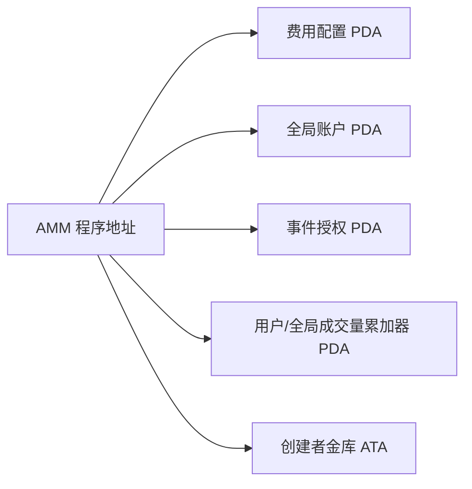
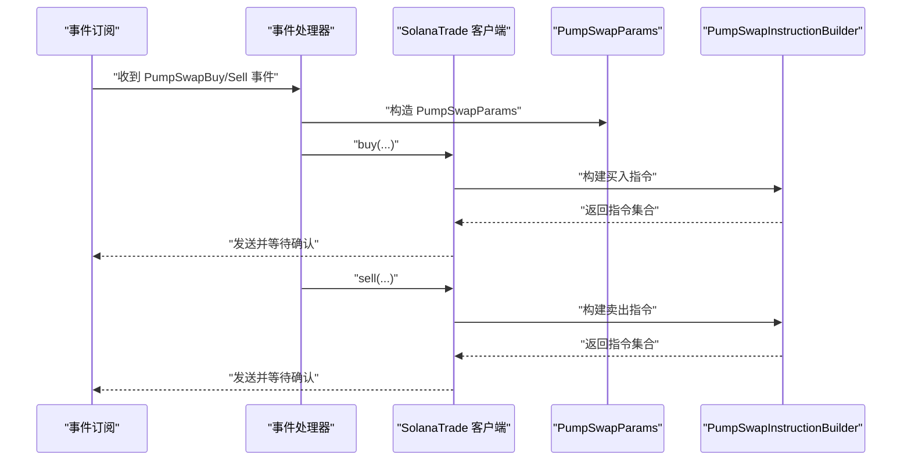
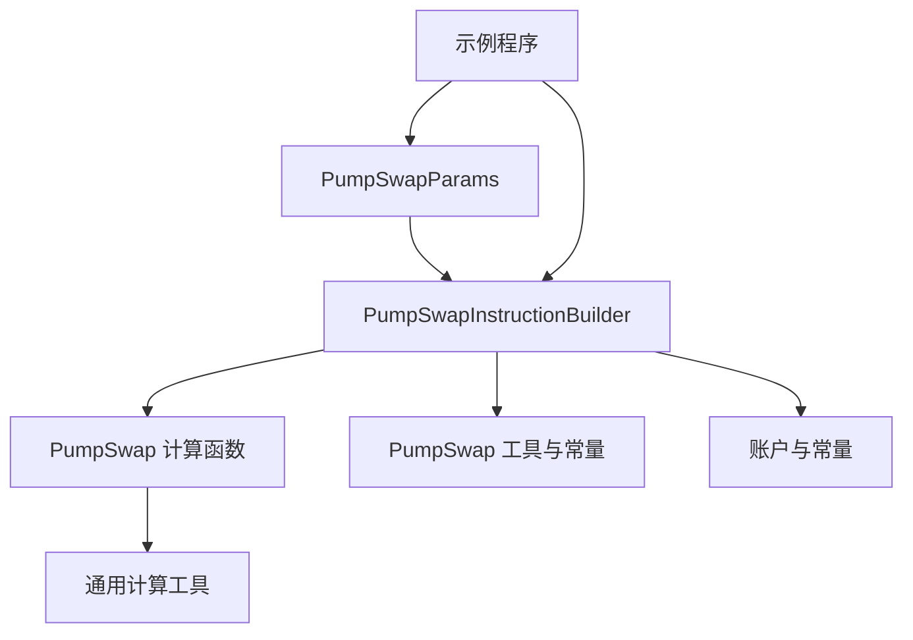

# PumpSwap标准交易

<cite>
**本文引用的文件列表**
- [pumpswap.rs](file://src/instruction/pumpswap.rs)
- [pumpswap_calc.rs](file://src/utils/calc/pumpswap.rs)
- [pumpswap_price.rs](file://src/utils/price/pumpswap.rs)
- [pumpswap_utils.rs](file://src/instruction/utils/pumpswap.rs)
- [pumpswap_params.rs](file://src/trading/core/params.rs)
- [instruction_builder_traits.rs](file://src/trading/core/traits.rs)
- [pumpswap_example_main.rs](file://examples/pumpswap_trading/src/main.rs)
- [common_calc.rs](file://src/utils/calc/common.rs)
- [constants_accounts.rs](file://src/constants/accounts.rs)
- [constants_decimals.rs](file://src/constants/decimals.rs)
</cite>

## 目录
1. [简介](#简介)
2. [项目结构](#项目结构)
3. [核心组件](#核心组件)
4. [架构总览](#架构总览)
5. [详细组件分析](#详细组件分析)
6. [依赖关系分析](#依赖关系分析)
7. [性能考量](#性能考量)
8. [故障排查指南](#故障排查指南)
9. [结论](#结论)
10. [附录](#附录)

## 简介
本文件深入解析 sol-trade-sdk 中 PumpSwap 标准交易的实现机制，重点覆盖以下方面：
- PumpSwapInstructionBuilder 如何实现 InstructionBuilder trait，构建符合 PumpSwap 协议规范的买卖指令；
- 交易参数验证流程，包括输入金额校验、交易对合法性检查（必须包含 WSOL 或 USDC）；
- 价格计算逻辑，基于 utils/price/pumpswap.rs 的 price_base_in_quote 和 price_quote_in_base 函数；
- 代币兑换计算过程，涵盖 buy_base_input_internal、buy_quote_input_internal、sell_base_input_internal、sell_quote_input_internal 四种核心计算模式，包括费用拆分（LP 费、协议费、代币创建者费）和滑点保护机制；
- 结合 pumpswap_trading 示例程序，展示如何配置 PumpSwapParams、设置滑点容忍度、管理 wSOL 账户的创建与关闭，并演示完整的交易构建、签名和发送流程。

## 项目结构
围绕 PumpSwap 的核心代码分布在如下模块：
- 指令构建层：src/instruction/pumpswap.rs 实现 InstructionBuilder trait，负责构建买卖指令；
- 计算层：src/utils/calc/pumpswap.rs 提供四类核心兑换计算函数；
- 价格层：src/utils/price/pumpswap.rs 提供价格换算函数；
- 工具与常量：src/instruction/utils/pumpswap.rs 提供账户常量、费用配置、池查询等；src/constants/accounts.rs、src/constants/decimals.rs 提供常量；
- 参数与交易层：src/trading/core/params.rs 定义 PumpSwapParams；examples/pumpswap_trading/src/main.rs 展示完整调用示例。

图表来源
- [pumpswap.rs](file://src/instruction/pumpswap.rs#L1-L407)
- [pumpswap_calc.rs](file://src/utils/calc/pumpswap.rs#L1-L276)
- [pumpswap_price.rs](file://src/utils/price/pumpswap.rs#L1-L48)
- [pumpswap_utils.rs](file://src/instruction/utils/pumpswap.rs#L1-L339)
- [pumpswap_params.rs](file://src/trading/core/params.rs#L206-L342)
- [pumpswap_example_main.rs](file://examples/pumpswap_trading/src/main.rs#L1-L263)

章节来源
- [pumpswap.rs](file://src/instruction/pumpswap.rs#L1-L407)
- [pumpswap_calc.rs](file://src/utils/calc/pumpswap.rs#L1-L276)
- [pumpswap_price.rs](file://src/utils/price/pumpswap.rs#L1-L48)
- [pumpswap_utils.rs](file://src/instruction/utils/pumpswap.rs#L1-L339)
- [pumpswap_params.rs](file://src/trading/core/params.rs#L206-L342)
- [pumpswap_example_main.rs](file://examples/pumpswap_trading/src/main.rs#L1-L263)

## 核心组件
- PumpSwapInstructionBuilder：实现 InstructionBuilder trait，提供 build_buy_instructions 和 build_sell_instructions，分别构建买入和卖出指令。
- PumpSwap 计算函数：提供四类核心兑换计算，分别对应不同输入/输出场景，内置费用拆分与滑点保护。
- PumpSwapParams：封装交易所需的池信息、代币配置、费用接收方等参数。
- PumpSwap 工具与常量：提供费用配置、全局账户、事件授权、程序地址、池查询与 PDA 推导等。
- 价格函数：提供基础/报价互换的价格计算，便于用户评估市场状态。

章节来源
- [instruction_builder_traits.rs](file://src/trading/core/traits.rs#L1-L26)
- [pumpswap.rs](file://src/instruction/pumpswap.rs#L1-L407)
- [pumpswap_calc.rs](file://src/utils/calc/pumpswap.rs#L1-L276)
- [pumpswap_utils.rs](file://src/instruction/utils/pumpswap.rs#L1-L339)
- [pumpswap_params.rs](file://src/trading/core/params.rs#L206-L342)
- [pumpswap_price.rs](file://src/utils/price/pumpswap.rs#L1-L48)

## 架构总览
下图展示了从参数到指令构建、再到最终交易执行的整体流程。

图表来源
- [pumpswap.rs](file://src/instruction/pumpswap.rs#L1-L407)
- [pumpswap_calc.rs](file://src/utils/calc/pumpswap.rs#L1-L276)
- [pumpswap_utils.rs](file://src/instruction/utils/pumpswap.rs#L1-L339)
- [pumpswap_params.rs](file://src/trading/core/params.rs#L206-L342)

## 详细组件分析

### 组件一：PumpSwapInstructionBuilder（指令构建器）
- 实现职责
  - 实现 InstructionBuilder trait 的两个方法：build_buy_instructions 与 build_sell_instructions。
  - 在构建过程中完成参数校验、交易对合法性检查、计算输入/输出数量、派生账户、组装指令数据与账户元组、处理 wSOL ATA 的创建与关闭。
- 关键流程
  - 参数校验：确保输入金额非零（买入）、输入金额存在（卖出），且交易对必须包含 WSOL 或 USDC。
  - 交易对合法性：通过比较 base_mint 与 quote_mint 与 WSOL/USDC 常量判断。
  - 兑换计算：根据 quote 是否为 WSOL/USDC 判断走 buy_quote_input_internal 或 sell_base_input_internal；反之走相反路径。
  - 费用接收方：根据是否为 mayhem 模式选择不同的 fee_recipient。
  - 指令组装：按协议要求拼接账户元组与指令数据（区分买入/卖出的字段顺序与含义）。
  - wSOL 管理：根据 create_input_mint_ata/close_input_mint_ata 或 create_output_mint_ata/close_output_mint_ata 控制 wSOL ATA 的创建与关闭。
- 错误处理
  - 对非法参数、池状态异常（如 reserves 为 0、超过池上限）进行早返回并返回错误。

图表来源
- [pumpswap.rs](file://src/instruction/pumpswap.rs#L28-L215)
- [pumpswap.rs](file://src/instruction/pumpswap.rs#L217-L405)

章节来源
- [pumpswap.rs](file://src/instruction/pumpswap.rs#L1-L407)

### 组件二：PumpSwap 计算函数（费用拆分与滑点保护）
- 四类核心计算函数
  - buy_base_input_internal：以 base 输入计算所需 quote 数量，包含 LP 费、协议费、代币创建者费，以及滑点保护。
  - buy_quote_input_internal：以 quote 输入计算可得 base 数量，先按总费后计算有效 quote 再计算 base，最后应用滑点保护。
  - sell_base_input_internal：以 base 输入计算可得 quote（扣除 LP/协议/创建者费后），再应用滑点保护。
  - sell_quote_input_internal：以期望 quote 输出反推需输入 base，并在中间步骤计算“含费”quote，再反推 base 输入，最后应用滑点保护。
- 费用拆分
  - LP 费、协议费、代币创建者费均以 basis points 形式配置，计算采用 ceil_div 保证精度。
- 滑点保护
  - 买入：calculate_with_slippage_buy 将输入金额上浮；
  - 卖出：calculate_with_slippage_sell 将输出金额下浮；
  - 通用工具位于 common.rs，提供 ceil_div 与滑点计算。

图表来源
- [pumpswap_calc.rs](file://src/utils/calc/pumpswap.rs#L53-L276)
- [common_calc.rs](file://src/utils/calc/common.rs#L1-L68)

章节来源
- [pumpswap_calc.rs](file://src/utils/calc/pumpswap.rs#L1-L276)
- [common_calc.rs](file://src/utils/calc/common.rs#L1-L68)

### 组件三：价格计算（price_base_in_quote / price_quote_in_base）
- 功能：基于池内 base/quote reserves 与各自的 decimals，计算 token 在 quote/base 中的价格。
- 使用场景：辅助用户决策、监控滑点与价格偏差。

图表来源
- [pumpswap_price.rs](file://src/utils/price/pumpswap.rs#L1-L48)
- [constants_decimals.rs](file://src/constants/decimals.rs#L1-L3)
- [constants_accounts.rs](file://src/constants/accounts.rs#L1-L61)

章节来源
- [pumpswap_price.rs](file://src/utils/price/pumpswap.rs#L1-L48)
- [constants_decimals.rs](file://src/constants/decimals.rs#L1-L3)
- [constants_accounts.rs](file://src/constants/accounts.rs#L1-L61)

### 组件四：PumpSwapParams（参数与池信息）
- 字段：pool、base_mint、quote_mint、pool_base_token_account、pool_quote_token_account、reserves、coin_creator_vault_*、token_programs、is_mayhem_mode 等。
- 构造方式：
  - 从 mint 通过 RPC 查找池并填充；
  - 从池地址直接填充；
  - 从事件或外部数据源构造。
- 作用：为指令构建器提供必要的池与账户信息，减少链上查询成本。

图表来源
- [pumpswap_params.rs](file://src/trading/core/params.rs#L206-L342)

章节来源
- [pumpswap_params.rs](file://src/trading/core/params.rs#L206-L342)

### 组件五：PumpSwap 工具与常量（账户、费用、池查询）
- 费用配置：LP 费、协议费、创建者费 basis points；
- 全局账户与事件授权：GLOBAL_ACCOUNT、EVENT_AUTHORITY、ASSOCIATED_TOKEN_PROGRAM、AMM_PROGRAM；
- 池查询：按 base_mint/quote_mint 查询池，排序取流动性最大的池；
- PDA 推导：用户/全局成交量累加器、费用配置 PDA、创建者金库 ATA 等。

图表来源
- [pumpswap_utils.rs](file://src/instruction/utils/pumpswap.rs#L31-L136)
- [pumpswap_utils.rs](file://src/instruction/utils/pumpswap.rs#L141-L339)

章节来源
- [pumpswap_utils.rs](file://src/instruction/utils/pumpswap.rs#L1-L339)

### 组件六：示例程序 pumpswap_trading（完整流程演示）
- 功能：订阅 PumpSwap 事件，筛选含 WSOL/USDC 的交易对，触发一次买/卖操作，演示如何配置 PumpSwapParams、设置滑点、管理 wSOL ATA 的创建与关闭、构建并发送交易。
- 关键点：
  - 从事件中提取池与代币信息，构造 PumpSwapParams；
  - 设置 slippage_basis_points；
  - 通过 create_input_token_ata/close_input_token_ata 控制 wSOL ATA；
  - 调用 client.buy/sell 完成交易。

图表来源
- [pumpswap_example_main.rs](file://examples/pumpswap_trading/src/main.rs#L1-L263)
- [pumpswap.rs](file://src/instruction/pumpswap.rs#L1-L407)
- [pumpswap_params.rs](file://src/trading/core/params.rs#L206-L342)

章节来源
- [pumpswap_example_main.rs](file://examples/pumpswap_trading/src/main.rs#L1-L263)

## 依赖关系分析
- 指令构建器依赖计算函数与工具常量，计算函数依赖通用计算工具与费用配置；
- 参数对象为指令构建器提供池与账户信息；
- 示例程序依赖参数对象与指令构建器，串联起完整交易流程。

图表来源
- [pumpswap.rs](file://src/instruction/pumpswap.rs#L1-L407)
- [pumpswap_calc.rs](file://src/utils/calc/pumpswap.rs#L1-L276)
- [pumpswap_utils.rs](file://src/instruction/utils/pumpswap.rs#L1-L339)
- [pumpswap_params.rs](file://src/trading/core/params.rs#L206-L342)
- [pumpswap_example_main.rs](file://examples/pumpswap_trading/src/main.rs#L1-L263)

章节来源
- [pumpswap.rs](file://src/instruction/pumpswap.rs#L1-L407)
- [pumpswap_calc.rs](file://src/utils/calc/pumpswap.rs#L1-L276)
- [pumpswap_utils.rs](file://src/instruction/utils/pumpswap.rs#L1-L339)
- [pumpswap_params.rs](file://src/trading/core/params.rs#L206-L342)
- [pumpswap_example_main.rs](file://examples/pumpswap_trading/src/main.rs#L1-L263)

## 性能考量
- 预填参数：PumpSwapParams 支持从 mint 或池地址直接填充，避免重复 RPC 查询，提升吞吐；
- 种子优化：示例程序与工具层广泛使用种子优化的 ATA 派生，降低计算与内存占用；
- 滑点策略：合理设置 slippage_basis_points，在成功率与成本间取得平衡；
- 多 SWQOS 并发：交易执行器支持多客户端并发提交，提高整体吞吐。

## 故障排查指南
- 交易对不合法
  - 现象：构建指令时报错“池必须包含 WSOL 或 USDC”；
  - 排查：确认 base_mint 与 quote_mint 至少一个为 WSOL/USDC。
- 输入金额异常
  - 现象：买入时报错“金额不能为零”，卖出时报错“未设置 token 数量”；
  - 排查：确保 input_amount 正确传入。
- 池状态异常
  - 现象：计算时报错“池储备为零”、“池将被耗尽”、“费用超过输出”；
  - 排查：检查 reserves、输入量是否超过池上限。
- wSOL ATA 管理
  - 现象：购买 SOL 时未创建/未关闭 wSOL ATA 导致余额异常；
  - 排查：根据 create_input_token_ata/close_input_token_ata 或 create_output_mint_ata/close_output_mint_ata 的配置正确设置。

章节来源
- [pumpswap.rs](file://src/instruction/pumpswap.rs#L38-L66)
- [pumpswap.rs](file://src/instruction/pumpswap.rs#L253-L255)
- [pumpswap_calc.rs](file://src/utils/calc/pumpswap.rs#L71-L107)
- [pumpswap_calc.rs](file://src/utils/calc/pumpswap.rs#L178-L211)
- [pumpswap_calc.rs](file://src/utils/calc/pumpswap.rs#L247-L276)

## 结论
PumpSwap 标准交易在 sol-trade-sdk 中通过清晰的分层设计实现了高可扩展性与高性能：
- 指令构建器专注于协议规范与账户组装；
- 计算函数提供严谨的费用拆分与滑点保护；
- 参数与工具层提供灵活的池信息与账户派生能力；
- 示例程序演示了从事件驱动到完整交易的闭环流程。

该实现既满足高频交易的性能需求，又兼顾安全性与易用性，适合在生产环境中稳定运行。

## 附录
- 常用常量参考
  - WSOL/USDC/系统程序等常量定义见账户常量文件；
  - 小数位常量用于价格换算。
- 交易参数建议
  - 合理设置 slippage_basis_points；
  - 预填 PumpSwapParams，减少链上查询；
  - 根据业务场景开启/关闭 wSOL ATA 自动管理。

章节来源
- [constants_accounts.rs](file://src/constants/accounts.rs#L1-L61)
- [constants_decimals.rs](file://src/constants/decimals.rs#L1-L3)