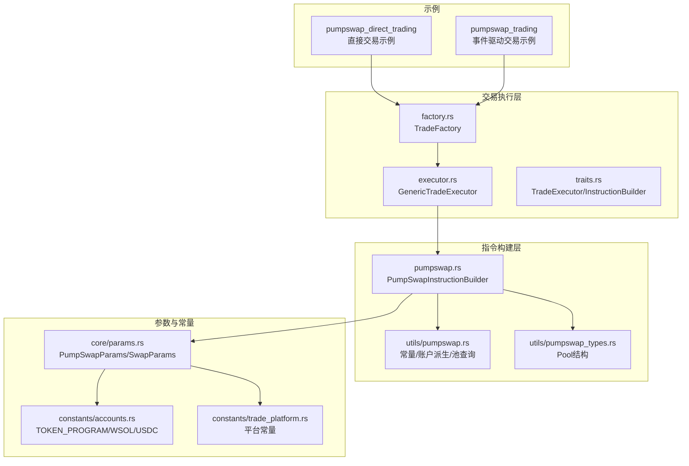
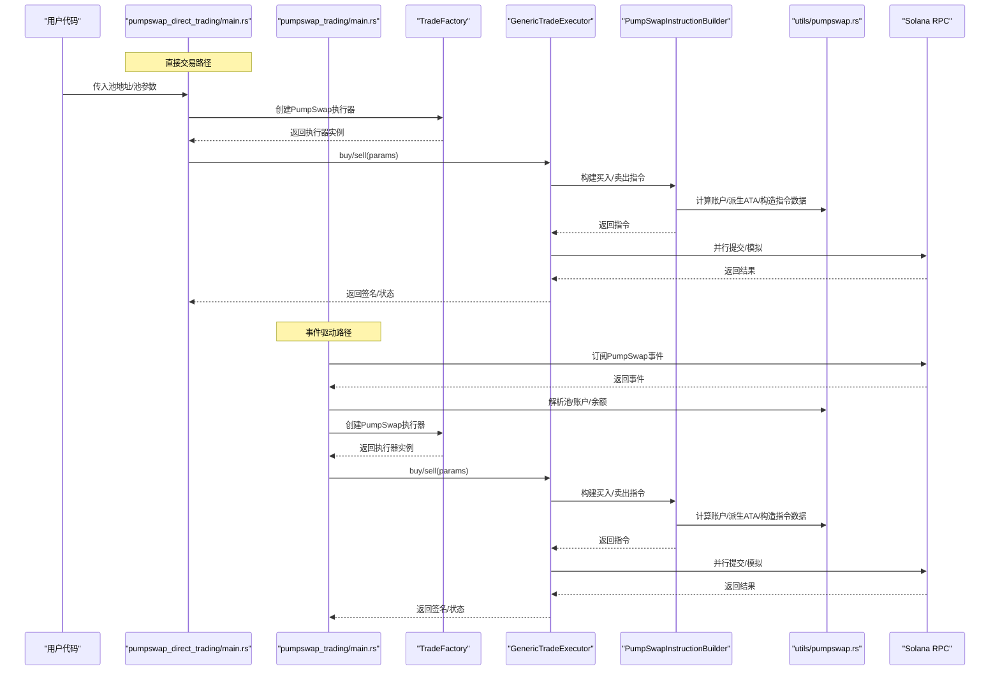
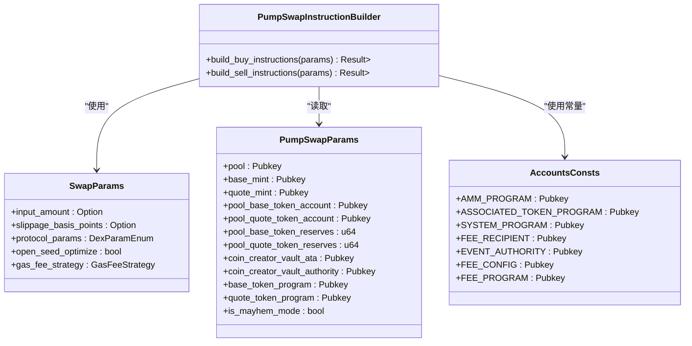
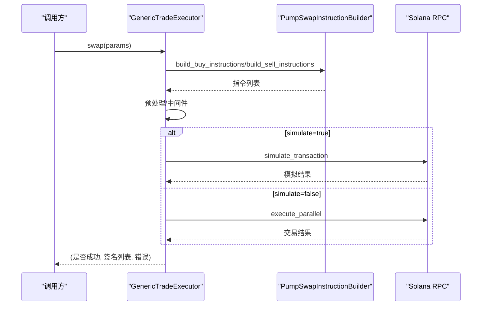
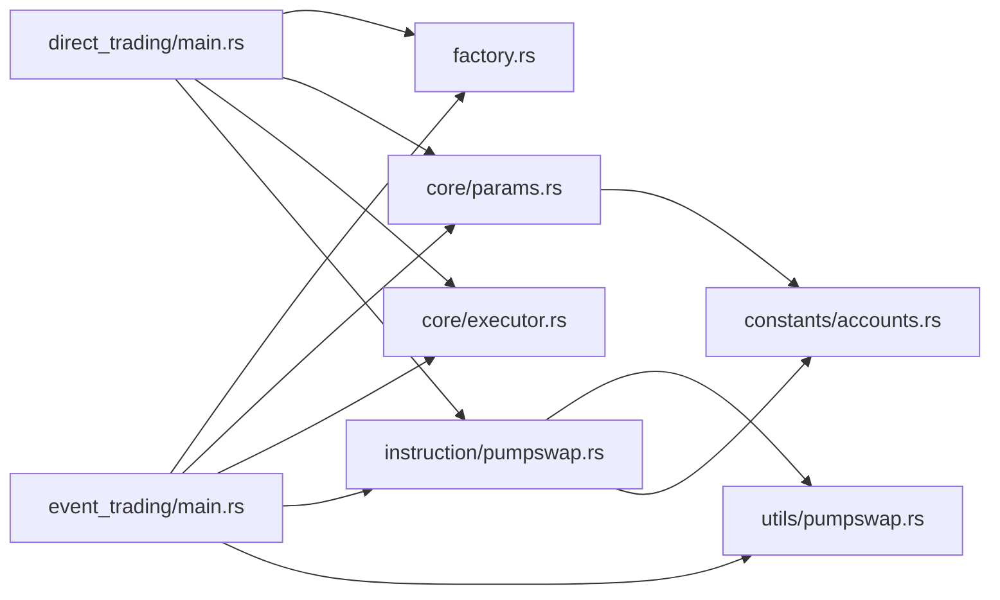

# PumpSwap直接交易

<cite>
**本文引用的文件**
- [examples/pumpswap_direct_trading/src/main.rs](file://examples/pumpswap_direct_trading/src/main.rs)
- [examples/pumpswap_trading/src/main.rs](file://examples/pumpswap_trading/src/main.rs)
- [src/instruction/pumpswap.rs](file://src/instruction/pumpswap.rs)
- [src/instruction/utils/pumpswap.rs](file://src/instruction/utils/pumpswap.rs)
- [src/instruction/utils/pumpswap_types.rs](file://src/instruction/utils/pumpswap_types.rs)
- [src/trading/factory.rs](file://src/trading/factory.rs)
- [src/trading/core/params.rs](file://src/trading/core/params.rs)
- [src/trading/core/executor.rs](file://src/trading/core/executor.rs)
- [src/trading/core/traits.rs](file://src/trading/core/traits.rs)
- [src/constants/accounts.rs](file://src/constants/accounts.rs)
- [src/constants/trade_platform.rs](file://src/constants/trade_platform.rs)
</cite>

## 目录
1. [引言](#引言)
2. [项目结构](#项目结构)
3. [核心组件](#核心组件)
4. [架构总览](#架构总览)
5. [详细组件分析](#详细组件分析)
6. [依赖关系分析](#依赖关系分析)
7. [性能考量](#性能考量)
8. [故障排查指南](#故障排查指南)
9. [结论](#结论)
10. [附录](#附录)

## 引言
本文件围绕 sol-trade-sdk 对 PumpSwap 直接交易模式的支持进行深入解析，重点说明该模式如何通过“绕过前端路由层”直接与核心 AMM 程序交互，从而降低交易延迟。我们将对比“pumpswap_direct_trading”示例与“pumpswap_trading”示例在交易路径、指令构建与性能表现上的关键差异，并解释直接交易如何通过精确构造账户列表（AccountMetas）与指令数据（Instruction Data）调用 PUMP_AMM_PROGRAM_ID，同时在直接交易中手动管理交易参数（池地址、代币铸币地址、程序ID等），并确保账户地址正确性与交易安全性。最后给出适用场景与实现建议，帮助开发者在追求极致性能时选择与实现直接交易方案。

## 项目结构
- 示例程序位于 examples/pumpswap_*，分别演示标准事件驱动交易与直接交易模式。
- 核心逻辑集中在 src/instruction/pumpswap.rs，负责为 PumpSwap 协议构建交易指令；工具模块 src/instruction/utils/pumpswap.rs 提供常量、账户派生与池查询能力。
- 交易执行由 src/trading/* 统一调度，包括工厂 TradeFactory、通用执行器 GenericTradeExecutor 与参数结构 PumpSwapParams/SwapParams。
- 常量定义在 src/constants/*，包含 TOKEN_PROGRAM、WSOL/USDC 等关键地址。

图表来源
- [examples/pumpswap_direct_trading/src/main.rs](file://examples/pumpswap_direct_trading/src/main.rs#L1-L98)
- [examples/pumpswap_trading/src/main.rs](file://examples/pumpswap_trading/src/main.rs#L1-L263)
- [src/trading/factory.rs](file://src/trading/factory.rs#L1-L99)
- [src/trading/core/executor.rs](file://src/trading/core/executor.rs#L1-L178)
- [src/trading/core/traits.rs](file://src/trading/core/traits.rs#L1-L26)
- [src/instruction/pumpswap.rs](file://src/instruction/pumpswap.rs#L1-L407)
- [src/instruction/utils/pumpswap.rs](file://src/instruction/utils/pumpswap.rs#L1-L339)
- [src/instruction/utils/pumpswap_types.rs](file://src/instruction/utils/pumpswap_types.rs#L1-L28)
- [src/trading/core/params.rs](file://src/trading/core/params.rs#L1-L342)
- [src/constants/accounts.rs](file://src/constants/accounts.rs#L1-L61)
- [src/constants/trade_platform.rs](file://src/constants/trade_platform.rs#L1-L9)

章节来源
- [examples/pumpswap_direct_trading/src/main.rs](file://examples/pumpswap_direct_trading/src/main.rs#L1-L98)
- [examples/pumpswap_trading/src/main.rs](file://examples/pumpswap_trading/src/main.rs#L1-L263)
- [src/trading/factory.rs](file://src/trading/factory.rs#L1-L99)
- [src/trading/core/executor.rs](file://src/trading/core/executor.rs#L1-L178)
- [src/trading/core/traits.rs](file://src/trading/core/traits.rs#L1-L26)
- [src/instruction/pumpswap.rs](file://src/instruction/pumpswap.rs#L1-L407)
- [src/instruction/utils/pumpswap.rs](file://src/instruction/utils/pumpswap.rs#L1-L339)
- [src/instruction/utils/pumpswap_types.rs](file://src/instruction/utils/pumpswap_types.rs#L1-L28)
- [src/trading/core/params.rs](file://src/trading/core/params.rs#L1-L342)
- [src/constants/accounts.rs](file://src/constants/accounts.rs#L1-L61)
- [src/constants/trade_platform.rs](file://src/constants/trade_platform.rs#L1-L9)

## 核心组件
- PumpSwap 直接交易示例：通过显式传入池地址与 Mint 地址，直接调用 SDK 的 buy/sell 接口，绕过事件订阅与中间件的额外开销，减少网络往返与参数解析时间。
- PumpSwap 事件驱动交易示例：通过 yellowstone_grpc 订阅事件，解析事件中的池与账户信息，再组装参数调用 buy/sell，适合自动化策略与低耦合场景。
- 指令构建器 PumpSwapInstructionBuilder：根据 SwapParams 与 PumpSwapParams，计算交易量、准备账户列表与指令数据，直接调用 PUMP_AMM_PROGRAM_ID。
- 通用执行器 GenericTradeExecutor：统一构建指令、预处理、应用中间件、并行提交交易，提供模拟与性能统计能力。
- 工厂 TradeFactory：按 DexType 返回对应协议的执行器实例，零开销单例缓存。
- 参数结构 PumpSwapParams/SwapParams：封装池、Mint、账户、程序ID、费率、滑点等关键字段，支持从 RPC 预取或手动注入以提升性能。

章节来源
- [examples/pumpswap_direct_trading/src/main.rs](file://examples/pumpswap_direct_trading/src/main.rs#L1-L98)
- [examples/pumpswap_trading/src/main.rs](file://examples/pumpswap_trading/src/main.rs#L1-L263)
- [src/instruction/pumpswap.rs](file://src/instruction/pumpswap.rs#L1-L407)
- [src/trading/core/executor.rs](file://src/trading/core/executor.rs#L1-L178)
- [src/trading/factory.rs](file://src/trading/factory.rs#L1-L99)
- [src/trading/core/params.rs](file://src/trading/core/params.rs#L1-L342)

## 架构总览
下图展示直接交易与事件驱动交易两种路径在 SDK 内部的调用关系与差异。

图表来源
- [examples/pumpswap_direct_trading/src/main.rs](file://examples/pumpswap_direct_trading/src/main.rs#L1-L98)
- [examples/pumpswap_trading/src/main.rs](file://examples/pumpswap_trading/src/main.rs#L1-L263)
- [src/trading/factory.rs](file://src/trading/factory.rs#L1-L99)
- [src/trading/core/executor.rs](file://src/trading/core/executor.rs#L1-L178)
- [src/instruction/pumpswap.rs](file://src/instruction/pumpswap.rs#L1-L407)
- [src/instruction/utils/pumpswap.rs](file://src/instruction/utils/pumpswap.rs#L1-L339)

## 详细组件分析

### 直接交易示例：pumpswap_direct_trading
- 显式传入池地址与 Mint 地址，避免 RPC 查询池与账户的额外开销。
- 使用 GasFeeStrategy 设置全局费用策略，提高交易吞吐与成功率。
- 通过 get_associated_token_address_with_program_id_fast_use_seed 快速派生用户 ATA，减少账户查询与派生成本。
- 在 buy/sell 之间读取用户代币余额，确保输入数量准确。
- 关键差异：
  - 不依赖事件订阅，交易路径更短。
  - 参数完全由调用方提供，减少中间层解析与校验。
  - 更易与高频策略集成，适合低延迟场景。

章节来源
- [examples/pumpswap_direct_trading/src/main.rs](file://examples/pumpswap_direct_trading/src/main.rs#L1-L98)

### 事件驱动示例：pumpswap_trading
- 通过 yellowstone_grpc 订阅 PumpSwap 事件，自动识别买/卖事件。
- 从事件中提取池地址、Mint、账户等信息，动态组装 PumpSwapParams。
- 适配 WSOL/USDC 的判定与程序ID选择，确保交易正确性。
- 关键差异：
  - 自动化程度高，适合策略发现与快速落地。
  - 需要网络订阅与事件解析，存在额外延迟。

章节来源
- [examples/pumpswap_trading/src/main.rs](file://examples/pumpswap_trading/src/main.rs#L1-L263)

### 指令构建器：PumpSwapInstructionBuilder
- 输入：SwapParams（包含 DexParamEnum::PumpSwap）。
- 核心流程：
  - 参数校验：输入金额非零、池必须包含 WSOL 或 USDC。
  - 计算：根据交易方向与滑点，计算输出/最小输出与最大输入。
  - 账户准备：派生用户 base/quote 代币账户、费用接收账户 ATA、可能的 WSOL ATA、体积累加器 PDA。
  - 指令组装：构造 AccountMeta 列表与 Instruction Data（区分买入/卖出），调用 PUMP_AMM_PROGRAM_ID。
  - 可选：创建/关闭 ATA、WSOL ATA，处理 mayhem 模式下的费用接收地址。
- 关键账户与程序ID：
  - PUMP_AMM_PROGRAM_ID、ASSOCIATED_TOKEN_PROGRAM、SYSTEM_PROGRAM、EVENT_AUTHORITY、FEE_CONFIG/FEE_PROGRAM 等。
  - TOKEN_PROGRAM/TOKEN_PROGRAM_2022 根据池账户是否与 ATA 匹配决定。
- 指令数据格式：
  - 8 字节判别符（BUY/SELL）、随后 8 字节 base/quote 金额字段，按交易方向排列。

图表来源
- [src/instruction/pumpswap.rs](file://src/instruction/pumpswap.rs#L1-L407)
- [src/trading/core/params.rs](file://src/trading/core/params.rs#L1-L342)
- [src/instruction/utils/pumpswap.rs](file://src/instruction/utils/pumpswap.rs#L1-L339)

章节来源
- [src/instruction/pumpswap.rs](file://src/instruction/pumpswap.rs#L1-L407)
- [src/trading/core/params.rs](file://src/trading/core/params.rs#L1-L342)
- [src/instruction/utils/pumpswap.rs](file://src/instruction/utils/pumpswap.rs#L1-L339)

### 交易执行器：GenericTradeExecutor
- 统一入口 swap：根据交易类型选择构建买入或卖出指令，预处理指令，应用中间件，然后并行提交或模拟。
- 性能统计：记录构建指令、提交前、模拟/发送、总耗时，便于定位瓶颈。
- 模拟模式：使用 RPC 模拟交易，返回签名与错误信息，便于调试与风控。

图表来源
- [src/trading/core/executor.rs](file://src/trading/core/executor.rs#L1-L178)
- [src/trading/core/traits.rs](file://src/trading/core/traits.rs#L1-L26)
- [src/instruction/pumpswap.rs](file://src/instruction/pumpswap.rs#L1-L407)

章节来源
- [src/trading/core/executor.rs](file://src/trading/core/executor.rs#L1-L178)
- [src/trading/core/traits.rs](file://src/trading/core/traits.rs#L1-L26)

### 参数与常量：PumpSwapParams 与常量
- PumpSwapParams 字段覆盖池、Mint、账户、程序ID、mayhem 模式等，支持从 RPC 预取或手动注入，以减少网络往返。
- 常量模块提供 TOKEN_PROGRAM、TOKEN_PROGRAM_2022、WSOL/USDC、系统程序等关键地址，保证指令构建一致性。

章节来源
- [src/trading/core/params.rs](file://src/trading/core/params.rs#L1-L342)
- [src/constants/accounts.rs](file://src/constants/accounts.rs#L1-L61)

## 依赖关系分析
- 直接交易示例依赖 TradeFactory 与 GenericTradeExecutor，通过 PumpSwapParams 注入池与账户信息，绕过事件订阅。
- 事件驱动示例依赖 yellowstone_grpc 事件解析与 utils/pumpswap 的池查询与账户派生函数。
- 指令构建器依赖 utils/pumpswap 的常量与账户派生逻辑，以及 constants/accounts 的程序ID常量。
- 两者共享相同的执行器与参数结构，保证行为一致。

图表来源
- [examples/pumpswap_direct_trading/src/main.rs](file://examples/pumpswap_direct_trading/src/main.rs#L1-L98)
- [examples/pumpswap_trading/src/main.rs](file://examples/pumpswap_trading/src/main.rs#L1-L263)
- [src/trading/factory.rs](file://src/trading/factory.rs#L1-L99)
- [src/trading/core/params.rs](file://src/trading/core/params.rs#L1-L342)
- [src/trading/core/executor.rs](file://src/trading/core/executor.rs#L1-L178)
- [src/instruction/pumpswap.rs](file://src/instruction/pumpswap.rs#L1-L407)
- [src/instruction/utils/pumpswap.rs](file://src/instruction/utils/pumpswap.rs#L1-L339)
- [src/constants/accounts.rs](file://src/constants/accounts.rs#L1-L61)

章节来源
- [examples/pumpswap_direct_trading/src/main.rs](file://examples/pumpswap_direct_trading/src/main.rs#L1-L98)
- [examples/pumpswap_trading/src/main.rs](file://examples/pumpswap_trading/src/main.rs#L1-L263)
- [src/trading/factory.rs](file://src/trading/factory.rs#L1-L99)
- [src/trading/core/params.rs](file://src/trading/core/params.rs#L1-L342)
- [src/trading/core/executor.rs](file://src/trading/core/executor.rs#L1-L178)
- [src/instruction/pumpswap.rs](file://src/instruction/pumpswap.rs#L1-L407)
- [src/instruction/utils/pumpswap.rs](file://src/instruction/utils/pumpswap.rs#L1-L339)
- [src/constants/accounts.rs](file://src/constants/accounts.rs#L1-L61)

## 性能考量
- 直接交易优势：
  - 减少事件订阅与解析开销，缩短交易路径。
  - 参数提前注入，避免 RPC 查询池与账户的时间。
  - 指令构建与账户派生采用快速路径（如快速 ATA 派生），降低 CPU 与内存压力。
- 事件驱动优势：
  - 自动化程度高，适合策略发现与低耦合集成。
  - 无需维护池与账户的静态配置，降低维护成本。
- 通用优化：
  - 使用 GasFeeStrategy 控制 CU 限制与价格，提升吞吐。
  - 通过中间件与并行提交提升成功率与速度。
  - 模拟模式用于调试与风控前置。

章节来源
- [examples/pumpswap_direct_trading/src/main.rs](file://examples/pumpswap_direct_trading/src/main.rs#L1-L98)
- [examples/pumpswap_trading/src/main.rs](file://examples/pumpswap_trading/src/main.rs#L1-L263)
- [src/trading/core/executor.rs](file://src/trading/core/executor.rs#L1-L178)

## 故障排查指南
- 常见问题与定位：
  - 池地址或 Mint 地址错误：检查 PumpSwapParams 的 pool/base_mint/quote_mint 是否匹配。
  - 程序ID不匹配：确认 base_token_program/quote_token_program 与池账户 ATA 是否一致。
  - 费用接收账户 ATA 不存在：确保已创建 fee_recipient_ata，或使用快速 ATA 派生。
  - mayhem 模式费用接收地址：mayhem 模式下 fee_recipient 与普通模式不同，需注意区分。
  - 滑点过大导致失败：适当提高 slippage_basis_points 或降低输入量。
- 调试建议：
  - 启用模拟模式，查看模拟结果与日志，定位失败原因。
  - 打印构建阶段耗时，识别瓶颈（指令构建/预处理/提交）。
  - 校验账户余额与 ATA 是否存在，避免因账户缺失导致失败。

章节来源
- [src/instruction/pumpswap.rs](file://src/instruction/pumpswap.rs#L1-L407)
- [src/instruction/utils/pumpswap.rs](file://src/instruction/utils/pumpswap.rs#L1-L339)
- [src/trading/core/executor.rs](file://src/trading/core/executor.rs#L1-L178)

## 结论
PumpSwap 直接交易模式通过“参数前置+指令直达”的方式，显著缩短交易路径，降低延迟，适合对性能敏感的高频策略。事件驱动模式则提供更高的自动化与可维护性，适合策略探索与快速落地。开发者应根据业务目标选择合适的模式：追求极致性能时优先直接交易，需要低耦合与可扩展时选择事件驱动。在实现上，务必确保参数正确性（池、Mint、账户、程序ID、mayhem 模式），并结合 GasFeeStrategy 与中间件优化整体吞吐与成功率。

## 附录
- 适用场景建议：
  - 直接交易：高频做市、套利、低延迟策略。
  - 事件驱动：策略发现、自动化跟单、低耦合集成。
- 实现要点：
  - 参数注入：优先使用 PumpSwapParams.from_pool_address_by_rpc 预取池信息，或在调用前手动注入。
  - 账户管理：使用快速 ATA 派生，必要时创建/关闭 ATA 与 WSOL ATA。
  - 安全性：严格校验池所有权、账户归属与程序ID，避免跨池/跨程序攻击。
  - 性能：启用 GasFeeStrategy、中间件与并行提交，结合模拟模式进行调试。