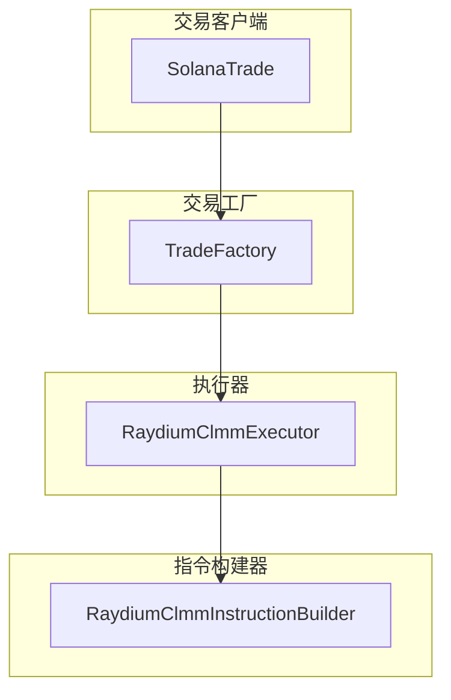
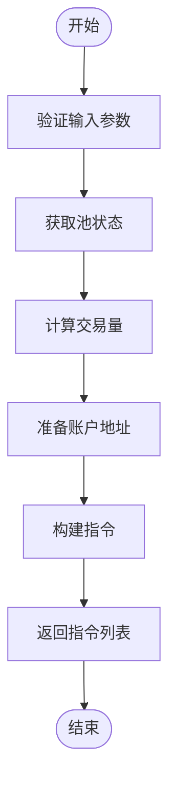
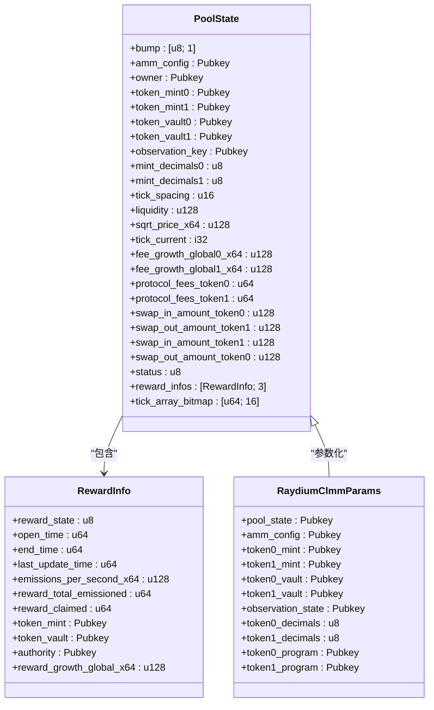
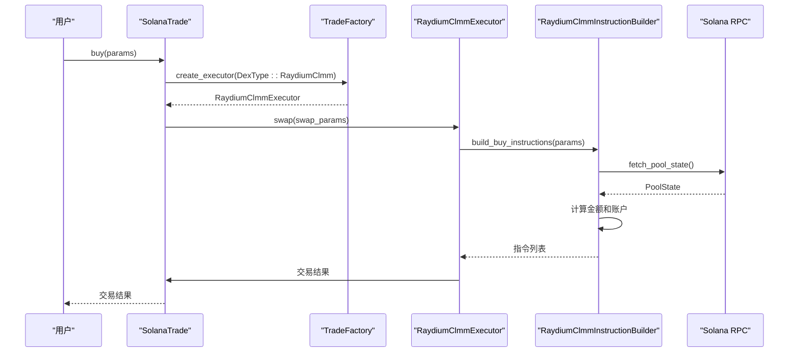
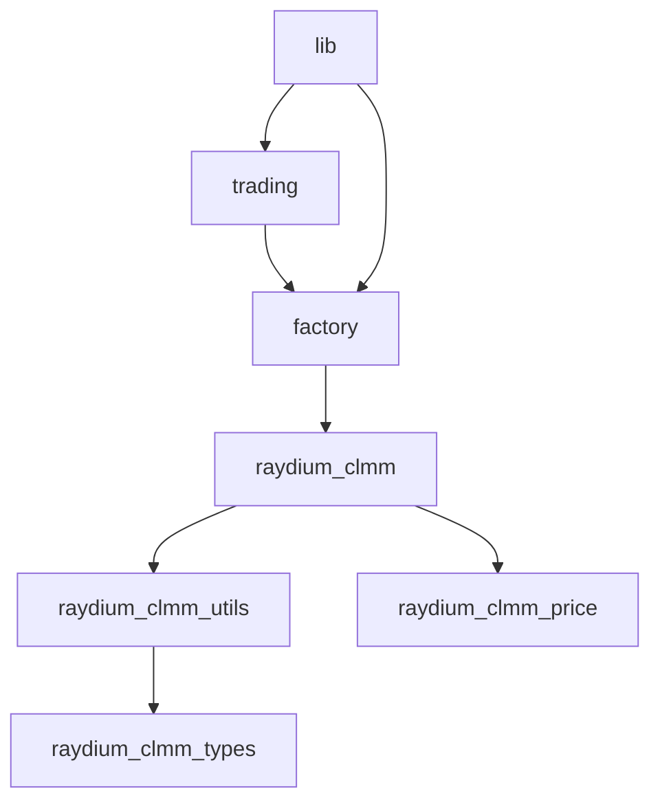

# Raydium CLMM 交易支持

<cite>
**本文档引用的文件**   
- [raydium_clmm.rs](file://src/instruction/raydium_clmm.rs)
- [raydium_clmm_types.rs](file://src/instruction/utils/raydium_clmm_types.rs)
- [raydium_clmm.rs](file://src/instruction/utils/raydium_clmm.rs)
- [raydium_clmm.rs](file://src/utils/price/raydium_clmm.rs)
- [params.rs](file://src/trading/core/params.rs)
- [factory.rs](file://src/trading/factory.rs)
- [lib.rs](file://src/lib.rs)
</cite>

## 目录
1. [介绍](#介绍)
2. [项目结构](#项目结构)
3. [核心组件](#核心组件)
4. [架构概述](#架构概述)
5. [详细组件分析](#详细组件分析)
6. [依赖分析](#依赖分析)
7. [性能考虑](#性能考虑)
8. [故障排除指南](#故障排除指南)
9. [结论](#结论)

## 介绍
本文档详细介绍了Solana交易SDK中Raydium集中流动性市场制造者（CLMM）的交易支持功能。该SDK提供了一个统一的接口，用于在多个Solana去中心化交易所（DEX）上执行交易，包括PumpFun、PumpSwap、Bonk、Raydium AMM V4和Raydium CPMM。本文档重点分析了Raydium CLMM协议的实现，涵盖了其核心组件、架构设计、数据流和关键功能。

## 项目结构
该项目是一个Rust编写的Solana交易SDK，其结构清晰地组织了不同的功能模块。核心功能位于`src`目录下，包括`common`（通用工具）、`constants`（常量定义）、`instruction`（指令构建）、`perf`（性能优化）、`swqos`（服务质量）、`trading`（交易逻辑）和`utils`（实用工具）。`examples`目录包含了各种交易策略的示例代码，如狙击交易、复制交易等。`docs`目录则提供了详细的文档说明。

**Section sources**
- [raydium_clmm.rs](file://src/instruction/raydium_clmm.rs)
- [raydium_clmm_types.rs](file://src/instruction/utils/raydium_clmm_types.rs)

## 核心组件
Raydium CLMM交易支持的核心组件包括指令构建器、协议参数、价格计算和状态获取。`RaydiumClmmInstructionBuilder`实现了`InstructionBuilder` trait，负责构建买入和卖出指令。`RaydiumClmmParams`结构体封装了CLMM池的所有必要信息，如池状态、AMM配置、代币金库和观察者状态。`price_token0_in_token1`和`price_token1_in_token0`函数用于计算代币价格。`fetch_pool_state`函数用于从区块链获取池的当前状态。

**Section sources**
- [raydium_clmm.rs](file://src/instruction/raydium_clmm.rs#L37-L582)
- [raydium_clmm_types.rs](file://src/instruction/utils/raydium_clmm_types.rs#L5-L70)
- [raydium_clmm.rs](file://src/utils/price/raydium_clmm.rs#L1-L37)

## 架构概述
该SDK采用模块化设计，通过工厂模式创建不同DEX协议的交易执行器。`TradeFactory`根据`DexType`枚举创建相应的`TradeExecutor`实例。每个执行器都包含一个`InstructionBuilder`，用于生成特定于协议的指令。`SolanaTrade`客户端作为统一入口，管理RPC连接、签名者和SWQOS配置，并通过`buy`和`sell`方法与执行器交互。

**Diagram sources **
- [factory.rs](file://src/trading/factory.rs#L1-L112)
- [lib.rs](file://src/lib.rs#L49-L66)

## 详细组件分析

### Raydium CLMM 指令构建器分析
`RaydiumClmmInstructionBuilder`是实现Raydium CLMM交易的核心。它实现了`InstructionBuilder` trait的`build_buy_instructions`和`build_sell_instructions`方法。这些方法负责验证参数、计算交易量、准备账户地址并构建最终的Solana指令。

#### 指令构建流程

**Diagram sources **
- [raydium_clmm.rs](file://src/instruction/raydium_clmm.rs#L41-L317)

#### 核心数据结构

**Diagram sources **
- [raydium_clmm_types.rs](file://src/instruction/utils/raydium_clmm_types.rs#L5-L70)
- [params.rs](file://src/trading/core/params.rs#L660-L715)

**Section sources**
- [raydium_clmm.rs](file://src/instruction/raydium_clmm.rs#L1-L583)
- [raydium_clmm_types.rs](file://src/instruction/utils/raydium_clmm_types.rs#L1-L70)
- [raydium_clmm.rs](file://src/instruction/utils/raydium_clmm.rs#L1-L331)

### 交易执行流程分析
当用户调用`SolanaTrade`的`buy`或`sell`方法时，会触发一个完整的交易执行流程。该流程涉及参数验证、指令构建、交易发送和确认。

#### 买入交易序列图

**Diagram sources **
- [lib.rs](file://src/lib.rs#L359-L449)
- [raydium_clmm.rs](file://src/instruction/raydium_clmm.rs#L41-L188)

**Section sources**
- [lib.rs](file://src/lib.rs#L89-L125)
- [params.rs](file://src/trading/core/params.rs#L46-L73)

## 依赖分析
该SDK的依赖关系清晰，核心模块之间耦合度低。`raydium_clmm`模块依赖于`instruction::utils::raydium_clmm`来获取池状态和计算PDA，依赖于`utils::price::raydium_clmm`来计算价格。`trading`模块通过`factory`模块与具体的指令构建器解耦。`lib.rs`作为入口，整合了所有模块并提供了统一的API。

**Diagram sources **
- [raydium_clmm.rs](file://src/instruction/raydium_clmm.rs#L1-L15)
- [factory.rs](file://src/trading/factory.rs#L1-L112)

**Section sources**
- [raydium_clmm.rs](file://src/instruction/raydium_clmm.rs#L1-L15)
- [factory.rs](file://src/trading/factory.rs#L1-L112)

## 性能考虑
该SDK在设计时考虑了性能优化。使用`LazyLock`来创建单例执行器，避免了重复初始化的开销。`fast_fn`模块提供了快速的函数调用，如`get_associated_token_address_with_program_id_fast_use_seed`。`seed`优化可以减少创建关联代币账户（ATA）的交易费用。此外，通过`address_lookup_table_account`支持地址查找表，可以优化大型交易的大小。

## 故障排除指南
在使用Raydium CLMM交易功能时，可能会遇到一些常见问题。例如，如果池不包含WSOL或USDC，交易将失败。如果输入或输出代币与池中的代币不匹配，也会导致错误。确保提供了正确的RPC客户端和池状态地址。在构建指令时，SDK会进行详细的参数验证，以防止无效交易。

**Section sources**
- [raydium_clmm.rs](file://src/instruction/raydium_clmm.rs#L45-L70)
- [raydium_clmm.rs](file://src/instruction/raydium_clmm.rs#L77-L84)

## 结论
本文档全面分析了Solana交易SDK中Raydium CLMM的交易支持。该实现提供了高效、可靠和易于使用的接口，用于在Raydium CLMM池上执行交易。通过模块化设计和工厂模式，SDK能够轻松扩展以支持更多的DEX协议。开发者可以利用此SDK快速构建复杂的交易策略，如狙击交易、复制交易等。