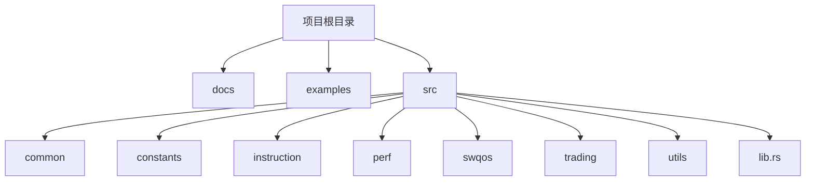
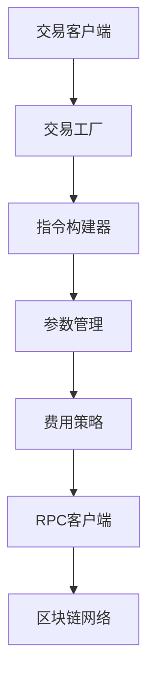
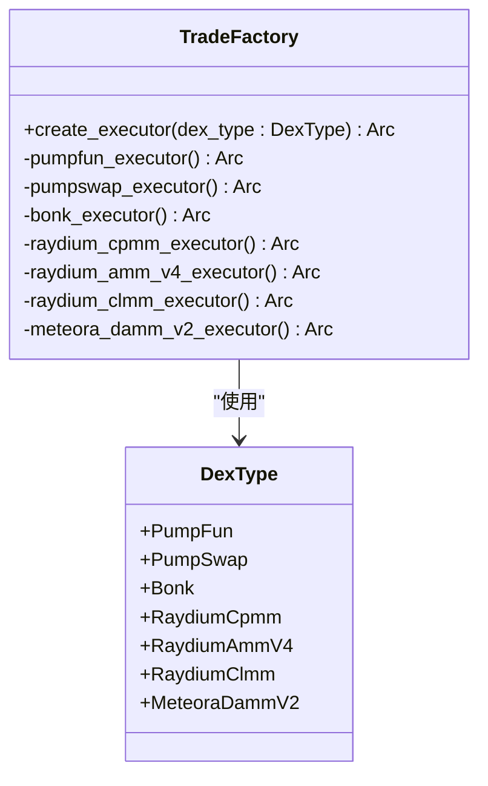
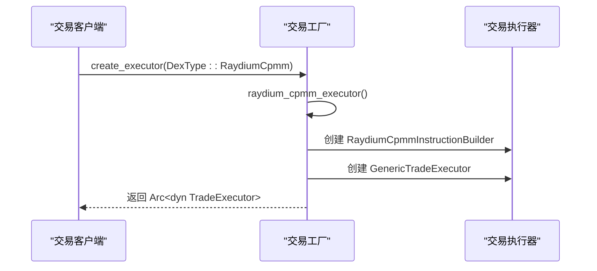
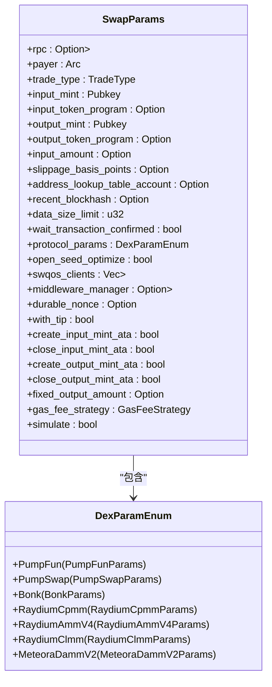
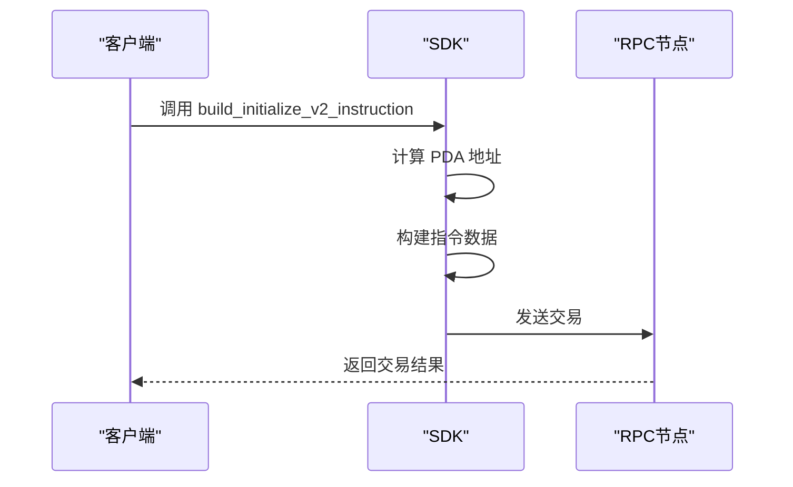
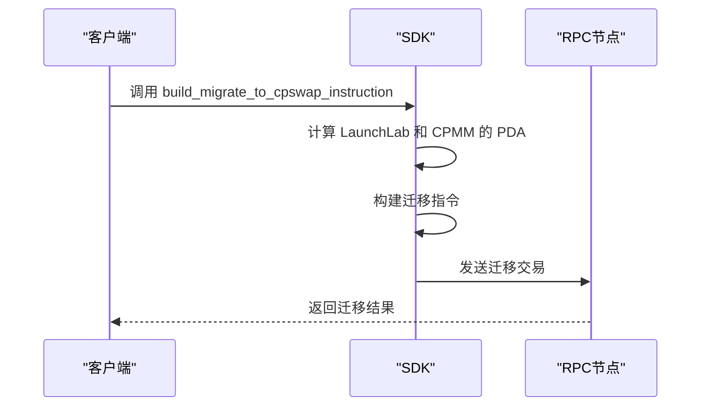
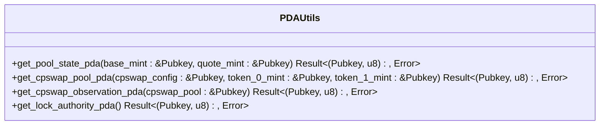

# Raydium LaunchLab 交易支持

<cite>
**本文档中引用的文件**  
- [raydium_launchlab.rs](file://src/instruction/utils/raydium_launchlab.rs)
- [factory.rs](file://src/trading/factory.rs)
- [params.rs](file://src/trading/core/params.rs)
- [trade_platform.rs](file://src/constants/trade_platform.rs)
</cite>

## 更新摘要
**已更改内容**  
- 新增代币创建功能说明，包括 `build_initialize_v2_instruction` 指令构建
- 新增迁移功能说明，包括 `build_migrate_to_cpswap_instruction` 指令构建
- 更新PDA查找策略，涵盖 `get_pool_state_pda`、`get_cpswap_pool_pda` 等函数
- 扩展核心组件分析，增加代币创建与迁移流程
- 增加新的架构图与类图以反映新功能

## 目录
1. [简介](#简介)
2. [项目结构](#项目结构)
3. [核心组件](#核心组件)
4. [架构概述](#架构概述)
5. [详细组件分析](#详细组件分析)
6. [依赖分析](#依赖分析)
7. [性能考虑](#性能考虑)
8. [故障排除指南](#故障排除指南)
9. [结论](#结论)

## 简介
本文档详细介绍了Raydium LaunchLab在Solana交易SDK中的实现和支持。Raydium LaunchLab是一个基于Solana的去中心化交易平台，支持多种交易模式，包括即时买卖、流动性池交易等。该SDK提供了完整的交易功能，包括交易指令构建、参数管理、费用计算等，旨在为开发者提供高效、可靠的交易解决方案。本次更新重点增加了代币创建、迁移功能以及PDA查找策略的详细说明。

## 项目结构
项目结构清晰地组织了各个模块，便于维护和扩展。主要目录包括`docs`、`examples`、`src`等，其中`src`目录包含了核心的交易逻辑和工具函数。



**图表来源**  
- [raydium_launchlab.rs](file://src/instruction/utils/raydium_launchlab.rs#L1-L1497)

**章节来源**  
- [raydium_launchlab.rs](file://src/instruction/utils/raydium_launchlab.rs#L1-L1497)

## 核心组件
核心组件包括交易工厂、参数管理、指令构建等，这些组件共同协作，实现了高效的交易功能。新增代币创建和迁移功能，扩展了PDA查找策略。

**章节来源**  
- [factory.rs](file://src/trading/factory.rs#L1-L112)
- [params.rs](file://src/trading/core/params.rs#L1-L800)
- [raydium_launchlab.rs](file://src/instruction/utils/raydium_launchlab.rs#L842-L1497)

## 架构概述
系统架构采用模块化设计，各组件之间通过接口进行通信，确保了高内聚低耦合。



**图表来源**  
- [factory.rs](file://src/trading/factory.rs#L1-L112)
- [params.rs](file://src/trading/core/params.rs#L1-L800)

## 详细组件分析
### 交易工厂分析
交易工厂负责创建不同协议的交易执行器，通过单例模式确保零开销。

#### 类图


**图表来源**  
- [factory.rs](file://src/trading/factory.rs#L1-L112)

#### 序列图


**图表来源**  
- [factory.rs](file://src/trading/factory.rs#L1-L112)

### 参数管理分析
参数管理模块负责处理不同协议的交易参数，确保交易的灵活性和可配置性。

#### 类图


**图表来源**  
- [params.rs](file://src/trading/core/params.rs#L1-L800)

**章节来源**  
- [factory.rs](file://src/trading/factory.rs#L1-L112)
- [params.rs](file://src/trading/core/params.rs#L1-L800)

### 代币创建与迁移功能分析
新增代币创建和迁移功能，支持开发者在Raydium LaunchLab上创建新代币并迁移到CPMM池。

#### 类图
```mermaid
classDiagram
class MintParams {
+decimals : u8
+name : String
+symbol : String
+uri : String
}
class CurveParams {
+Constant{supply : u64, total_base_sell : u64, total_quote_fund_raising : u64, migrate_type : u8}
+Fixed{supply : u64, total_quote_fund_raising : u64, migrate_type : u8}
+Linear{supply : u64, total_quote_fund_raising : u64, migrate_type : u8}
}
class VestingParams {
+total_locked_amount : u64
+cliff_period : u64
+unlock_period : u64
}
class AmmCreatorFeeOn {
+QuoteToken
+BothToken
}
```

**图表来源**  
- [raydium_launchlab.rs](file://src/instruction/utils/raydium_launchlab.rs#L842-L884)

#### 序列图


**图表来源**  
- [raydium_launchlab.rs](file://src/instruction/utils/raydium_launchlab.rs#L1054-L1120)

#### 迁移序列图


**图表来源**  
- [raydium_launchlab.rs](file://src/instruction/utils/raydium_launchlab.rs#L1412-L1495)

### PDA查找策略分析
详细说明了PDA（程序派生地址）的查找策略，包括池状态、CPMM池、观察状态等。

#### 类图


**图表来源**  
- [raydium_launchlab.rs](file://src/instruction/utils/raydium_launchlab.rs#L459-L466)
- [raydium_launchlab.rs](file://src/instruction/utils/raydium_launchlab.rs#L1338-L1411)

## 依赖分析
项目依赖关系清晰，各模块之间通过接口进行通信，确保了高内聚低耦合。


**图表来源**  
- [factory.rs](file://src/trading/factory.rs#L1-L112)
- [params.rs](file://src/trading/core/params.rs#L1-L800)

**章节来源**  
- [factory.rs](file://src/trading/factory.rs#L1-L112)
- [params.rs](file://src/trading/core/params.rs#L1-L800)

## 性能考虑
为了提高交易性能，SDK采用了多种优化技术，包括零开销单例、快速地址计算、并行处理等。新增的代币创建和迁移功能也经过优化，确保高效执行。

## 故障排除指南
常见问题及解决方案：
- **交易失败**：检查输入参数是否正确，确保账户有足够的余额。
- **网络延迟**：使用高性能RPC节点，减少网络延迟。
- **费用过高**：调整费用策略，选择合适的费用等级。
- **PDA查找失败**：确认输入的mint地址和quote_mint地址正确，使用`find_global_config`和`find_platform_config`辅助查找。

**章节来源**  
- [raydium_launchlab.rs](file://src/instruction/utils/raydium_launchlab.rs#L1-L1497)
- [params.rs](file://src/trading/core/params.rs#L1-L800)

## 结论
Raydium LaunchLab交易支持模块提供了完整的交易功能，通过模块化设计和优化技术，确保了高效、可靠的交易体验。开发者可以轻松集成该SDK，实现复杂的交易逻辑。本次更新增加了代币创建、迁移功能和PDA查找策略，进一步增强了SDK的功能性和灵活性。