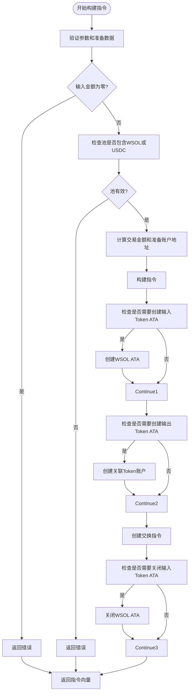
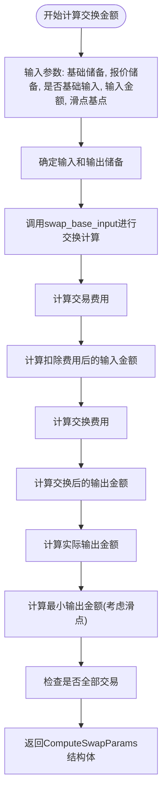
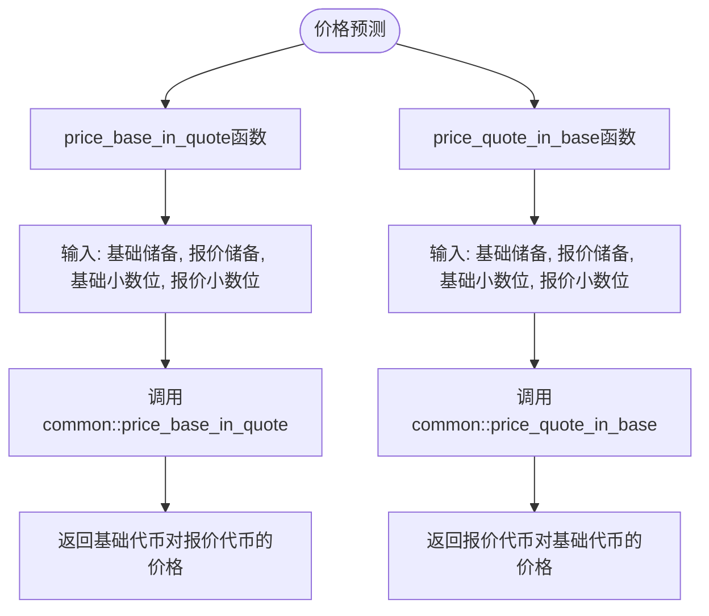
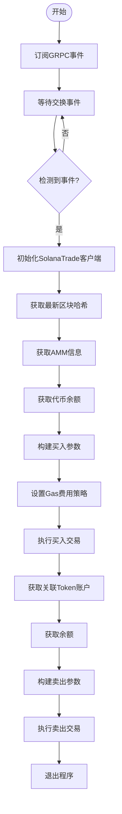
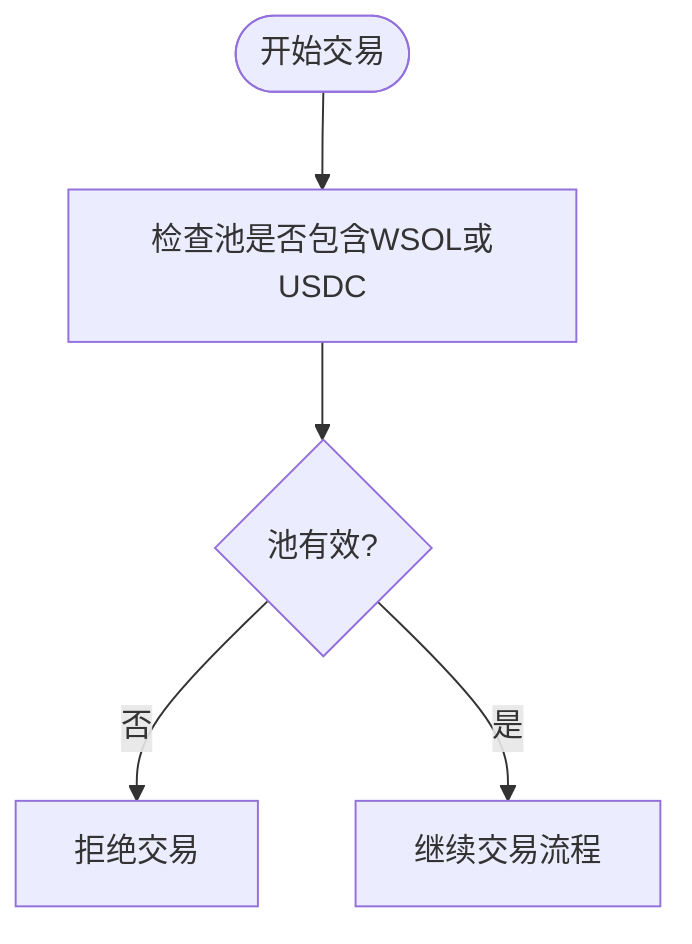
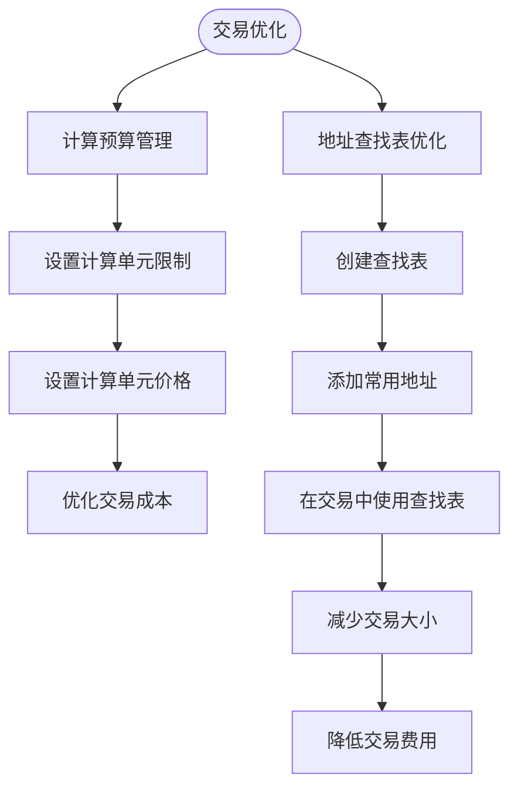

# Raydium AMM V4 交易支持

<cite>
**本文档中引用的文件**  
- [raydium_amm_v4.rs](file://src/instruction/raydium_amm_v4.rs)
- [raydium_amm_v4_types.rs](file://src/instruction/utils/raydium_amm_v4_types.rs)
- [raydium_amm_v4.rs](file://src/instruction/utils/raydium_amm_v4.rs)
- [raydium_amm_v4.rs](file://src/utils/calc/raydium_amm_v4.rs)
- [raydium_amm_v4.rs](file://src/utils/price/raydium_amm_v4.rs)
- [params.rs](file://src/trading/core/params.rs)
- [accounts.rs](file://src/constants/accounts.rs)
- [trade.rs](file://src/constants/trade.rs)
- [main.rs](file://examples/raydium_amm_v4_trading/src/main.rs)
</cite>

## 目录
1. [简介](#简介)
2. [核心组件分析](#核心组件分析)
3. [RaydiumAmmV4InstructionBuilder 指令构建机制](#raydiumammv4instructionbuilder-指令构建机制)
4. [compute_swap_amount 价格与滑点计算](#computeswapamount-价格与滑点计算)
5. [价格预测功能设计](#价格预测功能设计)
6. [交易流程示例分析](#交易流程示例分析)
7. [AMM V4 主对支持限制](#amm-v4-主对支持限制)
8. [计算预算与地址查找表优化](#计算预算与地址查找表优化)
9. [常见问题排查指南](#常见问题排查指南)

## 简介
sol-trade-sdk 提供了对 Raydium AMM V4 协议的全面支持，实现了高效、安全的去中心化交易所交易功能。本SDK通过 `RaydiumAmmV4InstructionBuilder` 结构体构建交换指令，利用 `compute_swap_amount` 函数进行精确的交易计算，并通过 `price_base_in_quote` 等函数提供价格预测能力。SDK支持从参数配置、交易构建到广播的完整流程，同时针对WSOL/USDC主对交易进行了特殊优化。本文档将深入解析这些核心功能的实现机制和使用方法。

## 核心组件分析

sol-trade-sdk 对 Raydium AMM V4 的支持主要由以下几个核心组件构成：`RaydiumAmmV4InstructionBuilder` 负责构建交易指令，`compute_swap_amount` 函数实现交易金额计算，`price_base_in_quote` 函数提供价格预测，以及 `RaydiumAmmV4Params` 结构体管理协议特定参数。这些组件协同工作，为开发者提供了一套完整的交易解决方案。

**本节来源**
- [raydium_amm_v4.rs](file://src/instruction/raydium_amm_v4.rs#L1-L252)
- [raydium_amm_v4.rs](file://src/utils/calc/raydium_amm_v4.rs#L1-L151)
- [raydium_amm_v4.rs](file://src/utils/price/raydium_amm_v4.rs#L1-L48)
- [params.rs](file://src/trading/core/params.rs#L607-L708)

## RaydiumAmmV4InstructionBuilder 指令构建机制

`RaydiumAmmV4InstructionBuilder` 是实现 Raydium AMM V4 交易的核心组件，它实现了 `InstructionBuilder` trait，提供了 `build_buy_instructions` 和 `build_sell_instructions` 两个异步方法来构建买入和卖出指令。

### 账户元数据（AccountMeta）组织方式
在构建指令时，系统会创建一个包含17个 `AccountMeta` 的数组，这些元数据定义了交易所需的所有账户信息。其中包括Token程序、AMM池、权威账户、各种Token账户以及用户账户等。每个账户的可写性和签名权限都经过精心设计，确保交易的安全性。

**本图来源**
- [raydium_amm_v4.rs](file://src/instruction/raydium_amm_v4.rs#L100-L118)

### 状态账户处理逻辑
在交易过程中，系统会根据需要自动处理状态账户。当 `create_input_mint_ata` 或 `create_output_mint_ata` 参数为真时，系统会自动创建相应的关联Token账户（ATA）。同样，当 `close_input_mint_ata` 或 `close_output_mint_ata` 参数为真时，系统会在交易完成后关闭相应的账户，回收租金。

### 交易数据编码结构
交易数据被编码为17字节的数组，其中第一个字节是交换指令的判别器（`SWAP_BASE_IN_DISCRIMINATOR`），接下来的8个字节是输入金额的小端序表示，最后8个字节是最小输出金额的小端序表示。这种紧凑的编码结构确保了交易数据的高效传输。

**本节来源**
- [raydium_amm_v4.rs](file://src/instruction/raydium_amm_v4.rs#L19-L252)
- [raydium_amm_v4.rs](file://src/instruction/utils/raydium_amm_v4.rs#L34-L35)

## compute_swap_amount 价格与滑点计算

`compute_swap_amount` 函数是 sol-trade-sdk 中实现 Raydium AMM V4 交易计算的核心函数，它基于常数乘积公式进行价格计算，并考虑了交易费用和滑点保护。

### 实现机制
该函数首先根据输入参数确定哪个是基础代币，然后调用 `swap_base_input` 函数进行实际的交换计算。计算过程包括：计算交易费用、计算扣除费用后的输入金额、计算交换费用、计算交换后的输出金额，最后计算实际输出金额。

**本图来源**
- [raydium_amm_v4.rs](file://src/utils/calc/raydium_amm_v4.rs#L120-L150)

### 常数乘积公式
函数使用常数乘积公式 k = x * y 来计算价格，其中x和y分别是两个代币的储备量。当用户用一定数量的代币X交换代币Y时，新的储备量满足 (x + Δx) * (y - Δy) = k 的关系。通过这个公式，可以计算出用户应该得到的代币Y的数量。

### 滑点计算方法
滑点计算通过以下公式实现：`min_amount_out = swap_result.output_amount * (1.0 - slippage_basis_points / 10000.0)`。这确保了用户在交易中至少能获得预期金额的一定比例，防止因市场波动导致的过度损失。

**本节来源**
- [raydium_amm_v4.rs](file://src/utils/calc/raydium_amm_v4.rs#L1-L151)
- [trade.rs](file://src/constants/trade.rs#L2)

## 价格预测功能设计

`src/utils/price/raydium_amm_v4.rs` 文件中的价格预测功能为交易决策提供了重要的前置支持。该模块通过简单的数学公式计算代币的理论价格，帮助用户在执行交易前做出更明智的决策。

### 设计原理
价格预测功能基于池中两个代币的储备量比例来计算价格。`price_base_in_quote` 函数计算一个基础代币能兑换多少报价代币，而 `price_quote_in_base` 函数则计算一个报价代币能兑换多少基础代币。这些计算考虑了代币的小数位数，确保结果的准确性。

**本图来源**
- [raydium_amm_v4.rs](file://src/utils/price/raydium_amm_v4.rs#L1-L48)

### 前置支持作用
这些价格预测功能在交易决策中起着关键作用。用户可以在执行实际交易前，使用这些函数来估算可能的交易结果，从而决定是否进行交易、设置合适的滑点参数，或者调整交易金额。这种前置分析能力大大降低了交易风险。

**本节来源**
- [raydium_amm_v4.rs](file://src/utils/price/raydium_amm_v4.rs#L1-L48)
- [raydium_amm_v4.rs](file://src/utils/price/common.rs#L1-L25)

## 交易流程示例分析

`examples/raydium_amm_v4_trading/src/main.rs` 示例展示了从参数配置、交易构建到广播的完整流程。该示例使用事件驱动的方式，在检测到新的Raydium AMM V4交易时自动执行复制交易。

### 完整流程
流程从订阅GRPC事件开始，当检测到新的交换事件时，系统会初始化SolanaTrade客户端，获取最新的区块哈希，然后构建买入和卖出参数并执行交易。整个过程自动化程度高，适合高频交易场景。

**本图来源**
- [main.rs](file://examples/raydium_amm_v4_trading/src/main.rs#L32-L222)

### 参数配置
示例中展示了如何配置各种交易参数，包括RPC URL、承诺级别、SWQOS配置、滑点基点等。这些参数的合理配置对交易的成功率和成本控制至关重要。

### 交易构建与广播
交易构建过程包括创建SolanaTrade客户端、设置Gas费用策略、构建买入和卖出参数，最后通过`client.buy()`和`client.sell()`方法广播交易。整个过程封装良好，易于使用。

**本节来源**
- [main.rs](file://examples/raydium_amm_v4_trading/src/main.rs#L1-L222)
- [params.rs](file://src/trading/core/params.rs#L43-L70)

## AMM V4 主对支持限制

sol-trade-sdk 对 Raydium AMM V4 的支持存在对WSOL/USDC主对的限制，这是出于安全性和兼容性的考虑。

### 技术原因
在 `raydium_amm_v4.rs` 的 `build_buy_instructions` 和 `build_sell_instructions` 方法中，系统会检查池是否包含WSOL或USDC代币。如果不包含，交易将被拒绝。这种限制确保了交易只在流动性充足、价格稳定的主流交易对上进行，降低了交易失败的风险。

**本图来源**
- [raydium_amm_v4.rs](file://src/instruction/raydium_amm_v4.rs#L40-L42)
- [raydium_amm_v4.rs](file://src/instruction/raydium_amm_v4.rs#L159-L161)

### 限制影响
这种限制虽然减少了支持的交易对数量，但提高了交易的可靠性和安全性。对于需要交易其他代币对的用户，可以考虑使用SDK的其他功能或修改源代码以适应特定需求。

**本节来源**
- [raydium_amm_v4.rs](file://src/instruction/raydium_amm_v4.rs#L34-L42)
- [raydium_amm_v4.rs](file://src/instruction/raydium_amm_v4.rs#L153-L161)

## 计算预算管理与地址查找表优化

在Solana交易中，计算预算管理和地址查找表优化是提高交易效率和降低成本的关键策略。

### 计算预算管理
通过合理设置计算预算，可以确保交易有足够的计算单元来完成执行，同时避免不必要的费用。在示例中，通过`gas_fee_strategy.set_global_fee_strategy`方法设置了计算单元限制和价格，实现了有效的预算管理。

### 地址查找表优化
地址查找表（Address Lookup Table）可以显著减少交易的大小和费用。虽然在当前示例中没有直接使用，但SDK提供了相关支持。通过将频繁使用的地址存储在查找表中，可以减少交易中需要包含的地址数量，从而降低交易费用。

**本图来源**
- [main.rs](file://examples/raydium_amm_v4_trading/src/main.rs#L144-L154)
- [accounts.rs](file://src/constants/accounts.rs#L1-L61)

**本节来源**
- [main.rs](file://examples/raydium_amm_v4_trading/src/main.rs#L144-L154)
- [accounts.rs](file://src/constants/accounts.rs#L1-L61)

## 常见问题排查指南

### 交易失败
交易失败可能由多种原因引起，包括网络问题、余额不足、无效的交易参数等。建议检查钱包余额、网络连接状态和交易参数设置。

### 滑点超限
滑点超限通常是由于市场波动剧烈或设置的滑点参数过小。建议根据市场情况调整滑点基点，对于波动较大的代币，可以设置更高的滑点容忍度。

### 账户未初始化
账户未初始化错误通常发生在尝试使用尚未创建的关联Token账户时。确保在交易前已正确创建所需的ATA账户，或在交易参数中设置`create_input_mint_ata`为true以自动创建。

**本节来源**
- [raydium_amm_v4.rs](file://src/instruction/raydium_amm_v4.rs#L25-L27)
- [raydium_amm_v4.rs](file://src/instruction/raydium_amm_v4.rs#L149-L151)
- [main.rs](file://examples/raydium_amm_v4_trading/src/main.rs#L171-L172)