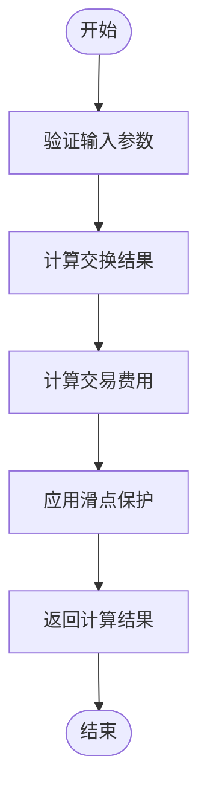

# Raydium CPMM 交易支持

<cite>
**本文档中引用的文件**  
- [raydium_cpmm.rs](file://src/instruction/raydium_cpmm.rs)
- [raydium_cpmm_types.rs](file://src/instruction/utils/raydium_cpmm_types.rs)
- [raydium_cpmm.rs](file://src/instruction/utils/raydium_cpmm.rs)
- [calc/raydium_cpmm.rs](file://src/utils/calc/raydium_cpmm.rs)
- [price/raydium_cpmm.rs](file://src/utils/price/raydium_cpmm.rs)
- [params.rs](file://src/trading/core/params.rs)
- [main.rs](file://examples/raydium_cpmm_trading/src/main.rs)
</cite>

## 目录
1. [简介](#简介)
2. [项目结构](#项目结构)
3. [核心组件](#核心组件)
4. [架构概述](#架构概述)
5. [详细组件分析](#详细组件分析)
6. [依赖分析](#依赖分析)
7. [性能考虑](#性能考虑)
8. [故障排除指南](#故障排除指南)
9. [结论](#结论)

## 简介
本文档全面介绍sol-trade-sdk对Raydium CPMM（集中流动性）协议的支持机制。重点解析`RaydiumCpmmInstructionBuilder`在构建交易时与AMM V4的差异，包括PDA派生、多程序交互以及复杂的账户列表结构。深入分析`compute_swap_amount`在`src/utils/calc/raydium_cpmm.rs`中的实现，说明其如何处理集中流动性池的非线性价格曲线与流动性深度计算。描述`src/utils/price/raydium_cpmm.rs`中价格预测模块的设计，支持高精度价格预判。通过`examples/raydium_cpmm_trading/src/main.rs`展示实际调用流程，涵盖配置初始化、参数设置与交易执行。

## 项目结构
sol-trade-sdk项目采用模块化设计，将不同功能分离到独立的目录中。核心交易逻辑位于`src/`目录下，其中`instruction`模块负责构建交易指令，`utils`模块提供计算和价格预测功能，`trading`模块管理交易执行流程。示例代码位于`examples/`目录下，为开发者提供实际使用参考。

**图表来源**  
- [raydium_cpmm.rs](file://src/instruction/raydium_cpmm.rs)
- [raydium_cpmm.rs](file://src/instruction/utils/raydium_cpmm.rs)
- [calc/raydium_cpmm.rs](file://src/utils/calc/raydium_cpmm.rs)
- [price/raydium_cpmm.rs](file://src/utils/price/raydium_cpmm.rs)
- [params.rs](file://src/trading/core/params.rs)
- [main.rs](file://examples/raydium_cpmm_trading/src/main.rs)

**本节来源**  
- [raydium_cpmm.rs](file://src/instruction/raydium_cpmm.rs)
- [raydium_cpmm_types.rs](file://src/instruction/utils/raydium_cpmm_types.rs)
- [raydium_cpmm.rs](file://src/instruction/utils/raydium_cpmm.rs)
- [calc/raydium_cpmm.rs](file://src/utils/calc/raydium_cpmm.rs)
- [price/raydium_cpmm.rs](file://src/utils/price/raydium_cpmm.rs)
- [params.rs](file://src/trading/core/params.rs)
- [main.rs](file://examples/raydium_cpmm_trading/src/main.rs)

## 核心组件
sol-trade-sdk的核心组件包括`RaydiumCpmmInstructionBuilder`、`RaydiumCpmmParams`、`compute_swap_amount`函数和价格预测模块。这些组件协同工作，实现对Raydium CPMM协议的完整支持。

**本节来源**  
- [raydium_cpmm.rs](file://src/instruction/raydium_cpmm.rs)
- [params.rs](file://src/trading/core/params.rs)
- [calc/raydium_cpmm.rs](file://src/utils/calc/raydium_cpmm.rs)
- [price/raydium_cpmm.rs](file://src/utils/price/raydium_cpmm.rs)

## 架构概述
sol-trade-sdk的架构设计遵循模块化原则，将交易构建、计算、价格预测和执行分离到不同的模块中。这种设计提高了代码的可维护性和可扩展性。

**图表来源**  
- [raydium_cpmm.rs](file://src/instruction/raydium_cpmm.rs)
- [params.rs](file://src/trading/core/params.rs)
- [calc/raydium_cpmm.rs](file://src/utils/calc/raydium_cpmm.rs)
- [price/raydium_cpmm.rs](file://src/utils/price/raydium_cpmm.rs)

## 详细组件分析

### RaydiumCpmmInstructionBuilder分析
`RaydiumCpmmInstructionBuilder`是构建Raydium CPMM交易指令的核心组件。它实现了`InstructionBuilder` trait，提供`build_buy_instructions`和`build_sell_instructions`方法。

**图表来源**  
- [raydium_cpmm.rs](file://src/instruction/raydium_cpmm.rs)

**本节来源**  
- [raydium_cpmm.rs](file://src/instruction/raydium_cpmm.rs)

### compute_swap_amount实现分析
`compute_swap_amount`函数位于`src/utils/calc/raydium_cpmm.rs`中，负责计算交换金额和相关费用。

**图表来源**  
- [calc/raydium_cpmm.rs](file://src/utils/calc/raydium_cpmm.rs)

**本节来源**  
- [calc/raydium_cpmm.rs](file://src/utils/calc/raydium_cpmm.rs)

### 价格预测模块分析
价格预测模块位于`src/utils/price/raydium_cpmm.rs`中，提供高精度的价格预判功能。

**图表来源**  
- [price/raydium_cpmm.rs](file://src/utils/price/raydium_cpmm.rs)
- [price/common.rs](file://src/utils/price/common.rs)

**本节来源**  
- [price/raydium_cpmm.rs](file://src/utils/price/raydium_cpmm.rs)

### 实际调用流程分析
通过`examples/raydium_cpmm_trading/src/main.rs`展示实际调用流程。

**图表来源**  
- [main.rs](file://examples/raydium_cpmm_trading/src/main.rs)

**本节来源**  
- [main.rs](file://examples/raydium_cpmm_trading/src/main.rs)

## 依赖分析
sol-trade-sdk对多个外部依赖和内部模块有依赖关系。

**图表来源**  
- [raydium_cpmm.rs](file://src/instruction/raydium_cpmm.rs)
- [raydium_cpmm_types.rs](file://src/instruction/utils/raydium_cpmm_types.rs)
- [raydium_cpmm.rs](file://src/instruction/utils/raydium_cpmm.rs)
- [calc/raydium_cpmm.rs](file://src/utils/calc/raydium_cpmm.rs)
- [price/raydium_cpmm.rs](file://src/utils/price/raydium_cpmm.rs)
- [params.rs](file://src/trading/core/params.rs)
- [main.rs](file://examples/raydium_cpmm_trading/src/main.rs)

**本节来源**  
- [raydium_cpmm.rs](file://src/instruction/raydium_cpmm.rs)
- [raydium_cpmm_types.rs](file://src/instruction/utils/raydium_cpmm_types.rs)
- [raydium_cpmm.rs](file://src/instruction/utils/raydium_cpmm.rs)
- [calc/raydium_cpmm.rs](file://src/utils/calc/raydium_cpmm.rs)
- [price/raydium_cpmm.rs](file://src/utils/price/raydium_cpmm.rs)
- [params.rs](file://src/trading/core/params.rs)
- [main.rs](file://examples/raydium_cpmm_trading/src/main.rs)

## 性能考虑
在使用sol-trade-sdk进行Raydium CPMM交易时，需要注意以下性能优化建议：

1. **减少PDA计算开销**：缓存常用的PDA地址，避免重复计算
2. **优化账户预取**：批量获取账户信息，减少RPC调用次数
3. **合理设置滑点**：根据市场情况调整滑点参数，平衡交易成功率和价格
4. **使用地址查找表**：利用地址查找表减少交易大小，提高执行效率

**本节来源**  
- [raydium_cpmm.rs](file://src/instruction/raydium_cpmm.rs)
- [calc/raydium_cpmm.rs](file://src/utils/calc/raydium_cpmm.rs)

## 故障排除指南
在使用sol-trade-sdk时可能遇到的常见问题及解决方案：

1. **交易失败**：检查账户余额、权限和网络状况
2. **PDA计算错误**：验证输入参数的正确性
3. **滑点过大**：调整滑点参数或选择流动性更好的交易对
4. **RPC超时**：切换到更稳定的RPC节点或增加超时时间

**本节来源**  
- [raydium_cpmm.rs](file://src/instruction/raydium_cpmm.rs)
- [main.rs](file://examples/raydium_cpmm_trading/src/main.rs)

## 结论
sol-trade-sdk提供了对Raydium CPMM协议的全面支持，通过`RaydiumCpmmInstructionBuilder`、`compute_swap_amount`和价格预测模块等核心组件，实现了高效、准确的交易构建和执行。开发者可以利用这些功能快速集成Raydium CPMM交易到自己的应用中。