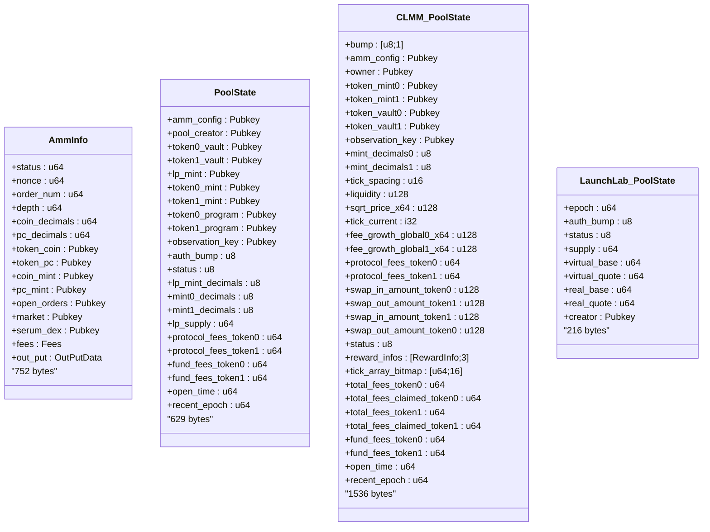
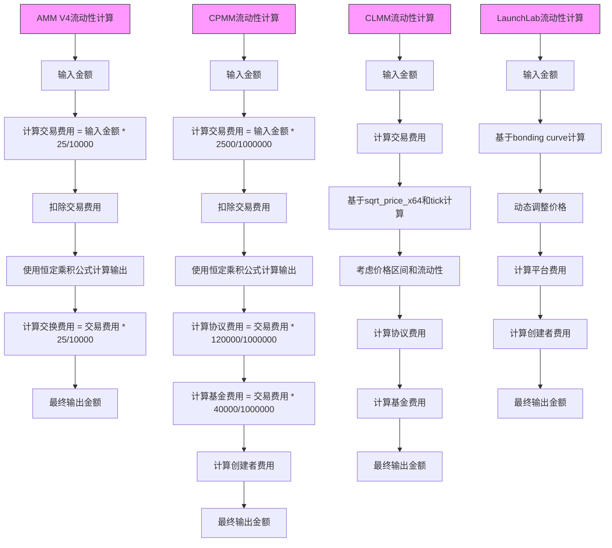
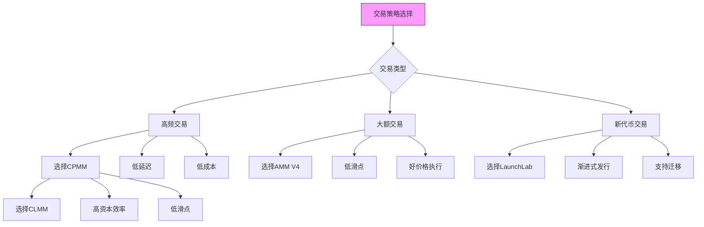

# Raydium交易支持

<cite>
**本文档中引用的文件**  
- [raydium_amm_v4.rs](file://src/instruction/raydium_amm_v4.rs)
- [raydium_clmm.rs](file://src/instruction/raydium_clmm.rs)
- [raydium_cpmm.rs](file://src/instruction/raydium_cpmm.rs)
- [raydium_amm_v4_types.rs](file://src/instruction/utils/raydium_amm_v4_types.rs)
- [raydium_clmm_types.rs](file://src/instruction/utils/raydium_clmm_types.rs)
- [raydium_cpmm_types.rs](file://src/instruction/utils/raydium_cpmm_types.rs)
- [raydium_amm_v4.rs](file://src/utils/calc/raydium_amm_v4.rs)
- [raydium_clmm.rs](file://src/utils/calc/raydium_clmm.rs)
- [raydium_cpmm.rs](file://src/utils/calc/raydium_cpmm.rs)
- [price/raydium_amm_v4.rs](file://src/utils/price/raydium_amm_v4.rs)
- [price/raydium_clmm.rs](file://src/utils/price/raydium_clmm.rs)
- [price/raydium_cpmm.rs](file://src/utils/price/raydium_cpmm.rs)
- [compute_budget_manager.rs](file://src/trading/common/compute_budget_manager.rs)
- [raydium_amm_v4_trading/main.rs](file://examples/raydium_amm_v4_trading/src/main.rs)
- [raydium_cpmm_trading/main.rs](file://examples/raydium_cpmm_trading/src/main.rs)
- [raydium_launchlab.rs](file://src/instruction/utils/raydium_launchlab.rs)
- [ADDRESS_LOOKUP_TABLE_CN.md](file://docs/ADDRESS_LOOKUP_TABLE_CN.md)
</cite>

## 更新摘要
**已更改内容**  
- 在“介绍”部分新增了CLMM和LaunchLab协议支持的说明
- 新增“CLMM与LaunchLab流动性池模型”章节，详细描述新协议
- 扩展“交换指令构建差异”章节，包含CLMM和LaunchLab的指令结构
- 扩展“状态账户处理”章节，包含CLMM的状态结构
- 扩展“流动性计算与费用模型”章节，包含CLMM的费用模型
- 扩展“价格预测实现”章节，包含CLMM的价格计算
- 更新“完整交易流程示例”章节，包含CLMM和LaunchLab的交易示例

## 目录
1. [介绍](#介绍)
2. [AMM V4与CPMM流动性池模型](#amm-v4与cpmm流动性池模型)
3. [CLMM与LaunchLab流动性池模型](#clmm与launchlab流动性池模型)
4. [交换指令构建差异](#交换指令构建差异)
5. [状态账户处理](#状态账户处理)
6. [流动性计算与费用模型](#流动性计算与费用模型)
7. [价格预测实现](#价格预测实现)
8. [计算预算优化](#计算预算优化)
9. [交易压缩（地址查找表）](#交易压缩地址查找表)
10. [完整交易流程示例](#完整交易流程示例)
11. [性能比较与策略选择](#性能比较与策略选择)

## 介绍
sol-trade-sdk为Raydium协议提供了全面的支持，涵盖AMM V4、CPMM、CLMM和LaunchLab四种流动性池模型。本SDK通过优化的指令构建、精确的价格预测和高效的交易执行，为开发者提供了强大的工具来实现自动化交易策略。AMM V4基于订单簿模型，CPMM采用恒定乘积做市商模型，CLMM使用集中流动性模型，而LaunchLab则是一种专为代币发行设计的新型流动性模型。

**本节不分析具体源文件**

## AMM V4与CPMM流动性池模型
sol-trade-sdk支持Raydium的两种主要流动性池模型：AMM V4和CPMM。AMM V4（Automated Market Maker Version 4）是一种结合了订单簿和自动化做市商特性的混合模型，它使用Serum DEX作为底层订单匹配引擎，同时提供AMM流动性。CPMM（Constant Product Market Maker）则是一种纯粹的恒定乘积做市商模型，遵循x*y=k的数学公式，其中x和y是池中两种资产的数量，k是常数。

AMM V4模型更适合高流动性交易对，因为它可以利用订单簿的深度，而CPMM模型则更适合长尾资产和新上线的代币，因为它提供了简单的定价机制和较低的进入门槛。在sol-trade-sdk中，这两种模型通过不同的指令构建器和参数结构进行区分，确保了交易逻辑的清晰分离。

**Section sources**
- [raydium_amm_v4.rs](file://src/instruction/raydium_amm_v4.rs#L1-L252)
- [raydium_cpmm.rs](file://src/instruction/raydium_cpmm.rs#L1-L309)

## CLMM与LaunchLab流动性池模型
sol-trade-sdk新增了对Raydium CLMM（Concentrated Liquidity Market Maker）和LaunchLab协议的支持。CLMM是一种集中流动性做市商模型，允许流动性提供者在特定价格区间内集中其流动性，从而提高资本效率。CLMM使用sqrt_price_x64作为价格表示，支持更精细的价格控制和更低的滑点。

LaunchLab是Raydium推出的代币发行平台，采用独特的bonding curve模型，允许项目方通过渐进式代币发行筹集资金。LaunchLab的流动性池状态包含虚拟储备和实际储备，支持渐进式解锁和迁移功能。在sol-trade-sdk中，CLMM和LaunchLab通过独立的指令构建器和参数结构进行支持，确保了与现有AMM V4和CPMM模型的兼容性。

**Section sources**
- [raydium_clmm.rs](file://src/instruction/raydium_clmm.rs#L1-L583)
- [raydium_launchlab.rs](file://src/instruction/utils/raydium_launchlab.rs#L1-L736)

## 交换指令构建差异
AMM V4、CPMM、CLMM和LaunchLab在交换指令的构建上存在显著差异，主要体现在指令数据结构、账户列表和指令标识符上。AMM V4的交换指令使用单字节的判别器`[9]`表示基础代币输入交换，而CPMM使用8字节的判别器`[143, 190, 90, 218, 196, 30, 51, 222]`。CLMM使用8字节的判别器`[43, 4, 237, 11, 26, 201, 30, 98]`表示swap_v2指令，而LaunchLab使用`[250, 234, 13, 123, 213, 156, 19, 236]`表示buy_exact_in指令。

在账户列表方面，AMM V4需要17个账户，包括Serum市场、出价、要价、事件队列等订单簿相关账户，而CPMM只需要13个账户，主要关注池状态、金库和观察状态账户。CLMM需要14个以上账户，包括tick array和tick array bitmap extension等额外账户。LaunchLab需要16个账户，包括平台配置、全局配置和事件授权等特殊账户。这种差异反映了不同协议在架构和功能上的复杂性。

```mermaid
flowchart TD
A["AMM V4指令构建"] --> B["单字节判别器 [9]"]
A --> C["17字节指令数据"]
A --> D["17个账户"]
A --> E["包含Serum订单簿账户"]
F["CPMM指令构建"] --> G["8字节判别器 [143,190,90,218,196,30,51,222]"]
F --> H["24字节指令数据"]
F --> I["13个账户"]
F --> J["包含观察状态账户"]
K["CLMM指令构建"] --> L["8字节判别器 [43,4,237,11,26,201,30,98]"]
K --> M["41字节指令数据"]
K --> N["14+个账户"]
K --> O["包含tick array账户"]
P["LaunchLab指令构建"] --> Q["8字节判别器 [250,234,13,123,213,156,19,236]"]
P --> R["32字节指令数据"]
P --> S["16个账户"]
P --> T["包含平台配置账户"]
style A fill:#f9f,stroke:#333
style F fill:#f9f,stroke:#333
style K fill:#f9f,stroke:#333
style P fill:#f9f,stroke:#333
```

**Diagram sources**
- [raydium_amm_v4.rs](file://src/instruction/raydium_amm_v4.rs#L120-L123)
- [raydium_cpmm.rs](file://src/instruction/raydium_cpmm.rs#L150-L153)
- [raydium_clmm.rs](file://src/instruction/raydium_clmm.rs#L297-L304)
- [raydium_launchlab.rs](file://src/instruction/utils/raydium_launchlab.rs#L558-L563)

**Section sources**
- [raydium_amm_v4.rs](file://src/instruction/raydium_amm_v4.rs#L120-L129)
- [raydium_cpmm.rs](file://src/instruction/raydium_cpmm.rs#L150-L159)
- [raydium_clmm.rs](file://src/instruction/raydium_clmm.rs#L297-L304)
- [raydium_launchlab.rs](file://src/instruction/utils/raydium_launchlab.rs#L558-L563)

## 状态账户处理
在状态账户处理方面，AMM V4、CPMM、CLMM和LaunchLab采用了不同的架构。AMM V4使用一个包含752字节数据的`AmmInfo`结构体，该结构体包含了订单簿状态、流动性池信息和费用参数。CPMM使用一个629字节的`PoolState`结构体，该结构体更加专注于流动性池的核心参数。

CLMM使用一个1536字节的`PoolState`结构体，该结构体包含了tick spacing、liquidity、sqrt_price_x64、tick_current等集中流动性特有的参数，以及三个reward_info奖励信息。LaunchLab使用一个自定义的`LaunchLabPoolState`结构体，包含virtual_base、virtual_quote、real_base、real_quote等bonding curve特有的虚拟和实际储备参数。

**Diagram sources**
- [raydium_amm_v4_types.rs](file://src/instruction/utils/raydium_amm_v4_types.rs#L5-L80)
- [raydium_cpmm_types.rs](file://src/instruction/utils/raydium_cpmm_types.rs#L5-L40)
- [raydium_clmm_types.rs](file://src/instruction/utils/raydium_clmm_types.rs#L21-L60)
- [raydium_launchlab.rs](file://src/instruction/utils/raydium_launchlab.rs#L115-L159)

**Section sources**
- [raydium_amm_v4_types.rs](file://src/instruction/utils/raydium_amm_v4_types.rs#L5-L80)
- [raydium_cpmm_types.rs](file://src/instruction/utils/raydium_cpmm_types.rs#L5-L40)
- [raydium_clmm_types.rs](file://src/instruction/utils/raydium_clmm_types.rs#L21-L60)
- [raydium_launchlab.rs](file://src/instruction/utils/raydium_launchlab.rs#L115-L159)

## 流动性计算与费用模型
AMM V4、CPMM、CLMM和LaunchLab在流动性计算和费用模型上采用了不同的数学公式和费用结构。AMM V4的流动性计算基于`swap_base_input`函数，该函数首先计算交易费用（25/10000），然后从输入金额中扣除费用，最后使用恒定乘积公式计算输出金额。CPMM的流动性计算也基于`swap_base_input`函数，但其费用模型更加复杂，包括交易费用（2500/1000000）、协议费用（120000/1000000）、基金费用（40000/1000000）和创建者费用（0/1000000）。

CLMM的流动性计算基于sqrt_price_x64和tick spacing，支持在特定价格区间内的精确流动性计算。CLMM的费用模型包括协议费用、基金费用和创建者费用，费用基数为1,000,000。LaunchLab使用bonding curve模型进行流动性计算，其价格随着交易量的增加而动态调整，费用模型包括平台费用、创建者费用和迁移费用。

**Diagram sources**
- [raydium_amm_v4.rs](file://src/utils/calc/raydium_amm_v4.rs#L76-L104)
- [raydium_cpmm.rs](file://src/utils/calc/raydium_cpmm.rs#L100-L146)
- [raydium_clmm.rs](file://src/instruction/raydium_clmm.rs#L139-L142)
- [raydium_launchlab.rs](file://src/instruction/utils/raydium_launchlab.rs#L409-L417)

**Section sources**
- [raydium_amm_v4.rs](file://src/utils/calc/raydium_amm_v4.rs#L76-L104)
- [raydium_cpmm.rs](file://src/utils/calc/raydium_cpmm.rs#L100-L146)
- [raydium_clmm.rs](file://src/instruction/raydium_clmm.rs#L139-L142)
- [raydium_launchlab.rs](file://src/instruction/utils/raydium_launchlab.rs#L409-L417)

## 价格预测实现
sol-trade-sdk通过`utils/price/raydium_amm_v4.rs`、`utils/price/raydium_clmm.rs`和`utils/price/raydium_cpmm.rs`模块实现了精确的价格预测功能。这三个模块提供了相同的API接口，包括`price_base_in_quote`和`price_quote_in_base`函数，但它们都委托给`utils/price/common.rs`中的通用实现。这种设计确保了代码的复用性和一致性。

CLMM的价格预测实现基于sqrt_price_x64，通过`price_token0_in_token1`函数将sqrt_price_x64转换为实际价格。该函数首先将sqrt_price_x64转换为浮点数，然后计算价格的平方，最后根据代币的小数位数进行调整。这种精确的计算对于避免滑点和确保交易执行的准确性至关重要。

**Section sources**
- [raydium_amm_v4.rs](file://src/utils/price/raydium_amm_v4.rs#L1-L48)
- [raydium_clmm.rs](file://src/utils/price/raydium_clmm.rs#L1-L37)
- [raydium_cpmm.rs](file://src/utils/price/raydium_cpmm.rs#L1-L48)

## 计算预算优化
sol-trade-sdk通过`trading/common/compute_budget_manager.rs`模块实现了计算预算优化。该模块使用`DashMap`和`Lazy`静态变量来缓存计算预算指令，避免了重复创建相同的指令。计算预算指令包括设置计算单元限制、计算单元价格和加载账户数据大小限制。

该优化机制根据`unit_price`、`unit_limit`、`data_size_limit`和`is_buy`参数生成唯一的缓存键，然后检查缓存中是否存在对应的指令。如果存在，则直接返回缓存的指令；否则，创建新的指令并存入缓存。这种缓存机制显著减少了内存分配和指令创建的开销，特别是在高频交易场景下。对于买入交易，SDK还会设置加载账户数据大小限制，以优化地址查找表的使用。

**Diagram sources**
- [compute_budget_manager.rs](file://src/trading/common/compute_budget_manager.rs#L1-L65)

**Section sources**
- [compute_budget_manager.rs](file://src/trading/common/compute_budget_manager.rs#L1-L65)

## 交易压缩（地址查找表）
sol-trade-sdk支持通过地址查找表（Address Lookup Table, ALT）实现交易压缩。地址查找表是Solana的一项功能，允许将经常使用的地址存储在紧凑的表格中，并通过索引引用它们，从而显著减少交易大小和成本。在使用地址查找表时，交易中的完整32字节地址被替换为1字节的索引，这可以将交易大小减少35%以上，交易费用节省高达30%。

在sol-trade-sdk中，开发者可以通过在交易参数中包含`address_lookup_table_account`来启用地址查找表。SDK会自动处理地址的压缩和解压，确保交易的正确执行。为了获得最佳效果，建议在高频交易场景中使用地址查找表，特别是在需要引用大量地址的复杂交易中。使用地址查找表还需要确保RPC提供商支持该功能，并在主网使用前在开发网进行充分测试。

**Section sources**
- [ADDRESS_LOOKUP_TABLE_CN.md](file://docs/ADDRESS_LOOKUP_TABLE_CN.md#L1-L67)

## 完整交易流程示例
sol-trade-sdk提供了完整的交易流程示例，从价格查询、交易构建到广播和确认。以`examples/raydium_amm_v4_trading/src/main.rs`为例，交易流程包括：首先通过gRPC订阅Raydium AMM V4的交换事件，然后在事件回调中创建SolanaTrade客户端，获取最新的区块哈希，计算滑点，构建买入和卖出指令，并最终广播交易。

对于CLMM交易，流程类似，但需要额外获取tick array信息。对于LaunchLab交易，需要获取平台配置和全局配置信息。在买入阶段，SDK会检查是否需要创建输入代币的关联代币账户（ATA），计算最小输出金额，构建交换指令，并根据需要添加计算预算指令。在卖出阶段，SDK会查询用户的代币余额，确保有足够的代币进行卖出，然后构建相应的卖出指令。整个流程通过异步执行，确保了高性能和低延迟。交易确认后，SDK会自动处理关联代币账户的关闭，回收租金。

**Section sources**
- [raydium_amm_v4_trading/main.rs](file://examples/raydium_amm_v4_trading/src/main.rs#L1-L222)
- [raydium_cpmm_trading/main.rs](file://examples/raydium_cpmm_trading/src/main.rs#L1-L202)
- [raydium_clmm.rs](file://src/instruction/raydium_clmm.rs#L41-L184)
- [raydium_launchlab.rs](file://src/instruction/utils/raydium_launchlab.rs#L523-L588)

## 性能比较与策略选择
AMM V4、CPMM、CLMM和LaunchLab在交易延迟、滑点和成本方面表现出不同的性能特征。AMM V4由于依赖Serum订单簿，通常具有更低的滑点和更好的价格执行，但交易延迟可能稍高，因为需要与订单簿交互。CPMM由于其简单的恒定乘积模型，交易执行速度更快，延迟更低，但在高波动性市场中可能产生更高的滑点。

CLMM在特定价格区间内提供最优的资本效率和最低的滑点，但需要更复杂的配置和管理。LaunchLab为新代币发行提供了独特的bonding curve模型，支持渐进式解锁和迁移，但可能在后期产生较高的滑点。在交易成本方面，CPMM通常更便宜，因为其交易更轻量，账户更少。然而，AMM V4可能在某些情况下提供更好的整体成本效益，因为它可以利用订单簿的深度。

**Diagram sources**
- [raydium_amm_v4.rs](file://src/instruction/raydium_amm_v4.rs#L1-L252)
- [raydium_cpmm.rs](file://src/instruction/raydium_cpmm.rs#L1-L309)
- [raydium_clmm.rs](file://src/instruction/raydium_clmm.rs#L1-L583)
- [raydium_launchlab.rs](file://src/instruction/utils/raydium_launchlab.rs#L1-L736)

**Section sources**
- [raydium_amm_v4.rs](file://src/instruction/raydium_amm_v4.rs#L1-L252)
- [raydium_cpmm.rs](file://src/instruction/raydium_cpmm.rs#L1-L309)
- [raydium_clmm.rs](file://src/instruction/raydium_clmm.rs#L1-L583)
- [raydium_launchlab.rs](file://src/instruction/utils/raydium_launchlab.rs#L1-L736)