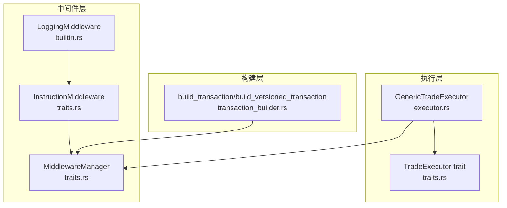
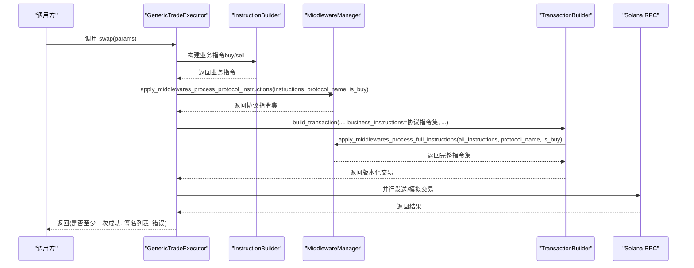
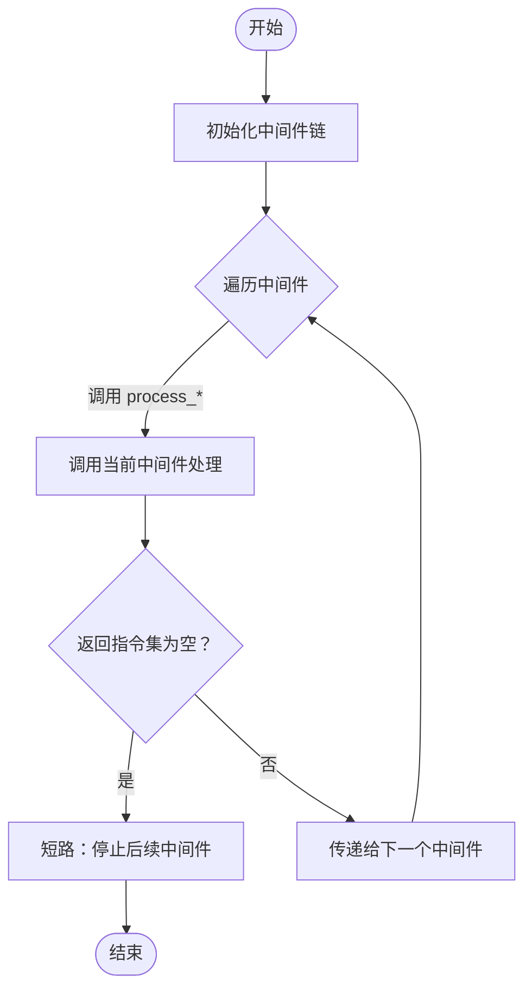
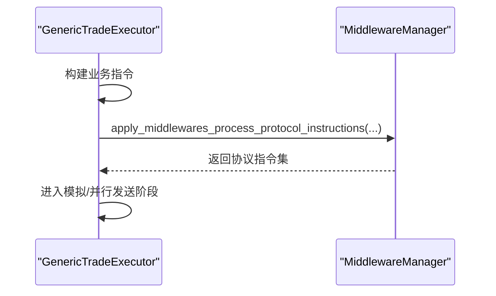
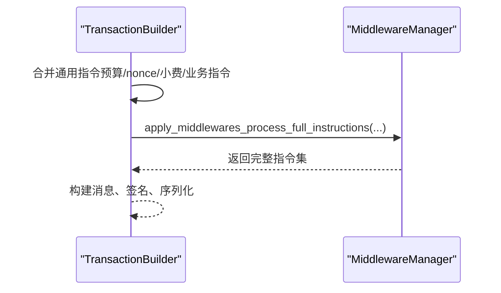
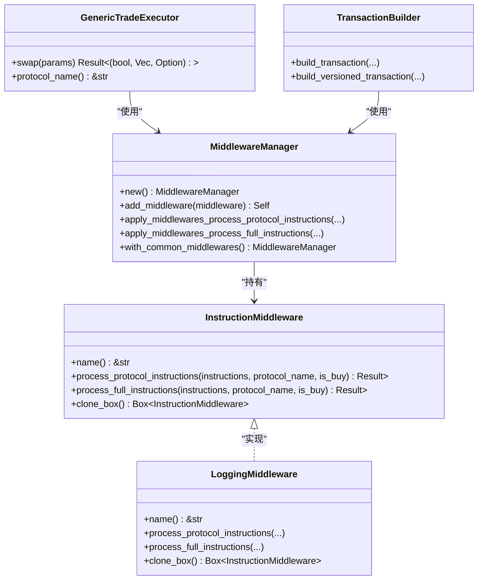

# 中间件接口设计

<cite>
**本文引用的文件**
- [src/trading/middleware/traits.rs](file://src/trading/middleware/traits.rs)
- [src/trading/middleware/builtin.rs](file://src/trading/middleware/builtin.rs)
- [src/trading/middleware/mod.rs](file://src/trading/middleware/mod.rs)
- [src/trading/core/executor.rs](file://src/trading/core/executor.rs)
- [src/trading/common/transaction_builder.rs](file://src/trading/common/transaction_builder.rs)
- [src/trading/core/traits.rs](file://src/trading/core/traits.rs)
- [examples/middleware_system/src/main.rs](file://examples/middleware_system/src/main.rs)
</cite>

## 目录
1. [简介](#简介)
2. [项目结构](#项目结构)
3. [核心组件](#核心组件)
4. [架构总览](#架构总览)
5. [详细组件分析](#详细组件分析)
6. [依赖关系分析](#依赖关系分析)
7. [性能考量](#性能考量)
8. [故障排查指南](#故障排查指南)
9. [结论](#结论)
10. [附录](#附录)

## 简介
本文件围绕 Trading 子系统的中间件接口设计进行系统化文档化，重点解释 InstructionMiddleware trait 的职责边界、参数语义与返回值对交易流程的影响；并结合代码路径说明中间件在执行器与交易构建器中的调用时机与责任链集成方式。同时给出错误处理建议、异步调用注意事项及常见实现误区提示，帮助开发者正确实现与扩展中间件能力。

## 项目结构
中间件相关代码位于 trading/middleware 目录，核心接口与管理器定义于 traits.rs，内置日志中间件定义于 builtin.rs；执行器在 core/executor.rs 中消费中间件管理器，交易构建器在 common/transaction_builder.rs 中对“完整指令集”进行二次中间件处理。

图表来源
- [src/trading/middleware/traits.rs](file://src/trading/middleware/traits.rs#L1-L116)
- [src/trading/middleware/builtin.rs](file://src/trading/middleware/builtin.rs#L1-L54)
- [src/trading/core/executor.rs](file://src/trading/core/executor.rs#L45-L177)
- [src/trading/common/transaction_builder.rs](file://src/trading/common/transaction_builder.rs#L1-L122)
- [src/trading/core/traits.rs](file://src/trading/core/traits.rs#L1-L26)

章节来源
- [src/trading/middleware/traits.rs](file://src/trading/middleware/traits.rs#L1-L116)
- [src/trading/middleware/builtin.rs](file://src/trading/middleware/builtin.rs#L1-L54)
- [src/trading/core/executor.rs](file://src/trading/core/executor.rs#L45-L177)
- [src/trading/common/transaction_builder.rs](file://src/trading/common/transaction_builder.rs#L1-L122)
- [src/trading/core/traits.rs](file://src/trading/core/traits.rs#L1-L26)

## 核心组件
- InstructionMiddleware trait：定义中间件可扩展点，包含两个核心处理方法：
  - process_protocol_instructions：对“协议指令集”进行处理
  - process_full_instructions：对“完整指令集”（含计算预算、持久化 nonce、小费等）进行处理
- MiddlewareManager：负责维护中间件列表并按顺序串联调用，形成责任链；提供两种 apply 方法分别对应上述两类指令集。
- 内置 LoggingMiddleware：演示如何实现 InstructionMiddleware，打印指令信息，便于调试与审计。

章节来源
- [src/trading/middleware/traits.rs](file://src/trading/middleware/traits.rs#L1-L116)
- [src/trading/middleware/builtin.rs](file://src/trading/middleware/builtin.rs#L1-L54)

## 架构总览
中间件在交易生命周期中的调用位置如下：
- 协议指令阶段：在执行器构建完业务指令后，进入中间件处理，得到“协议指令集”的最终形态。
- 完整指令阶段：在交易构建器中，将计算预算、nonce、小费等通用指令与业务指令合并后，再次进入中间件处理，得到“完整指令集”。

图表来源
- [src/trading/core/executor.rs](file://src/trading/core/executor.rs#L45-L177)
- [src/trading/common/transaction_builder.rs](file://src/trading/common/transaction_builder.rs#L1-L122)
- [src/trading/middleware/traits.rs](file://src/trading/middleware/traits.rs#L71-L115)

## 详细组件分析

### InstructionMiddleware 接口与参数语义
- 名称与克隆
  - name：返回中间件标识字符串，便于日志与调试。
  - clone_box：返回动态分发的克隆实例，保证中间件可在管理器中安全复制与重用。
- 处理方法
  - process_protocol_instructions：
    - 输入：当前协议指令集、协议名称、是否为买入交易
    - 输出：处理后的协议指令集
    - 作用：允许中间件对“仅业务逻辑”的指令集合进行增删改，例如注入/移除特定程序调用、调整账户顺序、插入前置/后置指令等。
  - process_full_instructions：
    - 输入：完整指令集（已包含计算预算、nonce、小费等通用指令）、协议名称、是否为买入交易
    - 输出：处理后的完整指令集
    - 作用：允许中间件对“最终将要签名并提交”的指令集合进行最终审查与调整，例如插入额外的安全检查、审计指令或根据 is_buy 动态调整策略。

返回值与错误传播
- 两者均返回 Result<Vec<Instruction>>，若中间件返回空指令集，责任链会提前终止后续中间件调用，从而实现“短路式拦截”。
- 任何中间件抛出错误都会中断后续中间件执行，最终由调用方捕获并记录。

章节来源
- [src/trading/middleware/traits.rs](file://src/trading/middleware/traits.rs#L1-L116)

### MiddlewareManager 责任链模式
- 维护中间件列表，按添加顺序依次调用。
- 提供两个 apply 方法：
  - apply_middlewares_process_protocol_instructions：对“协议指令集”逐个中间件处理。
  - apply_middlewares_process_full_instructions：对“完整指令集”逐个中间件处理。
- 当某中间件返回空指令集时，立即停止后续中间件调用，避免无效链路。

图表来源
- [src/trading/middleware/traits.rs](file://src/trading/middleware/traits.rs#L71-L115)

章节来源
- [src/trading/middleware/traits.rs](file://src/trading/middleware/traits.rs#L47-L115)

### 内置 LoggingMiddleware 实现
- 作为示例中间件，打印当前中间件名称、指令数量、协议名称、是否买入，以及每条指令的基本信息，便于开发调试。
- 实现了 InstructionMiddleware 的三个方法：name、process_protocol_instructions、process_full_instructions、clone_box。

章节来源
- [src/trading/middleware/builtin.rs](file://src/trading/middleware/builtin.rs#L1-L54)

### 与执行器的集成（GenericTradeExecutor）
- 在执行器构建业务指令后，先对“协议指令集”进行中间件处理，再进入交易构建阶段。
- 若 params.middleware_manager 为 None，则跳过中间件处理，直接使用原始指令集。
- 执行器还支持模拟模式，其中同样会将“完整指令集”传入中间件处理后再进行模拟。

图表来源
- [src/trading/core/executor.rs](file://src/trading/core/executor.rs#L45-L177)

章节来源
- [src/trading/core/executor.rs](file://src/trading/core/executor.rs#L45-L177)

### 与交易构建器的集成（TransactionBuilder）
- 交易构建器在完成计算预算、nonce、小费等通用指令拼接后，对“完整指令集”再次进行中间件处理，确保最终交易包含所有必要元指令且满足中间件策略。
- 构建完成后进行签名与序列化，随后进入执行器的发送/模拟流程。

图表来源
- [src/trading/common/transaction_builder.rs](file://src/trading/common/transaction_builder.rs#L83-L122)

章节来源
- [src/trading/common/transaction_builder.rs](file://src/trading/common/transaction_builder.rs#L1-L122)

### 示例：自定义中间件实现
- 示例工程展示了如何实现 InstructionMiddleware，并通过 MiddlewareManager 注册到客户端，随后在交易过程中生效。
- 可参考示例中的 CustomMiddleware 实现，按需在 process_protocol_instructions 或 process_full_instructions 中进行指令修改。

章节来源
- [examples/middleware_system/src/main.rs](file://examples/middleware_system/src/main.rs#L1-L110)

## 依赖关系分析
- 接口与实现
  - InstructionMiddleware 是 trait，具体实现（如 LoggingMiddleware）遵循该接口。
  - MiddlewareManager 通过动态分发持有多个 InstructionMiddleware 实例，形成可插拔的中间件体系。
- 执行器与构建器
  - GenericTradeExecutor 在“协议指令阶段”调用 MiddlewareManager 的协议指令处理方法。
  - TransactionBuilder 在“完整指令阶段”调用 MiddlewareManager 的完整指令处理方法。
- 与执行器接口的关系
  - TradeExecutor 定义了 swap 的统一入口，中间件集成不改变执行器对外契约。

图表来源
- [src/trading/middleware/traits.rs](file://src/trading/middleware/traits.rs#L1-L116)
- [src/trading/middleware/builtin.rs](file://src/trading/middleware/builtin.rs#L1-L54)
- [src/trading/core/executor.rs](file://src/trading/core/executor.rs#L45-L177)
- [src/trading/common/transaction_builder.rs](file://src/trading/common/transaction_builder.rs#L1-L122)

章节来源
- [src/trading/middleware/traits.rs](file://src/trading/middleware/traits.rs#L1-L116)
- [src/trading/middleware/builtin.rs](file://src/trading/middleware/builtin.rs#L1-L54)
- [src/trading/core/executor.rs](file://src/trading/core/executor.rs#L45-L177)
- [src/trading/common/transaction_builder.rs](file://src/trading/common/transaction_builder.rs#L1-L122)

## 性能考量
- 责任链开销：中间件数量与处理复杂度直接影响指令构建与发送的总耗时。建议：
  - 将昂贵操作（如网络请求、磁盘 IO）放在非关键路径或缓存命中分支。
  - 避免在中间件中进行大规模数据拷贝，优先采用就地修改或共享所有权。
- 短路优化：当中间件返回空指令集时，后续中间件不再执行，可利用此特性快速拦截无效交易。
- 异步与并发：中间件本身应保持无阻塞，避免阻塞主线程或交易构建关键路径。

[本节为通用性能建议，无需特定文件引用]

## 故障排查指南
- 常见错误类型
  - 中间件返回空指令集导致交易被提前拦截：检查中间件逻辑是否误判或条件触发不当。
  - 中间件抛错导致交易失败：确认中间件内部错误处理与日志输出，定位具体中间件与指令索引。
  - 指令顺序错误：在 process_protocol_instructions 或 process_full_instructions 中插入指令时注意顺序一致性。
- 日志与调试
  - 使用内置 LoggingMiddleware 快速验证中间件链是否生效、指令数量与内容是否符合预期。
  - 结合执行器与构建器中的时间统计输出，定位中间件处理耗时占比。
- 异步调用注意事项
  - 避免在中间件中进行同步阻塞调用（如长耗时网络请求），应在异步环境中完成或使用缓存。
  - 若需要外部服务校验，建议在构建阶段预取并缓存结果，减少运行时等待。
- 常见实现误区
  - 修改关键交易字段：不要在中间件中随意更改 payer、recent_blockhash、nonce 等关键字段，这些由执行器与构建器统一管理。
  - 阻塞主线程：避免在中间件中执行 CPU 密集型任务或同步 IO，影响交易吞吐。
  - 忽视 is_buy 参数：根据 is_buy 分支处理不同策略，避免对买入/卖出路径一视同仁造成错误行为。
  - 不必要的指令删除：删除指令需谨慎，确保不会破坏协议原子性或导致交易失败。

章节来源
- [src/trading/middleware/builtin.rs](file://src/trading/middleware/builtin.rs#L1-L54)
- [src/trading/core/executor.rs](file://src/trading/core/executor.rs#L45-L177)
- [src/trading/common/transaction_builder.rs](file://src/trading/common/transaction_builder.rs#L1-L122)

## 结论
InstructionMiddleware 通过“协议指令集”和“完整指令集”两阶段处理，为交易流程提供了强大的可扩展点。MiddlewareManager 以责任链模式串联中间件，既保证了灵活性，又维持了清晰的调用边界。结合执行器与交易构建器的集成，中间件可以在不影响执行器契约的前提下，对指令进行精细化控制与增强。实践中应重视异步与性能、错误处理与日志输出，并避免常见实现误区，以确保中间件体系稳定可靠。

[本节为总结性内容，无需特定文件引用]

## 附录
- 关键调用路径参考
  - 协议指令阶段：[src/trading/core/executor.rs](file://src/trading/core/executor.rs#L69-L77)
  - 完整指令阶段：[src/trading/common/transaction_builder.rs](file://src/trading/common/transaction_builder.rs#L93-L101)
  - 中间件接口定义：[src/trading/middleware/traits.rs](file://src/trading/middleware/traits.rs#L1-L46)
  - 内置中间件示例：[src/trading/middleware/builtin.rs](file://src/trading/middleware/builtin.rs#L1-L54)
  - 示例工程实现：[examples/middleware_system/src/main.rs](file://examples/middleware_system/src/main.rs#L1-L110)