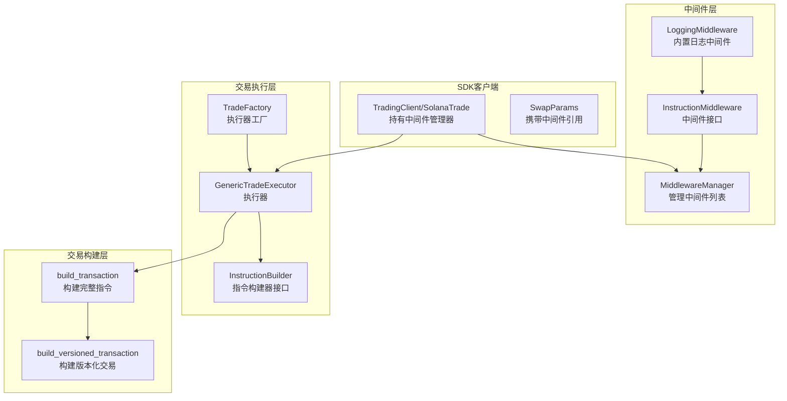
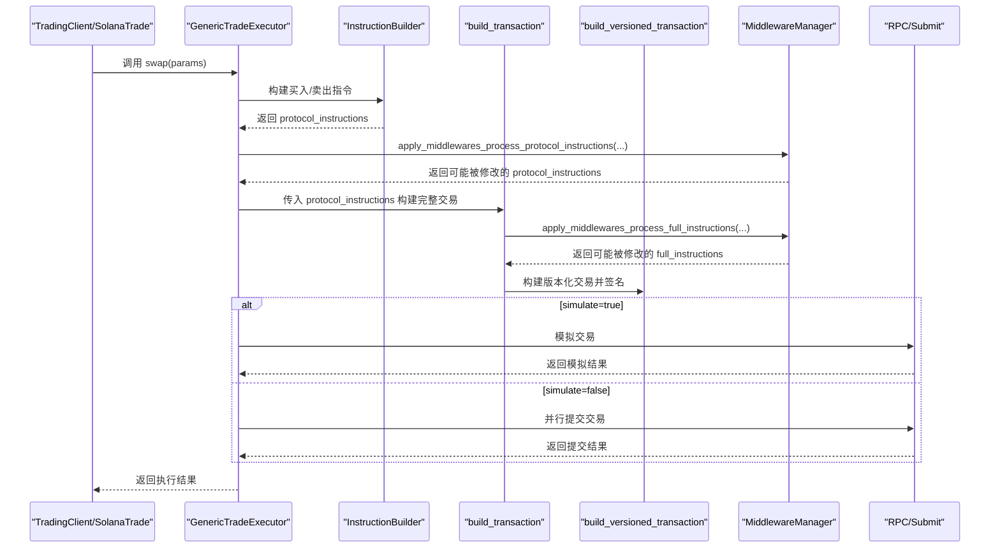
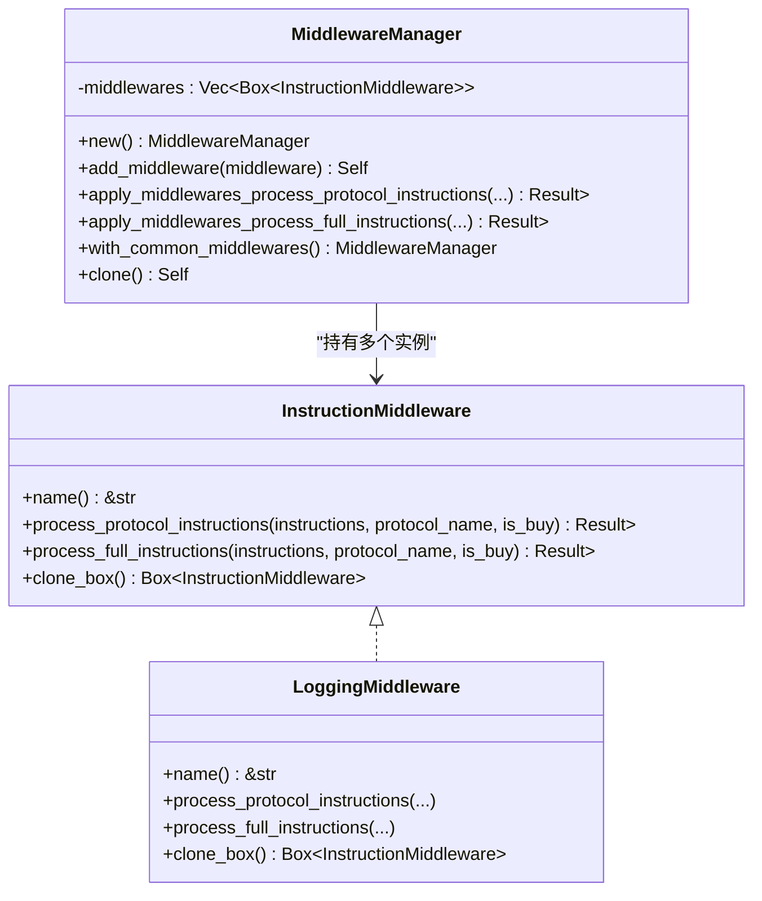
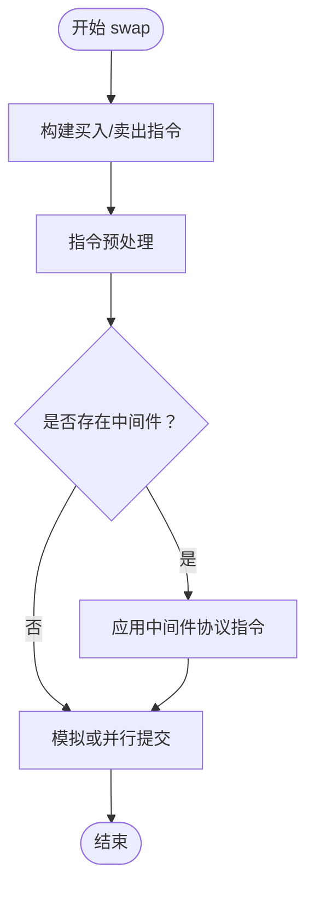
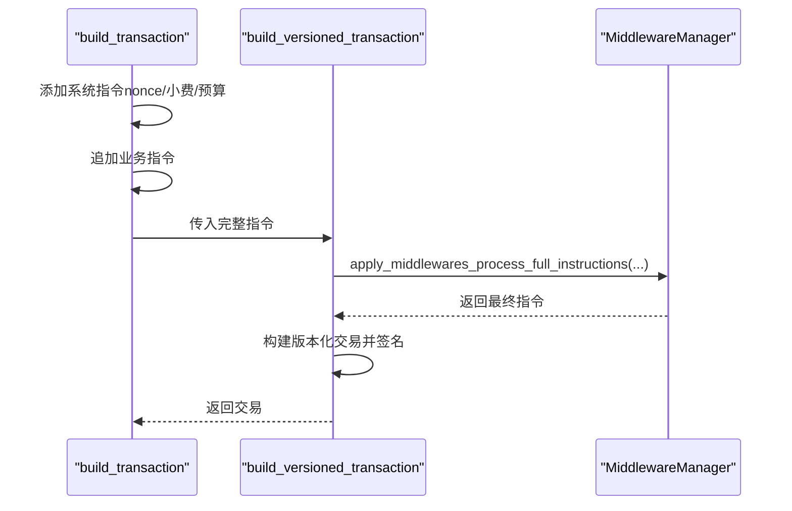
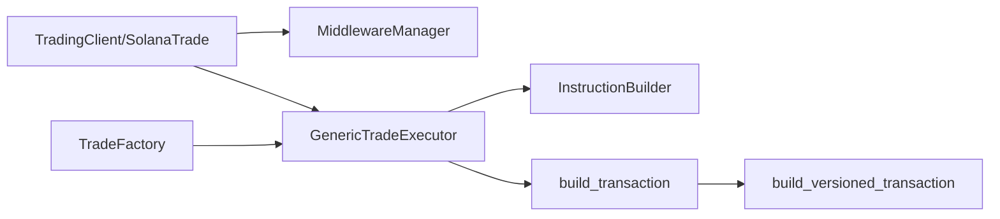

# 中间件系统

<cite>
**本文引用的文件**
- [src/trading/middleware/mod.rs](file://src/trading/middleware/mod.rs)
- [src/trading/middleware/traits.rs](file://src/trading/middleware/traits.rs)
- [src/trading/middleware/builtin.rs](file://src/trading/middleware/builtin.rs)
- [src/trading/core/executor.rs](file://src/trading/core/executor.rs)
- [src/trading/common/transaction_builder.rs](file://src/trading/common/transaction_builder.rs)
- [src/trading/core/traits.rs](file://src/trading/core/traits.rs)
- [src/trading/factory.rs](file://src/trading/factory.rs)
- [src/lib.rs](file://src/lib.rs)
- [examples/middleware_system/src/main.rs](file://examples/middleware_system/src/main.rs)
</cite>

## 目录
1. [简介](#简介)
2. [项目结构](#项目结构)
3. [核心组件](#核心组件)
4. [架构总览](#架构总览)
5. [详细组件分析](#详细组件分析)
6. [依赖关系分析](#依赖关系分析)
7. [性能考量](#性能考量)
8. [故障排查指南](#故障排查指南)
9. [结论](#结论)
10. [附录](#附录)

## 简介
本章节系统性地文档化 sol-trade-sdk 的中间件系统，重点说明如何在交易执行流程中插入自定义逻辑。中间件系统提供两个关键扩展点：
- 协议指令阶段：在业务指令构建完成后、提交前，对“仅协议相关指令”进行修改或过滤。
- 完整指令阶段：在业务指令与系统指令（计算预算、小费等）合并后，对“完整交易指令”进行修改或过滤。

通过 MiddlewareManager 和 InstructionMiddleware 接口，开发者可以注册任意数量的中间件，并以链式顺序依次应用。内置中间件 LoggingMiddleware 提供日志输出能力；示例工程展示了如何实现自定义中间件以完成价格检查或失败重试等业务需求。中间件与 TransactionBuilder、Executor 协同工作，贯穿交易构建与提交的全生命周期。

## 项目结构
中间件系统位于 trading 子模块下，核心文件如下：
- 接口与管理器：src/trading/middleware/traits.rs
- 中间件导出入口：src/trading/middleware/mod.rs
- 内置中间件：src/trading/middleware/builtin.rs
- 交易执行器：src/trading/core/executor.rs
- 交易构建器：src/trading/common/transaction_builder.rs
- 交易工厂与执行器接口：src/trading/factory.rs, src/trading/core/traits.rs
- SDK 客户端与参数：src/lib.rs
- 示例：examples/middleware_system/src/main.rs

图表来源
- [src/trading/middleware/mod.rs](file://src/trading/middleware/mod.rs#L1-L5)
- [src/trading/middleware/traits.rs](file://src/trading/middleware/traits.rs#L1-L116)
- [src/trading/middleware/builtin.rs](file://src/trading/middleware/builtin.rs#L1-L54)
- [src/trading/core/executor.rs](file://src/trading/core/executor.rs#L45-L177)
- [src/trading/common/transaction_builder.rs](file://src/trading/common/transaction_builder.rs#L18-L122)
- [src/trading/factory.rs](file://src/trading/factory.rs#L1-L99)
- [src/lib.rs](file://src/lib.rs#L40-L83)

章节来源
- [src/trading/middleware/mod.rs](file://src/trading/middleware/mod.rs#L1-L5)
- [src/trading/middleware/traits.rs](file://src/trading/middleware/traits.rs#L1-L116)
- [src/trading/middleware/builtin.rs](file://src/trading/middleware/builtin.rs#L1-L54)
- [src/trading/core/executor.rs](file://src/trading/core/executor.rs#L45-L177)
- [src/trading/common/transaction_builder.rs](file://src/trading/common/transaction_builder.rs#L18-L122)
- [src/trading/factory.rs](file://src/trading/factory.rs#L1-L99)
- [src/lib.rs](file://src/lib.rs#L40-L83)

## 核心组件
- InstructionMiddleware 接口：定义中间件必须实现的方法，包括名称标识、对“协议指令”和“完整指令”的处理方法，以及克隆接口。
- MiddlewareManager：负责维护中间件列表，提供添加中间件、按序应用“协议指令”和“完整指令”处理的能力，并提供常用中间件的便捷构造。
- LoggingMiddleware：内置日志中间件，打印当前中间件名称、协议名、是否为买入、指令数量及每条指令摘要。
- GenericTradeExecutor：通用执行器，负责构建指令、预处理、应用中间件、模拟或并行提交交易。
- build_transaction/build_versioned_transaction：交易构建器，负责将系统指令（计算预算、小费、nonce等）与业务指令合并，并在完整指令阶段应用中间件。
- TradingClient/SolanaTrade：SDK 客户端，可附加 MiddlewareManager，并将其传递给执行器与构建器。
- TradeFactory：根据 DEX 类型创建对应的执行器实例，避免运行时开销。

章节来源
- [src/trading/middleware/traits.rs](file://src/trading/middleware/traits.rs#L1-L116)
- [src/trading/middleware/builtin.rs](file://src/trading/middleware/builtin.rs#L1-L54)
- [src/trading/core/executor.rs](file://src/trading/core/executor.rs#L45-L177)
- [src/trading/common/transaction_builder.rs](file://src/trading/common/transaction_builder.rs#L18-L122)
- [src/lib.rs](file://src/lib.rs#L40-L83)
- [src/trading/factory.rs](file://src/trading/factory.rs#L1-L99)

## 架构总览
中间件系统贯穿交易生命周期的关键节点：
- 指令构建阶段：由 InstructionBuilder 产出“协议指令”，随后进入中间件处理。
- 协议指令阶段：对“仅协议指令”进行处理，适合做协议级校验、增强或裁剪。
- 完整指令阶段：在“系统指令+业务指令”合并后，对“完整交易指令”进行处理，适合做全局性调整（如注入延迟、风控拦截）。
- 执行阶段：执行器决定是否模拟或真实提交，中间件在两种路径均生效。
- 构建阶段：构建器在完整指令阶段再次应用中间件，确保最终交易消息符合预期。

图表来源
- [src/trading/core/executor.rs](file://src/trading/core/executor.rs#L45-L177)
- [src/trading/common/transaction_builder.rs](file://src/trading/common/transaction_builder.rs#L18-L122)
- [src/trading/middleware/traits.rs](file://src/trading/middleware/traits.rs#L60-L116)

## 详细组件分析

### 接口与管理器：InstructionMiddleware 与 MiddlewareManager
- InstructionMiddleware
  - name：中间件标识，便于日志与调试。
  - process_protocol_instructions：对“仅协议指令”进行处理，返回修改后的指令列表；若返回空列表则中断后续中间件执行。
  - process_full_instructions：对“完整指令”进行处理，同样支持中断。
  - clone_box：支持克隆中间件实例，便于复制到新的管理器或线程安全使用。
- MiddlewareManager
  - add_middleware：向管理器追加中间件。
  - apply_middlewares_process_protocol_instructions：按注册顺序依次应用中间件于“协议指令”。
  - apply_middlewares_process_full_instructions：按注册顺序依次应用中间件于“完整指令”。
  - with_common_middlewares：提供常用中间件的便捷构造（例如内置日志中间件）。

图表来源
- [src/trading/middleware/traits.rs](file://src/trading/middleware/traits.rs#L1-L116)
- [src/trading/middleware/builtin.rs](file://src/trading/middleware/builtin.rs#L1-L54)

章节来源
- [src/trading/middleware/traits.rs](file://src/trading/middleware/traits.rs#L1-L116)
- [src/trading/middleware/builtin.rs](file://src/trading/middleware/builtin.rs#L1-L54)

### 内置中间件：LoggingMiddleware
- 功能：在“协议指令”和“完整指令”处理前后打印中间件名称、协议名、是否买入、指令数量及每条指令摘要，便于调试与审计。
- 适用场景：开发期调试、风控规则可视化、合规日志记录。

章节来源
- [src/trading/middleware/builtin.rs](file://src/trading/middleware/builtin.rs#L1-L54)

### 执行器：GenericTradeExecutor
- 流程要点：
  - 根据交易类型判断是否为买入，分别构建买入或卖出指令。
  - 对指令进行预处理。
  - 若存在中间件，则在“协议指令”阶段应用中间件处理。
  - 在模拟模式下，使用 RPC 模拟交易；否则并行提交至 SWQOS 客户端。
  - 记录构建、提交前、模拟/提交耗时，便于性能分析。
- 关键交互：
  - 从 SwapParams 读取 middleware_manager 引用，决定是否应用中间件。
  - 将中间件应用于协议指令阶段。

图表来源
- [src/trading/core/executor.rs](file://src/trading/core/executor.rs#L45-L177)

章节来源
- [src/trading/core/executor.rs](file://src/trading/core/executor.rs#L45-L177)

### 交易构建器：build_transaction 与 build_versioned_transaction
- build_transaction：
  - 组装系统指令：nonce、小费转账、计算预算指令。
  - 追加业务指令（协议指令）。
  - 获取区块哈希，调用 build_versioned_transaction。
- build_versioned_transaction：
  - 在完整指令阶段应用中间件（process_full_instructions），得到最终指令序列。
  - 使用预分配的交易构建器零拷贝构建版本化交易消息并签名。
  - 归还构建器到池，降低延迟。

图表来源
- [src/trading/common/transaction_builder.rs](file://src/trading/common/transaction_builder.rs#L18-L122)

章节来源
- [src/trading/common/transaction_builder.rs](file://src/trading/common/transaction_builder.rs#L18-L122)

### SDK 客户端与参数：TradingClient/SolanaTrade、SwapParams
- TradingClient/SolanaTrade：
  - 持有 middleware_manager 字段，可通过 with_middleware_manager 注入中间件。
  - 在 buy/sell 构造 SwapParams 时，将 middleware_manager 透传给执行器与构建器。
- SwapParams：
  - 包含 middleware_manager 字段，作为执行器与构建器的输入来源。

章节来源
- [src/lib.rs](file://src/lib.rs#L40-L83)
- [src/lib.rs](file://src/lib.rs#L280-L320)
- [src/lib.rs](file://src/lib.rs#L396-L428)
- [src/lib.rs](file://src/lib.rs#L511-L543)

### 执行器工厂与接口：TradeFactory、InstructionBuilder、TradeExecutor
- TradeFactory：根据 DEX 类型创建对应执行器实例，采用静态懒加载实现零开销单例。
- InstructionBuilder：定义构建买入/卖出指令的异步接口。
- TradeExecutor：统一的交易执行接口，swap 返回成功标志、签名列表与错误信息。

章节来源
- [src/trading/factory.rs](file://src/trading/factory.rs#L1-L99)
- [src/trading/core/traits.rs](file://src/trading/core/traits.rs#L1-L26)

### 示例：自定义中间件与注册
- 示例工程展示了如何实现自定义中间件（实现 InstructionMiddleware），并通过 MiddlewareManager.add_middleware 注册，再通过 TradingClient.with_middleware_manager 应用到 SDK 客户端。
- 示例中还演示了如何使用内置 LoggingMiddleware 作为参考，以及如何在 buy 流程中使用中间件。

章节来源
- [examples/middleware_system/src/main.rs](file://examples/middleware_system/src/main.rs#L1-L110)

## 依赖关系分析
- 组件耦合与协作：
  - TradingClient/SolanaTrade 与 MiddlewareManager：客户端持有中间件管理器引用，并在交易参数中传递。
  - GenericTradeExecutor 与 MiddlewareManager：执行器在协议指令阶段应用中间件。
  - build_transaction/build_versioned_transaction 与 MiddlewareManager：在完整指令阶段应用中间件。
  - TradeFactory 与 GenericTradeExecutor：工厂创建执行器实例，执行器负责调度指令构建与中间件应用。
- 外部依赖：
  - solana_sdk 的 Instruction、Message、VersionedTransaction 等类型。
  - 交易构建器依赖 compute budget、nonce、tip 等系统指令生成工具。
- 循环依赖：
  - 无循环依赖，模块边界清晰：middleware 与 core、common 解耦。

图表来源
- [src/lib.rs](file://src/lib.rs#L40-L83)
- [src/trading/core/executor.rs](file://src/trading/core/executor.rs#L45-L177)
- [src/trading/common/transaction_builder.rs](file://src/trading/common/transaction_builder.rs#L18-L122)
- [src/trading/factory.rs](file://src/trading/factory.rs#L1-L99)

章节来源
- [src/lib.rs](file://src/lib.rs#L40-L83)
- [src/trading/core/executor.rs](file://src/trading/core/executor.rs#L45-L177)
- [src/trading/common/transaction_builder.rs](file://src/trading/common/transaction_builder.rs#L18-L122)
- [src/trading/factory.rs](file://src/trading/factory.rs#L1-L99)

## 性能考量
- 中间件执行顺序：中间件按注册顺序依次执行，尽早返回空指令可提前短路，减少后续处理成本。
- 完整指令阶段：在构建器内部应用中间件，避免重复遍历；同时使用预分配构建器与零拷贝序列化，降低内存与 CPU 开销。
- 执行器路径：模拟与真实提交两条路径均应用中间件，确保行为一致性。
- 建议：
  - 将轻量逻辑放在“协议指令”阶段，减少完整指令阶段的处理压力。
  - 控制中间件数量与复杂度，避免在高频交易路径上引入额外开销。
  - 使用内置 LoggingMiddleware 辅助定位性能瓶颈与异常路径。

[本节为通用性能建议，不直接分析具体文件]

## 故障排查指南
- 中间件未生效
  - 确认已通过 with_middleware_manager 注入 MiddlewareManager，并在 buy/sell 参数中正确传递。
  - 检查中间件是否在某一步返回空指令导致后续中间件被跳过。
- 日志定位
  - 使用内置 LoggingMiddleware 输出中间件名称、协议名、是否买入、指令数量与每条指令摘要，辅助定位问题。
- 模拟与提交差异
  - 在模拟模式下，中间件同样参与处理；若模拟失败而真实提交成功，需检查中间件对完整指令的修改是否影响提交路径。
- 性能异常
  - 关注中间件数量与复杂度；必要时拆分中间件职责，或在“协议指令”阶段完成轻量处理。

章节来源
- [src/trading/middleware/builtin.rs](file://src/trading/middleware/builtin.rs#L1-L54)
- [src/trading/middleware/traits.rs](file://src/trading/middleware/traits.rs#L60-L116)
- [src/trading/core/executor.rs](file://src/trading/core/executor.rs#L45-L177)
- [src/trading/common/transaction_builder.rs](file://src/trading/common/transaction_builder.rs#L18-L122)

## 结论
中间件系统为 sol-trade-sdk 提供了强大的可扩展性：开发者可在“协议指令”和“完整指令”两个关键节点插入自定义逻辑，实现日志、风控、延迟注入、失败重试等多样化需求。通过 MiddlewareManager 的链式应用与 TradingClient 的无缝集成，中间件与执行器、构建器协同工作，既保证了灵活性，又兼顾了性能与一致性。该系统在构建复杂交易策略与风控机制方面具有显著价值。

[本节为总结性内容，不直接分析具体文件]

## 附录

### 中间件注册与执行顺序
- 注册：通过 MiddlewareManager.add_middleware 添加中间件；也可使用 with_common_middlewares 快速启用常用中间件。
- 执行顺序：严格遵循注册顺序；若中间件返回空指令，后续中间件将被跳过。
- 应用位置：
  - 协议指令阶段：GenericTradeExecutor 在构建完成后、提交前应用中间件。
  - 完整指令阶段：build_transaction/build_versioned_transaction 在系统指令与业务指令合并后应用中间件。

章节来源
- [src/trading/middleware/traits.rs](file://src/trading/middleware/traits.rs#L60-L116)
- [src/trading/core/executor.rs](file://src/trading/core/executor.rs#L45-L177)
- [src/trading/common/transaction_builder.rs](file://src/trading/common/transaction_builder.rs#L18-L122)

### 自定义中间件示例路径
- 实现自定义中间件：参考 examples/middleware_system/src/main.rs 中的 CustomMiddleware 实现。
- 注册与使用：参考 examples/middleware_system/src/main.rs 中的 with_middleware_manager 与 buy 调用。

章节来源
- [examples/middleware_system/src/main.rs](file://examples/middleware_system/src/main.rs#L1-L110)