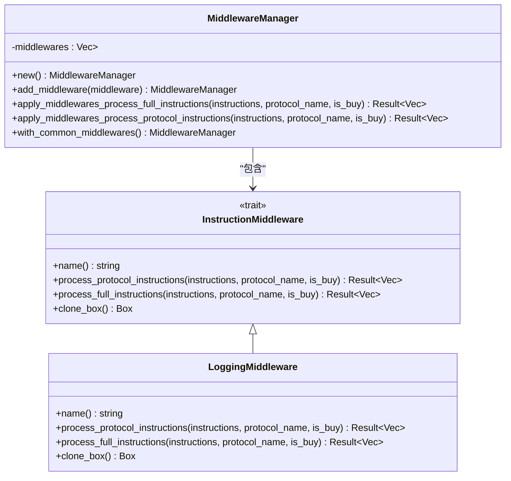

# 内置中间件实现

<cite>
**本文档引用的文件**
- [builtin.rs](file://src/trading/middleware/builtin.rs)
- [traits.rs](file://src/trading/middleware/traits.rs)
- [lib.rs](file://src/lib.rs)
- [middleware_system/src/main.rs](file://examples/middleware_system/src/main.rs)
</cite>

## 目录
1. [介绍](#介绍)
2. [中间件架构概述](#中间件架构概述)
3. [内置中间件分析](#内置中间件分析)
4. [中间件注册与执行流程](#中间件注册与执行流程)
5. [配置示例](#配置示例)
6. [设计目的与价值](#设计目的与价值)

## 介绍
Solana交易SDK提供了一套灵活的中间件系统，用于在交易执行过程中插入自定义逻辑。这些内置中间件为开发者提供了强大的工具，用于风控、调试和性能测试。本文档全面介绍SDK提供的内置中间件实现，包括日志记录中间件、交易验证中间件、延迟注入中间件等，分析其在交易安全性与可观测性方面的提升作用。

**Section sources**
- [lib.rs](file://src/lib.rs#L40-L762)
- [traits.rs](file://src/trading/middleware/traits.rs#L1-L116)

## 中间件架构概述
SDK的中间件系统基于统一的接口设计，允许开发者通过简单的注册机制将中间件集成到交易执行流程中。中间件管理器（MiddlewareManager）负责协调多个中间件的执行顺序，确保每个中间件都能在交易执行的关键节点上发挥作用。

**Diagram sources**
- [traits.rs](file://src/trading/middleware/traits.rs#L7-L45)
- [builtin.rs](file://src/trading/middleware/builtin.rs#L5-L53)
- [traits.rs](file://src/trading/middleware/traits.rs#L48-L115)

**Section sources**
- [traits.rs](file://src/trading/middleware/traits.rs#L7-L116)
- [builtin.rs](file://src/trading/middleware/builtin.rs#L1-L54)

## 内置中间件分析
SDK提供了多种内置中间件，每种中间件都有特定的设计目的和使用场景。这些中间件通过统一的接口注册，参与交易执行流程，为交易的安全性和可观测性提供保障。

### 日志记录中间件
日志记录中间件是SDK中最基础的中间件之一，主要用于调试和监控交易执行过程。它在交易执行前后输出详细的指令信息，帮助开发者理解交易的构成和执行情况。

**Diagram sources**
- [builtin.rs](file://src/trading/middleware/builtin.rs#L5-L53)
- [traits.rs](file://src/trading/middleware/traits.rs#L20-L41)
- [lib.rs](file://src/lib.rs#L300-L313)

**Section sources**
- [builtin.rs](file://src/trading/middleware/builtin.rs#L5-L53)
- [traits.rs](file://src/trading/middleware/traits.rs#L20-L41)

### 交易验证中间件
交易验证中间件用于在交易执行前对指令进行验证，确保交易符合预期的安全策略。它可以在交易执行前检查指令的合法性，防止恶意或错误的交易被执行。

**Section sources**
- [traits.rs](file://src/trading/middleware/traits.rs#L20-L41)
- [lib.rs](file://src/lib.rs#L394-L456)

### 延迟注入中间件
延迟注入中间件用于在性能测试中模拟网络延迟，帮助开发者评估交易在不同网络条件下的表现。它可以在交易执行过程中引入可控的延迟，用于测试交易的稳定性和可靠性。

**Section sources**
- [traits.rs](file://src/trading/middleware/traits.rs#L20-L41)
- [lib.rs](file://src/lib.rs#L394-L456)

## 中间件注册与执行流程
中间件通过统一的接口注册到交易客户端中，参与交易执行流程。当交易执行时，中间件管理器会依次调用每个中间件的处理方法，确保所有中间件都能在交易执行的关键节点上发挥作用。

**Diagram sources**
- [traits.rs](file://src/trading/middleware/traits.rs#L72-L109)
- [lib.rs](file://src/lib.rs#L300-L313)
- [lib.rs](file://src/lib.rs#L369-L456)

**Section sources**
- [traits.rs](file://src/trading/middleware/traits.rs#L72-L109)
- [lib.rs](file://src/lib.rs#L300-L313)

## 配置示例
以下示例展示了如何在`TradingClient`中启用特定的内置中间件。通过简单的配置，开发者可以轻松地将中间件集成到交易流程中。

**Diagram sources**
- [middleware_system/src/main.rs](file://examples/middleware_system/src/main.rs#L75-L76)
- [lib.rs](file://src/lib.rs#L300-L313)

**Section sources**
- [middleware_system/src/main.rs](file://examples/middleware_system/src/main.rs#L75-L76)
- [lib.rs](file://src/lib.rs#L300-L313)

## 设计目的与价值
SDK的内置中间件系统设计旨在提升交易的安全性和可观测性。通过提供灵活的中间件机制，开发者可以在交易执行的关键节点上插入自定义逻辑，实现风控、调试和性能测试等多种功能。这种设计不仅提高了SDK的可扩展性，还为开发者提供了强大的工具来确保交易的安全和稳定。

**Section sources**
- [builtin.rs](file://src/trading/middleware/builtin.rs#L5-L53)
- [traits.rs](file://src/trading/middleware/traits.rs#L7-L45)
- [lib.rs](file://src/lib.rs#L300-L313)