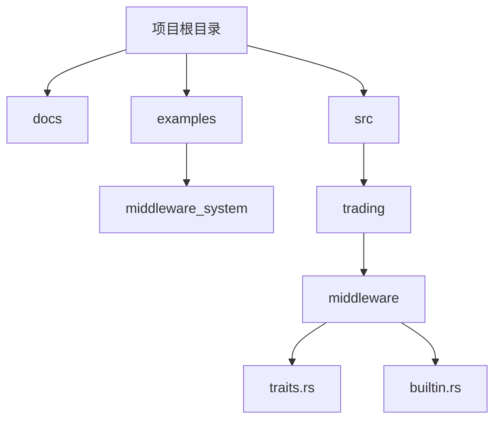
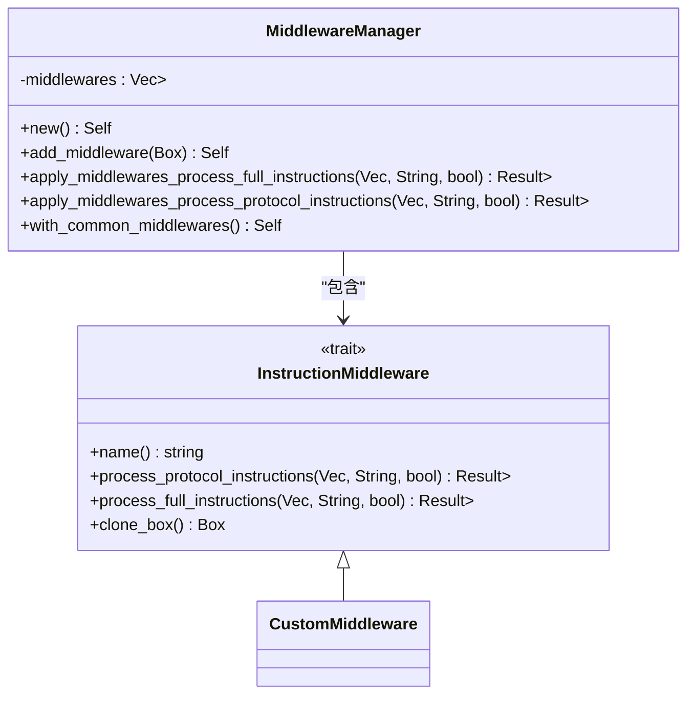
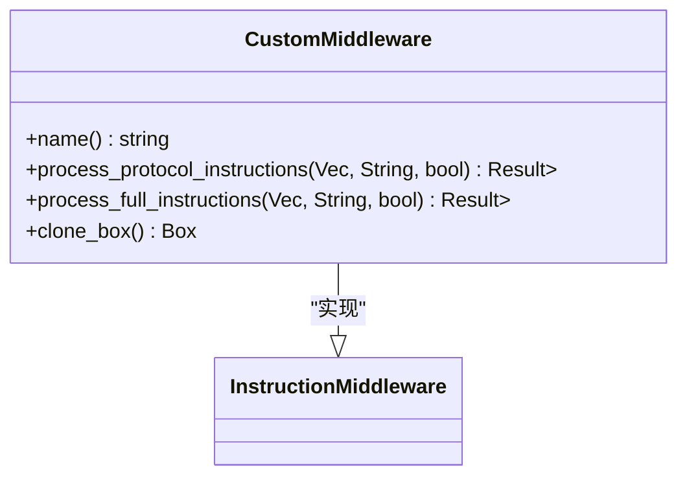
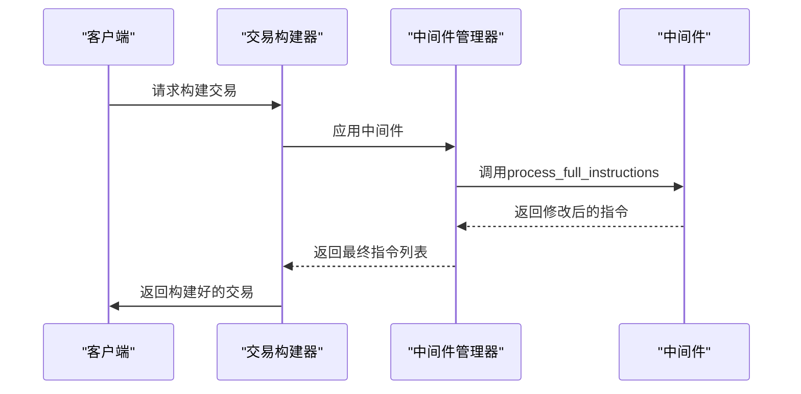
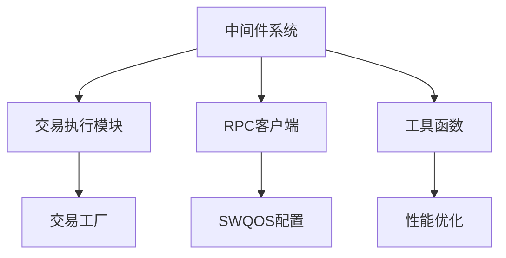

# 自定义中间件开发指南

<cite>
**本文档引用的文件**   
- [middleware_system/src/main.rs](file://examples/middleware_system/src/main.rs)
- [trading/middleware/traits.rs](file://src/trading/middleware/traits.rs)
- [trading/middleware/builtin.rs](file://src/trading/middleware/builtin.rs)
- [trading/common/transaction_builder.rs](file://src/trading/common/transaction_builder.rs)
- [trading/core/execution.rs](file://src/trading/core/execution.rs)
- [trading/factory.rs](file://src/trading/factory.rs)
- [lib.rs](file://src/lib.rs)
</cite>

## 目录
1. [简介](#简介)
2. [项目结构](#项目结构)
3. [核心组件](#核心组件)
4. [架构概述](#架构概述)
5. [详细组件分析](#详细组件分析)
6. [依赖分析](#依赖分析)
7. [性能考虑](#性能考虑)
8. [故障排除指南](#故障排除指南)
9. [结论](#结论)

## 简介
本指南旨在为开发者提供一个完整的教程，指导如何基于`Middleware` trait构建自定义的交易处理逻辑。通过分析`examples/middleware_system`中的实例，我们将演示创建价格检查中间件或失败重试中间件的具体步骤：从结构体定义、trait实现到注册到交易流程的全过程。此外，还将说明如何访问交易上下文数据、调用外部服务以及安全地修改交易参数，并包含编译注意事项和调试技巧，同时指出生命周期管理与线程安全等高级议题。

## 项目结构
该项目采用模块化设计，主要分为以下几个部分：
- `docs/`：存放文档文件
- `examples/`：包含多个示例应用，其中`middleware_system`是本指南的重点
- `src/`：源代码目录，包含了核心功能实现

**图示来源**
- [middleware_system/src/main.rs](file://examples/middleware_system/src/main.rs)
- [trading/middleware/traits.rs](file://src/trading/middleware/traits.rs)

## 核心组件
在Solana交易SDK中，中间件系统的核心是`InstructionMiddleware` trait，它允许开发者在交易执行前对指令进行修改、添加或删除。该trait提供了两个核心方法：`process_protocol_instructions` 和 `process_full_instructions`，分别用于处理协议指令和完整指令列表。

**节来源**
- [trading/middleware/traits.rs](file://src/trading/middleware/traits.rs#L4-L45)

## 架构概述
整个中间件系统的架构围绕着`MiddlewareManager`展开，它负责管理一系列实现了`InstructionMiddleware` trait的中间件实例。当交易请求到达时，`MiddlewareManager`会依次调用每个中间件的处理方法，最终生成修改后的指令列表。

**图示来源**
- [trading/middleware/traits.rs](file://src/trading/middleware/traits.rs#L4-L116)
- [trading/middleware/builtin.rs](file://src/trading/middleware/builtin.rs#L5-L54)

## 详细组件分析
### 自定义中间件分析
为了创建一个自定义中间件，首先需要定义一个结构体并实现`InstructionMiddleware` trait。以`CustomMiddleware`为例，其基本实现如下：

#### 对象导向组件

**图示来源**
- [middleware_system/src/main.rs](file://examples/middleware_system/src/main.rs#L21-L55)

### 交易构建流程分析
在交易构建过程中，`build_transaction`函数会调用`MiddlewareManager`来应用所有注册的中间件。这一过程确保了在最终生成交易之前，所有的中间件都有机会对指令进行处理。

#### API/服务组件

**图示来源**
- [trading/common/transaction_builder.rs](file://src/trading/common/transaction_builder.rs#L18-L122)
- [middleware_system/src/main.rs](file://examples/middleware_system/src/main.rs#L71-L107)

## 依赖分析
中间件系统依赖于多个核心模块，包括交易执行、RPC客户端、以及各种工具函数。这些依赖关系确保了中间件能够在正确的上下文中运行，并能够访问必要的资源。

**图示来源**
- [lib.rs](file://src/lib.rs#L1-L762)
- [trading/factory.rs](file://src/trading/factory.rs#L1-L99)

## 性能考虑
在设计中间件时，必须考虑到性能影响。由于每个中间件都会在交易构建过程中被调用，因此应尽量减少不必要的计算和I/O操作。此外，使用异步处理可以提高整体吞吐量。

## 故障排除指南
在开发和使用中间件时，可能会遇到一些常见问题，如中间件未正确注册、指令修改导致交易失败等。建议使用日志记录中间件的行为，以便于调试和问题定位。

**节来源**
- [trading/middleware/builtin.rs](file://src/trading/middleware/builtin.rs#L5-L54)
- [middleware_system/src/main.rs](file://examples/middleware_system/src/main.rs#L71-L107)

## 结论
通过本指南，我们详细介绍了如何基于`Middleware` trait构建自定义的交易处理逻辑。从结构体定义到trait实现，再到注册到交易流程，每一步都至关重要。希望本指南能帮助开发者更好地理解和利用中间件系统，从而构建出更加灵活和强大的交易应用。