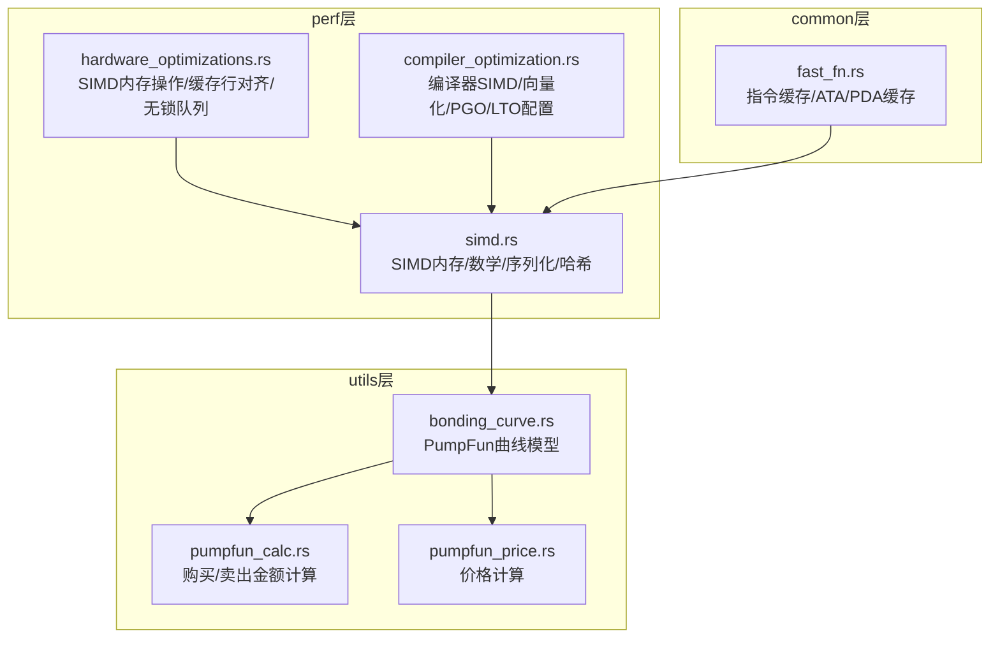
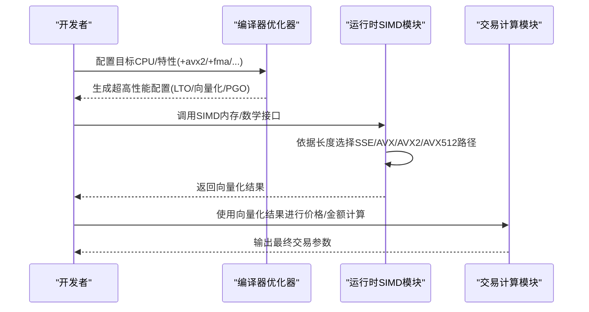
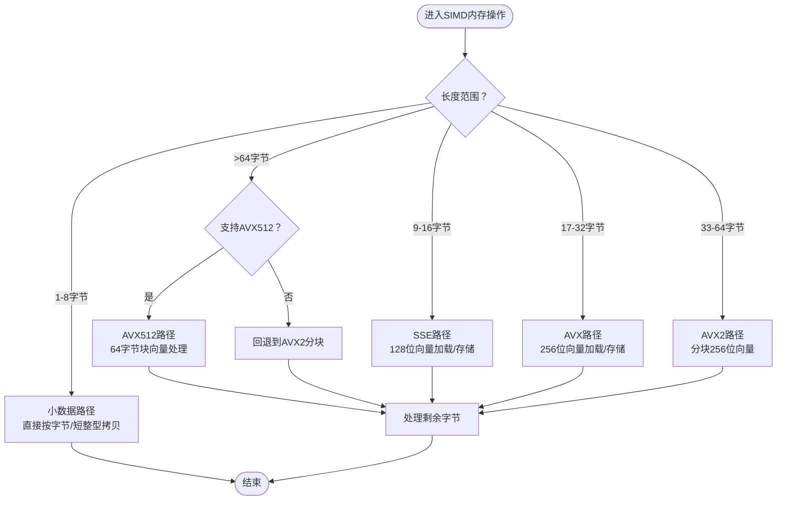
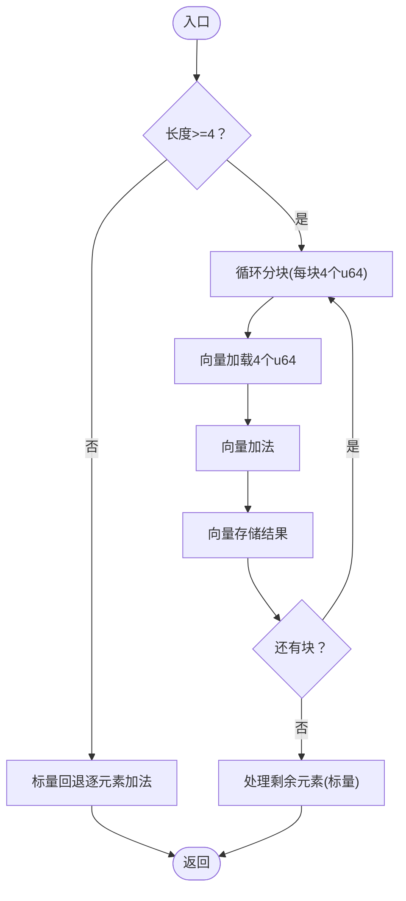
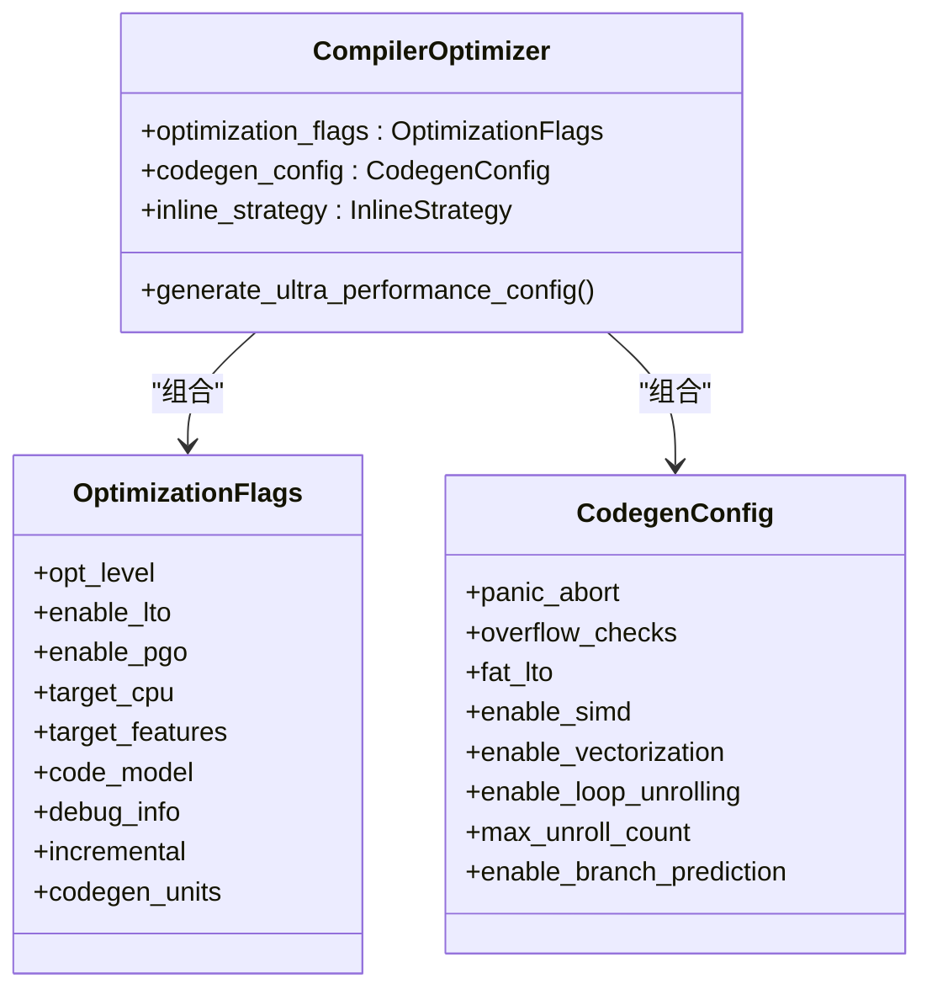
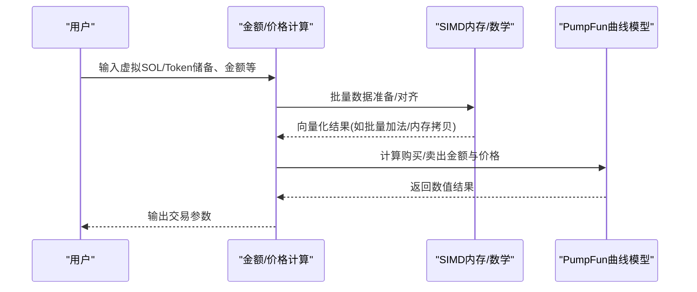
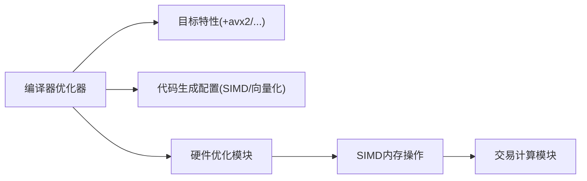

# SIMD向量计算优化

<cite>
**本文引用的文件列表**
- [simd.rs](file://src/perf/simd.rs)
- [hardware_optimizations.rs](file://src/perf/hardware_optimizations.rs)
- [compiler_optimization.rs](file://src/perf/compiler_optimization.rs)
- [fast_fn.rs](file://src/common/fast_fn.rs)
- [bonding_curve.rs](file://src/common/bonding_curve.rs)
- [pumpfun_calc.rs](file://src/utils/calc/pumpfun.rs)
- [pumpfun_price.rs](file://src/utils/price/pumpfun.rs)
- [test_latency.sh](file://test_latency.sh)
</cite>

## 目录
1. [引言](#引言)
2. [项目结构](#项目结构)
3. [核心组件](#核心组件)
4. [架构总览](#架构总览)
5. [详细组件分析](#详细组件分析)
6. [依赖关系分析](#依赖关系分析)
7. [性能考量](#性能考量)
8. [故障排查指南](#故障排查指南)
9. [结论](#结论)
10. [附录](#附录)

## 引言
本文件聚焦于sol-trade-sdk中基于SIMD（单指令多数据）的性能优化实现，系统梳理了在x86_64平台下如何通过AVX2/AVX512等指令集加速内存拷贝、比较、清零以及批量整型加法等操作；同时结合交易计算中的价格曲线与金额批量处理，解释SIMD在并行处理多个浮点/整型运算时的优势，展示如何通过向量化减少循环开销、提升吞吐量。文档还提供了数据对齐、向量加载与运算的具体实现思路、跨CPU架构的兼容性策略，以及性能基准测试建议与开发者复用SIMD优化模式的方法。

## 项目结构
围绕SIMD优化的关键文件分布如下：
- perf层：提供SIMD内存操作、硬件优化与编译器优化配置
- common层：提供高频缓存与快速函数，间接体现SIMD在交易构建中的价值
- utils层：提供PumpFun相关的价格与金额计算，便于在SIMD优化中复用

图表来源
- [simd.rs](file://src/perf/simd.rs#L1-L330)
- [hardware_optimizations.rs](file://src/perf/hardware_optimizations.rs#L1-L609)
- [compiler_optimization.rs](file://src/perf/compiler_optimization.rs#L1-L662)
- [fast_fn.rs](file://src/common/fast_fn.rs#L1-L310)
- [bonding_curve.rs](file://src/common/bonding_curve.rs#L1-L249)
- [pumpfun_calc.rs](file://src/utils/calc/pumpfun.rs#L1-L111)
- [pumpfun_price.rs](file://src/utils/price/pumpfun.rs#L1-L19)

章节来源
- [simd.rs](file://src/perf/simd.rs#L1-L330)
- [hardware_optimizations.rs](file://src/perf/hardware_optimizations.rs#L1-L609)
- [compiler_optimization.rs](file://src/perf/compiler_optimization.rs#L1-L662)
- [fast_fn.rs](file://src/common/fast_fn.rs#L1-L310)
- [bonding_curve.rs](file://src/common/bonding_curve.rs#L1-L249)
- [pumpfun_calc.rs](file://src/utils/calc/pumpfun.rs#L1-L111)
- [pumpfun_price.rs](file://src/utils/price/pumpfun.rs#L1-L19)

## 核心组件
- SIMD内存操作（AVX2/AVX512）：提供内存拷贝、比较、清零的向量化实现，并针对不同长度采用SSE/AVX/AVX2/AVX512的最优策略。
- SIMD数学运算：提供批量u64加法的向量化实现，减少循环开销。
- 编译器SIMD/向量化：通过编译器配置启用SIMD、向量化、LTO、PGO等，确保生成代码充分利用CPU特性。
- 硬件优化：缓存行对齐、无锁环形缓冲、预取、内存屏障等，配合SIMD提升整体吞吐。
- 交易计算适配：在PumpFun价格曲线与金额计算中，可将批量数据转换为SIMD友好的格式，从而复用向量化路径。

章节来源
- [simd.rs](file://src/perf/simd.rs#L1-L330)
- [hardware_optimizations.rs](file://src/perf/hardware_optimizations.rs#L1-L609)
- [compiler_optimization.rs](file://src/perf/compiler_optimization.rs#L1-L662)

## 架构总览
SIMD优化贯穿“编译期配置—运行期硬件优化—具体算法向量化”三层：
- 编译期：启用AVX2/FMA/BMI等特性，开启LTO/向量化/PGO，确保生成代码具备SIMD能力。
- 运行期：根据数据长度选择SSE/AVX/AVX2/AVX512路径，保证对齐与分块处理，避免越界。
- 算法层：在内存密集型与数值密集型路径上应用SIMD，如批量加法、内存拷贝/比较/清零。

图表来源
- [compiler_optimization.rs](file://src/perf/compiler_optimization.rs#L140-L211)
- [hardware_optimizations.rs](file://src/perf/hardware_optimizations.rs#L31-L171)
- [simd.rs](file://src/perf/simd.rs#L112-L181)

## 详细组件分析

### SIMD内存操作（AVX2/AVX512）
- 内存拷贝：按长度分段，优先使用SSE/AVX/AVX2/AVX512，最后处理剩余字节，保证对齐与吞吐。
- 内存比较：使用向量比较指令，掩码判断，支持任意长度的高效比较。
- 内存清零：以向量零寄存器填充，分块清零后处理剩余字节。
- 兼容性：非x86_64平台回退到标准库实现，确保跨平台可用。

图表来源
- [hardware_optimizations.rs](file://src/perf/hardware_optimizations.rs#L31-L171)
- [hardware_optimizations.rs](file://src/perf/hardware_optimizations.rs#L173-L264)
- [hardware_optimizations.rs](file://src/perf/hardware_optimizations.rs#L266-L293)

章节来源
- [hardware_optimizations.rs](file://src/perf/hardware_optimizations.rs#L31-L171)
- [hardware_optimizations.rs](file://src/perf/hardware_optimizations.rs#L173-L264)
- [hardware_optimizations.rs](file://src/perf/hardware_optimizations.rs#L266-L293)

### SIMD数学运算（批量u64加法）
- 以256位向量为粒度，每批处理4个u64，减少循环开销。
- 对剩余元素进行标量回退，保证正确性与吞吐。
- 非x86_64平台回退到逐元素加法，保持功能一致。

图表来源
- [simd.rs](file://src/perf/simd.rs#L112-L181)

章节来源
- [simd.rs](file://src/perf/simd.rs#L112-L181)

### 编译器SIMD/向量化配置
- 目标特性：启用AVX2/FMA/BMI等，目标CPU设为native以获得最佳性能。
- 代码生成：开启SIMD/向量化、循环展开、分支预测优化，关闭溢出检查与调试信息以提升发布性能。
- LTO/PGO：在支持场景下启用胖LTO与PGO，进一步提升热点路径性能。
- 构建脚本：动态检测CPU特性并注入编译器标志，确保在不同硬件上获得最优配置。

图表来源
- [compiler_optimization.rs](file://src/perf/compiler_optimization.rs#L1-L209)
- [compiler_optimization.rs](file://src/perf/compiler_optimization.rs#L262-L307)
- [compiler_optimization.rs](file://src/perf/compiler_optimization.rs#L309-L347)

章节来源
- [compiler_optimization.rs](file://src/perf/compiler_optimization.rs#L140-L211)
- [compiler_optimization.rs](file://src/perf/compiler_optimization.rs#L262-L307)
- [compiler_optimization.rs](file://src/perf/compiler_optimization.rs#L309-L347)
- [compiler_optimization.rs](file://src/perf/compiler_optimization.rs#L529-L580)

### 在交易计算中的应用（PumpFun）
- 价格曲线与金额计算：PumpFun曲线模型与价格计算函数提供数值密集型路径，适合在批量数据上应用SIMD。
- 快速函数与缓存：fast_fn.rs中的指令缓存与ATA/PDA缓存减少重复计算，为SIMD优化腾挪更多CPU周期。

图表来源
- [pumpfun_calc.rs](file://src/utils/calc/pumpfun.rs#L1-L111)
- [pumpfun_price.rs](file://src/utils/price/pumpfun.rs#L1-L19)
- [bonding_curve.rs](file://src/common/bonding_curve.rs#L122-L248)
- [fast_fn.rs](file://src/common/fast_fn.rs#L1-L310)

章节来源
- [pumpfun_calc.rs](file://src/utils/calc/pumpfun.rs#L1-L111)
- [pumpfun_price.rs](file://src/utils/price/pumpfun.rs#L1-L19)
- [bonding_curve.rs](file://src/common/bonding_curve.rs#L122-L248)
- [fast_fn.rs](file://src/common/fast_fn.rs#L1-L310)

## 依赖关系分析
- 编译器优化器依赖目标平台特性检测与构建脚本，确保在x86_64上启用AVX2/FMA/BMI等。
- 硬件优化模块与SIMD内存操作紧密耦合，共同负责内存带宽与缓存友好性。
- 交易计算模块依赖SIMD提供的高效内存/数学能力，以提升批量处理吞吐。

图表来源
- [compiler_optimization.rs](file://src/perf/compiler_optimization.rs#L140-L211)
- [hardware_optimizations.rs](file://src/perf/hardware_optimizations.rs#L31-L171)
- [simd.rs](file://src/perf/simd.rs#L112-L181)

章节来源
- [compiler_optimization.rs](file://src/perf/compiler_optimization.rs#L140-L211)
- [hardware_optimizations.rs](file://src/perf/hardware_optimizations.rs#L31-L171)
- [simd.rs](file://src/perf/simd.rs#L112-L181)

## 性能考量
- 数据对齐：SIMD要求数据按向量宽度对齐，硬件优化模块提供对齐与分块策略，避免未对齐导致的性能下降。
- 向量加载与运算：优先使用256位/512位向量，减少循环次数；对剩余元素采用标量回退，保证正确性。
- 编译器优化：启用LTO/向量化/PGO，关闭溢出检查与调试信息，最大化发布性能。
- 缓存友好：缓存行对齐、预取、无锁环形缓冲降低缓存抖动，提升持续吞吐。
- CPU特性检测：在构建脚本中检测AVX2/AVX512，动态注入编译器标志，确保在不同硬件上获得最优配置。

章节来源
- [hardware_optimizations.rs](file://src/perf/hardware_optimizations.rs#L296-L459)
- [compiler_optimization.rs](file://src/perf/compiler_optimization.rs#L140-L211)
- [compiler_optimization.rs](file://src/perf/compiler_optimization.rs#L529-L580)

## 故障排查指南
- 平台不支持AVX2/AVX512：非x86_64平台会自动回退到通用实现；若出现性能异常，检查编译器配置与目标特性。
- 数据未对齐：确保输入数据按向量宽度对齐，必要时使用缓存行对齐结构体或中间缓冲。
- 未启用SIMD/向量化：确认编译器配置已开启enable_simd与enable_vectorization，且目标CPU为native。
- 性能测试：使用仓库提供的延迟测试脚本，观察各阶段耗时，定位瓶颈。

章节来源
- [hardware_optimizations.rs](file://src/perf/hardware_optimizations.rs#L296-L459)
- [compiler_optimization.rs](file://src/perf/compiler_optimization.rs#L140-L211)
- [test_latency.sh](file://test_latency.sh#L1-L303)

## 结论
sol-trade-sdk通过编译器配置、硬件优化与SIMD内存/数学操作，构建了从编译期到运行期的全栈SIMD优化体系。在PumpFun等交易场景中，SIMD能够显著提升批量数据处理的吞吐与延迟表现。开发者可在遵循数据对齐、分块处理与标量回退的原则下，将SIMD模式复用于自定义逻辑，以获得稳定且可观的性能收益。

## 附录

### 在自定义逻辑中复用SIMD优化模式的实践建议
- 数据对齐与分块：将批量数据按向量宽度对齐，优先使用256位/512位向量处理，剩余部分采用标量回退。
- 条件路径选择：根据数据长度选择SSE/AVX/AVX2/AVX512路径，避免不必要的指令族切换。
- 编译期配置：启用LTO/向量化/PGO，关闭溢出检查与调试信息，确保生成代码充分利用SIMD。
- 缓存友好：使用缓存行对齐结构体与预取指令，降低缓存抖动。
- 平台兼容：在非x86_64平台回退到通用实现，保证功能一致性。

章节来源
- [hardware_optimizations.rs](file://src/perf/hardware_optimizations.rs#L31-L171)
- [hardware_optimizations.rs](file://src/perf/hardware_optimizations.rs#L296-L459)
- [compiler_optimization.rs](file://src/perf/compiler_optimization.rs#L140-L211)