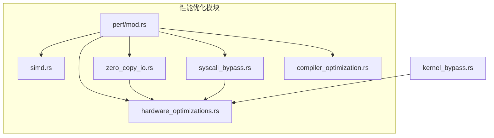
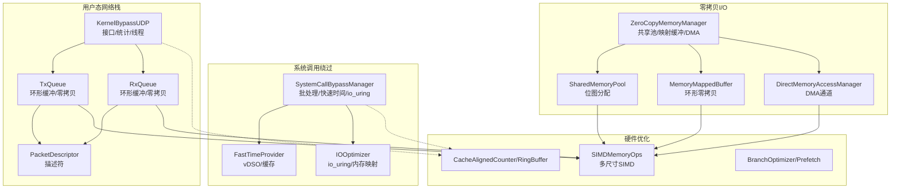
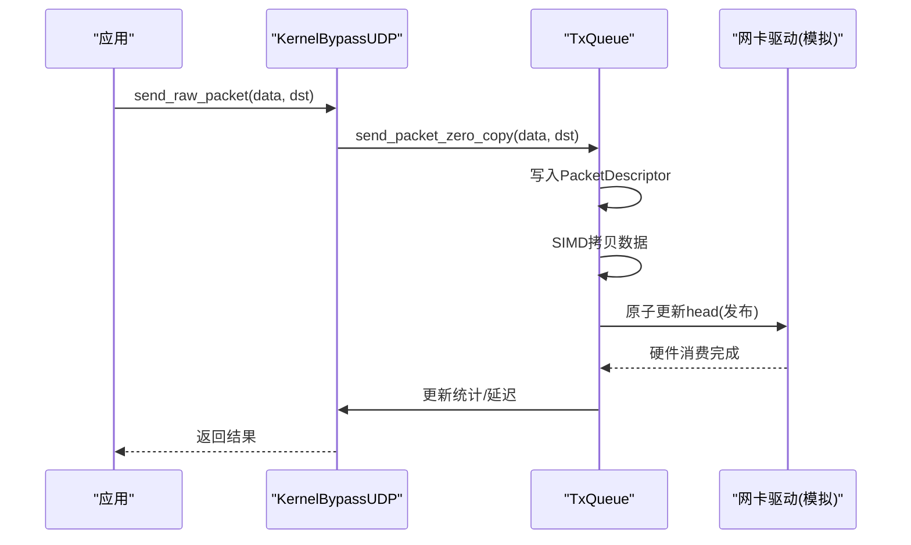
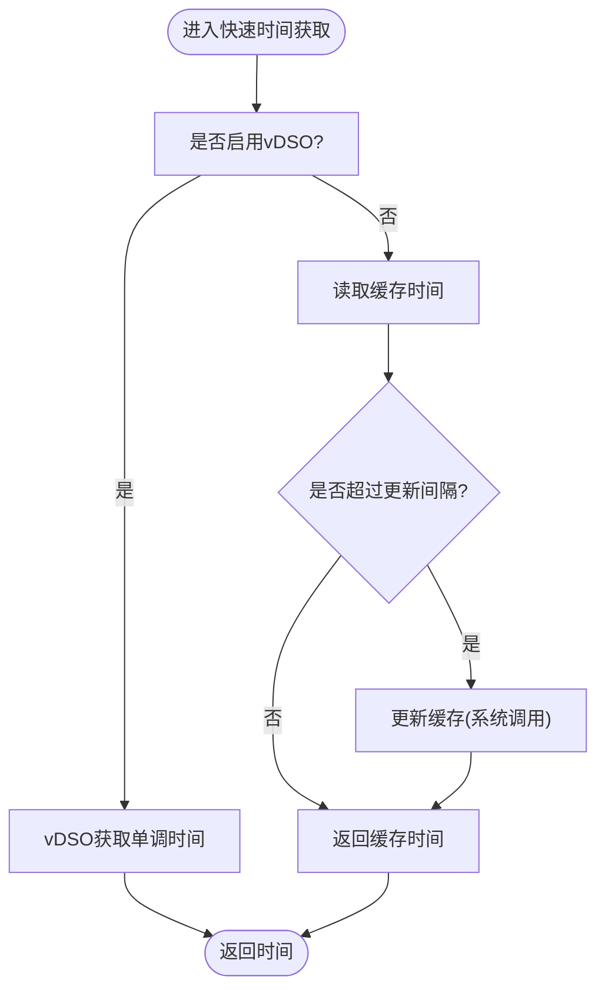
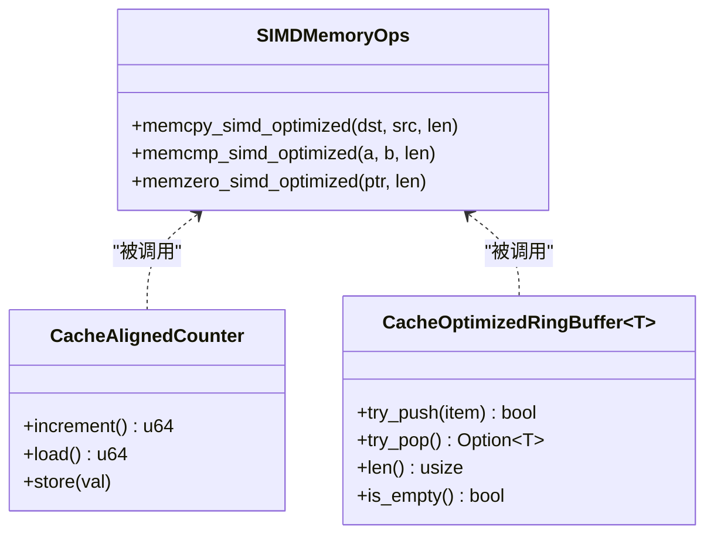
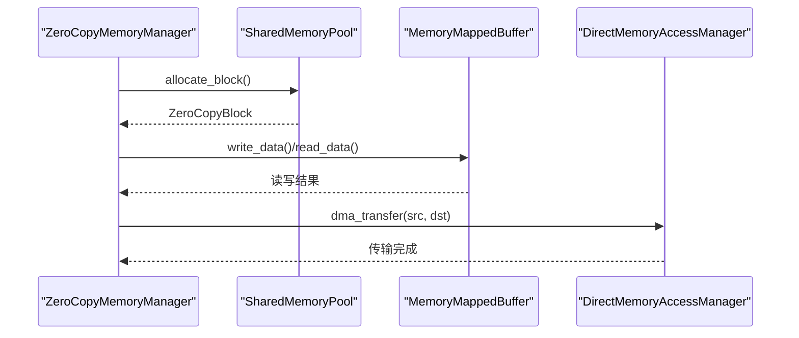
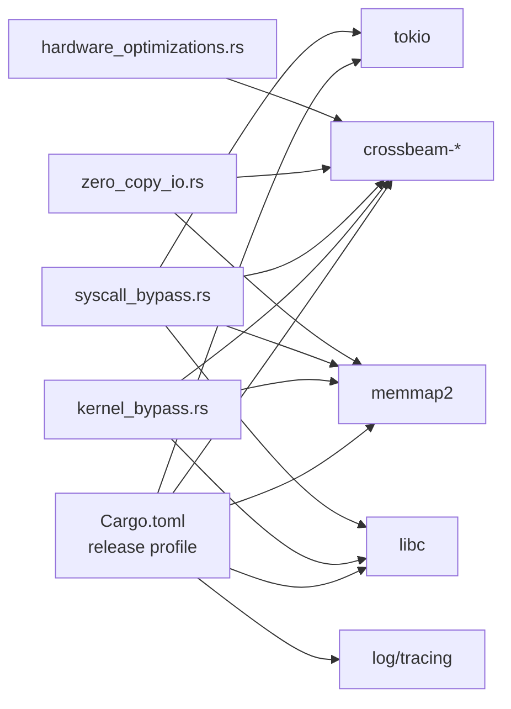

# 内核旁路与系统调用绕过

<cite>
**本文引用的文件**
- [kernel_bypass.rs](file://src/perf/kernel_bypass.rs)
- [syscall_bypass.rs](file://src/perf/syscall_bypass.rs)
- [hardware_optimizations.rs](file://src/perf/hardware_optimizations.rs)
- [zero_copy_io.rs](file://src/perf/zero_copy_io.rs)
- [mod.rs](file://src/perf/mod.rs)
- [Cargo.toml](file://Cargo.toml)
- [test_latency.sh](file://test_latency.sh)
</cite>

## 目录
1. [简介](#简介)
2. [项目结构](#项目结构)
3. [核心组件](#核心组件)
4. [架构总览](#架构总览)
5. [详细组件分析](#详细组件分析)
6. [依赖关系分析](#依赖关系分析)
7. [性能考量](#性能考量)
8. [故障排查指南](#故障排查指南)
9. [结论](#结论)
10. [附录](#附录)

## 简介
本文件聚焦 sol-trade-sdk 中的“内核旁路”与“系统调用绕过”两大性能优化方向，系统性解析以下能力：
- 内核旁路网络栈：通过用户态直接访问网卡与零拷贝环形缓冲，降低网络路径延迟与抖动。
- 系统调用绕过：通过批处理、vDSO、io_uring、内存映射与用户态实现，减少系统调用次数与开销。
- 硬件协同优化：利用缓存行对齐、SIMD、分支预测、内存屏障等，最大化CPU与内存带宽利用率。
- 零拷贝I/O：共享内存池、内存映射缓冲与DMA式传输，进一步消除数据拷贝与内核上下文切换。

上述能力共同服务于“交易广播”的极致低延迟目标，帮助构建可预测、稳定、低抖动的高频交易环境。

## 项目结构
性能优化模块位于 src/perf 下，包含 SIMD、硬件优化、零拷贝I/O、系统调用绕过、编译器优化等子模块；其中与内核旁路和系统调用绕过最直接相关的是 kernel_bypass.rs 与 syscall_bypass.rs，二者与 hardware_optimizations.rs、zero_copy_io.rs 形成互补。

图表来源
- [mod.rs](file://src/perf/mod.rs#L1-L21)
- [kernel_bypass.rs](file://src/perf/kernel_bypass.rs#L1-L620)
- [syscall_bypass.rs](file://src/perf/syscall_bypass.rs#L1-L778)
- [hardware_optimizations.rs](file://src/perf/hardware_optimizations.rs#L1-L609)
- [zero_copy_io.rs](file://src/perf/zero_copy_io.rs#L1-L717)

章节来源
- [mod.rs](file://src/perf/mod.rs#L1-L21)

## 核心组件
- 内核旁路网络栈（用户态UDP与环形队列）
  - 用户态网络接口与统计
  - 发送/接收环形队列（Tx/Rx）
  - 零拷贝包描述符与SIMD拷贝
  - 线程CPU亲和性绑定
- 系统调用绕过（批处理、vDSO、io_uring、内存映射）
  - 批处理器与请求分类
  - 快速时间提供器（vDSO优先）
  - io_uring批量异步I/O
  - 用户态内存分配与内存映射I/O
- 硬件协同优化（缓存行对齐、SIMD、分支预测、内存屏障）
  - 缓存对齐计数器与环形缓冲
  - 多尺寸SIMD内存操作
  - 预取与分支优化
- 零拷贝I/O（共享内存池、内存映射缓冲、DMA式传输）
  - 位图管理的块分配/释放
  - 环形缓冲零拷贝读写
  - DMA通道与统计

章节来源
- [kernel_bypass.rs](file://src/perf/kernel_bypass.rs#L1-L620)
- [syscall_bypass.rs](file://src/perf/syscall_bypass.rs#L1-L778)
- [hardware_optimizations.rs](file://src/perf/hardware_optimizations.rs#L1-L609)
- [zero_copy_io.rs](file://src/perf/zero_copy_io.rs#L1-L717)

## 架构总览
下图展示“内核旁路+系统调用绕过+硬件优化+零拷贝I/O”的整体协作关系与数据流。

图表来源
- [kernel_bypass.rs](file://src/perf/kernel_bypass.rs#L1-L620)
- [syscall_bypass.rs](file://src/perf/syscall_bypass.rs#L1-L778)
- [hardware_optimizations.rs](file://src/perf/hardware_optimizations.rs#L1-L609)
- [zero_copy_io.rs](file://src/perf/zero_copy_io.rs#L1-L717)

## 详细组件分析

### 内核旁路网络栈（Kernel Bypass）
- 设计要点
  - 用户态网络接口：统一 send_raw_packet/receive_raw_packet/get_network_stats，屏蔽底层差异。
  - 环形队列：TxQueue/RxQueue 使用内存映射作为环形缓冲，配合原子指针与缓存行填充，避免伪共享。
  - 零拷贝：包描述符与数据在同一内存区域，发送/接收均通过SIMD拷贝，避免内核复制。
  - 线程亲和：启动TX/RX线程并绑定特定CPU，降低跨核迁移与TLB抖动。
- 关键流程（发送）
  - 申请环形槽位，写入 PacketDescriptor 与数据，原子更新 head 指针。
  - 统计发送字节与错误，计算平均发送延迟。
- 关键流程（接收）
  - 从环形缓冲读取 PacketDescriptor，零拷贝读取数据，构造源地址，原子更新 tail 指针。
  - 统计接收字节与错误，计算平均接收延迟。
- 与硬件优化的协同
  - TxQueue/RxQueue 的描述符与数据区域采用缓存行对齐，SIMD拷贝在 x86_64 上使用 AVX/AVX2/AVX512。
  - CPU亲和性绑定通过 libc::sched_setaffinity 实现（Linux）。

图表来源
- [kernel_bypass.rs](file://src/perf/kernel_bypass.rs#L131-L238)
- [kernel_bypass.rs](file://src/perf/kernel_bypass.rs#L358-L591)

章节来源
- [kernel_bypass.rs](file://src/perf/kernel_bypass.rs#L1-L620)

### 系统调用绕过（System Call Bypass）
- 设计要点
  - 批处理：将多个系统调用请求聚合，减少系统调用次数（writev/readv/sendmsg/recvmsg）。
  - 快速时间：优先使用 vDSO（CLOCK_MONOTONIC_RAW）获取单调时间，避免系统调用；否则使用缓存+定期更新。
  - io_uring：检测内核版本后启用批量异步I/O，将多次系统调用合并为一次提交，显著降低开销。
  - 内存映射：使用 mmap 直接I/O（O_DIRECT）与共享映射，绕过页缓存。
  - 用户态实现：在极端配置下，提供用户态内存分配器，避免 malloc 系统调用。
- 关键流程（时间获取）
  - 若启用vDSO则直接调用 clock_gettime；否则使用缓存时间并在周期性阈值后刷新。
- 关键流程（批量I/O）
  - 将多个写/读/网络请求分组，优先使用io_uring批量提交；否则合并为单次系统调用。
- 关键流程（用户态分配）
  - 使用静态内存池（once_cell::Lazy）提供固定大小的内存块，按需分配并保持对齐。

图表来源
- [syscall_bypass.rs](file://src/perf/syscall_bypass.rs#L139-L202)

章节来源
- [syscall_bypass.rs](file://src/perf/syscall_bypass.rs#L1-L778)

### 硬件协同优化（Hardware Optimizations）
- 设计要点
  - 缓存行对齐：CacheAlignedCounter 与 CacheOptimizedRingBuffer 使用 64 字节对齐，避免伪共享。
  - SIMD内存操作：针对不同数据大小选择最优SIMD指令（SSE/AVX/AVX2/AVX512），提供 memcpy/memcmp/memzero。
  - 分支预测与预取：BranchOptimizer 提供 likely/unlikely 宏与预取指令，优化分支与缓存命中。
  - 内存屏障：提供轻/重内存屏障，确保多核可见性与顺序一致性。
- 与内核旁路/系统调用绕过的协同
  - TxQueue/RxQueue 的描述符与数据区对齐，SIMD拷贝在 x86_64 上充分利用指令集。
  - 零拷贝缓冲区与共享池也受益于缓存行对齐与预取，降低CPU缓存压力。

图表来源
- [hardware_optimizations.rs](file://src/perf/hardware_optimizations.rs#L27-L294)
- [hardware_optimizations.rs](file://src/perf/hardware_optimizations.rs#L296-L459)

章节来源
- [hardware_optimizations.rs](file://src/perf/hardware_optimizations.rs#L1-L609)

### 零拷贝I/O（Zero Copy I/O）
- 设计要点
  - 共享内存池：使用位图管理空闲块，按缓存行对齐分配，减少碎片与锁竞争。
  - 内存映射缓冲：基于 memmap2 的匿名映射，实现环形零拷贝读写，SIMD拷贝跨越边界自动分段。
  - DMA式传输：DirectMemoryAccessManager 提供多通道，通道间轮询分配，统计传输字节与次数。
- 与硬件优化的协同
  - 共享池与映射缓冲均采用缓存行对齐与SIMD拷贝，降低CPU与内存带宽消耗。
  - 预取与分支优化在分配/释放路径中提升吞吐。

图表来源
- [zero_copy_io.rs](file://src/perf/zero_copy_io.rs#L1-L717)

章节来源
- [zero_copy_io.rs](file://src/perf/zero_copy_io.rs#L1-L717)

## 依赖关系分析
- 编译与运行时依赖
  - Tokio 异步运行时用于线程与任务调度。
  - crossbeam-utils/crossbeam-queue 提供无锁数据结构与缓存行填充。
  - memmap2 提供内存映射，用于零拷贝缓冲与共享池。
  - libc 用于 Linux 平台的 CPU亲和性与系统调用。
  - log/tracing 用于性能日志与可观测性。
- 性能配置
  - Cargo.toml 中 release profile 使用 thin LTO、多代码生成单元、禁用溢出检查与调试信息，追求极致性能。

图表来源
- [Cargo.toml](file://Cargo.toml#L112-L142)
- [kernel_bypass.rs](file://src/perf/kernel_bypass.rs#L1-L620)
- [syscall_bypass.rs](file://src/perf/syscall_bypass.rs#L1-L778)
- [zero_copy_io.rs](file://src/perf/zero_copy_io.rs#L1-L717)
- [hardware_optimizations.rs](file://src/perf/hardware_optimizations.rs#L1-L609)

章节来源
- [Cargo.toml](file://Cargo.toml#L112-L142)

## 性能考量
- 内核旁路的优势
  - 绕过内核网络栈，减少系统调用与上下文切换，显著降低广播延迟与抖动。
  - 零拷贝环形队列与SIMD拷贝减少CPU与内存带宽占用。
  - 线程亲和性绑定降低跨核迁移成本。
- 系统调用绕过的优势
  - 批处理将多次系统调用合并为一次，io_uring进一步降低I/O开销。
  - vDSO时间获取避免系统调用，用户态分配绕过malloc。
- 硬件优化的收益
  - 缓存行对齐与SIMD指令充分利用CPU指令集，提升吞吐。
  - 预取与分支优化改善缓存命中与分支预测。
- 零拷贝I/O的收益
  - 共享池与映射缓冲减少分配与拷贝，DMA通道提升大块数据传输效率。

[本节为通用性能讨论，无需列出具体文件来源]

## 故障排查指南
- 常见问题与定位
  - 网络发送队列满：TxQueue.pending_packets() 反映积压，检查发送线程是否及时推进 tail。
  - 接收缓冲区空：RxQueue.available_packets() 为0，检查网卡轮询逻辑与硬件中断。
  - vDSO不可用：FastTimeProvider 回退到缓存时间，确认内核版本与权限。
  - io_uring不生效：IOOptimizer.check_io_uring_support() 返回false，检查内核版本。
  - 内存映射失败：mmap/munmap 报错，检查平台支持与权限。
- 性能观测
  - 使用 test_latency.sh 运行延迟测试，观察各阶段耗时与缓冲池/交易池使用情况。
  - 通过日志级别（RUST_LOG）与 tracing 输出，定位瓶颈环节。

章节来源
- [kernel_bypass.rs](file://src/perf/kernel_bypass.rs#L358-L591)
- [syscall_bypass.rs](file://src/perf/syscall_bypass.rs#L231-L315)
- [test_latency.sh](file://test_latency.sh#L1-L303)

## 结论
通过内核旁路与系统调用绕过，结合硬件协同优化与零拷贝I/O，sol-trade-sdk 在网络路径、系统调用、CPU与内存层面实现了全方位的低延迟优化。这些能力共同作用，显著降低交易广播的延迟与抖动，提升系统的可预测性与吞吐稳定性。建议在生产环境中：
- 启用内核旁路网络栈与系统调用绕过（极端配置）。
- 配置线程CPU亲和性与NUMA感知。
- 使用零拷贝I/O与共享内存池。
- 结合 vDSO 与 io_uring，最大限度减少系统调用与上下文切换。

[本节为总结性内容，无需列出具体文件来源]

## 附录

### 部署与权限要求
- 权限
  - CAP_NET_ADMIN：用于配置网卡与中断亲和性（Linux）。在内核旁路场景中，通常需要管理员权限以绑定网卡与中断到指定CPU。
- 环境
  - Linux 内核版本：建议较新版本以支持 io_uring 与 vDSO。
  - NUMA 与 CPU 亲和：根据硬件拓扑合理绑定 TX/RX 线程到同一NUMA节点的CPU核心。
  - 网卡驱动：确保网卡驱动支持用户态直通或DPDK/AF_XDP（仓库中为概念性实现，实际部署需结合具体硬件与驱动）。

[本节为通用部署建议，无需列出具体文件来源]

### 性能监控与观测
- 日志级别
  - RUST_LOG 控制日志输出，建议在测试阶段开启 debug 以观察各模块统计。
- 延迟测试
  - 使用 test_latency.sh 运行真实交易广播流程，记录各阶段耗时与缓冲池/交易池使用率。
- 统计接口
  - 内核旁路：NetworkStats 提供发送/接收字节、错误与平均延迟。
  - 系统调用绕过：SyscallBypassStatsSnapshot 提供绕过/批处理/时间缓存/I/O优化/内存操作避免等统计。
  - 零拷贝I/O：ZeroCopyStats 提供块分配/释放、传输字节数与映射缓冲使用量。

章节来源
- [kernel_bypass.rs](file://src/perf/kernel_bypass.rs#L566-L591)
- [syscall_bypass.rs](file://src/perf/syscall_bypass.rs#L633-L683)
- [zero_copy_io.rs](file://src/perf/zero_copy_io.rs#L523-L560)
- [test_latency.sh](file://test_latency.sh#L1-L303)