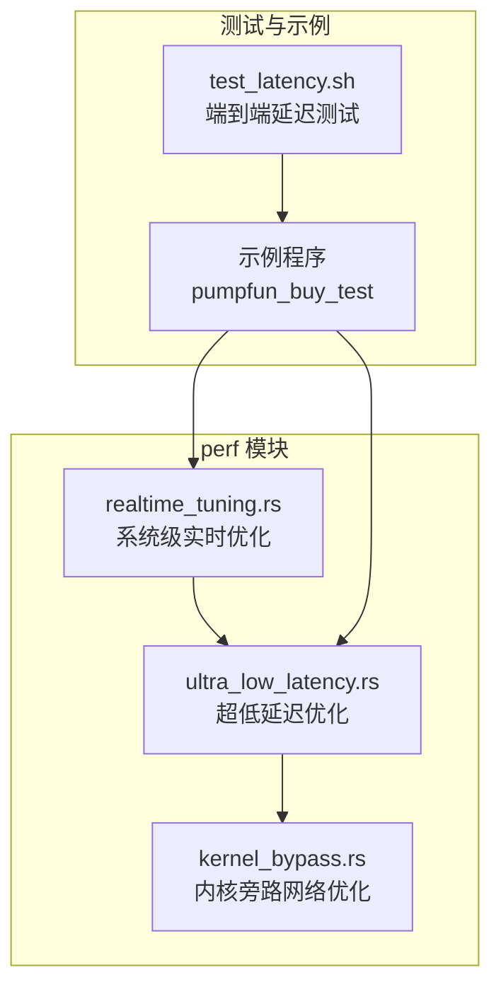
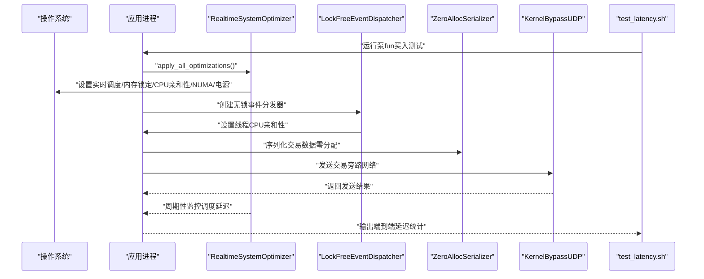
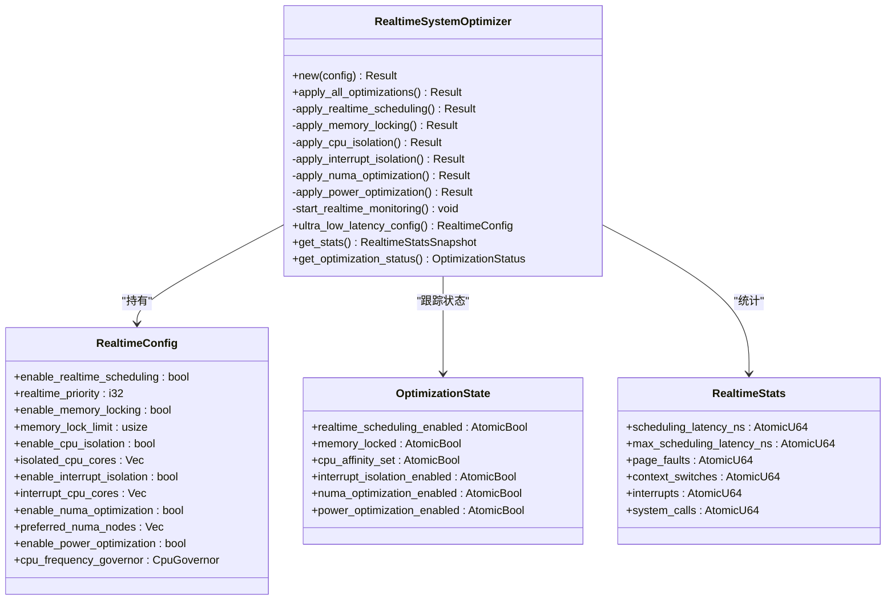
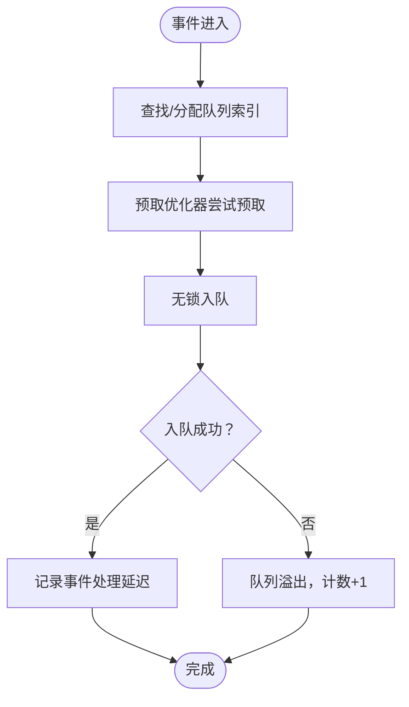
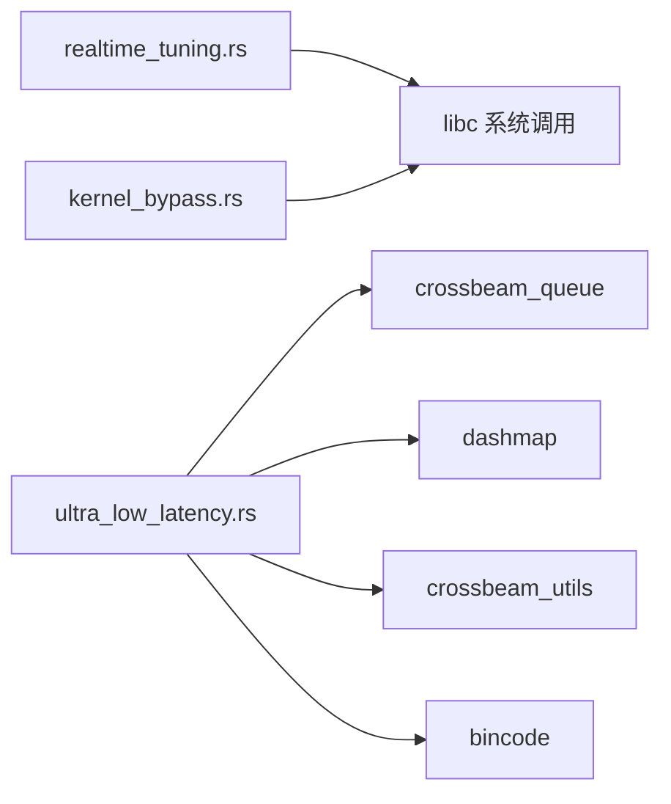

# 实时系统调优

<cite>
**本文引用的文件**
- [realtime_tuning.rs](file://src/perf/realtime_tuning.rs)
- [ultra_low_latency.rs](file://src/perf/ultra_low_latency.rs)
- [kernel_bypass.rs](file://src/perf/kernel_bypass.rs)
- [test_latency.sh](file://test_latency.sh)
- [README.md](file://README.md)
</cite>

## 目录
1. [简介](#简介)
2. [项目结构](#项目结构)
3. [核心组件](#核心组件)
4. [架构总览](#架构总览)
5. [详细组件分析](#详细组件分析)
6. [依赖关系分析](#依赖关系分析)
7. [性能考量](#性能考量)
8. [故障排查指南](#故障排查指南)
9. [结论](#结论)
10. [附录：系统配置清单](#附录系统配置清单)

## 简介
本文件系统性阐述 sol-trade-sdk 中“实时调优（Realtime Tuning）”机制的设计与应用，围绕以下目标展开：
- 基于 realtime_tuning.rs 与 ultra_low_latency.rs，说明如何通过 CPU 亲和性绑定、线程优先级提升（SCHED_FIFO/SCHED_RR）、内存锁定、NUMA 优化、电源管理调优等手段，确保交易线程获得确定性执行时间。
- 结合 test_latency.sh 脚本，讲解如何测量端到端延迟并验证调优效果。
- 提供完整的系统配置清单，覆盖内核参数（如 isolcpus、nohz_full、rcu_nocbs）、用户组权限（realtime 组）、systemd 服务配置等。
- 针对优先级反转、GC 干扰等常见问题给出排查建议，帮助构建稳定可靠的超低延迟运行环境。

## 项目结构
实时调优相关能力主要分布在 perf 子模块中，核心文件如下：
- src/perf/realtime_tuning.rs：系统级实时优化器，负责调度、内存、CPU/NUMA、电源等系统级调优。
- src/perf/ultra_low_latency.rs：面向亚毫秒级延迟的极致优化，包含无锁事件分发、CPU 亲和性、零分配序列化等。
- src/perf/kernel_bypass.rs：内核旁路网络优化（与实时调优互补，用于网络路径的确定性降低）。
- test_latency.sh：端到端延迟测试脚本，用于验证交易链路的延迟表现。

图表来源
- [realtime_tuning.rs](file://src/perf/realtime_tuning.rs#L1-L120)
- [ultra_low_latency.rs](file://src/perf/ultra_low_latency.rs#L1-L120)
- [kernel_bypass.rs](file://src/perf/kernel_bypass.rs#L490-L513)
- [test_latency.sh](file://test_latency.sh#L1-L120)

章节来源
- [README.md](file://README.md#L284-L302)

## 核心组件
- RealtimeSystemOptimizer：系统级实时优化器，提供统一入口应用调度、内存、CPU/NUMA、电源等优化，并内置运行时监控与统计。
- LockFreeEventDispatcher：无锁事件分发器，结合 CPU 亲和性与预取优化，实现亚毫秒级事件处理。
- ZeroAllocSerializer：零分配序列化器，通过预分配缓冲池减少 GC 干扰与分配开销。
- KernelBypassUDP：内核旁路网络优化，降低网络栈延迟，与实时调优互补。

章节来源
- [realtime_tuning.rs](file://src/perf/realtime_tuning.rs#L150-L255)
- [ultra_low_latency.rs](file://src/perf/ultra_low_latency.rs#L20-L120)
- [ultra_low_latency.rs](file://src/perf/ultra_low_latency.rs#L480-L543)
- [kernel_bypass.rs](file://src/perf/kernel_bypass.rs#L490-L513)

## 架构总览
实时调优的整体架构由“系统级优化 + 应用层优化 + 网络旁路 + 测试验证”四部分组成：
- 系统级优化：通过 RealtimeSystemOptimizer 在进程启动阶段应用调度、内存、CPU/NUMA、电源等优化，并持续监控调度延迟。
- 应用层优化：LockFreeEventDispatcher 采用无锁队列与 CPU 亲和性，ZeroAllocSerializer 避免分配与 GC 干扰。
- 网络旁路：KernelBypassUDP 降低网络栈延迟，配合实时调度提升整体确定性。
- 测试验证：test_latency.sh 自动化构建测试程序，模拟交易提交路径，输出各阶段耗时统计。

图表来源
- [realtime_tuning.rs](file://src/perf/realtime_tuning.rs#L209-L255)
- [ultra_low_latency.rs](file://src/perf/ultra_low_latency.rs#L314-L394)
- [ultra_low_latency.rs](file://src/perf/ultra_low_latency.rs#L414-L460)
- [kernel_bypass.rs](file://src/perf/kernel_bypass.rs#L529-L591)
- [test_latency.sh](file://test_latency.sh#L200-L250)

## 详细组件分析

### RealtimeSystemOptimizer（系统级实时优化）
- 功能要点
  - 实时调度策略：优先尝试 SCHED_FIFO，失败则回退到 SCHED_RR；需要 root 权限。
  - 内存锁定：设置 RLIMIT_MEMLOCK 并调用 mlockall，防止页面交换。
  - CPU 亲和性：为当前进程设置 CPU 掩码，绑定到隔离核心。
  - 中断隔离：提供配置建议（isolcpus、rcu_nocbs、IRQ 亲和性）。
  - NUMA 优化：检测并建议使用 numactl 与 zone reclaim 配置。
  - 电源管理：建议设置 CPU 频率策略为 performance，并考虑禁用 C-states。
  - 运行时监控：定期测量线程让出后的调度延迟，输出状态与告警。
- 关键接口
  - apply_all_optimizations：按顺序应用上述优化。
  - apply_realtime_scheduling / apply_memory_locking / apply_cpu_isolation / apply_interrupt_isolation / apply_numa_optimization / apply_power_optimization：单项优化。
  - start_realtime_monitoring：后台任务周期性采集调度延迟与状态。
  - ultra_low_latency_config：一键生成超低延迟配置模板。
- 复杂度与性能
  - 优化过程为一次性系统调用，复杂度 O(1)，对运行时影响可忽略。
  - 监控线程每 5 秒采样一次，开销极低。

图表来源
- [realtime_tuning.rs](file://src/perf/realtime_tuning.rs#L150-L255)
- [realtime_tuning.rs](file://src/perf/realtime_tuning.rs#L31-L118)
- [realtime_tuning.rs](file://src/perf/realtime_tuning.rs#L121-L148)
- [realtime_tuning.rs](file://src/perf/realtime_tuning.rs#L532-L555)

章节来源
- [realtime_tuning.rs](file://src/perf/realtime_tuning.rs#L209-L255)
- [realtime_tuning.rs](file://src/perf/realtime_tuning.rs#L257-L456)
- [realtime_tuning.rs](file://src/perf/realtime_tuning.rs#L458-L506)
- [realtime_tuning.rs](file://src/perf/realtime_tuning.rs#L532-L555)

### LockFreeEventDispatcher（无锁事件分发器）
- 功能要点
  - 多生产者单消费者环形队列（ArrayQueue），避免锁竞争。
  - 客户端到队列的映射与轮询分配，保证负载均衡。
  - 预取优化器：基于历史模式预测性预取，提升缓存命中。
  - CPU 亲和性：为工作线程绑定到指定核心，减少跨 NUMA 与上下文切换。
  - 批处理：每次轮询批量 pop，提升吞吐。
- 关键接口
  - new：创建分发器并初始化队列与映射。
  - dispatch_event_ultra_fast：无阻塞推送事件并记录延迟。
  - start_processing_workers：启动多个工作线程并设置亲和性。
  - get_performance_stats/get_prefetch_stats/get_queue_stats：查询性能与预取统计。
- 复杂度与性能
  - 推送/消费均为 O(1) 均摊，批量处理进一步降低调度开销。
  - 预取命中率统计有助于评估预测模型有效性。

图表来源
- [ultra_low_latency.rs](file://src/perf/ultra_low_latency.rs#L254-L313)

章节来源
- [ultra_low_latency.rs](file://src/perf/ultra_low_latency.rs#L20-L120)
- [ultra_low_latency.rs](file://src/perf/ultra_low_latency.rs#L254-L394)
- [ultra_low_latency.rs](file://src/perf/ultra_low_latency.rs#L414-L460)

### ZeroAllocSerializer（零分配序列化器）
- 功能要点
  - 预分配缓冲池：复用 Vec<u8>，避免频繁分配与 GC。
  - 大小提示：根据事件类型动态估算序列化大小，优化池容量。
  - 归还策略：限制超大缓冲区归还，防止池被污染。
- 关键接口
  - new：初始化池与大小提示表。
  - serialize_zero_alloc：零分配序列化并返回缓冲区。
  - return_buffer：归还缓冲区。
  - get_pool_stats：查询池状态。
- 复杂度与性能
  - 序列化 O(n)（n 为序列化长度），但避免了堆分配与拷贝。

章节来源
- [ultra_low_latency.rs](file://src/perf/ultra_low_latency.rs#L480-L543)

### KernelBypassUDP（内核旁路网络优化）
- 功能要点
  - 通过用户态队列直接发送/接收原始包，绕过内核网络栈。
  - 提供发送/接收统计，便于评估旁路网络的延迟收益。
- 关键接口
  - set_thread_cpu_affinity：为发送/接收线程设置 CPU 亲和性。
  - send_raw_packet/receive_raw_packet：零拷贝发送/接收。
  - get_network_stats：汇总发送/接收延迟与错误计数。
- 复杂度与性能
  - 发送/接收为 O(n)（n 为包长），显著降低系统调用与拷贝成本。

章节来源
- [kernel_bypass.rs](file://src/perf/kernel_bypass.rs#L490-L513)
- [kernel_bypass.rs](file://src/perf/kernel_bypass.rs#L529-L591)

## 依赖关系分析
- RealtimeSystemOptimizer 依赖 libc 系统调用（实时调度、内存锁定、CPU 亲和性）。
- LockFreeEventDispatcher 依赖 crossbeam_queue、dashmap、crossbeam_utils（无锁队列、缓存填充、映射）。
- ZeroAllocSerializer 依赖 bincode、dashmap（序列化与大小提示）。
- KernelBypassUDP 依赖用户态队列实现与网络设备（与平台相关）。

图表来源
- [realtime_tuning.rs](file://src/perf/realtime_tuning.rs#L257-L388)
- [ultra_low_latency.rs](file://src/perf/ultra_low_latency.rs#L1-L60)
- [kernel_bypass.rs](file://src/perf/kernel_bypass.rs#L490-L513)

章节来源
- [realtime_tuning.rs](file://src/perf/realtime_tuning.rs#L257-L388)
- [ultra_low_latency.rs](file://src/perf/ultra_low_latency.rs#L1-L60)
- [kernel_bypass.rs](file://src/perf/kernel_bypass.rs#L490-L513)

## 性能考量
- 确定性执行时间的关键在于：
  - 实时调度：SCHED_FIFO/SCHED_RR 降低抢占延迟。
  - 内存锁定：mlockall 防止缺页中断与抖动。
  - CPU 亲和性：绑定到隔离核心，减少跨 NUMA 与上下文切换。
  - 中断线程化：rcu_nocbs + IRQ 亲和性，减少软硬中断对应用线程的影响。
  - 电源管理：scaling_governor=performance，禁用 C-states，维持恒定频率。
- 应用层优化：
  - 无锁队列与批量处理，降低锁竞争与调度开销。
  - 零分配序列化，避免 GC 抖动。
  - 预取优化，提升缓存命中率。
- 网络路径优化：
  - 内核旁路网络减少系统调用与拷贝，显著降低网络栈延迟。

[本节为通用性能讨论，无需列出具体文件来源]

## 故障排查指南
- 无法设置实时调度
  - 现象：日志提示需要 root 权限。
  - 排查：检查是否以 root 运行；确认 seccomp、cgroups 限制；确认内核支持 SCHED_FIFO/SCHED_RR。
  - 参考路径：[realtime_tuning.rs](file://src/perf/realtime_tuning.rs#L257-L300)
- 内存锁定失败
  - 现象：设置 RLIMIT_MEMLOCK 或 mlockall 失败。
  - 排查：增大 limits.conf 中 memlock 限制；确认有足够的可用内存；检查 SELinux/AppArmor。
  - 参考路径：[realtime_tuning.rs](file://src/perf/realtime_tuning.rs#L302-L339)
- CPU 亲和性设置失败
  - 现象：sched_setaffinity 返回错误。
  - 排查：确认核心 ID 有效且未被其他进程占用；在 macOS/Windows 上亲和性不可用时，改用线程优先级策略。
  - 参考路径：[realtime_tuning.rs](file://src/perf/realtime_tuning.rs#L341-L389)、[ultra_low_latency.rs](file://src/perf/ultra_low_latency.rs#L414-L460)、[kernel_bypass.rs](file://src/perf/kernel_bypass.rs#L490-L513)
- 中断影响导致抖动
  - 现象：调度延迟高于预期。
  - 排查：确认 isolcpus、rcu_nocbs、IRQ 亲和性配置；关闭不必要的中断线程。
  - 参考路径：[realtime_tuning.rs](file://src/perf/realtime_tuning.rs#L391-L413)
- 电源策略导致频率波动
  - 现象：CPU 频率变化造成延迟抖动。
  - 排查：设置 scaling_governor=performance；必要时禁用 C-states。
  - 参考路径：[realtime_tuning.rs](file://src/perf/realtime_tuning.rs#L435-L456)
- GC 干扰（Rust 应用）
  - 现象：偶发长停顿。
  - 排查：使用 ZeroAllocSerializer 减少分配；避免在热路径进行大对象分配；使用稳定的 allocator。
  - 参考路径：[ultra_low_latency.rs](file://src/perf/ultra_low_latency.rs#L480-L543)
- 优先级反转
  - 现象：实时线程被更高优先级任务抢占。
  - 排查：确保实时线程不持有互斥锁；缩短临界区；使用无锁数据结构。
  - 参考路径：[realtime_tuning.rs](file://src/perf/realtime_tuning.rs#L257-L300)

章节来源
- [realtime_tuning.rs](file://src/perf/realtime_tuning.rs#L257-L456)
- [ultra_low_latency.rs](file://src/perf/ultra_low_latency.rs#L480-L543)
- [kernel_bypass.rs](file://src/perf/kernel_bypass.rs#L490-L513)

## 结论
通过 RealtimeSystemOptimizer 与 Ultra Low Latency 优化的协同，sol-trade-sdk 能够在 Linux 实时环境下实现确定性的低延迟交易执行。结合内核旁路网络与完善的监控统计，开发者可以在生产环境中稳定地达到亚毫秒级端到端延迟目标。配合 test_latency.sh 的自动化测试，可快速验证调优效果并定位瓶颈。

[本节为总结性内容，无需列出具体文件来源]

## 附录：系统配置清单

### 内核参数（Linux）
- isolcpus：将特定 CPU 核心隔离给实时应用，减少后台负载干扰。
- rcu_nocbs：禁止 RCU 回调在隔离核心上执行，降低 RCU 延迟。
- nohz_full：关闭动态时钟，减少 tick 中断。
- rcu_nocbs 与 IRQ 亲和性：将中断绑定到非隔离核心，避免实时线程被中断打断。
- 示例建议（来源于代码注释与实现）：
  - isolcpus=<isolated_cores>
  - rcu_nocbs=<isolated_cores>
  - IRQ 亲和性：/proc/irq/*/smp_affinity
  - NUMA：numactl --membind=<nodes> --cpunodebind=<nodes>，vm.zone_reclaim_mode=1
  - CPU 频率：scaling_governor=performance，intel_idle.max_cstate=0

章节来源
- [realtime_tuning.rs](file://src/perf/realtime_tuning.rs#L391-L413)
- [realtime_tuning.rs](file://src/perf/realtime_tuning.rs#L435-L456)

### 用户组与权限
- realtime 组：将运行实时应用的用户加入 realtime 组，允许设置实时调度与内存锁定。
- limits.conf：提高 memlock 限制与 nofile 等资源限制。
- cgroups：可选，用于进一步限制与隔离实时进程。

章节来源
- [realtime_tuning.rs](file://src/perf/realtime_tuning.rs#L257-L339)

### systemd 服务配置（建议）
- ExecStart：指向应用二进制，建议以 root 运行或使用 Capabilities。
- CPUAffinity：绑定到隔离核心集合。
- IOSchedulingClass：实时调度类（若支持）。
- LimitMEMLOCK：提升内存锁定上限。
- TasksMax：限制任务数量，避免资源争用。
- Environment：注入必要的环境变量（如 RPC 地址、SWQOS 节点等）。

章节来源
- [realtime_tuning.rs](file://src/perf/realtime_tuning.rs#L257-L339)

### test_latency.sh 使用说明
- 功能概述：自动生成泵fun买入测试程序，配置 SWQOS 并并发发送，测量端到端延迟。
- 主要环境变量
  - PAYER_KEYPAIR：测试钱包私钥（为空时自动生成临时密钥对）
  - RPC_URL：Solana RPC 地址
  - TEST_MINT：测试代币地址
  - BUY_AMOUNT：买入金额（lamports）
  - SLIPPAGE：滑点（bps）
  - SWQOS_*：各 MEV 服务的自定义 URL
  - RUST_LOG：日志级别
- 运行方式
  - 设置环境变量后执行脚本，自动编译并运行 pumpfun_buy_test。
  - 输出包含序列化器缓冲池、交易构建器池等统计信息，以及各阶段耗时。
- 注意事项
  - 测试账户余额不足会导致交易失败，但会记录完整耗时统计。
  - 建议在隔离 CPU 核心上运行，避免其他负载干扰。

章节来源
- [test_latency.sh](file://test_latency.sh#L1-L120)
- [test_latency.sh](file://test_latency.sh#L120-L250)
- [test_latency.sh](file://test_latency.sh#L250-L303)