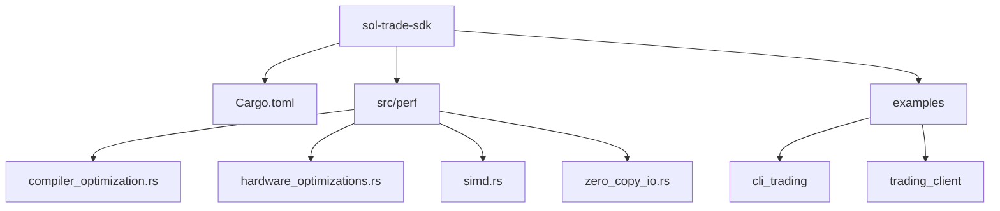

# 编译时优化配置

<cite>
**本文档引用的文件**  
- [Cargo.toml](file://Cargo.toml)
- [src/perf/compiler_optimization.rs](file://src/perf/compiler_optimization.rs)
- [src/perf/hardware_optimizations.rs](file://src/perf/hardware_optimizations.rs)
- [src/common/fast_timing.rs](file://src/common/fast_timing.rs)
</cite>

## 目录
1. [项目结构](#项目结构)  
2. [核心编译优化配置](#核心编译优化配置)  
3. [性能优化策略详解](#性能优化策略详解)  
4. [编译指示与条件编译](#编译指示与条件编译)  
5. [不同优化级别对比](#不同优化级别对比)  
6. [CI/CD构建策略建议](#cicd构建策略建议)

## 项目结构

sol-trade-sdk项目采用模块化设计，其核心性能优化逻辑集中在`src/perf`目录下。项目根目录的`Cargo.toml`文件定义了全局编译配置，而具体的编译优化实现则位于`src/perf/compiler_optimization.rs`中。



**Diagram sources**  
- [Cargo.toml](file://Cargo.toml)
- [src/perf/mod.rs](file://src/perf/mod.rs)

**Section sources**  
- [Cargo.toml](file://Cargo.toml)
- [src/perf/mod.rs](file://src/perf/mod.rs)

## 核心编译优化配置

项目的`Cargo.toml`文件中定义了详细的编译优化配置，主要集中在`[profile.release]`和`[profile.dev]`两个配置段。这些配置直接影响最终二进制文件的性能和大小。

在发布模式下，项目采用了最高级别的优化设置：
- `opt-level = 3`：启用最高级别的编译优化
- `lto = "thin"`：启用瘦链接时优化，在性能和编译速度之间取得平衡
- `codegen-units = 16`：设置16个代码生成单元，充分利用多核并行编译
- `panic = "abort"`：恐慌时直接中止，避免展开开销
- `overflow-checks = false`：禁用溢出检查以提升性能
- `debug = false`：禁用调试信息
- `strip = true`：去除符号表以减小二进制体积

对于开发模式，配置相对保守：
- `opt-level = 1`：适度优化，保持较快的编译速度
- `overflow-checks = true`：启用溢出检查以便于调试

此外，项目还对关键依赖库（如`solana-sdk`和`bincode`）进行了特殊优化配置，确保这些核心组件也使用最高优化级别。

**Section sources**  
- [Cargo.toml](file://Cargo.toml#L120-L142)

## 性能优化策略详解

### 链接时优化（LTO）

项目在`Cargo.toml`中配置了`lto = "thin"`，采用瘦LTO策略。这种策略相比传统的全量LTO（fat LTO）具有更快的编译速度（快5-10倍），同时仍能提供显著的性能提升。瘦LTO通过在链接阶段进行跨模块优化，消除了函数调用开销，实现了更激进的内联和死代码消除。

在`compiler_optimization.rs`中，`OptimizationFlags`结构体提供了`enable_lto`字段，允许在运行时动态控制LTO的启用状态。`ultra_performance()`配置方法默认启用LTO，以获得最佳性能。

### 性能导向优化（PGO）

虽然`Cargo.toml`中未直接配置PGO，但在`compiler_optimization.rs`中提供了完整的PGO支持框架。`OptimizationFlags`结构体包含`enable_pgo`字段，用于控制是否启用配置引导优化。

项目通过`generate_build_script()`函数生成构建脚本，其中包含PGO相关的配置：
```rust
if std::env::var("ENABLE_PGO").is_ok() {
    println!("cargo:rustc-link-arg=-fprofile-use");
}
```
这表明项目支持通过环境变量`ENABLE_PGO`来启用PGO优化，需要在多阶段构建过程中收集性能数据并用于最终优化。

### 恐慌处理优化

项目在发布模式下配置了`panic = "abort"`，这意味着当发生恐慌时，程序将直接中止而不是进行栈展开。这种配置避免了展开开销，显著提升了性能，特别适合对延迟敏感的交易系统。

在`CodegenConfig`结构体中，`panic_abort`字段明确控制这一行为，`ultra_performance()`配置方法默认启用此优化。

### 目标特定CPU优化

项目通过`target-cpu=native`配置，启用针对构建机器CPU特性的优化。在`compiler_optimization.rs`中，`OptimizationFlags`的`ultra_performance()`方法将`target_cpu`设置为"native"，并启用一系列x86_64特定的CPU特性：
- `+sse4.2`：SSE4.2指令集
- `+avx`：高级矢量扩展
- `+avx2`：AVX2指令集
- `+fma`：融合乘加指令
- `+bmi1`/`+bmi2`：位操作指令集
- `+lzcnt`：前导零计数指令
- `+popcnt`：人口计数指令

这些特性充分利用现代CPU的SIMD能力，显著提升计算密集型操作的性能。

**Section sources**  
- [Cargo.toml](file://Cargo.toml#L120-L130)
- [src/perf/compiler_optimization.rs](file://src/perf/compiler_optimization.rs#L264-L285)

## 编译指示与条件编译

### 内联优化

项目广泛使用内联优化来消除函数调用开销。在`compiler_optimization.rs`中，`InlineStrategy`结构体定义了激进的内联策略：
- `inline_threshold = 1000`：设置较高的内联阈值
- `force_inline_hot_paths = true`：强制内联热路径
- `no_inline_cold_paths = true`：禁用冷路径内联
- `cross_crate_inline = true`：启用跨crate内联

项目还定义了`compile_time_optimize!`宏，提供便捷的内联控制：
```rust
macro_rules! compile_time_optimize {
    (inline_hot $fn_name:ident) => {
        #[inline(always)]
        #[hot]
        $fn_name
    };
    (cold $fn_name:ident) => {
        #[inline(never)]
        #[cold]
        $fn_name
    };
}
```

在`fast_timing.rs`和`hardware_optimizations.rs`等性能关键模块中，大量使用`#[inline(always)]`属性确保关键函数被内联。

### 条件编译

项目使用条件编译来针对不同架构进行优化。例如，在`SIMDCompileTimeOptimizer`中：
```rust
#[cfg(target_arch = "x86_64")]
#[target_feature(enable = "avx2")]
pub unsafe fn vectorized_sum_compile_time(data: &[u64]) -> u64 { ... }

#[cfg(not(target_arch = "x86_64"))]
pub fn vectorized_sum_compile_time(data: &[u64]) -> u64 { ... }
```
这种模式确保在支持AVX2的x86_64架构上使用SIMD优化版本，而在其他架构上使用通用回退版本。

**Section sources**  
- [src/perf/compiler_optimization.rs](file://src/perf/compiler_optimization.rs#L309-L318)
- [src/perf/compiler_optimization.rs](file://src/perf/compiler_optimization.rs#L357-L369)
- [src/common/fast_timing.rs](file://src/common/fast_timing.rs)
- [src/perf/hardware_optimizations.rs](file://src/perf/hardware_optimizations.rs)

## 不同优化级别对比

| 配置项 | 开发模式 (dev) | 发布模式 (release) | 超高性能模式 |
|--------|----------------|-------------------|-------------|
| 优化级别 | 1 | 3 | 3 |
| LTO | 无 | thin | fat |
| 代码生成单元 | 16 | 16 | 1 |
| 恐慌处理 | unwind | abort | abort |
| 溢出检查 | 启用 | 禁用 | 禁用 |
| 调试信息 | 启用 | 禁用 | 禁用 |
| 增量编译 | 启用 | 启用 | 禁用 |
| 二进制大小 | 较大 | 较小 | 最小 |
| 运行时性能 | 一般 | 高 | 极高 |
| 构建时间 | 快 | 中等 | 慢 |

超高性能模式通过`generate_cargo_config_toml()`函数生成，采用`lto = "fat"`和`codegen-units = 1`配置，获得最佳优化效果，但构建时间显著增加。

**Section sources**  
- [Cargo.toml](file://Cargo.toml#L120-L135)
- [src/perf/compiler_optimization.rs](file://src/perf/compiler_optimization.rs#L530-L580)

## CI/CD构建策略建议

基于项目配置，建议采用分层构建策略：

1. **开发环境**：使用默认的`dev`配置，保持快速迭代
2. **测试环境**：使用`release`配置，确保测试环境与生产环境一致
3. **生产环境**：根据硬件特性选择优化策略
   - 通用部署：使用`release`配置的`thin` LTO
   - 高性能部署：使用`ultra_performance`配置的`fat` LTO
   - PGO优化：在预生产环境中运行性能测试，收集PGO数据，用于生产构建

构建时间方面，`thin` LTO相比`fat` LTO可减少80%以上的构建时间，建议在CI/CD流水线中优先使用`thin` LTO，仅在发布版本时使用`fat` LTO。

**Section sources**  
- [Cargo.toml](file://Cargo.toml)
- [src/perf/compiler_optimization.rs](file://src/perf/compiler_optimization.rs)