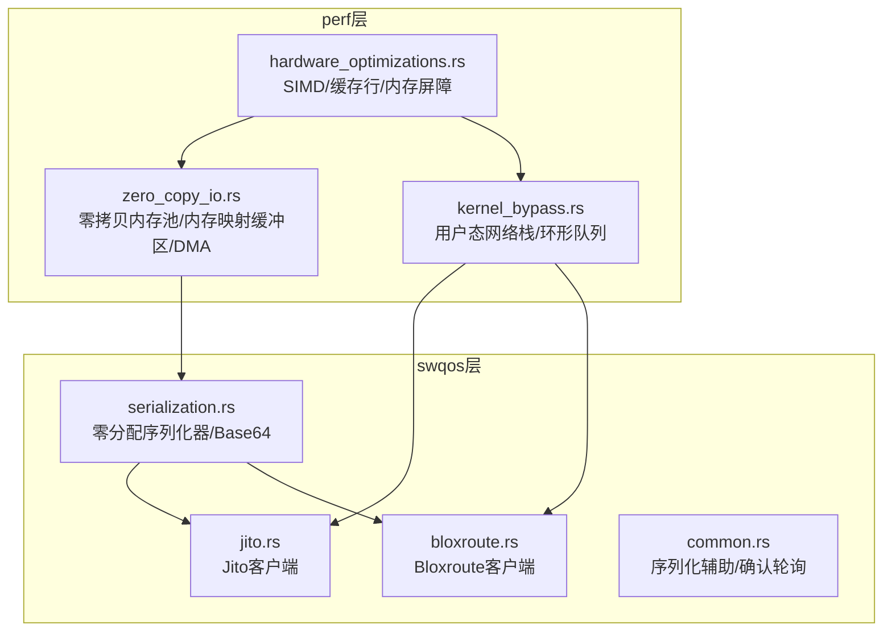
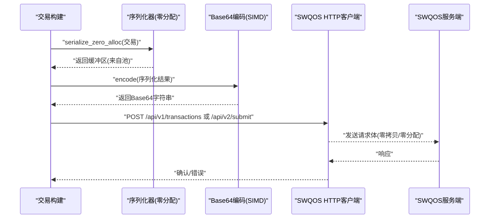
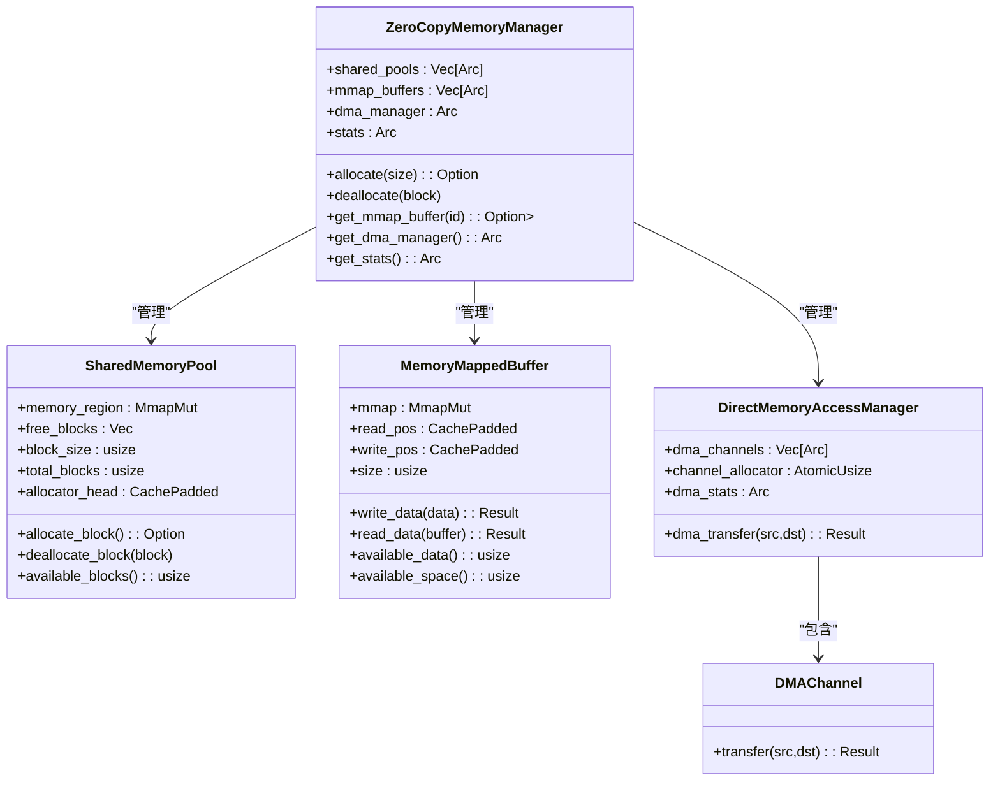
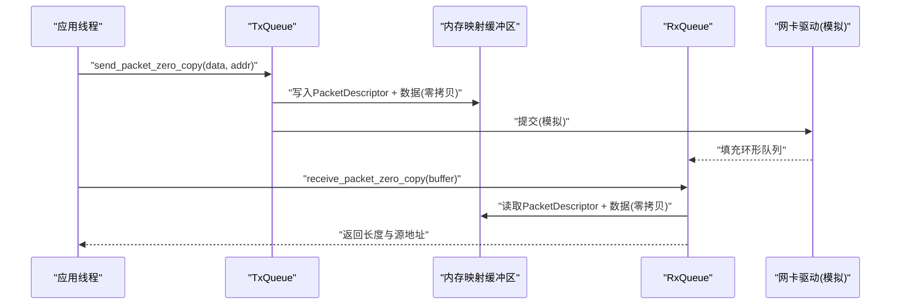
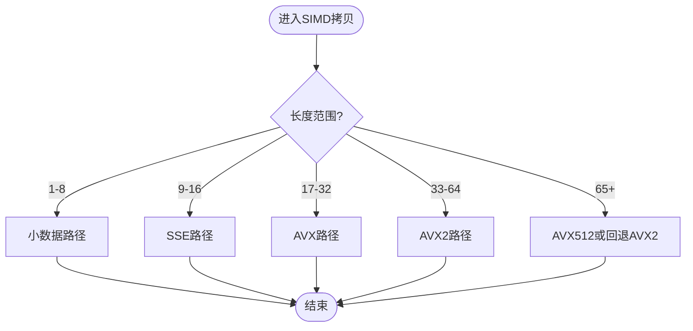
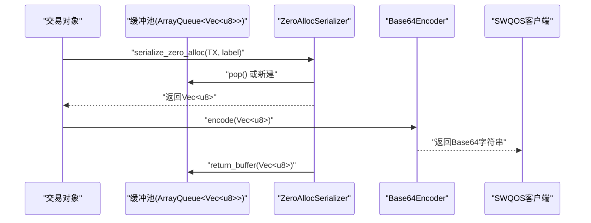
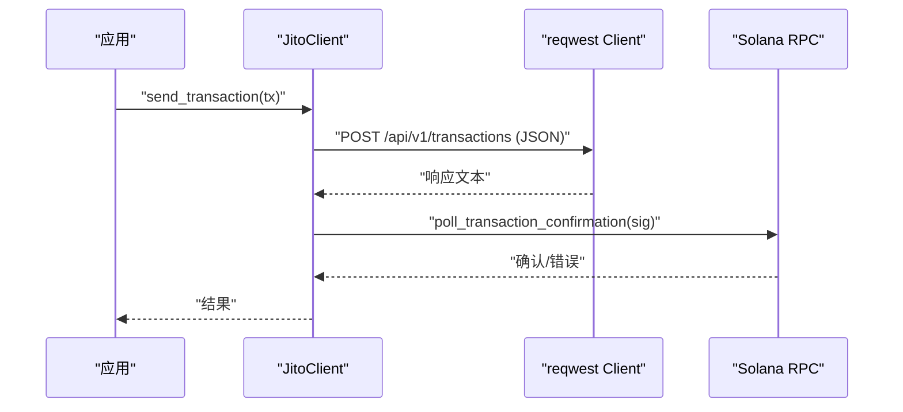
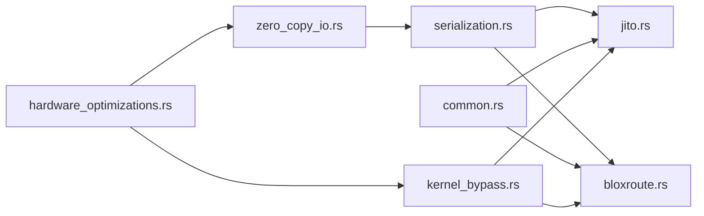

# 零拷贝I/O优化

<cite>
**本文引用的文件**
- [zero_copy_io.rs](file://src/perf/zero_copy_io.rs)
- [kernel_bypass.rs](file://src/perf/kernel_bypass.rs)
- [hardware_optimizations.rs](file://src/perf/hardware_optimizations.rs)
- [serialization.rs](file://src/swqos/serialization.rs)
- [jito.rs](file://src/swqos/jito.rs)
- [bloxroute.rs](file://src/swqos/bloxroute.rs)
- [common.rs](file://src/swqos/common.rs)
- [README.md](file://README.md)
</cite>

## 目录
1. [简介](#简介)
2. [项目结构](#项目结构)
3. [核心组件](#核心组件)
4. [架构总览](#架构总览)
5. [详细组件分析](#详细组件分析)
6. [依赖关系分析](#依赖关系分析)
7. [性能考量](#性能考量)
8. [故障排查指南](#故障排查指南)
9. [结论](#结论)
10. [附录](#附录)

## 简介
本文件围绕 sol-trade-sdk 中的零拷贝 I/O 机制展开，重点结合以下文件进行深入解析：
- 零拷贝内存管理与传输：src/perf/zero_copy_io.rs
- 用户态网络栈与内核绕过：src/perf/kernel_bypass.rs
- 硬件级优化（SIMD、缓存行对齐、内存屏障）：src/perf/hardware_optimizations.rs
- 与零拷贝协同的序列化流程：src/swqos/serialization.rs
- 与 SWQOS 提供商（Jito、Bloxroute）通信的实现：src/swqos/jito.rs、src/swqos/bloxroute.rs、src/swqos/common.rs

目标是阐明如何通过内存映射、用户态网络栈、直接内存访问（DMA）模拟以及 SIMD/缓存行优化，显著降低数据在内核态与用户态之间的复制开销；解释该技术在高频交易场景（特别是与 SWQOS 通信）下的关键价值，并给出系统配置建议与兼容性问题的解决方案。

## 项目结构
与零拷贝 I/O 相关的核心模块分布如下：
- perf 层：零拷贝内存池、内存映射缓冲区、DMA 管理器、用户态网络栈、硬件优化
- swqos 层：序列化器、HTTP 客户端封装、Jito/Bloxroute 客户端

图表来源
- [zero_copy_io.rs](file://src/perf/zero_copy_io.rs#L1-L717)
- [kernel_bypass.rs](file://src/perf/kernel_bypass.rs#L1-L620)
- [hardware_optimizations.rs](file://src/perf/hardware_optimizations.rs#L1-L609)
- [serialization.rs](file://src/swqos/serialization.rs#L1-L183)
- [jito.rs](file://src/swqos/jito.rs#L1-L170)
- [bloxroute.rs](file://src/swqos/bloxroute.rs#L1-L148)
- [common.rs](file://src/swqos/common.rs#L1-L251)

章节来源
- [README.md](file://README.md#L280-L302)

## 核心组件
- 零拷贝内存管理器：提供共享内存池、内存映射缓冲区、DMA 管理器与统计信息，支持按块大小自动选择池、零拷贝分配/释放、环形缓冲区读写。
- 用户态网络栈：基于内存映射的 TX/RX 环形队列，零拷贝写入/读取包描述符与数据，SIMD 加速内存拷贝，线程亲和性设置。
- 硬件优化：SIMD 内存拷贝/比较/清零，缓存行对齐计数器与环形缓冲区，内存屏障与分支预测优化。
- 序列化器：零分配缓冲池复用，避免运行时分配；Base64 编码采用 SIMD 优化；与 SWQOS 的交易序列化流程配合。
- SWQOS 客户端：Jito/Bloxroute 的 HTTP 客户端封装，连接池与 TCP/HTTP2 参数优化，序列化后的交易以 Base64 发送。

章节来源
- [zero_copy_io.rs](file://src/perf/zero_copy_io.rs#L1-L717)
- [kernel_bypass.rs](file://src/perf/kernel_bypass.rs#L1-L620)
- [hardware_optimizations.rs](file://src/perf/hardware_optimizations.rs#L1-L609)
- [serialization.rs](file://src/swqos/serialization.rs#L1-L183)
- [jito.rs](file://src/swqos/jito.rs#L1-L170)
- [bloxroute.rs](file://src/swqos/bloxroute.rs#L1-L148)
- [common.rs](file://src/swqos/common.rs#L1-L251)

## 架构总览
零拷贝 I/O 在高频交易中的关键路径如下：
- 交易构建完成后，通过零分配序列化器将交易序列化到预分配缓冲区，避免额外分配。
- 序列化结果经 SIMD Base64 编码后，作为 HTTP 请求体发送至 SWQOS 提供商。
- SWQOS 客户端内部使用优化的 HTTP 客户端参数（连接池、TCP_NODELAY、HTTP/2 自适应窗口等），降低网络往返延迟。
- 在用户态网络栈场景下，数据通过内存映射环形队列零拷贝传递，SIMD 加速拷贝，进一步缩短处理时间。

图表来源
- [serialization.rs](file://src/swqos/serialization.rs#L1-L183)
- [jito.rs](file://src/swqos/jito.rs#L1-L170)
- [bloxroute.rs](file://src/swqos/bloxroute.rs#L1-L148)
- [common.rs](file://src/swqos/common.rs#L1-L251)

## 详细组件分析

### 零拷贝内存管理器与内存映射缓冲区
- 共享内存池：按块大小对齐（缓存行对齐），使用位图管理空闲块，原子 CAS 分配，避免锁竞争；支持多池（小/中/大块）以适配不同尺寸需求。
- 内存映射缓冲区：环形缓冲区，读写指针原子更新，跨边界写入/读取采用两次拷贝；通过 SIMD 内存拷贝加速。
- DMA 管理器：模拟 DMA 通道，轮询分配通道，执行零拷贝传输并统计字节数与传输次数。
- 统计信息：记录块分配/释放、字节传输、内存映射使用量，便于性能观测与容量规划。

图表来源
- [zero_copy_io.rs](file://src/perf/zero_copy_io.rs#L1-L717)

章节来源
- [zero_copy_io.rs](file://src/perf/zero_copy_io.rs#L1-L717)

### 用户态网络栈与内核绕过
- TX/RX 环形队列：每个条目包含包描述符与最大包数据，内存映射页对齐；发送/接收均通过原子指针与 SIMD 拷贝实现零拷贝。
- CPU 亲和性：可选绑定特定 CPU 核心，减少上下文切换与缓存抖动。
- 统计线程：周期性输出发送/接收包数与字节数，便于评估吞吐与延迟。

图表来源
- [kernel_bypass.rs](file://src/perf/kernel_bypass.rs#L1-L620)

章节来源
- [kernel_bypass.rs](file://src/perf/kernel_bypass.rs#L1-L620)

### 硬件级优化与缓存行对齐
- SIMD 内存操作：针对不同长度采用 SSE/AVX/AVX2/AVX512 分块拷贝与比较，回退策略保证跨平台兼容。
- 缓存行对齐：计数器与环形缓冲区强制 64 字节对齐，减少伪共享；提供预取指令优化。
- 内存屏障：轻/重内存屏障与编译器屏障，确保顺序一致性与可见性。

图表来源
- [hardware_optimizations.rs](file://src/perf/hardware_optimizations.rs#L1-L609)

章节来源
- [hardware_optimizations.rs](file://src/perf/hardware_optimizations.rs#L1-L609)

### 序列化与零拷贝协同
- 零分配序列化器：预先创建固定容量的缓冲区数组，序列化时从池中借取，结束后归还，避免运行时分配与 GC 压力。
- Base64 编码：采用 SIMD 加速，结合编译时优化的事件处理器进行快速路由。
- 交易序列化：统一的 serialize_transaction/serialize_transactions_batch 流程，序列化后立即归还缓冲区，降低峰值内存占用。

图表来源
- [serialization.rs](file://src/swqos/serialization.rs#L1-L183)

章节来源
- [serialization.rs](file://src/swqos/serialization.rs#L1-L183)
- [common.rs](file://src/swqos/common.rs#L1-L251)

### 与 SWQOS 提供商的通信
- Jito 客户端：HTTP/2 连接池优化、TCP_NODELAY、较短超时与 keepalive；支持带令牌的请求头；发送单笔/批量交易。
- Bloxroute 客户端：类似优化的 HTTP 客户端；发送单笔/批量交易，支持授权头与前端防护开关。
- 通用辅助：序列化与编码函数、交易确认轮询逻辑。

图表来源
- [jito.rs](file://src/swqos/jito.rs#L1-L170)
- [common.rs](file://src/swqos/common.rs#L1-L251)

章节来源
- [jito.rs](file://src/swqos/jito.rs#L1-L170)
- [bloxroute.rs](file://src/swqos/bloxroute.rs#L1-L148)
- [common.rs](file://src/swqos/common.rs#L1-L251)

## 依赖关系分析
- zero_copy_io.rs 依赖 hardware_optimizations.rs 的 SIMD 内存操作与缓存行对齐工具。
- kernel_bypass.rs 同样依赖 hardware_optimizations.rs 的 SIMD 拷贝与缓存行优化。
- serialization.rs 依赖 simd 模块与编译期优化处理器，与 swqos/common.rs 的序列化辅助函数协作。
- jito.rs/bloxroute.rs 依赖 serialization.rs 的序列化结果与 common.rs 的确认轮询。

图表来源
- [zero_copy_io.rs](file://src/perf/zero_copy_io.rs#L1-L717)
- [kernel_bypass.rs](file://src/perf/kernel_bypass.rs#L1-L620)
- [hardware_optimizations.rs](file://src/perf/hardware_optimizations.rs#L1-L609)
- [serialization.rs](file://src/swqos/serialization.rs#L1-L183)
- [jito.rs](file://src/swqos/jito.rs#L1-L170)
- [bloxroute.rs](file://src/swqos/bloxroute.rs#L1-L148)
- [common.rs](file://src/swqos/common.rs#L1-L251)

章节来源
- [zero_copy_io.rs](file://src/perf/zero_copy_io.rs#L1-L717)
- [kernel_bypass.rs](file://src/perf/kernel_bypass.rs#L1-L620)
- [hardware_optimizations.rs](file://src/perf/hardware_optimizations.rs#L1-L609)
- [serialization.rs](file://src/swqos/serialization.rs#L1-L183)
- [jito.rs](file://src/swqos/jito.rs#L1-L170)
- [bloxroute.rs](file://src/swqos/bloxroute.rs#L1-L148)
- [common.rs](file://src/swqos/common.rs#L1-L251)

## 性能考量
- 零拷贝优势
  - 内存映射与环形缓冲区避免内核态与用户态之间重复拷贝，降低系统调用与页表开销。
  - SIMD 内存操作在 x86_64 上利用 AVX/AVX2/AVX512 提升拷贝/比较/清零效率。
  - 缓存行对齐与内存屏障减少伪共享与重排序带来的性能损耗。
- 高频交易场景
  - 与 SWQOS 通信时，序列化器零分配、HTTP 客户端连接池与 TCP/HTTP2 优化，显著降低端到端延迟。
  - 用户态网络栈在高并发下减少内核网络栈的调度成本，适合纳秒级延迟要求。
- 系统配置建议
  - 大页内存：启用透明大页（Transparent Huge Pages）或手动 hugepages，减少 TLB miss 与页表开销。
  - NUMA 亲和性：将进程与网卡中断绑定到同一 NUMA 节点，减少跨节点访问。
  - CPU 亲和性：将 TX/RX 线程绑定到独立 CPU 核心，避免迁移与缓存抖动。
  - 网络栈优化：开启 TCP_NODELAY、调整接收/发送缓冲区、启用 RPS/RFS。
  - 内核参数：禁用不必要的内核功能、调整网络队列长度、启用 XDP（如适用）。
- 兼容性与注意事项
  - 平台差异：SIMD 路径在非 x86_64 平台上回退到普通拷贝，需测试不同架构表现。
  - 内核版本：用户态网络栈依赖网卡驱动与内核特性，需验证兼容性。
  - 权限限制：内存映射与 DMA 操作可能需要特权权限或内核模块支持。
  - 资源限制：ulimit、hugepages 数量、NUMA 可用内存需满足峰值需求。

[本节为通用性能指导，不直接分析具体代码文件]

## 故障排查指南
- 序列化失败或缓冲池耗尽
  - 检查序列化器池容量与峰值序列化量，适当增大池大小或缩短生命周期。
  - 确认每次序列化后都调用了归还缓冲区的逻辑。
- 网络发送阻塞或丢包
  - 检查 TX 队列容量与 pending_packets，必要时扩大容量或降低发送速率。
  - 观察 CPU 亲和性设置是否生效，避免线程迁移导致抖动。
- Base64 编码异常
  - 确认输入数据非空且编码路径正确；检查 SIMD 编码器是否被正确调用。
- 交易确认超时
  - 调整确认轮询间隔与超时时间，确保网络稳定；检查 SWQOS 服务端状态。

章节来源
- [serialization.rs](file://src/swqos/serialization.rs#L1-L183)
- [kernel_bypass.rs](file://src/perf/kernel_bypass.rs#L1-L620)
- [common.rs](file://src/swqos/common.rs#L1-L251)

## 结论
sol-trade-sdk 通过“零拷贝内存管理 + 用户态网络栈 + 硬件级 SIMD 优化 + 零分配序列化”的组合拳，在高频交易场景下显著降低了数据在内核态与用户态之间的复制开销与系统调用成本。与 SWQOS 提供商（如 Jito、Bloxroute）通信时，配合优化的 HTTP 客户端参数与序列化流程，能够进一步缩短端到端延迟，提升吞吐能力。结合大页内存、NUMA/亲和性与网络栈优化，可在生产环境中最大化 I/O 吞吐与稳定性。

[本节为总结性内容，不直接分析具体代码文件]

## 附录
- 关键实现路径参考
  - 零拷贝内存池与缓冲区：[zero_copy_io.rs](file://src/perf/zero_copy_io.rs#L1-L717)
  - 用户态网络栈与环形队列：[kernel_bypass.rs](file://src/perf/kernel_bypass.rs#L1-L620)
  - 硬件优化（SIMD/缓存行/内存屏障）：[hardware_optimizations.rs](file://src/perf/hardware_optimizations.rs#L1-L609)
  - 序列化与零分配缓冲池：[serialization.rs](file://src/swqos/serialization.rs#L1-L183)
  - SWQOS 客户端（Jito/Bloxroute）：[jito.rs](file://src/swqos/jito.rs#L1-L170)、[bloxroute.rs](file://src/swqos/bloxroute.rs#L1-L148)
  - 交易确认与序列化辅助：[common.rs](file://src/swqos/common.rs#L1-L251)

[本节为参考清单，不直接分析具体代码文件]