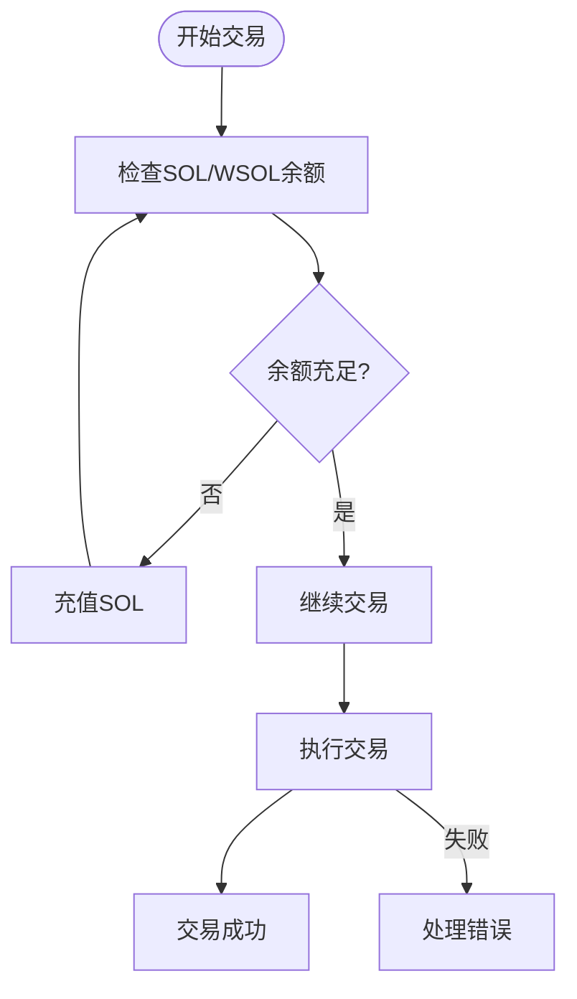
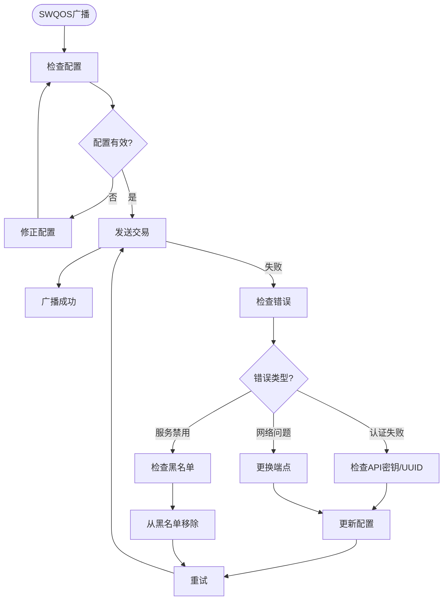
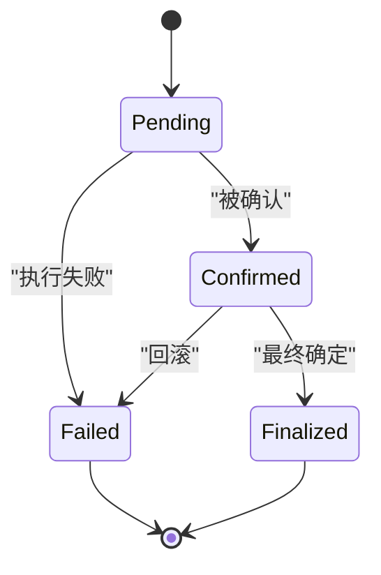
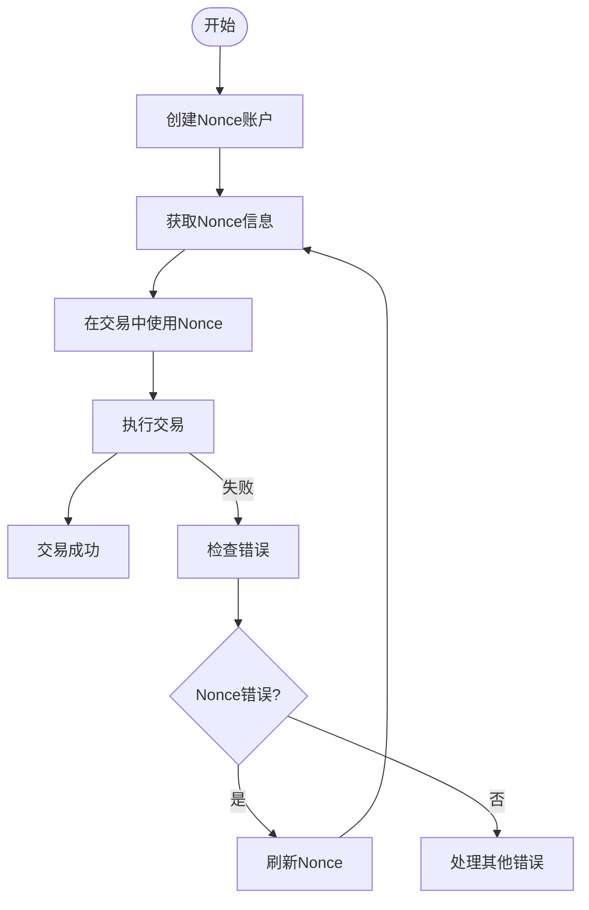
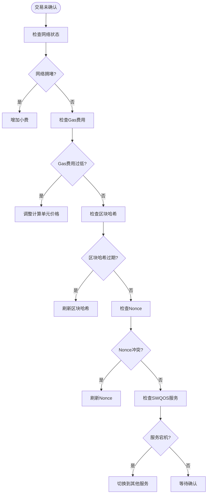

# 故障排查与常见问题

<cite>
**本文档引用的文件**   
- [lib.rs](file://src/lib.rs#L1-L762)
- [swqos/mod.rs](file://src/swqos/mod.rs#L1-L344)
- [common/nonce_cache.rs](file://src/common/nonce_cache.rs#L1-L42)
- [constants/swqos.rs](file://src/constants/swqos.rs#L1-L276)
- [trading/core/executor.rs](file://src/trading/core/executor.rs#L1-L288)
- [trading/core/execution.rs](file://src/trading/core/execution.rs#L1-L156)
- [swqos/common.rs](file://src/swqos/common.rs#L1-L251)
- [CHANGELOG_CN.md](file://CHANGELOG_CN.md#L1-L22)
- [README_CN.md](file://README_CN.md#L1-L322)
- [NONCE_CACHE_CN.md](file://docs/NONCE_CACHE_CN.md#L1-L74)
- [GAS_FEE_STRATEGY_CN.md](file://docs/GAS_FEE_STRATEGY_CN.md#L1-L90)
- [cli_trading/src/main.rs](file://examples/cli_trading/src/main.rs#L1-L800)
- [nonce_cache/src/main.rs](file://examples/nonce_cache/src/main.rs#L1-L169)
</cite>

## 目录
1. [简介](#简介)
2. [常见错误场景与解决方案](#常见错误场景与解决方案)
3. [错误日志与交易状态解读](#错误日志与交易状态解读)
4. [Nonce缓存配置与交易冲突](#nonce缓存配置与交易冲突)
5. [版本兼容性与升级注意事项](#版本兼容性与升级注意事项)
6. [社区常见问题解答](#社区常见问题解答)

## 简介

本指南旨在为开发者提供一份全面的故障排查手册，帮助解决在使用sol-trade-sdk时可能遇到的各类问题。文档涵盖了交易失败、连接超时、SWQOS广播失败等典型错误场景的诊断步骤和解决方案。通过深入分析SDK的错误处理机制、日志系统和核心组件，本文将指导开发者如何正确解读错误信息、配置Nonce缓存以避免交易冲突，并解答社区中常见的技术问题。

**Section sources**
- [README_CN.md](file://README_CN.md#L1-L322)

## 常见错误场景与解决方案

### 交易失败：余额不足

当交易因余额不足而失败时，通常会收到`InsufficientFunds`错误。这可能是由于SOL余额不足以支付交易费用或购买代币所需金额。

**诊断步骤：**
1. 检查钱包的SOL余额，确保有足够的资金支付交易费用（通常需要0.01-0.05 SOL）和购买代币的金额。
2. 使用`get_payer_sol_balance()`方法查询当前余额。
3. 如果使用WSOL进行交易，还需检查WSOL余额是否足够。

**解决方案：**
- 向钱包充值足够的SOL。
- 如果使用WSOL，先通过`wrap_sol_to_wsol()`将SOL包装为WSOL。
- 在交易参数中设置合理的`input_token_amount`。



**Diagram sources**
- [lib.rs](file://src/lib.rs#L634-L644)
- [swqos/common.rs](file://src/swqos/common.rs#L139-L155)

### 交易失败：滑点过大

滑点设置过小会导致交易因价格波动而失败。SDK默认使用1%的滑点，但在市场剧烈波动时可能需要调整。

**诊断步骤：**
1. 检查交易失败时的错误日志，寻找`Slippage tolerance exceeded`相关提示。
2. 分析当前市场价格波动情况，判断是否需要调整滑点。
3. 使用`set_slippage_basis_points()`方法检查当前滑点设置。

**解决方案：**
- 增加滑点容忍度，例如从1%增加到5%或更高。
- 在市场极度波动时，考虑使用更激进的滑点设置。
- 对于狙击交易，可以动态计算最优滑点值。

### 交易失败：Nonce冲突

当多个交易使用相同的Nonce值时会发生冲突，导致交易被拒绝。

**诊断步骤：**
1. 检查错误日志中的`Nonce mismatch`或`Blockhash not found`错误。
2. 确认是否在短时间内发送了多个交易。
3. 检查`durable_nonce`配置是否正确。

**解决方案：**
- 使用`fetch_nonce_info()`获取最新的Nonce值。
- 确保每次交易后都刷新Nonce缓存。
- 配置合理的交易间隔时间。

### 连接超时

连接超时通常是由于网络问题或RPC节点响应缓慢导致。

**诊断步骤：**
1. 检查RPC URL是否正确且可达。
2. 测试网络连接，确保没有防火墙或网络限制。
3. 查看超时错误的具体信息，判断是DNS解析问题还是连接建立问题。

**解决方案：**
- 更换更稳定的RPC服务提供商。
- 增加超时时间配置。
- 实现重试机制，使用指数退避策略。

### SWQOS广播失败

SWQOS服务广播失败可能由多种原因引起，包括API密钥无效、区域端点不可达等。

**诊断步骤：**
1. 检查SWQOS配置中的API密钥或UUID是否正确。
2. 验证所选区域端点是否可用。
3. 查看具体的错误代码和消息。

**解决方案：**
- 确认API密钥或UUID的有效性。
- 尝试使用不同的区域端点。
- 检查`SWQOS_BLACKLIST`配置，确保服务未被禁用。



**Diagram sources**
- [swqos/mod.rs](file://src/swqos/mod.rs#L224-L344)
- [constants/swqos.rs](file://src/constants/swqos.rs#L142-L250)

**Section sources**
- [lib.rs](file://src/lib.rs#L186-L298)
- [swqos/mod.rs](file://src/swqos/mod.rs#L224-L344)
- [constants/swqos.rs](file://src/constants/swqos.rs#L142-L250)

## 错误日志与交易状态解读

### 错误日志结构

sol-trade-sdk的错误日志遵循统一的格式，包含错误代码、消息和可选的指令索引。

```rust
pub struct TradeError {
    pub code: u32,
    pub message: String,
    pub instruction: Option<u8>,
}
```

**关键字段说明：**
- **code**: Solana原生的InstructionError代码，如6表示`InsufficientFunds`。
- **message**: 详细的错误描述，通常包含程序日志中的错误信息。
- **instruction**: 发生错误的指令索引，有助于定位问题。

### 交易确认状态

交易确认状态通过`poll_transaction_confirmation`函数进行轮询检查。

**状态转换流程：**
1. **Pending**: 交易已提交但尚未被确认。
2. **Confirmed**: 交易已被网络确认。
3. **Finalized**: 交易已达到最终确定性。
4. **Failed**: 交易执行失败，包含具体的错误信息。

**超时处理：**
- 默认超时时间为15秒。
- 如果超时，会返回`Transaction confirmation timed out`错误。
- 建议实现重试机制以应对网络拥堵。



**Diagram sources**
- [swqos/common.rs](file://src/swqos/common.rs#L56-L170)

**Section sources**
- [swqos/common.rs](file://src/swqos/common.rs#L56-L170)

## Nonce缓存配置与交易冲突

### Durable Nonce工作原理

Durable Nonce允许创建在较长时间内有效的交易，不受最近区块哈希150个区块的限制。

**核心优势：**
- **交易重放保护**: 防止相同交易被重复执行。
- **时间窗口扩展**: 交易可在更长时间内保持有效。
- **离线交易支持**: 支持预签名交易的离线处理。

### 配置步骤

1. **创建Nonce账户**
   需要先为payer账号创建Nonce账户。
   ```rust
   let nonce_account = Pubkey::from_str("your_nonce_account_address_here")?;
   ```

2. **获取Nonce信息**
   从RPC获取最新的Nonce值。
   ```rust
   let durable_nonce = fetch_nonce_info(&client.rpc, nonce_account).await;
   ```

3. **在交易中使用Nonce**
   将获取到的Nonce信息填入交易参数。
   ```rust
   let buy_params = TradeBuyParams {
       // ... 其他参数
       durable_nonce: durable_nonce, // 设置durable nonce
   };
   ```

### 最佳实践

- **定期刷新**: 每次交易后都应调用`fetch_nonce_info()`获取新的Nonce值。
- **错误处理**: 当收到`Nonce mismatch`错误时，立即刷新Nonce并重试交易。
- **并发控制**: 在多线程环境中，确保Nonce的获取和使用是原子操作。



**Diagram sources**
- [common/nonce_cache.rs](file://src/common/nonce_cache.rs#L18-L42)
- [NONCE_CACHE_CN.md](file://docs/NONCE_CACHE_CN.md#L1-L74)

**Section sources**
- [common/nonce_cache.rs](file://src/common/nonce_cache.rs#L18-L42)
- [NONCE_CACHE_CN.md](file://docs/NONCE_CACHE_CN.md#L1-L74)

## 版本兼容性与升级注意事项

### 最新变更记录

根据`CHANGELOG_CN.md`文件，最新版本3.3.6的主要变更包括：

**新增功能：**
- **Stellium SWQOS支持**：新增Stellium客户端实现，使用标准Solana `sendTransaction` RPC格式。
- **多区域端点支持**：支持8个区域端点（纽约、法兰克福、阿姆斯特丹、东京、伦敦等）。
- **自动连接保活**：60秒ping间隔，确保连接稳定性。

**变更：**
- **更新最低小费要求**以提高交易成功率：
  - NextBlock: 0.00001 → 0.001 SOL
  - ZeroSlot: 0.00001 → 0.001 SOL
  - Temporal: 0.00001 → 0.001 SOL
  - BloxRoute: 0.00001 → 0.001 SOL
  - FlashBlock: 0.00001 → 0.001 SOL
  - BlockRazor: 0.00001 → 0.001 SOL
- 增强异步执行器，添加小费验证警告。

### 升级注意事项

1. **更新小费配置**
   由于多个SWQOS服务的最低小费要求已提高，必须更新Gas Fee策略：
   ```rust
   gas_fee_strategy.set_global_fee_strategy(150000,150000, 500000,500000, 0.001, 0.001, 256 * 1024, 0);
   ```

2. **检查SWQOS黑名单**
   `SWQOS_BLACKLIST`中默认禁用了NextBlock服务，如需使用需从黑名单中移除。

3. **Stellium配置**
   新增的Stellium服务需要API Token认证，配置方式与其他服务一致：
   ```rust
   SwqosConfig::Stellium("your api_token".to_string(), SwqosRegion::Frankfurt, None)
   ```

4. **区域端点选择**
   Stellium支持8个区域端点，建议选择地理位置最近的端点以降低延迟。

**Section sources**
- [CHANGELOG_CN.md](file://CHANGELOG_CN.md#L1-L22)
- [constants/swqos.rs](file://src/constants/swqos.rs#L263-L276)
- [GAS_FEE_STRATEGY_CN.md](file://docs/GAS_FEE_STRATEGY_CN.md#L1-L90)

## 社区常见问题解答

### 如何提高狙击成功率？

提高狙击成功率的关键在于优化交易延迟和配置。

**技术解答：**
1. **选择低延迟SWQOS服务**：优先使用Jito、ZeroSlot等低延迟服务。
2. **优化Gas费用**：设置合理的小费和计算单元价格，参考`GAS_FEE_STRATEGY_CN.md`中的建议值。
3. **使用地址查找表**：通过地址查找表(ALT)减少交易大小，提高打包速度。
4. **并行发送**：同时使用多个SWQOS服务发送交易，最快的成功，其他失败。
5. **预获取Nonce**：提前获取并缓存Nonce信息，减少交易准备时间。

### 为何交易未被确认？

交易未被确认可能由多种原因导致。

**技术解答：**
1. **网络拥堵**：在高负载时期，交易可能需要更长时间才能被确认。解决方案是增加小费或等待网络负载降低。
2. **Gas费用不足**：如果计算单元价格或小费过低，验证者可能不会优先处理您的交易。建议参考`SWQOS_MIN_TIP_*`常量设置合理的小费。
3. **区块哈希过期**：交易的recent_blockhash有150个区块的有效期，超时后需要重新获取。SDK会自动处理此问题。
4. **交易冲突**：如果有多个相同Nonce的交易，只有第一个会被处理。确保每次交易都使用最新的Nonce值。
5. **SWQOS服务问题**：某些SWQOS服务可能暂时不可用。建议配置多个服务作为备用。



**Diagram sources**
- [trading/core/executor.rs](file://src/trading/core/executor.rs#L134-L151)
- [swqos/common.rs](file://src/swqos/common.rs#L56-L170)

**Section sources**
- [trading/core/executor.rs](file://src/trading/core/executor.rs#L134-L151)
- [swqos/common.rs](file://src/swqos/common.rs#L56-L170)