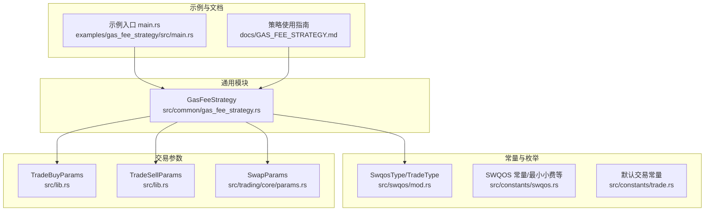
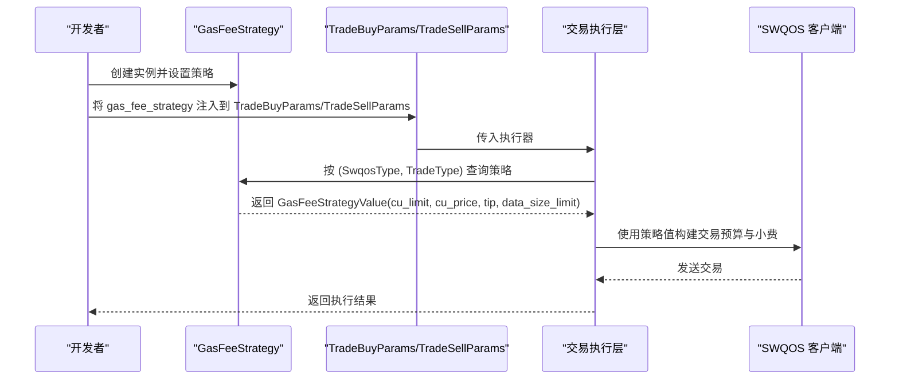
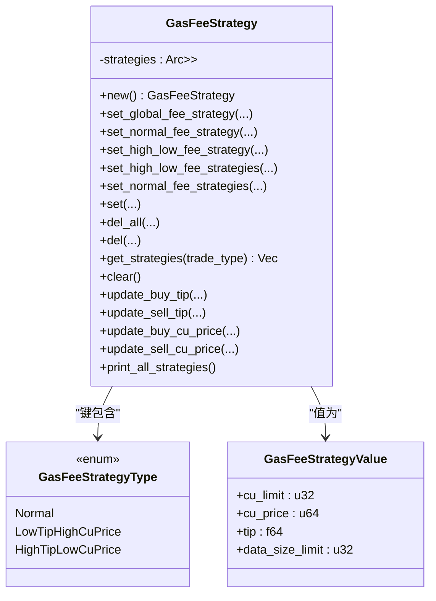
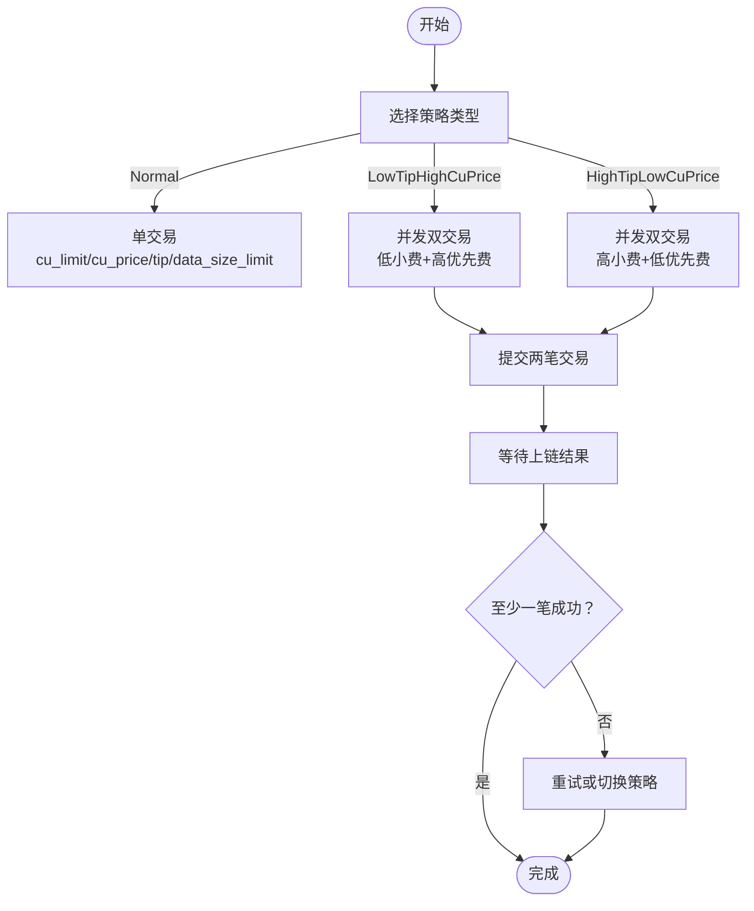
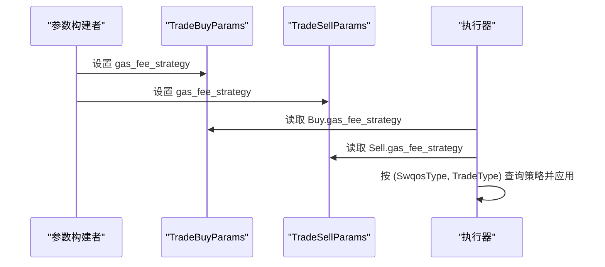
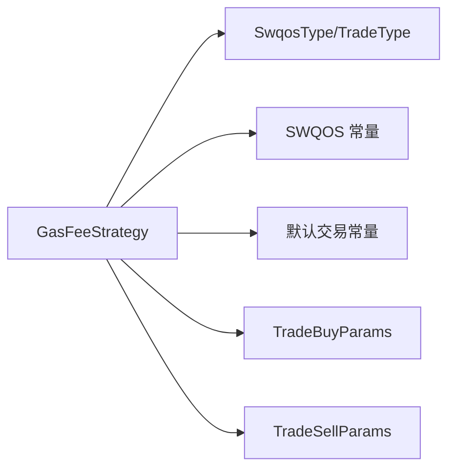

# Gas费策略

<cite>
**本文引用的文件**
- [gas_fee_strategy.rs](file://src/common/gas_fee_strategy.rs)
- [GAS_FEE_STRATEGY.md](file://docs/GAS_FEE_STRATEGY.md)
- [main.rs](file://examples/gas_fee_strategy/src/main.rs)
- [mod.rs](file://src/swqos/mod.rs)
- [swqos.rs](file://src/constants/swqos.rs)
- [trade.rs](file://src/constants/trade.rs)
- [lib.rs](file://src/lib.rs)
- [params.rs](file://src/trading/core/params.rs)
</cite>

## 目录
1. [引言](#引言)
2. [项目结构](#项目结构)
3. [核心组件](#核心组件)
4. [架构总览](#架构总览)
5. [详细组件分析](#详细组件分析)
6. [依赖关系分析](#依赖关系分析)
7. [性能考量](#性能考量)
8. [故障排查指南](#故障排查指南)
9. [结论](#结论)
10. [附录](#附录)

## 引言
本文件面向开发者，系统性解析 sol-trade-sdk 中的 Gas 费策略系统，聚焦于 GasFeeStrategy 的设计与使用。该系统为不同 SWQOS 服务商（如 Jito、BlockRazor 等）与交易类型（买入/卖出）提供动态配置能力，涵盖计算单元（CU）限制、优先费（CU Price）与小费（Tip）的组合策略。文档重点阐述：
- GasFeeStrategy 如何使用 ArcSwap 实现线程安全的策略存储与运行时动态更新；
- 三种策略类型：Normal（标准单交易）、LowTipHighCuPrice（低小费高优先费）、HighTipLowCuPrice（高小费低优先费）；
- 并发发送两笔交易以提升上链成功率的高-低费策略工作原理；
- 关键方法（如 set_normal_fee_strategy、set_high_low_fee_strategy、update_buy_tip 等）的参数与调用逻辑；
- 在 TradeBuyParams/TradeSellParams 中的集成方式；
- 策略查询（print_all_strategies）与清理（clear）机制。

## 项目结构
Gas 费策略位于通用模块 common 下，围绕 SWQOS 提供商与交易类型进行策略分组与选择；在交易参数中通过 TradeBuyParams/TradeSellParams 注入策略实例，最终由交易执行层根据策略生成交易预算与小费配置。

图表来源
- [gas_fee_strategy.rs](file://src/common/gas_fee_strategy.rs#L1-L387)
- [mod.rs](file://src/swqos/mod.rs#L68-L123)
- [swqos.rs](file://src/constants/swqos.rs#L262-L276)
- [trade.rs](file://src/constants/trade.rs#L1-L9)
- [lib.rs](file://src/lib.rs#L89-L169)
- [params.rs](file://src/trading/core/params.rs#L42-L71)
- [main.rs](file://examples/gas_fee_strategy/src/main.rs#L1-L80)
- [GAS_FEE_STRATEGY.md](file://docs/GAS_FEE_STRATEGY.md#L1-L90)

章节来源
- [gas_fee_strategy.rs](file://src/common/gas_fee_strategy.rs#L1-L387)
- [mod.rs](file://src/swqos/mod.rs#L68-L123)
- [lib.rs](file://src/lib.rs#L89-L169)
- [params.rs](file://src/trading/core/params.rs#L42-L71)
- [main.rs](file://examples/gas_fee_strategy/src/main.rs#L1-L80)
- [GAS_FEE_STRATEGY.md](file://docs/GAS_FEE_STRATEGY.md#L1-L90)

## 核心组件
- GasFeeStrategy：策略容器与操作接口，支持全局与按服务商/交易类型的策略配置、删除、批量更新与打印。
- GasFeeStrategyType：策略类型枚举，包含 Normal、LowTipHighCuPrice、HighTipLowCuPrice。
- GasFeeStrategyValue：策略值对象，包含 cu_limit、cu_price、tip、data_size_limit 四项关键参数。
- 依赖枚举：SwqosType（Jito、BlockRazor 等）、TradeType（Buy/Sell 等）。

关键点
- 线程安全：内部以 ArcSwap 包裹 HashMap 存储策略，提供 rcu 更新与 load 访问，避免锁竞争。
- 运行时动态更新：支持按交易类型批量更新 tip/cu_price，或按服务商/交易类型删除/覆盖策略。
- 策略覆盖规则：Normal 与其他两类互斥，设置任一类型会先删除另一类；设置 Normal 会删除该 (SwqosType, TradeType) 组合下的所有高-低费策略。

章节来源
- [gas_fee_strategy.rs](file://src/common/gas_fee_strategy.rs#L6-L31)
- [gas_fee_strategy.rs](file://src/common/gas_fee_strategy.rs#L235-L286)
- [gas_fee_strategy.rs](file://src/common/gas_fee_strategy.rs#L288-L318)

## 架构总览
Gas 费策略在交易执行前被注入到交易参数中，执行阶段依据当前 (SwqosType, TradeType) 选择对应策略，生成对应的 CU 限制、优先费与小费配置，从而影响上链速度与成本。

图表来源
- [gas_fee_strategy.rs](file://src/common/gas_fee_strategy.rs#L235-L385)
- [lib.rs](file://src/lib.rs#L89-L169)
- [params.rs](file://src/trading/core/params.rs#L42-L71)

## 详细组件分析

### GasFeeStrategy 结构与线程安全
- 内部存储：ArcSwap 包裹 HashMap，键为 (SwqosType, TradeType, GasFeeStrategyType)，值为 GasFeeStrategyValue。
- 线程安全更新：通过 ArcSwap::rcu 对映射进行原子替换，避免写锁阻塞读取。
- 读取路径：load 后遍历键集合，按 TradeType 收集策略，保证并发安全。

图表来源
- [gas_fee_strategy.rs](file://src/common/gas_fee_strategy.rs#L27-L31)
- [gas_fee_strategy.rs](file://src/common/gas_fee_strategy.rs#L6-L17)
- [gas_fee_strategy.rs](file://src/common/gas_fee_strategy.rs#L19-L26)

章节来源
- [gas_fee_strategy.rs](file://src/common/gas_fee_strategy.rs#L27-L31)
- [gas_fee_strategy.rs](file://src/common/gas_fee_strategy.rs#L235-L286)

### 策略类型与高-低费策略工作原理
- Normal：每个 (SwqosType, TradeType) 仅配置一个策略，适合稳定成本与确定性执行。
- LowTipHighCuPrice：低小费、高优先费，降低小费成本，提高上链优先级。
- HighTipLowCuPrice：高小费、低优先费，提高小费收益，降低优先费成本。
- 并发双交易：对同一交易类型，同时发送两笔交易（一高一低），以提升至少一笔上链的成功率，从而在波动市场中平衡成本与成功率。

图表来源
- [GAS_FEE_STRATEGY.md](file://docs/GAS_FEE_STRATEGY.md#L1-L20)

章节来源
- [GAS_FEE_STRATEGY.md](file://docs/GAS_FEE_STRATEGY.md#L1-L20)

### 关键方法与参数说明
- set_global_fee_strategy
  - 作用：为除 Default 外的所有 SwqosType 设置 Normal 策略，同时为 Default 设置 Normal 策略（小费为 0）。
  - 参数：买入/卖出 cu_limit、cu_price、buy_tip、sell_tip、buy_data_size_limit、sell_data_size_limit。
  - 场景：快速初始化全局策略，适用于统一成本控制。

- set_normal_fee_strategy / set_normal_fee_strategies
  - 作用：为指定 SwqosType 或一组 SwqosType 设置 Normal 策略，会删除该 (SwqosType, TradeType) 组合下所有高-低费策略。
  - 参数：swqos_type、cu_limit、cu_price、buy_tip、sell_tip、buy_data_size_limit、sell_data_size_limit。
  - 场景：从高-低费策略切换回标准策略，或为特定服务商定制 Normal 策略。

- set_high_low_fee_strategy / set_high_low_fee_strategies
  - 作用：为指定 SwqosType 或一组 SwqosType 设置高-低费策略，会删除 Normal 策略。
  - 参数：swqos_type、trade_type、cu_limit、low_cu_price、high_cu_price、low_tip、high_tip、data_size_limit。
  - 场景：追求成功率优先，通过并发双交易提升上链概率。

- set / del / del_all
  - 作用：底层设置与删除接口，支持按 (SwqosType, TradeType, StrategyType) 精确控制。
  - 场景：细粒度策略管理与覆盖。

- update_buy_tip / update_sell_tip / update_buy_cu_price / update_sell_cu_price
  - 作用：按交易类型批量动态更新 tip 或 cu_price，不改变其他参数。
  - 场景：实时调整小费或优先费，以应对网络拥堵或价格波动。

- print_all_strategies / clear
  - 作用：打印当前所有策略或清空策略。
  - 场景：调试、运维与策略回收。

章节来源
- [gas_fee_strategy.rs](file://src/common/gas_fee_strategy.rs#L38-L165)
- [gas_fee_strategy.rs](file://src/common/gas_fee_strategy.rs#L167-L233)
- [gas_fee_strategy.rs](file://src/common/gas_fee_strategy.rs#L235-L286)
- [gas_fee_strategy.rs](file://src/common/gas_fee_strategy.rs#L288-L385)

### 在 TradeBuyParams/TradeSellParams 中的集成
- 字段：TradeBuyParams 和 TradeSellParams 均包含 gas_fee_strategy: GasFeeStrategy 字段。
- 使用方式：在构建交易参数时，将已配置好的 GasFeeStrategy 实例赋给 gas_fee_strategy 字段，随后在执行阶段由交易层按 (SwqosType, TradeType) 查询策略并应用。

图表来源
- [lib.rs](file://src/lib.rs#L89-L169)
- [params.rs](file://src/trading/core/params.rs#L42-L71)

章节来源
- [lib.rs](file://src/lib.rs#L89-L169)
- [params.rs](file://src/trading/core/params.rs#L42-L71)

### 示例与最佳实践
- 示例入口展示了从创建实例、设置全局策略、打印、清理、设置高-低费策略、切换回 Normal 策略、删除策略到再次打印的完整流程。
- 最佳实践建议：
  - 初始阶段使用 set_global_fee_strategy 快速覆盖大多数服务商；
  - 针对关键服务商（如 Jito）使用 set_high_low_fee_strategy 提升成功率；
  - 在网络拥堵时使用 update_buy_tip/update_sell_tip 提升小费；
  - 使用 print_all_strategies 定期核对策略状态，使用 clear 回收不再使用的策略。

章节来源
- [main.rs](file://examples/gas_fee_strategy/src/main.rs#L1-L80)
- [GAS_FEE_STRATEGY.md](file://docs/GAS_FEE_STRATEGY.md#L1-L90)

## 依赖关系分析
- GasFeeStrategy 依赖：
  - SwqosType/TradeType：作为策略键的一部分，决定策略选择维度。
  - SWQOS 常量：包含各服务商的最小小费阈值等，指导策略参数设置。
  - 默认交易常量：提供默认 CU 限制、优先费与小费参考值。
  - 交易参数结构：在 TradeBuyParams/TradeSellParams 中注入策略实例，供执行层使用。

图表来源
- [gas_fee_strategy.rs](file://src/common/gas_fee_strategy.rs#L1-L31)
- [mod.rs](file://src/swqos/mod.rs#L68-L123)
- [swqos.rs](file://src/constants/swqos.rs#L262-L276)
- [trade.rs](file://src/constants/trade.rs#L1-L9)
- [lib.rs](file://src/lib.rs#L89-L169)

章节来源
- [mod.rs](file://src/swqos/mod.rs#L68-L123)
- [swqos.rs](file://src/constants/swqos.rs#L262-L276)
- [trade.rs](file://src/constants/trade.rs#L1-L9)
- [lib.rs](file://src/lib.rs#L89-L169)

## 性能考量
- 线程安全与并发：ArcSwap 的 rcu 替换避免了写锁阻塞读取，适合高频更新与并发访问场景。
- 策略覆盖与删除：Normal 与其他两类互斥，减少冗余策略带来的查找与内存占用。
- 数据规模：策略键为三元组，数据量随 (服务商数 × 交易类型数 × 策略类型数) 增长，建议按需配置与定期清理。
- 动态更新成本：批量更新 tip/cu_price 为 O(N) 遍历，建议在策略数量可控的前提下使用。

[本节为通用性能讨论，无需列出具体文件来源]

## 故障排查指南
- 策略未生效
  - 检查是否正确注入到 TradeBuyParams/TradeSellParams 的 gas_fee_strategy 字段。
  - 使用 print_all_strategies 核对当前策略表，确认键 (SwqosType, TradeType, StrategyType) 是否匹配。
- 策略被覆盖
  - Normal 与其他两类互斥，若先设置了高-低费策略，再设置 Normal，后者会删除高-低费策略。
- 小费或优先费异常
  - 使用 update_buy_tip/update_sell_tip/update_buy_cu_price/update_sell_cu_price 进行微调。
- 清理策略
  - 使用 del_all 或 clear 进行清理，避免历史策略干扰。

章节来源
- [gas_fee_strategy.rs](file://src/common/gas_fee_strategy.rs#L288-L385)
- [lib.rs](file://src/lib.rs#L89-L169)

## 结论
GasFeeStrategy 通过 ArcSwap 实现线程安全的策略存储与运行时动态更新，结合 Normal 与高-低费策略，为不同 SWQOS 服务商与交易类型提供了灵活的成本与执行优先级管理方案。开发者可通过 set_*、update_*、del_all、clear 等方法精细化控制策略生命周期，并在 TradeBuyParams/TradeSellParams 中无缝集成，最终在交易执行阶段获得最优的上链体验。

[本节为总结性内容，无需列出具体文件来源]

## 附录
- 参考文档：GAS_FEE_STRATEGY.md 提供了策略配置与使用的完整示例与说明。
- 示例程序：examples/gas_fee_strategy 展示了从创建实例到清理策略的全流程。

章节来源
- [GAS_FEE_STRATEGY.md](file://docs/GAS_FEE_STRATEGY.md#L1-L90)
- [main.rs](file://examples/gas_fee_strategy/src/main.rs#L1-L80)