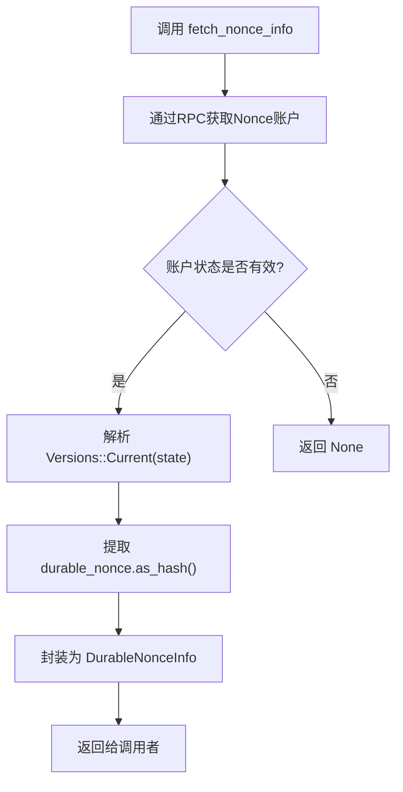

# Nonce缓存

<cite>
**本文档中引用的文件**  
- [nonce_cache.rs](file://src/common/nonce_cache.rs)
- [NONCE_CACHE.md](file://docs/NONCE_CACHE.md)
- [main.rs](file://examples/nonce_cache/src/main.rs)
- [nonce_manager.rs](file://src/trading/common/nonce_manager.rs)
- [params.rs](file://src/trading/core/params.rs)
</cite>

## 目录
1. [简介](#简介)
2. [Durable Nonce的作用](#durable-nonce的作用)
3. [核心实现分析](#核心实现分析)
4. [DurableNonceInfo结构体详解](#durablenonceinfo结构体详解)
5. [使用流程与最佳实践](#使用流程与最佳实践)
6. [在交易参数中的集成](#在交易参数中的集成)
7. [完整使用示例解析](#完整使用示例解析)
8. [关键价值与应用场景](#关键价值与应用场景)

## 简介
本文档深入阐述sol-trade-sdk中Nonce缓存机制的实现原理与重要性。通过分析`fetch_nonce_info`函数的实现，说明SDK如何利用Solana的Durable Nonce功能来提升交易的可靠性与灵活性。文档涵盖从Nonce账户创建到在交易中实际使用的完整流程，并强调操作中的关键注意事项。

## Durable Nonce的作用
Durable Nonce是Solana区块链提供的一项重要功能，旨在解决传统交易依赖最新区块哈希所带来的限制。其核心作用包括：

- **突破150区块限制**：普通交易的有效期通常只有150个区块（约2-3分钟），而使用Durable Nonce的交易有效期可以大大延长，适用于需要长时间有效的场景。
- **防止交易重放**：每个Nonce值只能被使用一次，系统在使用后会自动推进Nonce状态，确保同一笔交易不会被恶意重复执行。
- **支持离线交易**：用户可以在离线状态下预先构建交易，只要Nonce账户状态有效，交易在后续联网时仍可成功提交。
- **降低对最新区块哈希的依赖**：传统交易必须频繁获取最新的`recent_blockhash`，而Durable Nonce提供了一个稳定的交易有效期来源，减少了网络请求的频率和失败风险。

**Section sources**
- [NONCE_CACHE.md](file://docs/NONCE_CACHE.md#L7-L15)

## 核心实现分析
sol-trade-sdk通过`src/common/nonce_cache.rs`文件中的`fetch_nonce_info`函数实现了对Durable Nonce的高效获取。

该函数的核心逻辑如下：
1. 通过`SolanaRpcClient`向指定的Nonce账户地址发起RPC请求，获取账户数据。
2. 解析账户状态，检查其是否为当前版本的`Versions::Current(state)`。
3. 如果账户状态为已初始化（`State::Initialized`），则从中提取出持久化的Nonce值（`durable_nonce`）。
4. 将提取出的Nonce值（即`blockhash`）与账户地址一起封装成`DurableNonceInfo`结构体并返回。

此机制的关键在于，它直接从链上Nonce账户的状态中获取一个持久化的`blockhash`，而不是依赖于短暂的`getLatestBlockhash` API。这使得交易构建者可以使用一个在较长时间内都有效的哈希值，极大地提升了交易策略的稳定性和执行成功率。



**Diagram sources**
- [nonce_cache.rs](file://src/common/nonce_cache.rs#L19-L41)

**Section sources**
- [nonce_cache.rs](file://src/common/nonce_cache.rs#L19-L41)

## DurableNonceInfo结构体详解
`DurableNonceInfo`是SDK中用于封装Nonce相关信息的核心数据结构，定义于`nonce_cache.rs`中。

```rust
pub struct DurableNonceInfo {
    pub nonce_account: Option<Pubkey>,
    pub current_nonce: Option<Hash>,
}
```

- **nonce_account**：这是一个`Pubkey`类型的可选字段，存储了Nonce账户的公钥地址。它标识了用于生成和管理Nonce值的特定账户。在构建交易时，系统需要知道是哪个账户的Nonce状态被使用。
- **current_nonce**：这是一个`Hash`类型的可选字段，存储了从Nonce账户状态中提取出的当前`blockhash`值。这个值将被用作交易的`recent_blockhash`，是实现交易有效期延长和重放保护的直接依据。

这两个字段共同构成了一个完整的Nonce信息包，使得交易构建逻辑可以独立于实时的区块哈希获取过程。

**Section sources**
- [nonce_cache.rs](file://src/common/nonce_cache.rs#L11-L16)

## 使用流程与最佳实践
根据`NONCE_CACHE.md`文档，正确使用Durable Nonce遵循一个严格的“获取-使用-刷新”循环。

### 前提条件
在使用任何Nonce功能之前，**必须**为你的支付者（payer）账户预先创建一个Nonce账户。这通常是一个独立的、一次性的操作。

### 操作流程
1.  **获取 (Fetch)**：在构建每一笔需要Nonce的交易之前，调用`fetch_nonce_info`函数，从RPC获取最新的`DurableNonceInfo`。这确保了你使用的是当前有效的Nonce值。
2.  **使用 (Use)**：将获取到的`DurableNonceInfo`实例作为`durable_nonce`参数，传递给`TradeBuyParams`或`TradeSellParams`等交易参数结构体。
3.  **刷新 (Refresh)**：一旦交易被成功发送并确认，该Nonce值即被消耗。在准备下一笔交易时，必须**重新调用**`fetch_nonce_info`来获取新的Nonce值。重复使用同一个Nonce值会导致交易失败。

**重要警告**：违反“获取-使用-刷新”循环，例如重复使用同一个`DurableNonceInfo`实例，将导致交易因Nonce值已失效而被拒绝。

**Section sources**
- [NONCE_CACHE.md](file://docs/NONCE_CACHE.md#L66-L69)

## 在交易参数中的集成
`DurableNonceInfo`被无缝集成到SDK的交易参数系统中。在`src/trading/core/params.rs`中定义的`SwapParams`结构体（`TradeBuyParams`和`TradeSellParams`的底层结构）包含一个`durable_nonce`字段：

```rust
pub struct SwapParams {
    // ... 其他字段
    pub durable_nonce: Option<DurableNonceInfo>,
    // ... 其他字段
}
```

当这个字段被设置时，交易构建逻辑会自动处理后续事宜：
- **选择Blockhash**：`get_transaction_blockhash`函数会优先使用`durable_nonce`中的`current_nonce`，只有在未设置Nonce时才回退到传统的`recent_blockhash`。
- **添加Nonce指令**：`add_nonce_instruction`函数会自动为交易添加一个`advance_nonce_account`指令，该指令会在交易成功执行时推进Nonce账户的状态，消耗当前的Nonce值并为下一次使用做准备。

这种设计将复杂的Nonce管理逻辑封装在SDK内部，用户只需提供`DurableNonceInfo`即可。

**Section sources**
- [params.rs](file://src/trading/core/params.rs#L62)
- [nonce_manager.rs](file://src/trading/common/nonce_manager.rs#L29-L40)

## 完整使用示例解析
`examples/nonce_cache/src/main.rs`提供了一个完整的使用示例。

该示例展示了如何：
1.  初始化`SolanaTrade`客户端。
2.  定义一个Nonce账户的公钥字符串。
3.  调用`fetch_nonce_info`异步函数，传入RPC客户端和Nonce账户地址，获取`durable_nonce`实例。
4.  在构建`TradeBuyParams`时，将获取到的`durable_nonce`赋值给对应的字段。
5.  调用`client.buy(buy_params)`执行交易。

此示例清晰地体现了从获取Nonce信息到在交易中使用的完整代码路径，是开发者实践该功能的直接参考。

**Section sources**
- [main.rs](file://examples/nonce_cache/src/main.rs#L124-L125)
- [main.rs](file://examples/nonce_cache/src/main.rs#L159)

## 关键价值与应用场景
Durable Nonce功能在以下场景中具有不可替代的关键价值：

- **高频交易与狙击策略**：在PumpFun等平台进行狙击时，网络延迟可能导致获取的`recent_blockhash`在交易构建完成前就已过期。使用Durable Nonce可以预先获取一个长期有效的哈希，从容构建和签名交易，显著提高成功率。
- **预签名与离线交易**：对于需要多方签名或在安全离线环境中生成的交易，Durable Nonce允许交易在创建时就确定有效期，而无需在广播前联网获取最新区块哈希。
- **复杂交易流水线**：在涉及多个步骤或条件的自动化交易系统中，Durable Nonce提供了一个稳定的时序基础，避免了因区块哈希快速过期而导致的流水线中断。

总而言之，Nonce缓存机制通过利用Solana的Durable Nonce特性，为sol-trade-sdk的用户提供了更强的交易控制力、更高的执行可靠性和更灵活的策略设计空间。

**Section sources**
- [NONCE_CACHE.md](file://docs/NONCE_CACHE.md#L10-L15)