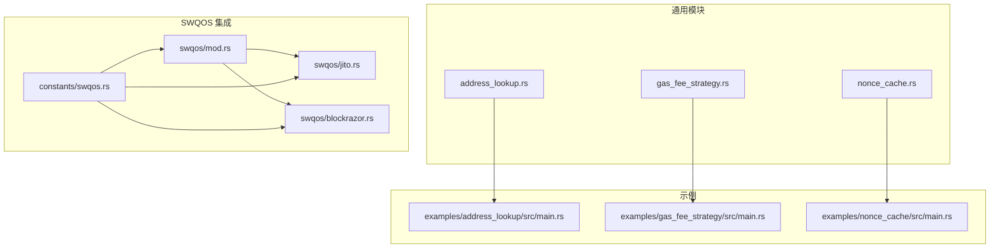
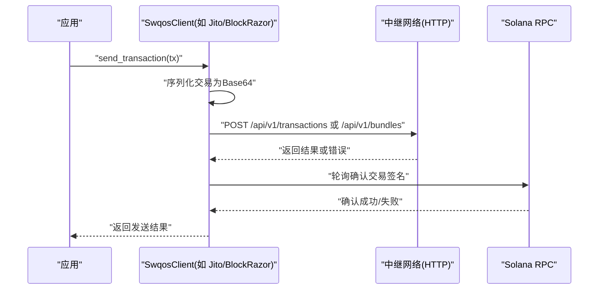
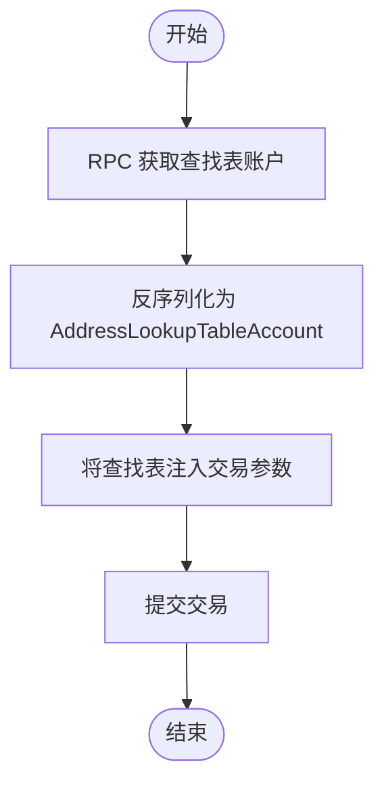
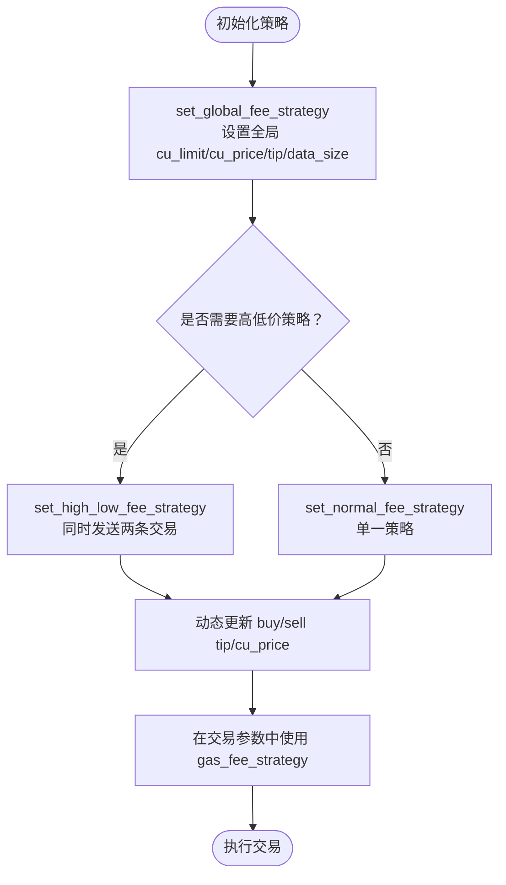
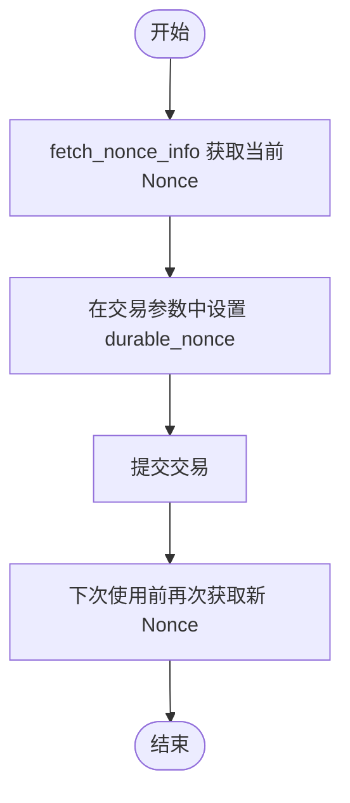
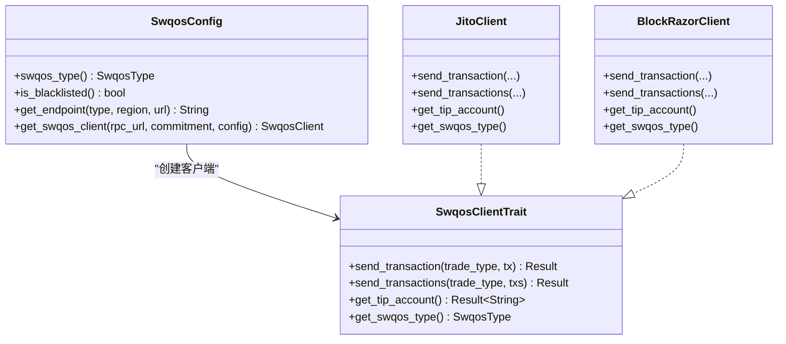
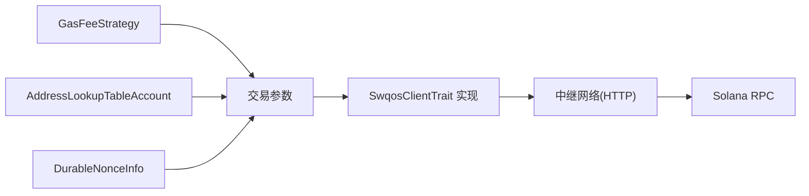

# 核心概念详解

<cite>
**本文引用的文件**
- [address_lookup.rs](file://src/common/address_lookup.rs)
- [GAS_FEE_STRATEGY.md](file://docs/GAS_FEE_STRATEGY.md)
- [gas_fee_strategy.rs](file://src/common/gas_fee_strategy.rs)
- [NONCE_CACHE.md](file://docs/NONCE_CACHE.md)
- [nonce_cache.rs](file://src/common/nonce_cache.rs)
- [swqos.rs](file://src/swqos/mod.rs)
- [swqos_constants.rs](file://src/constants/swqos.rs)
- [jito.rs](file://src/swqos/jito.rs)
- [blockrazor.rs](file://src/swqos/blockrazor.rs)
- [address_lookup_example_main.rs](file://examples/address_lookup/src/main.rs)
- [gas_fee_strategy_example_main.rs](file://examples/gas_fee_strategy/src/main.rs)
- [nonce_cache_example_main.rs](file://examples/nonce_cache/src/main.rs)
</cite>

## 目录
1. [引言](#引言)
2. [项目结构](#项目结构)
3. [核心组件](#核心组件)
4. [架构总览](#架构总览)
5. [详细组件分析](#详细组件分析)
6. [依赖关系分析](#依赖关系分析)
7. [性能考量](#性能考量)
8. [故障排查指南](#故障排查指南)
9. [结论](#结论)
10. [附录](#附录)

## 引言
本篇文档围绕 sol-trade-sdk 的四大关键能力进行深入解析：地址查找表（Address Lookup Table，简称 ALT）优化、Gas 费用策略（Gas Fee Strategy）动态调整、Nonce 缓存以降低 RPC 调用与提升并发吞吐、以及 SWQOS（Solana 优质服务）通过 Jito、BlockRazor 等中继网络实现交易优先广播。我们将从原理、实现细节、数据流、错误处理与性能影响等维度展开，并给出实际应用场景与配置示例路径，帮助开发者快速掌握并正确使用这些能力。

## 项目结构
该仓库采用按功能域划分的组织方式：
- src/common：通用工具与策略模块（如 ALT、Gas Fee、Nonce）
- src/swqos：SWQOS 中继网络适配层（Jito、BlockRazor、NextBlock 等）
- src/constants：SWQOS 常量（端点、小费账户、最小小费等）
- docs：各模块的中文文档
- examples：各模块的使用示例

图表来源
- [address_lookup.rs](file://src/common/address_lookup.rs#L1-L18)
- [gas_fee_strategy.rs](file://src/common/gas_fee_strategy.rs#L1-L387)
- [nonce_cache.rs](file://src/common/nonce_cache.rs#L1-L42)
- [swqos.rs](file://src/swqos/mod.rs#L1-L344)
- [swqos_constants.rs](file://src/constants/swqos.rs#L1-L276)
- [jito.rs](file://src/swqos/jito.rs#L1-L170)
- [blockrazor.rs](file://src/swqos/blockrazor.rs#L1-L227)
- [address_lookup_example_main.rs](file://examples/address_lookup/src/main.rs#L1-L169)
- [gas_fee_strategy_example_main.rs](file://examples/gas_fee_strategy/src/main.rs#L1-L80)
- [nonce_cache_example_main.rs](file://examples/nonce_cache/src/main.rs#L1-L169)

章节来源
- [address_lookup.rs](file://src/common/address_lookup.rs#L1-L18)
- [gas_fee_strategy.rs](file://src/common/gas_fee_strategy.rs#L1-L387)
- [nonce_cache.rs](file://src/common/nonce_cache.rs#L1-L42)
- [swqos.rs](file://src/swqos/mod.rs#L1-L344)
- [swqos_constants.rs](file://src/constants/swqos.rs#L1-L276)
- [jito.rs](file://src/swqos/jito.rs#L1-L170)
- [blockrazor.rs](file://src/swqos/blockrazor.rs#L1-L227)
- [address_lookup_example_main.rs](file://examples/address_lookup/src/main.rs#L1-L169)
- [gas_fee_strategy_example_main.rs](file://examples/gas_fee_strategy/src/main.rs#L1-L80)
- [nonce_cache_example_main.rs](file://examples/nonce_cache/src/main.rs#L1-L169)

## 核心组件
- 地址查找表（ALT）：通过查询并注入地址查找表账户，显著降低交易体积与费用，适用于大型交易场景。
- Gas 费用策略：支持“普通”与“高低优先级”两种策略，动态设置 CU 限制、CU 单价、小费与数据大小上限，并可按 SWQOS 类型与交易类型灵活组合。
- Nonce 缓存：通过 RPC 查询持久化 Nonce，减少对最新区块哈希的依赖，提升离线/批量交易的确定性与吞吐。
- SWQOS：统一抽象不同中继网络（Jito、BlockRazor、NextBlock 等），提供交易发送、确认轮询、Tip 账户选择与区域端点管理。

章节来源
- [address_lookup.rs](file://src/common/address_lookup.rs#L1-L18)
- [GAS_FEE_STRATEGY.md](file://docs/GAS_FEE_STRATEGY.md#L1-L90)
- [gas_fee_strategy.rs](file://src/common/gas_fee_strategy.rs#L1-L387)
- [NONCE_CACHE.md](file://docs/NONCE_CACHE.md#L1-L74)
- [nonce_cache.rs](file://src/common/nonce_cache.rs#L1-L42)
- [swqos.rs](file://src/swqos/mod.rs#L1-L344)
- [swqos_constants.rs](file://src/constants/swqos.rs#L1-L276)

## 架构总览
下图展示了 SWQOS 的整体交互：客户端根据配置创建具体中继客户端，序列化交易并通过 HTTP 发送；随后通过 RPC 轮询确认签名状态。

图表来源
- [jito.rs](file://src/swqos/jito.rs#L68-L126)
- [blockrazor.rs](file://src/swqos/blockrazor.rs#L156-L200)
- [swqos.rs](file://src/swqos/mod.rs#L224-L343)

## 详细组件分析

### 地址查找表（Address Lookup Table，ALT）
- 原理与优势
  - 将频繁使用的地址存储在查找表中，交易中仅使用索引引用，大幅减少交易体积与费用，提升网络效率与处理速度。
- 实现要点
  - 通过 RPC 获取账户数据并反序列化为地址查找表账户对象，供交易构建时使用。
- 关键流程
  - 获取查找表账户 -> 注入到交易参数 -> 提交交易。
- 应用场景
  - 大型 AMM 交易、多指令打包交易、多 Token 持有者授权场景。
- 配置示例路径
  - 示例中演示了如何加载查找表并将其传入购买参数：[示例入口](file://examples/address_lookup/src/main.rs#L123-L164)

图表来源
- [address_lookup.rs](file://src/common/address_lookup.rs#L6-L17)
- [address_lookup_example_main.rs](file://examples/address_lookup/src/main.rs#L123-L164)

章节来源
- [address_lookup.rs](file://src/common/address_lookup.rs#L1-L18)
- [ADDRESS_LOOKUP_TABLE.md](file://docs/ADDRESS_LOOKUP_TABLE.md#L1-L67)
- [address_lookup_example_main.rs](file://examples/address_lookup/src/main.rs#L123-L164)

### Gas 费用策略（Gas Fee Strategy）
- 策略类型
  - 普通策略：为某 (SwqosType, TradeType) 组合设定 cu_limit、cu_price、tip、data_size_limit。
  - 高低优先级策略：同时发送两条交易，一条低 tip 高 cu_price，另一条高 tip 低 cu_price，以提高被优先处理的概率。
- 动态调整
  - 支持按交易类型动态更新 buy/sell 的 tip 与 cu_price，且不会影响其他参数。
  - 支持批量设置全局策略、按服务类型设置高低价策略或标准策略，并自动清理冲突策略。
- 计算模型
  - cu_limit：交易的计算单元预算。
  - cu_price：每 CU 的优先费用（优先被验证器打包）。
  - tip：额外的小费，用于进一步提升优先级。
  - data_size_limit：交易数据大小上限。
- 应用场景
  - 高波动市场中提升确认速度；批量交易中平衡成本与优先级；针对不同中继网络（Jito、BlockRazor 等）定制策略。
- 配置示例路径
  - 文档示例：[策略配置与使用](file://docs/GAS_FEE_STRATEGY.md#L1-L90)
  - 代码示例：[策略设置与打印](file://examples/gas_fee_strategy/src/main.rs#L1-L80)

图表来源
- [gas_fee_strategy.rs](file://src/common/gas_fee_strategy.rs#L38-L233)
- [gas_fee_strategy.rs](file://src/common/gas_fee_strategy.rs#L235-L387)
- [GAS_FEE_STRATEGY.md](file://docs/GAS_FEE_STRATEGY.md#L1-L90)
- [gas_fee_strategy_example_main.rs](file://examples/gas_fee_strategy/src/main.rs#L1-L80)

章节来源
- [gas_fee_strategy.rs](file://src/common/gas_fee_strategy.rs#L1-L387)
- [GAS_FEE_STRATEGY.md](file://docs/GAS_FEE_STRATEGY.md#L1-L90)
- [gas_fee_strategy_example_main.rs](file://examples/gas_fee_strategy/src/main.rs#L1-L80)

### Nonce 缓存（Durable Nonce）
- 原理与优势
  - 使用持久化 Nonce 账户替代短期 blockhash，延长交易有效期，防止重放攻击，降低对最新区块哈希的依赖，提升离线/批量交易的确定性。
- 实现要点
  - 通过 RPC 获取 Nonce 账户状态，提取当前 Nonce 值；每次使用后需刷新以获得新 Nonce。
- 关键流程
  - 获取 Nonce -> 在交易参数中设置 durable_nonce -> 使用后再次获取新 Nonce。
- 应用场景
  - 批量交易、离线签名交易、跨节点一致性交易。
- 配置示例路径
  - 示例中演示了如何获取 Nonce 并注入到购买参数：[示例入口](file://examples/nonce_cache/src/main.rs#L123-L164)

图表来源
- [nonce_cache.rs](file://src/common/nonce_cache.rs#L18-L42)
- [NONCE_CACHE.md](file://docs/NONCE_CACHE.md#L1-L74)
- [nonce_cache_example_main.rs](file://examples/nonce_cache/src/main.rs#L123-L164)

章节来源
- [nonce_cache.rs](file://src/common/nonce_cache.rs#L1-L42)
- [NONCE_CACHE.md](file://docs/NONCE_CACHE.md#L1-L74)
- [nonce_cache_example_main.rs](file://examples/nonce_cache/src/main.rs#L123-L164)

### SWQOS（Solana 优质服务）
- 概念与目标
  - 通过 Jito、BlockRazor、NextBlock 等中继网络实现交易优先广播与更优确认体验，支持多区域端点与 Tip 账户。
- 组件关系
  - swqos/mod.rs 定义了 SwqosType、TradeType、SwqosClientTrait 接口与配置枚举。
  - constants/swqos.rs 提供各中继的端点列表、Tip 账户集合与最小小费常量。
  - 各中继模块（如 jito.rs、blockrazor.rs）实现具体发送逻辑与连接池优化。
- 关键流程
  - 解析 SwqosConfig -> 创建对应客户端 -> 序列化交易 -> 发送到中继 -> 轮询确认。
- 应用场景
  - 高频交易、抢跑交易、批量交易优先广播。
- 配置示例路径
  - 默认 RPC：[示例入口](file://examples/address_lookup/src/main.rs#L101-L111)
  - Jito/BlockRazor 配置与发送：[Jito 客户端](file://src/swqos/jito.rs#L68-L126)，[BlockRazor 客户端](file://src/swqos/blockrazor.rs#L156-L200)

图表来源
- [swqos.rs](file://src/swqos/mod.rs#L68-L201)
- [swqos.rs](file://src/swqos/mod.rs#L224-L343)
- [swqos_constants.rs](file://src/constants/swqos.rs#L1-L276)
- [jito.rs](file://src/swqos/jito.rs#L1-L170)
- [blockrazor.rs](file://src/swqos/blockrazor.rs#L1-L227)

章节来源
- [swqos.rs](file://src/swqos/mod.rs#L1-L344)
- [swqos_constants.rs](file://src/constants/swqos.rs#L1-L276)
- [jito.rs](file://src/swqos/jito.rs#L1-L170)
- [blockrazor.rs](file://src/swqos/blockrazor.rs#L1-L227)

## 依赖关系分析
- Gas Fee 策略与 SWQOS 类型耦合：策略按 (SwqosType, TradeType, StrategyType) 存储，便于在不同中继网络上差异化定价。
- Nonce 与交易参数：交易参数包含 durable_nonce 字段，用于替换 blockhash 期限限制。
- ALT 与交易构建：交易参数可选包含地址查找表账户，减少交易体积。
- SWQOS 客户端族：各中继客户端实现统一接口，便于切换与扩展。

图表来源
- [gas_fee_strategy.rs](file://src/common/gas_fee_strategy.rs#L1-L387)
- [address_lookup.rs](file://src/common/address_lookup.rs#L1-L18)
- [nonce_cache.rs](file://src/common/nonce_cache.rs#L1-L42)
- [swqos.rs](file://src/swqos/mod.rs#L127-L201)

章节来源
- [gas_fee_strategy.rs](file://src/common/gas_fee_strategy.rs#L1-L387)
- [address_lookup.rs](file://src/common/address_lookup.rs#L1-L18)
- [nonce_cache.rs](file://src/common/nonce_cache.rs#L1-L42)
- [swqos.rs](file://src/swqos/mod.rs#L127-L201)

## 性能考量
- ALT
  - 显著降低交易体积与费用，减少带宽占用与验证时间，适合大型交易。
- Gas Fee 策略
  - 通过 cu_price 与 tip 的动态调整，在成本与优先级之间取得平衡；高低价策略可提升确认概率。
- Nonce 缓存
  - 减少对最新 blockhash 的依赖，提升离线/批量交易的稳定性与吞吐。
- SWQOS
  - 合理选择中继网络与区域端点，利用连接池优化与 Tip 账户，提升广播效率与确认速度。

[本节为通用性能讨论，不直接分析具体文件]

## 故障排查指南
- ALT
  - 确认查找表地址有效、RPC 支持、网络一致（mainnet/devnet/testnet）。
  - 参考：[文档说明](file://docs/ADDRESS_LOOKUP_TABLE.md#L53-L67)
- Gas Fee 策略
  - 检查策略覆盖范围与冲突清理（Normal 与高低价策略互斥）。
  - 参考：[策略设置与清理](file://src/common/gas_fee_strategy.rs#L235-L286)
- Nonce 缓存
  - 每次使用后必须刷新 Nonce；检查账户状态与权限。
  - 参考：[使用流程](file://docs/NONCE_CACHE.md#L65-L71)
- SWQOS
  - 检查中继端点可用性、认证信息、黑名单配置；关注最小小费阈值。
  - 参考：[SWQOS 黑名单与最小小费](file://src/swqos/mod.rs#L61-L71)，[最小小费常量](file://src/constants/swqos.rs#L263-L276)

章节来源
- [ADDRESS_LOOKUP_TABLE.md](file://docs/ADDRESS_LOOKUP_TABLE.md#L53-L67)
- [gas_fee_strategy.rs](file://src/common/gas_fee_strategy.rs#L235-L286)
- [NONCE_CACHE.md](file://docs/NONCE_CACHE.md#L65-L71)
- [swqos.rs](file://src/swqos/mod.rs#L61-L71)
- [swqos_constants.rs](file://src/constants/swqos.rs#L263-L276)

## 结论
- ALT、Gas Fee 策略、Nonce 缓存与 SWQOS 是 sol-trade-sdk 的四大性能与可靠性基石。
- ALT 降低交易体积与费用；Gas Fee 策略在成本与优先级间动态权衡；Nonce 缓存提升确定性与吞吐；SWQOS 通过多中继网络实现优先广播。
- 建议在高频/大额交易中综合使用这些能力，并结合示例与文档进行配置与调试。

[本节为总结性内容，不直接分析具体文件]

## 附录
- 实际应用示例路径
  - ALT 示例：[示例入口](file://examples/address_lookup/src/main.rs#L123-L164)
  - Gas Fee 策略示例：[示例入口](file://examples/gas_fee_strategy/src/main.rs#L1-L80)
  - Nonce 缓存示例：[示例入口](file://examples/nonce_cache/src/main.rs#L123-L164)
- 相关文档
  - [Gas Fee 策略文档](file://docs/GAS_FEE_STRATEGY.md#L1-L90)
  - [Address Lookup Table 文档](file://docs/ADDRESS_LOOKUP_TABLE.md#L1-L67)
  - [Nonce 缓存文档](file://docs/NONCE_CACHE.md#L1-L74)

[本节为补充材料，不直接分析具体文件]