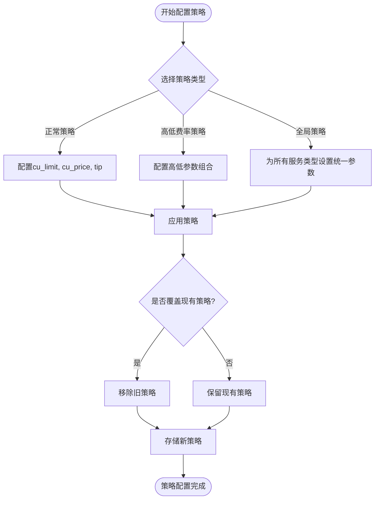
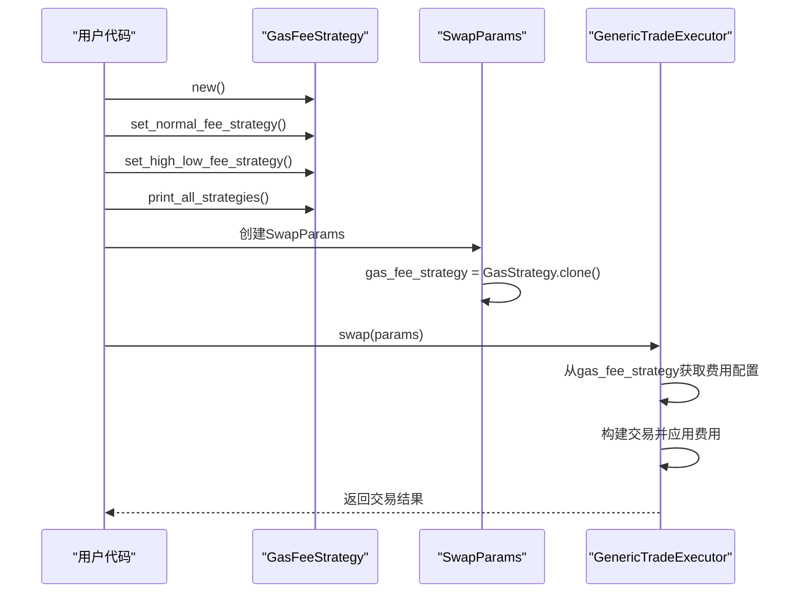
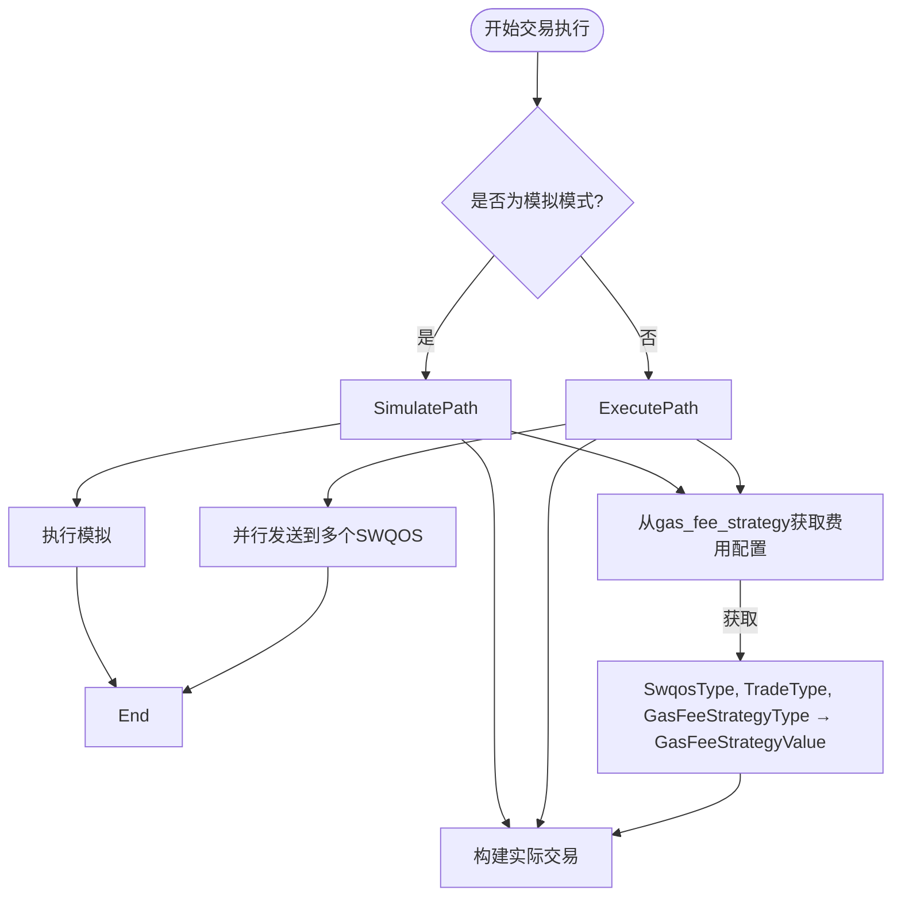
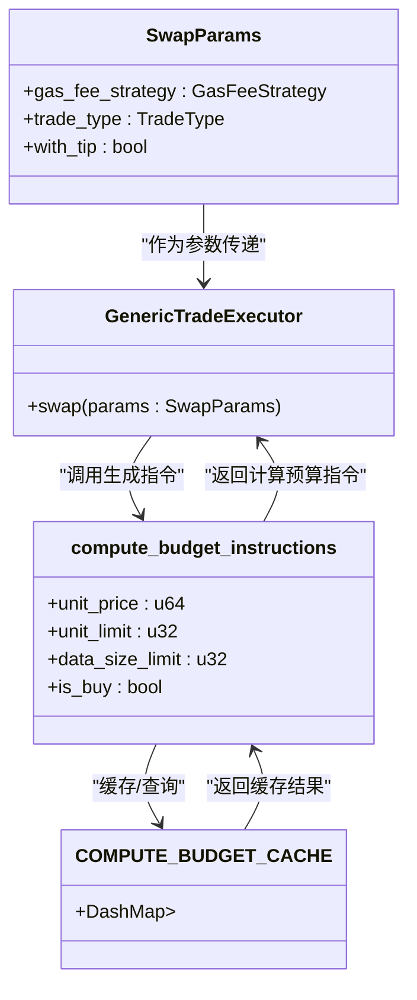
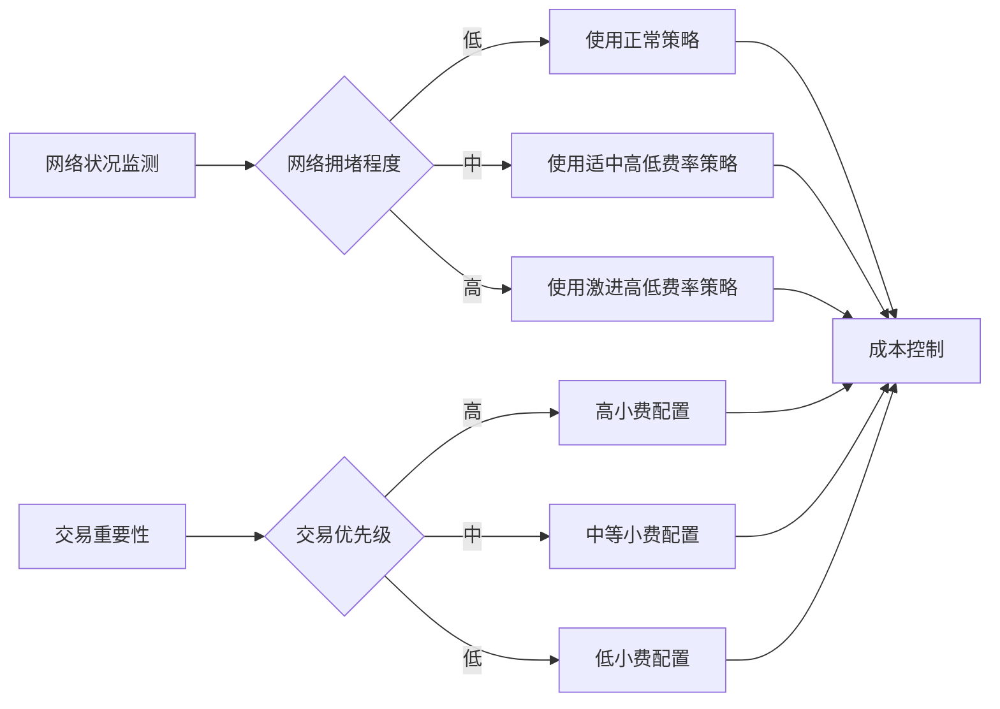

# Gas费策略配置示例详解

<cite>
**本文档引用文件**  
- [main.rs](file://examples/gas_fee_strategy/src/main.rs)
- [gas_fee_strategy.rs](file://src/common/gas_fee_strategy.rs)
- [params.rs](file://src/trading/core/params.rs)
- [executor.rs](file://src/trading/core/executor.rs)
- [transaction_builder.rs](file://src/trading/common/transaction_builder.rs)
- [compute_budget_manager.rs](file://src/trading/common/compute_budget_manager.rs)
- [mod.rs](file://src/swqos/mod.rs)
</cite>

## 目录
1. [引言](#引言)
2. [GasFeeStrategy核心组件分析](#gasfeestrategy核心组件分析)
3. [策略类型与适用场景](#策略类型与适用场景)
4. [策略配置与注入流程](#策略配置与注入流程)
5. [交易执行中的费用应用](#交易执行中的费用应用)
6. [性能影响与成本控制](#性能影响与成本控制)
7. [配置建议与最佳实践](#配置建议与最佳实践)

## 引言
本文档基于`gas_fee_strategy`示例，全面讲解如何在Sol-Trade-SDK中配置和应用动态Gas费与小费策略以提升交易上链成功率。通过剖析代码中`GasFeeStrategy`的实例化过程，包括基础费用计算、市场拥堵检测、小费阶梯调整等逻辑，说明不同策略模式（如固定、动态、预测型）的适用场景，并结合实际网络状况给出配置建议。演示如何将自定义策略注入`TradingClient`，并通过日志观察费用设置效果。同时提供性能影响评估和成本控制平衡方案。

## GasFeeStrategy核心组件分析

`GasFeeStrategy`是Sol-Trade-SDK中用于管理交易费用策略的核心组件，通过灵活的策略配置机制提升交易上链成功率。

```mermaid
classDiagram
class GasFeeStrategy {
+strategies : Arc<ArcSwap<HashMap<(SwqosType, TradeType, GasFeeStrategyType), GasFeeStrategyValue>>>
+new() GasFeeStrategy
+set_global_fee_strategy(buy_cu_limit : u32, sell_cu_limit : u32, buy_cu_price : u64, sell_cu_price : u64, buy_tip : f64, sell_tip : f64, buy_data_size_limit : u32, sell_data_size_limit : u32) void
+set_normal_fee_strategy(swqos_type : SwqosType, cu_limit : u32, cu_price : u64, buy_tip : f64, sell_tip : f64, buy_data_size_limit : u32, sell_data_size_limit : u32) void
+set_high_low_fee_strategy(swqos_type : SwqosType, trade_type : TradeType, cu_limit : u32, low_cu_price : u64, high_cu_price : u64, low_tip : f64, high_tip : f64, data_size_limit : u32) void
+del_all(swqos_type : SwqosType, trade_type : TradeType) void
+print_all_strategies() void
+clear() void
+update_buy_tip(buy_tip : f64) void
+update_sell_tip(sell_tip : f64) void
}
class GasFeeStrategyValue {
+cu_limit : u32
+cu_price : u64
+tip : f64
+data_size_limit : u32
}
class GasFeeStrategyType {
<<enumeration>>
Normal
LowTipHighCuPrice
HighTipLowCuPrice
}
class SwqosType {
<<enumeration>>
Jito
NextBlock
ZeroSlot
Temporal
Bloxroute
Node1
FlashBlock
BlockRazor
Astralane
Stellium
Lightspeed
Soyas
Default
}
class TradeType {
<<enumeration>>
Create
CreateAndBuy
Buy
Sell
}
GasFeeStrategy --> GasFeeStrategyValue : "包含"
GasFeeStrategy --> GasFeeStrategyType : "使用"
GasFeeStrategy --> SwqosType : "关联"
GasFeeStrategy --> TradeType : "关联"
```

**图表来源**  
- [gas_fee_strategy.rs](file://src/common/gas_fee_strategy.rs#L6-L387)
- [mod.rs](file://src/swqos/mod.rs#L68-L103)

**本节来源**  
- [gas_fee_strategy.rs](file://src/common/gas_fee_strategy.rs#L6-L387)
- [mod.rs](file://src/swqos/mod.rs#L68-L103)

## 策略类型与适用场景

### 正常策略（Normal Strategy）
正常策略为每个交易类型设置固定的计算单元限制、价格和小费。适用于网络状况稳定、交易优先级要求不高的场景。

### 高低费率策略（High-Low Fee Strategy）
高低费率策略通过同时发送两笔交易来提高上链成功率：
- 一笔低小费高优先费交易：降低成本
- 一笔高小费低优先费交易：确保在拥堵时优先上链

这种策略特别适用于市场剧烈波动或新代币首发等高竞争场景。

### 全局策略（Global Strategy）
全局策略为所有SWQOS服务类型设置统一的费用参数，简化配置流程。适用于需要快速部署、对不同服务类型没有特殊要求的场景。



**图表来源**  
- [gas_fee_strategy.rs](file://src/common/gas_fee_strategy.rs#L38-L259)

**本节来源**  
- [gas_fee_strategy.rs](file://src/common/gas_fee_strategy.rs#L38-L259)
- [GAS_FEE_STRATEGY_CN.md](file://docs/GAS_FEE_STRATEGY_CN.md#L11-L13)

## 策略配置与注入流程

### 策略配置流程
策略配置流程从创建`GasFeeStrategy`实例开始，通过一系列方法调用完成策略设置：

1. 创建`GasFeeStrategy`实例
2. 设置全局策略或特定服务类型策略
3. 可选择性地清除或删除现有策略
4. 打印所有策略进行验证

### 策略注入机制
策略通过`SwapParams`结构体注入到交易执行器中，作为交易参数的一部分传递给`GenericTradeExecutor`。



**图表来源**  
- [main.rs](file://examples/gas_fee_strategy/src/main.rs#L11-L76)
- [params.rs](file://src/trading/core/params.rs#L69)
- [executor.rs](file://src/trading/core/executor.rs#L97)

**本节来源**  
- [main.rs](file://examples/gas_fee_strategy/src/main.rs#L11-L76)
- [params.rs](file://src/trading/core/params.rs#L69)
- [executor.rs](file://src/trading/core/executor.rs#L97)

## 交易执行中的费用应用

### 费用参数提取
在交易执行过程中，`GenericTradeExecutor`从`GasFeeStrategy`中提取相应的费用配置：



### 计算预算指令生成
费用参数最终转化为Solana的计算预算指令，通过`compute_budget_manager`模块实现缓存优化：



**图表来源**  
- [executor.rs](file://src/trading/core/executor.rs#L202-L214)
- [compute_budget_manager.rs](file://src/trading/common/compute_budget_manager.rs#L22-L64)
- [transaction_builder.rs](file://src/trading/common/transaction_builder.rs#L22-L31)

**本节来源**  
- [executor.rs](file://src/trading/core/executor.rs#L202-L214)
- [compute_budget_manager.rs](file://src/trading/common/compute_budget_manager.rs#L22-L64)
- [transaction_builder.rs](file://src/trading/common/transaction_builder.rs#L22-L31)

## 性能影响与成本控制

### 性能优化机制
`GasFeeStrategy`通过以下机制实现性能优化：
- 使用`ArcSwap`实现无锁并发访问
- `compute_budget_manager`中的指令缓存减少重复计算
- 原子性策略更新避免竞态条件

### 成本控制策略
合理的成本控制需要平衡上链成功率与交易成本：
- 在网络低峰期使用正常策略降低成本
- 在高峰期采用高低费率策略确保成功率
- 根据交易重要性分级设置不同策略

### 动态调整能力
`GasFeeStrategy`支持运行时动态调整费用参数，无需重新创建实例：
- `update_buy_tip()` 动态更新买入小费
- `update_sell_tip()` 动态更新卖出小费
- `update_buy_cu_price()` 动态更新买入优先费
- `update_sell_cu_price()` 动态更新卖出优先费



**图表来源**  
- [gas_fee_strategy.rs](file://src/common/gas_fee_strategy.rs#L320-L374)
- [compute_budget_manager.rs](file://src/trading/common/compute_budget_manager.rs#L18-L19)

**本节来源**  
- [gas_fee_strategy.rs](file://src/common/gas_fee_strategy.rs#L320-L374)
- [compute_budget_manager.rs](file://src/trading/common/compute_budget_manager.rs#L18-L19)

## 配置建议与最佳实践

### 策略选择建议
| 场景 | 推荐策略 | 说明 |
|------|----------|------|
| 日常交易 | 正常策略 | 成本低，配置简单 |
| 新币首发 | 高低费率策略 | 提高抢购成功率 |
| 套利交易 | 全局策略 | 快速部署，统一管理 |
| 大额交易 | 组合策略 | 不同金额采用不同策略 |

### 参数设置指南
- **计算单元限制(cu_limit)**：根据交易复杂度设置，建议150000-500000
- **计算单元价格(cu_price)**：参考网络当前费率，动态调整
- **小费(tip)**：0.001-0.1 SOL，根据紧急程度调整
- **数据大小限制(data_size_limit)**：买入时设置，提高优先级

### 监控与调优
定期使用`print_all_strategies()`方法检查策略配置，结合交易结果日志进行调优。在策略效果不佳时，可使用`clear()`方法重置并重新配置。

**本节来源**  
- [GAS_FEE_STRATEGY_CN.md](file://docs/GAS_FEE_STRATEGY_CN.md)
- [main.rs](file://examples/gas_fee_strategy/src/main.rs)