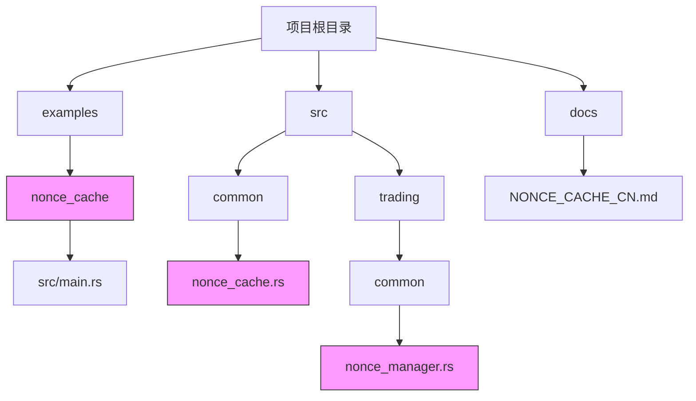
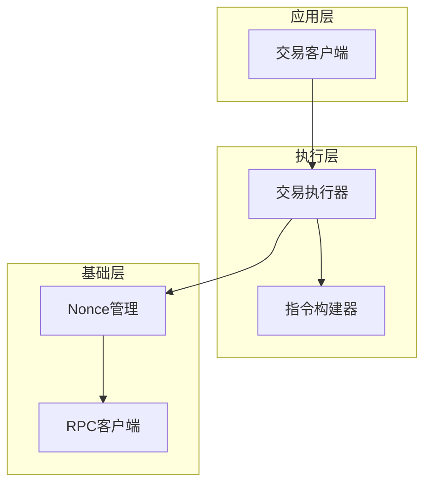
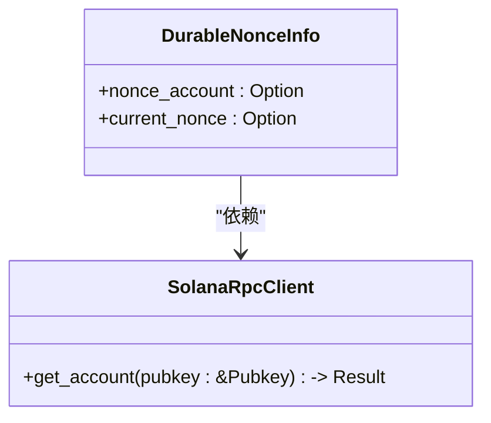
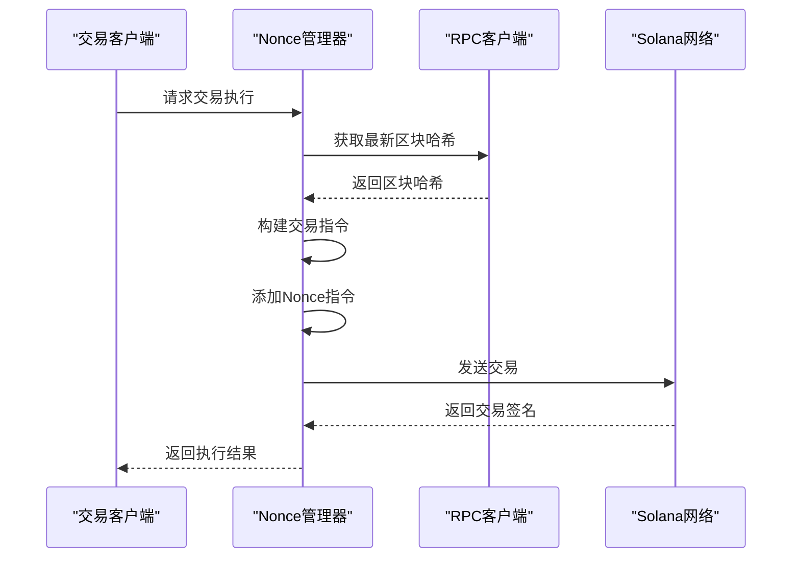
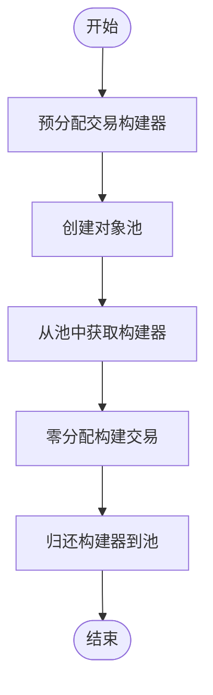
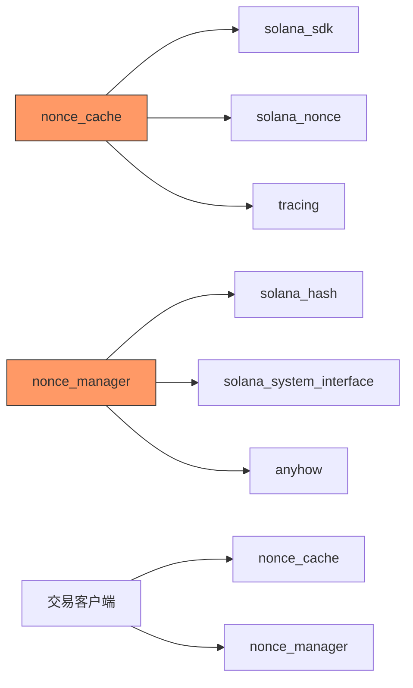

# Nonce缓存机制示例详解

<cite>
**本文档引用的文件**   
- [main.rs](file://examples/nonce_cache/src/main.rs)
- [nonce_cache.rs](file://src/common/nonce_cache.rs)
- [nonce_manager.rs](file://src/trading/common/nonce_manager.rs)
- [lib.rs](file://src/lib.rs)
- [transaction_pool.rs](file://src/trading/core/transaction_pool.rs)
- [execution.rs](file://src/trading/core/execution.rs)
- [solana_rpc.rs](file://src/swqos/solana_rpc.rs)
- [factory.rs](file://src/trading/factory.rs)
- [NONCE_CACHE_CN.md](file://docs/NONCE_CACHE_CN.md)
</cite>

## 目录
1. [简介](#简介)
2. [项目结构](#项目结构)
3. [核心组件](#核心组件)
4. [架构概述](#架构概述)
5. [详细组件分析](#详细组件分析)
6. [依赖分析](#依赖分析)
7. [性能考量](#性能考量)
8. [故障排除指南](#故障排除指南)
9. [结论](#结论)

## 简介
本文档深入解析Sol-Trade-SDK中`nonce_cache`示例，重点阐述在高并发交易场景下如何利用Nonce缓存避免交易冲突和重复提交。详细说明`NonceCache`组件的工作原理，包括缓存初始化、Nonce获取与递增、线程安全访问控制及与`SolanaRpcClient`的协同机制。结合代码展示多线程环境下交易序列管理的最佳实践，分析其对交易成功率和吞吐量的提升效果。提供缓存失效处理、边界异常恢复及性能监控建议，帮助开发者构建稳定高效的并发交易系统。

## 项目结构
Sol-Trade-SDK项目采用模块化设计，将核心功能与示例代码分离。`examples/nonce_cache`目录提供了Nonce缓存机制的完整使用示例，而核心实现位于`src/common/nonce_cache.rs`和`src/trading/common/nonce_manager.rs`中。

**Diagram sources**
- [main.rs](file://examples/nonce_cache/src/main.rs)
- [nonce_cache.rs](file://src/common/nonce_cache.rs)
- [nonce_manager.rs](file://src/trading/common/nonce_manager.rs)

**Section sources**
- [project_structure](file://workspace_path)

## 核心组件
`NonceCache`机制的核心组件包括`DurableNonceInfo`结构体、`fetch_nonce_info`异步函数以及`add_nonce_instruction`和`get_transaction_blockhash`辅助函数。这些组件协同工作，确保在高并发环境下交易的唯一性和顺序性。

**Section sources**
- [nonce_cache.rs](file://src/common/nonce_cache.rs#L1-L42)
- [nonce_manager.rs](file://src/trading/common/nonce_manager.rs#L1-L41)

## 架构概述
Nonce缓存机制的架构设计体现了分层和职责分离的原则。上层应用通过`SolanaTrade`客户端调用交易接口，中间层的交易执行器处理协议特定逻辑，底层的Nonce管理组件确保交易序列的正确性。

**Diagram sources**
- [lib.rs](file://src/lib.rs#L50-L762)
- [factory.rs](file://src/trading/factory.rs#L1-L99)

## 详细组件分析

### Nonce缓存组件分析
`DurableNonceInfo`结构体封装了Nonce账户地址和当前Nonce值，为上层应用提供了一致的接口。`fetch_nonce_info`函数通过RPC从区块链获取最新的Nonce信息，确保了数据的实时性和准确性。

**Diagram sources**
- [nonce_cache.rs](file://src/common/nonce_cache.rs#L10-L16)

### 交易执行流程分析
交易执行流程展示了Nonce机制如何与交易构建和发送过程集成。从获取最新区块哈希到构建交易，再到发送和确认，每个步骤都经过精心设计以确保高性能和可靠性。

**Diagram sources**
- [lib.rs](file://src/lib.rs#L369-L456)
- [execution.rs](file://src/trading/core/execution.rs#L1-L156)

### 交易池优化分析
交易池优化机制通过预分配和对象池技术显著提升了交易构建的性能。`PreallocatedTxBuilder`结构体和全局对象池`TX_BUILDER_POOL`共同实现了零分配交易构建，减少了内存分配开销。

**Diagram sources**
- [transaction_pool.rs](file://src/trading/core/transaction_pool.rs#L1-L153)

## 依赖分析
Nonce缓存机制依赖于多个核心组件和外部库。这些依赖关系确保了功能的完整性和系统的稳定性。

**Diagram sources**
- [Cargo.toml](file://Cargo.toml)
- [lib.rs](file://src/lib.rs)

**Section sources**
- [nonce_cache.rs](file://src/common/nonce_cache.rs)
- [nonce_manager.rs](file://src/trading/common/nonce_manager.rs)

## 性能考量
Nonce缓存机制在设计时充分考虑了性能因素。通过预分配对象池、零分配交易构建和SIMD内存操作等技术，显著提升了交易处理的吞吐量和响应速度。

- **对象池优化**: 使用`crossbeam_queue::ArrayQueue`实现无锁并发队列，避免了传统锁的竞争开销
- **零分配构建**: `PreallocatedTxBuilder`预分配指令和查找表空间，避免运行时内存分配
- **SIMD加速**: 利用AVX2指令集加速内存复制、比较和清零操作
- **分支预测**: 使用`BranchOptimizer`优化关键路径的分支预测准确性

**Section sources**
- [transaction_pool.rs](file://src/trading/core/transaction_pool.rs)
- [execution.rs](file://src/trading/core/execution.rs)

## 故障排除指南
在使用Nonce缓存机制时，可能会遇到一些常见问题。以下是一些故障排除建议：

- **Nonce账户不存在**: 确保已正确创建Nonce账户，并在`fetch_nonce_info`调用中使用正确的账户地址
- **交易重复提交**: 检查`durable_nonce`是否正确传递，并确保每次交易后刷新Nonce值
- **性能瓶颈**: 监控对象池的使用情况，必要时调整池大小或预填充数量
- **RPC连接问题**: 检查RPC端点的可用性和网络延迟，考虑使用多个SWQOS客户端进行负载均衡

**Section sources**
- [nonce_cache.rs](file://src/common/nonce_cache.rs#L36-L41)
- [solana_rpc.rs](file://src/swqos/solana_rpc.rs#L41-L48)

## 结论
Sol-Trade-SDK的Nonce缓存机制为高并发交易场景提供了一套完整且高效的解决方案。通过精心设计的组件架构和性能优化技术，有效避免了交易冲突和重复提交问题，显著提升了交易成功率和系统吞吐量。开发者可以基于此机制构建稳定高效的并发交易系统，充分利用Solana网络的高性能特性。