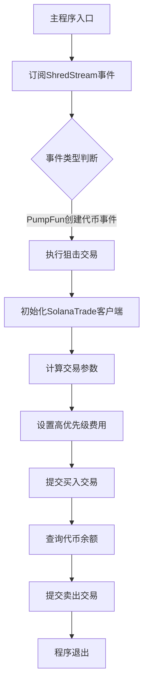
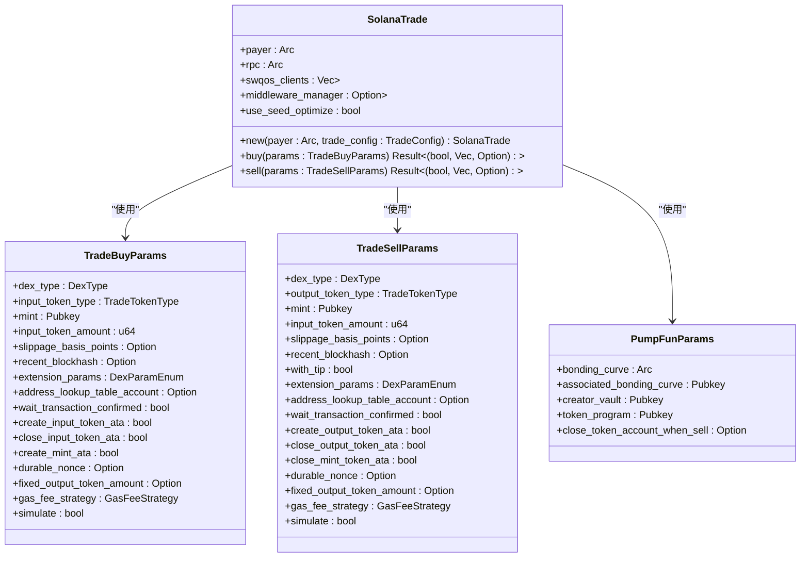
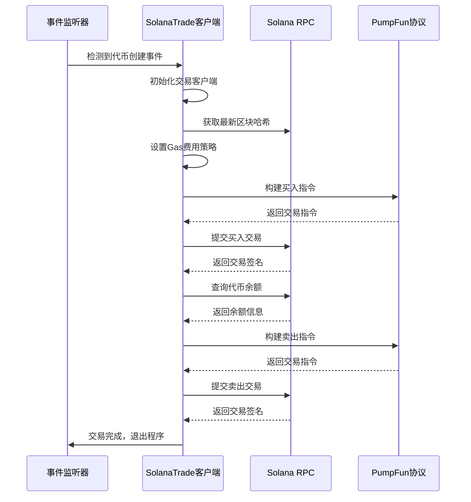
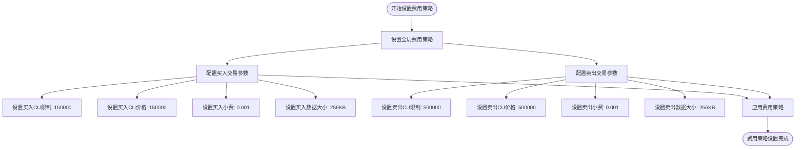
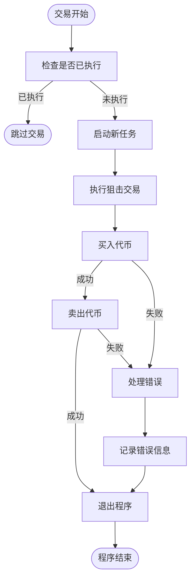

# PumpFun狙击交易示例详解

<cite>
**本文档引用的文件**   
- [main.rs](file://examples/pumpfun_sniper_trading/src/main.rs)
- [Cargo.toml](file://examples/pumpfun_sniper_trading/Cargo.toml)
- [pumpfun.rs](file://src/instruction/pumpfun.rs)
- [pumpfun.rs](file://src/trading/core/params.rs)
- [gas_fee_strategy.rs](file://src/common/gas_fee_strategy.rs)
- [factory.rs](file://src/trading/factory.rs)
- [lib.rs](file://src/lib.rs)
</cite>

## 目录
1. [项目结构](#项目结构)
2. [核心组件](#核心组件)
3. [交易流程分析](#交易流程分析)
4. [Gas费用策略](#gas费用策略)
5. [异常处理与重试机制](#异常处理与重试机制)
6. [性能优化建议](#性能优化建议)
7. [常见问题解决方案](#常见问题解决方案)

## 项目结构

`pumpfun_sniper_trading`示例程序是Sol-Trade-SDK中的一个自动化狙击交易实现，专门用于在PumpFun平台上监听新代币创建事件并立即执行交易。该程序通过ShredStream订阅PumpFun协议的实时事件流，当检测到新代币创建时，立即执行买入和卖出操作。

**图表来源**
- [main.rs](file://examples/pumpfun_sniper_trading/src/main.rs#L28-L165)

**本节来源**
- [main.rs](file://examples/pumpfun_sniper_trading/src/main.rs#L1-L166)
- [Cargo.toml](file://examples/pumpfun_sniper_trading/Cargo.toml#L1-L12)

## 核心组件

`pumpfun_sniper_trading`示例程序的核心组件包括事件监听、交易执行和费用管理三个主要部分。程序通过`ShredStreamGrpc`订阅PumpFun协议的实时事件流，当检测到新代币创建事件时，触发狙击交易逻辑。

程序使用`SolanaTrade`客户端进行交易操作，该客户端封装了与Solana区块链交互的所有必要功能，包括RPC连接、交易签名和SWQOS（Solana Web Quality of Service）设置。`TradingClient`结构体提供了统一的接口来执行买入和卖出操作。

**图表来源**
- [lib.rs](file://src/lib.rs#L49-L762)
- [params.rs](file://src/trading/core/params.rs#L42-L709)

**本节来源**
- [main.rs](file://examples/pumpfun_sniper_trading/src/main.rs#L67-L165)
- [lib.rs](file://src/lib.rs#L49-L762)

## 交易流程分析

PumpFun狙击交易的完整流程包括事件监听、参数计算、交易执行和结果处理四个阶段。程序首先订阅ShredStream事件流，当检测到新代币创建事件时，立即启动交易流程。

交易流程的核心是`pumpfun_sniper_trade_with_shreds`函数，该函数接收PumpFun交易事件作为输入，执行买入和卖出操作。在买入阶段，程序使用`from_dev_trade`方法从事件数据中提取必要的PumpFun参数，包括bonding curve、creator vault等。这些参数用于准确计算交易执行所需的指令。

**图表来源**
- [main.rs](file://examples/pumpfun_sniper_trading/src/main.rs#L83-L165)
- [pumpfun.rs](file://src/instruction/pumpfun.rs#L27-L290)

**本节来源**
- [main.rs](file://examples/pumpfun_sniper_trading/src/main.rs#L83-L165)
- [pumpfun.rs](file://src/instruction/pumpfun.rs#L27-L290)

## Gas费用策略

Gas费用策略是狙击交易成功的关键因素之一。`pumpfun_sniper_trading`示例程序使用`GasFeeStrategy`来设置交易的计算单元限制、优先费和小费。通过设置较高的优先费和小费，可以确保交易在拥挤的网络中获得优先处理。

程序在`pumpfun_sniper_trade_with_shreds`函数中创建`GasFeeStrategy`实例，并通过`set_global_fee_strategy`方法设置全局费用策略。该策略包括计算单元限制（cu_limit）、计算单元价格（cu_price）、小费（tip）和数据大小限制（data_size_limit）等参数。

**图表来源**
- [main.rs](file://examples/pumpfun_sniper_trading/src/main.rs#L91-L93)
- [gas_fee_strategy.rs](file://src/common/gas_fee_strategy.rs#L34-L92)

**本节来源**
- [main.rs](file://examples/pumpfun_sniper_trading/src/main.rs#L91-L93)
- [gas_fee_strategy.rs](file://src/common/gas_fee_strategy.rs#L1-L387)

## 异常处理与重试机制

`pumpfun_sniper_trading`示例程序实现了基本的异常处理机制，确保在交易失败时能够及时响应。程序使用`AtomicBool`标志`ALREADY_EXECUTED`来确保狙击交易只执行一次，防止重复交易。

当交易过程中发生错误时，程序会在`create_event_callback`函数中捕获异常，并通过`eprintln!`宏输出错误信息。如果买入或卖出交易失败，程序会记录错误并退出。这种设计确保了程序的稳定性和可靠性，避免了因错误导致的无限循环或资源浪费。

**图表来源**
- [main.rs](file://examples/pumpfun_sniper_trading/src/main.rs#L24-L63)
- [main.rs](file://examples/pumpfun_sniper_trading/src/main.rs#L56-L58)

**本节来源**
- [main.rs](file://examples/pumpfun_sniper_trading/src/main.rs#L24-L63)
- [main.rs](file://examples/pumpfun_sniper_trading/src/main.rs#L56-L58)

## 性能优化建议

为了提高狙击交易的成功率，开发者可以采取多种性能优化措施。首先，使用`seed_optimize`功能可以显著减少创建关联代币账户（ATA）的时间和费用。其次，合理配置`address_lookup_table`可以优化交易大小，提高交易确认速度。

程序还支持使用`durable_nonce`来防止交易重放攻击，同时确保交易的原子性。通过预计算和缓存常用的账户地址，可以进一步减少网络请求次数，提高交易执行速度。此外，使用高性能的RPC节点和SWQOS服务可以显著降低网络延迟。

**本节来源**
- [lib.rs](file://src/lib.rs#L64-L66)
- [lib.rs](file://src/lib.rs#L222-L284)

## 常见问题解决方案

在实际运行`pumpfun_sniper_trading`示例程序时，可能会遇到交易失败、Nonce冲突等问题。对于交易失败问题，建议检查钱包余额是否充足，以及RPC节点是否稳定。如果遇到Nonce冲突，可以使用`durable_nonce`机制来确保交易的唯一性。

另一个常见问题是代币账户创建失败。这通常是由于网络延迟或RPC节点响应慢导致的。解决方案是增加重试机制，并使用`create_associated_token_account_idempotent_fast_use_seed`等优化函数来提高账户创建的成功率。此外，确保使用最新的`shred_stream_url`和正确的`payer_keypair`也是避免问题的关键。

**本节来源**
- [main.rs](file://examples/pumpfun_sniper_trading/src/main.rs#L71-L72)
- [lib.rs](file://src/lib.rs#L222-L284)
- [pumpfun.rs](file://src/instruction/pumpfun.rs#L108-L117)