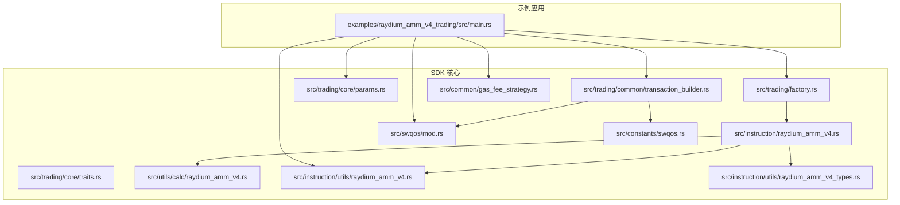
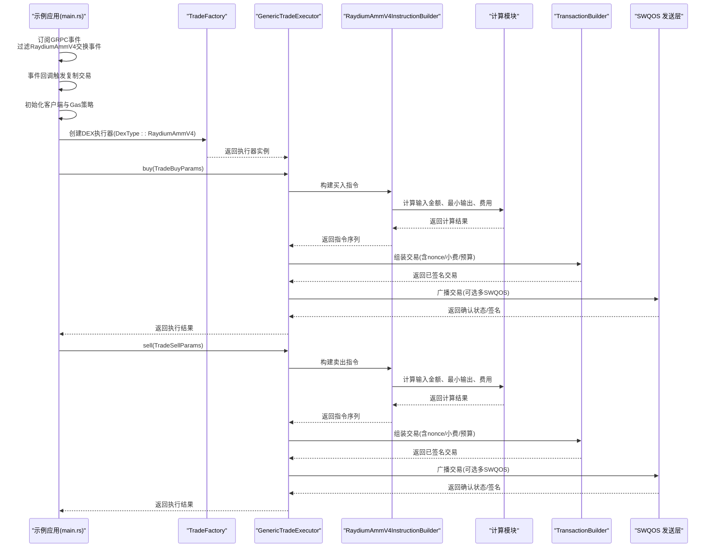
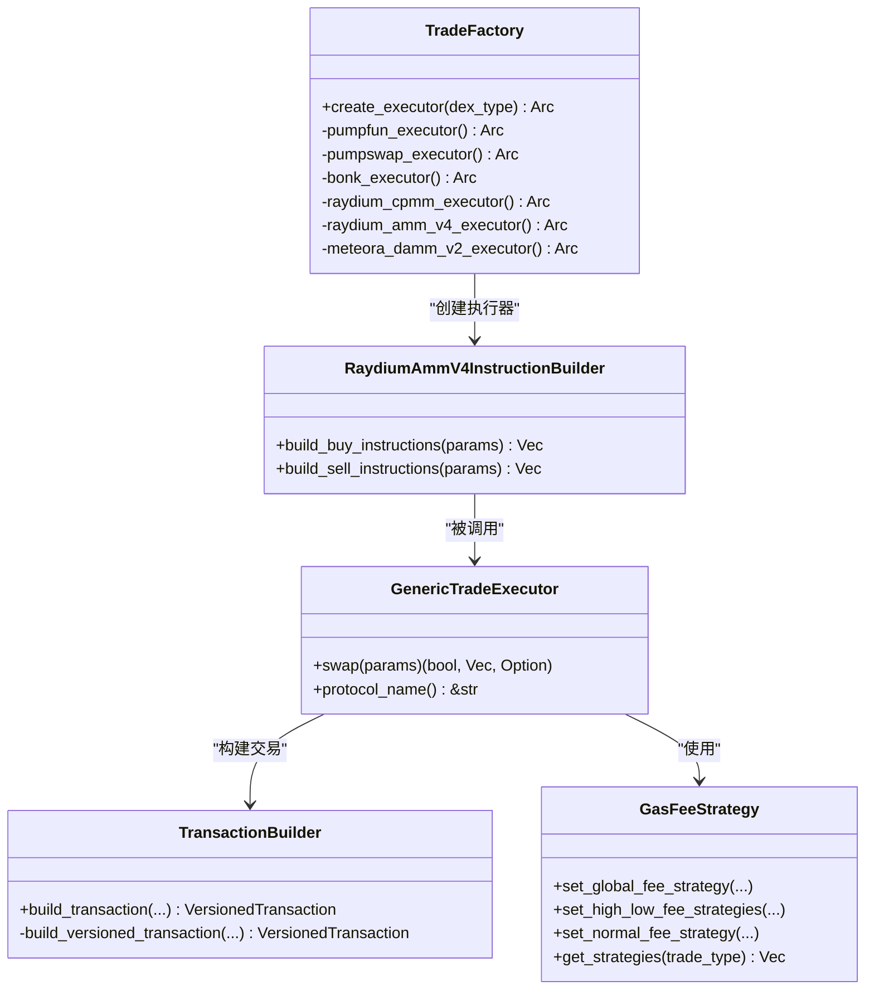
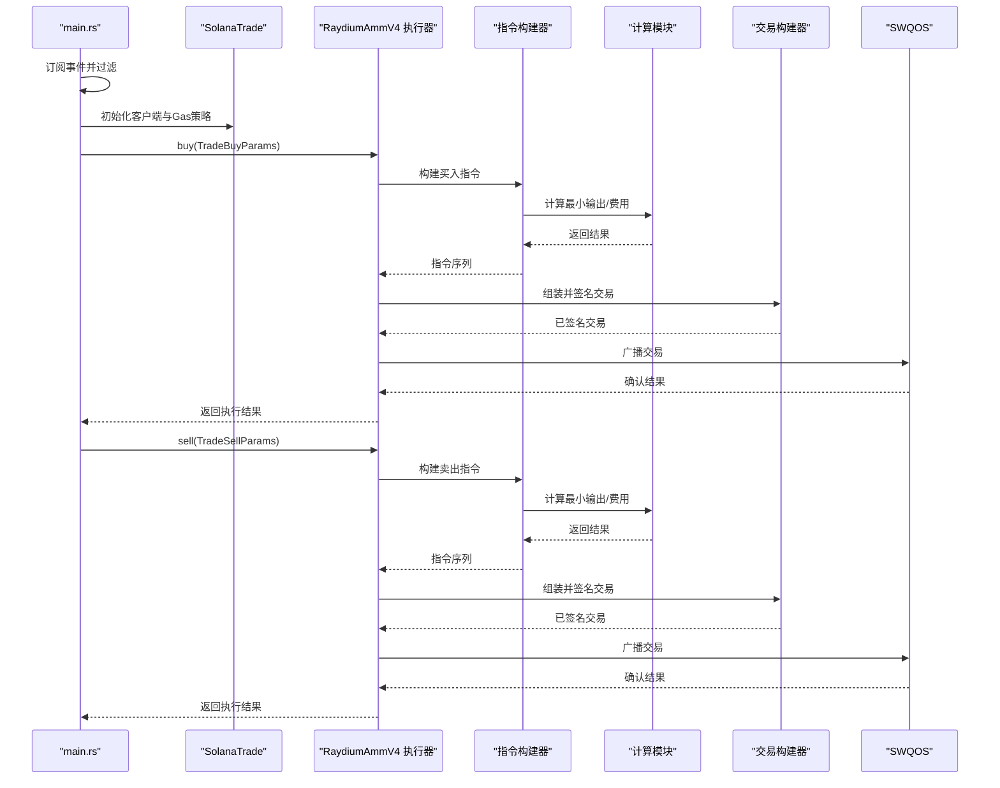
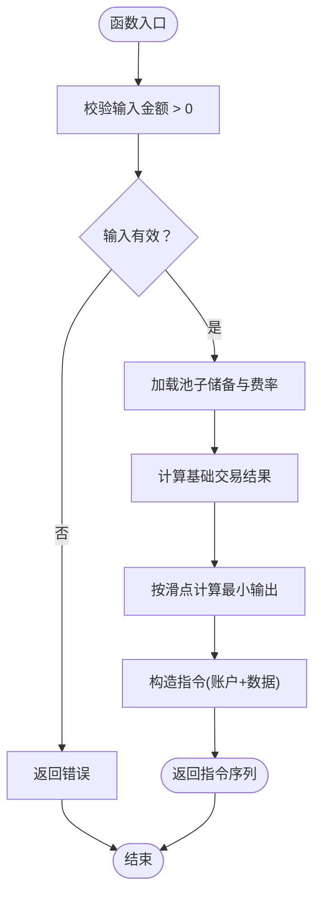
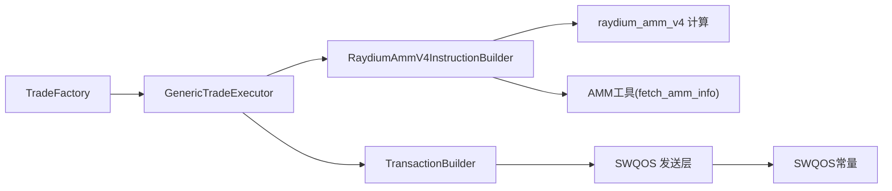

# Raydium AMM V4交易示例详解

<cite>
**本文引用的文件列表**
- [examples/raydium_amm_v4_trading/src/main.rs](file://examples/raydium_amm_v4_trading/src/main.rs)
- [src/trading/factory.rs](file://src/trading/factory.rs)
- [src/trading/common/transaction_builder.rs](file://src/trading/common/transaction_builder.rs)
- [src/instruction/raydium_amm_v4.rs](file://src/instruction/raydium_amm_v4.rs)
- [src/utils/calc/raydium_amm_v4.rs](file://src/utils/calc/raydium_amm_v4.rs)
- [src/swqos/mod.rs](file://src/swqos/mod.rs)
- [src/constants/swqos.rs](file://src/constants/swqos.rs)
- [src/instruction/utils/raydium_amm_v4.rs](file://src/instruction/utils/raydium_amm_v4.rs)
- [src/instruction/utils/raydium_amm_v4_types.rs](file://src/instruction/utils/raydium_amm_v4_types.rs)
- [src/trading/core/params.rs](file://src/trading/core/params.rs)
- [src/common/gas_fee_strategy.rs](file://src/common/gas_fee_strategy.rs)
- [src/trading/core/traits.rs](file://src/trading/core/traits.rs)
- [examples/raydium_amm_v4_trading/Cargo.toml](file://examples/raydium_amm_v4_trading/Cargo.toml)
</cite>

## 目录
1. [简介](#简介)
2. [项目结构](#项目结构)
3. [核心组件](#核心组件)
4. [架构总览](#架构总览)
5. [详细组件分析](#详细组件分析)
6. [依赖关系分析](#依赖关系分析)
7. [性能考量](#性能考量)
8. [故障排查指南](#故障排查指南)
9. [结论](#结论)
10. [附录](#附录)

## 简介
本文件围绕 Sol-Trade-SDK 的 Raydium AMM V4 示例进行深入解读，系统性说明如何通过 SDK 与 Raydium AMM V4 协议交互完成标准代币兑换。文档覆盖从交易配置初始化、流动性池价格与余额获取、交易路径构建、滑点设置，到最终交易广播的完整流程；同时解释 TradeFactory 如何创建对应 DEX 执行器、TransactionBuilder 如何生成有效指令、以及如何通过 SWQOS 服务加速确认。此外，提供配置参数说明、执行日志解析思路与性能基准参考，帮助开发者快速掌握主流 AMM 交易的集成方法。

## 项目结构
Raydium AMM V4 示例位于 examples/raydium_amm_v4_trading，核心逻辑集中在示例入口文件中，配合 SDK 内部的交易工厂、指令构建器、计算模块与 SWQOS 发送层协同工作。

图表来源
- [examples/raydium_amm_v4_trading/src/main.rs](file://examples/raydium_amm_v4_trading/src/main.rs#L1-L222)
- [src/trading/factory.rs](file://src/trading/factory.rs#L1-L99)
- [src/trading/common/transaction_builder.rs](file://src/trading/common/transaction_builder.rs#L1-L122)
- [src/instruction/raydium_amm_v4.rs](file://src/instruction/raydium_amm_v4.rs#L1-L252)
- [src/utils/calc/raydium_amm_v4.rs](file://src/utils/calc/raydium_amm_v4.rs#L1-L151)
- [src/swqos/mod.rs](file://src/swqos/mod.rs#L1-L344)
- [src/constants/swqos.rs](file://src/constants/swqos.rs#L1-L276)
- [src/instruction/utils/raydium_amm_v4.rs](file://src/instruction/utils/raydium_amm_v4.rs#L1-L43)
- [src/instruction/utils/raydium_amm_v4_types.rs](file://src/instruction/utils/raydium_amm_v4_types.rs#L1-L80)
- [src/trading/core/params.rs](file://src/trading/core/params.rs#L1-L709)
- [src/common/gas_fee_strategy.rs](file://src/common/gas_fee_strategy.rs#L1-L387)

章节来源
- [examples/raydium_amm_v4_trading/src/main.rs](file://examples/raydium_amm_v4_trading/src/main.rs#L1-L222)
- [examples/raydium_amm_v4_trading/Cargo.toml](file://examples/raydium_amm_v4_trading/Cargo.toml#L1-L12)

## 核心组件
- 交易工厂（TradeFactory）：根据 DexType 返回对应的通用执行器实例，RaydiumAmmV4 对应的执行器由 RaydiumAmmV4InstructionBuilder 提供指令构建能力。
- 指令构建器（RaydiumAmmV4InstructionBuilder）：依据 SwapParams 计算滑点保护后的最小接收量，构造买入/卖出指令序列，包含账户元数据与指令数据。
- 计算模块（raydium_amm_v4 计算）：基于池子储备与费率参数，计算理论输出、滑点保护下的最小输出、交易费用等。
- 交易构建器（TransactionBuilder）：组装 nonce、小费转账、计算预算、业务指令，生成版本化交易并签名。
- SWQOS 发送层：封装多种上链通道（如 Jito、Node1、Bloxroute 等），统一发送交易并支持小费账户选择与区域端点。
- 参数与常量：包含 DexParamEnum、SwapParams、RaydiumAmmV4Params 等，以及 AMM 常量与费率定义。

章节来源
- [src/trading/factory.rs](file://src/trading/factory.rs#L1-L99)
- [src/instruction/raydium_amm_v4.rs](file://src/instruction/raydium_amm_v4.rs#L1-L252)
- [src/utils/calc/raydium_amm_v4.rs](file://src/utils/calc/raydium_amm_v4.rs#L1-L151)
- [src/trading/common/transaction_builder.rs](file://src/trading/common/transaction_builder.rs#L1-L122)
- [src/swqos/mod.rs](file://src/swqos/mod.rs#L1-L344)
- [src/constants/swqos.rs](file://src/constants/swqos.rs#L1-L276)
- [src/trading/core/params.rs](file://src/trading/core/params.rs#L1-L709)

## 架构总览
下图展示从事件订阅到交易执行与广播的整体流程，包括 SWQOS 加速确认的关键节点。

图表来源
- [examples/raydium_amm_v4_trading/src/main.rs](file://examples/raydium_amm_v4_trading/src/main.rs#L1-L222)
- [src/trading/factory.rs](file://src/trading/factory.rs#L1-L99)
- [src/instruction/raydium_amm_v4.rs](file://src/instruction/raydium_amm_v4.rs#L1-L252)
- [src/utils/calc/raydium_amm_v4.rs](file://src/utils/calc/raydium_amm_v4.rs#L1-L151)
- [src/trading/common/transaction_builder.rs](file://src/trading/common/transaction_builder.rs#L1-L122)
- [src/swqos/mod.rs](file://src/swqos/mod.rs#L1-L344)

## 详细组件分析

### 交易配置初始化与客户端创建
- 客户端初始化：示例创建 SolanaTrade 客户端，设置 RPC、承诺级别与 SWQOS 配置，随后在交易参数中复用。
- Gas 费策略：使用 GasFeeStrategy 设置全局 CU 上限、CU 价格与小费，支持按 SWQOS 类型与交易类型差异化配置。
- 事件订阅：通过 YellowstoneGrpc 订阅 Raydium AMM V4 交换事件，过滤程序 ID 与事件类型，确保只处理目标池的交易。

章节来源
- [examples/raydium_amm_v4_trading/src/main.rs](file://examples/raydium_amm_v4_trading/src/main.rs#L101-L113)
- [src/common/gas_fee_strategy.rs](file://src/common/gas_fee_strategy.rs#L1-L387)
- [src/swqos/mod.rs](file://src/swqos/mod.rs#L1-L344)

### 流动性池信息与价格获取
- 池信息读取：通过 fetch_amm_info 从 RPC 读取 AMM 账户数据并解码为 AmmInfo 结构，提取币种、储备、代币账户等关键字段。
- 多币种余额：使用 get_multi_token_balances 获取池内两种代币的当前余额，作为后续计算的基础。
- 池参数封装：将 amm 地址、币种、储备等封装为 RaydiumAmmV4Params，供指令构建器使用。

章节来源
- [src/instruction/utils/raydium_amm_v4.rs](file://src/instruction/utils/raydium_amm_v4.rs#L1-L43)
- [src/instruction/utils/raydium_amm_v4_types.rs](file://src/instruction/utils/raydium_amm_v4_types.rs#L1-L80)
- [src/trading/core/params.rs](file://src/trading/core/params.rs#L607-L656)

### 交易路径构建与滑点设置
- 买入路径：
  - 指令构建：RaydiumAmmV4InstructionBuilder 在 buy 分支中校验输入金额与池子必须包含 WSOL 或 USDC，计算最小接收量（考虑滑点），准备用户源/目的代币账户，构造 17 个账户元数据与指令数据。
  - 账户准备：根据是否需要创建 ATA，动态生成或关闭 wSOL/USDC 的 ATA。
- 卖出路径：
  - 指令构建：在 sell 分支中同样校验池子条件，计算最小接收量，准备用户源/目的代币账户，构造 17 个账户元数据与指令数据。
  - 账户准备：根据是否需要创建 ATA，动态生成或关闭 wSOL/USDC 的 ATA。
- 滑点控制：滑点以“基点”表示，计算时先得到理论输出，再按 1 - slippage/10000 得到最小输出，防止价格劣变。

章节来源
- [src/instruction/raydium_amm_v4.rs](file://src/instruction/raydium_amm_v4.rs#L21-L137)
- [src/instruction/raydium_amm_v4.rs](file://src/instruction/raydium_amm_v4.rs#L139-L250)
- [src/utils/calc/raydium_amm_v4.rs](file://src/utils/calc/raydium_amm_v4.rs#L106-L151)

### 交易广播与 SWQOS 加速
- 交易构建：TransactionBuilder 组装 nonce、小费转账、计算预算、业务指令，使用预分配交易构建器零拷贝序列化，最后对消息进行签名。
- SWQOS 发送：示例中通过 TradeBuyParams/TradeSellParams 中的 swqos_clients 字段传入 SWQOS 客户端集合，执行器在广播阶段调用各 SWQOS 提供商，提升确认速度与成功率。
- 小费账户：SWQOS 常量中内置多提供商的小费账户列表，便于选择最优节点。

章节来源
- [src/trading/common/transaction_builder.rs](file://src/trading/common/transaction_builder.rs#L1-L122)
- [src/swqos/mod.rs](file://src/swqos/mod.rs#L1-L344)
- [src/constants/swqos.rs](file://src/constants/swqos.rs#L1-L276)

### 代码级类图（面向对象视角）

图表来源
- [src/trading/factory.rs](file://src/trading/factory.rs#L1-L99)
- [src/instruction/raydium_amm_v4.rs](file://src/instruction/raydium_amm_v4.rs#L1-L252)
- [src/trading/common/transaction_builder.rs](file://src/trading/common/transaction_builder.rs#L1-L122)
- [src/common/gas_fee_strategy.rs](file://src/common/gas_fee_strategy.rs#L1-L387)
- [src/trading/core/traits.rs](file://src/trading/core/traits.rs#L1-L26)

### 交易流程时序图（示例主流程）

图表来源
- [examples/raydium_amm_v4_trading/src/main.rs](file://examples/raydium_amm_v4_trading/src/main.rs#L115-L218)
- [src/instruction/raydium_amm_v4.rs](file://src/instruction/raydium_amm_v4.rs#L21-L250)
- [src/utils/calc/raydium_amm_v4.rs](file://src/utils/calc/raydium_amm_v4.rs#L106-L151)
- [src/trading/common/transaction_builder.rs](file://src/trading/common/transaction_builder.rs#L1-L122)
- [src/swqos/mod.rs](file://src/swqos/mod.rs#L1-L344)

### 算法流程图（滑点与最小输出计算）

图表来源
- [src/instruction/raydium_amm_v4.rs](file://src/instruction/raydium_amm_v4.rs#L21-L137)
- [src/utils/calc/raydium_amm_v4.rs](file://src/utils/calc/raydium_amm_v4.rs#L106-L151)

## 依赖关系分析
- 组件耦合：
  - TradeFactory 与 RaydiumAmmV4InstructionBuilder 通过 TradeExecutor 接口解耦，执行器持有指令构建器实例。
  - 指令构建器依赖计算模块与池信息工具，不直接访问 RPC。
  - 交易构建器与 SWQOS 层通过中间件管理器与 GasFeeStrategy 解耦，便于扩展与测试。
- 外部依赖：
  - SWQOS 提供商端点与小费账户常量集中于 constants/swqos.rs，便于统一维护。
  - 事件解析依赖 solana-streamer-sdk，示例中使用 GRPC 过滤与事件类型。

图表来源
- [src/trading/factory.rs](file://src/trading/factory.rs#L1-L99)
- [src/instruction/raydium_amm_v4.rs](file://src/instruction/raydium_amm_v4.rs#L1-L252)
- [src/utils/calc/raydium_amm_v4.rs](file://src/utils/calc/raydium_amm_v4.rs#L1-L151)
- [src/instruction/utils/raydium_amm_v4.rs](file://src/instruction/utils/raydium_amm_v4.rs#L1-L43)
- [src/trading/common/transaction_builder.rs](file://src/trading/common/transaction_builder.rs#L1-L122)
- [src/swqos/mod.rs](file://src/swqos/mod.rs#L1-L344)
- [src/constants/swqos.rs](file://src/constants/swqos.rs#L1-L276)

章节来源
- [src/swqos/mod.rs](file://src/swqos/mod.rs#L1-L344)
- [src/constants/swqos.rs](file://src/constants/swqos.rs#L1-L276)

## 性能考量
- 零拷贝与预分配：交易构建器使用预分配的交易构建器，避免重复内存分配，减少 GC 压力。
- 计算预算与小费：通过 GasFeeStrategy 精细控制 CU 上限、CU 价格与小费，平衡吞吐与确认速度。
- SWQOS 多通道：示例中可配置多个 SWQOS 提供商，提高确认概率与时延表现。
- 事件驱动：通过 GRPC 事件过滤，仅在目标池发生交换时触发交易，降低无效调用成本。

章节来源
- [src/trading/common/transaction_builder.rs](file://src/trading/common/transaction_builder.rs#L1-L122)
- [src/common/gas_fee_strategy.rs](file://src/common/gas_fee_strategy.rs#L1-L387)
- [src/swqos/mod.rs](file://src/swqos/mod.rs#L1-L344)

## 故障排查指南
- 指令构建错误：
  - 输入金额为 0 或池子不含 WSOL/USDC：检查参数校验与池子配置。
  - 指令账户缺失或权限不足：核对用户 ATA 创建标志与账户元数据。
- 交易广播失败：
  - 小费过低：调整 GasFeeStrategy 中的 tip 或切换更高阈值的 SWQOS 提供商。
  - 区块哈希过期：在交易构建前重新获取最新区块哈希。
  - 竞价失败：尝试提高 CU 价格或切换 SWQOS 区域端点。
- 事件订阅问题：
  - 过滤条件不匹配：确认程序 ID、事件类型与过滤器配置一致。
  - 一次性执行：示例中使用原子布尔变量保证仅执行一次，避免重复交易。

章节来源
- [src/instruction/raydium_amm_v4.rs](file://src/instruction/raydium_amm_v4.rs#L21-L137)
- [src/common/gas_fee_strategy.rs](file://src/common/gas_fee_strategy.rs#L1-L387)
- [examples/raydium_amm_v4_trading/src/main.rs](file://examples/raydium_amm_v4_trading/src/main.rs#L1-L79)

## 结论
该示例完整展示了如何基于 Sol-Trade-SDK 与 Raydium AMM V4 协议进行标准代币兑换：从事件驱动的触发、池信息与余额读取、滑点保护下的指令构建，到交易组装与 SWQOS 加速广播。通过 TradeFactory 的零开销单例模式与 TransactionBuilder 的高效序列化，开发者可以快速集成主流 AMM 的交易流程，并在性能与可靠性之间取得平衡。

## 附录

### 配置参数说明（示例中关键项）
- 交易参数（买入/卖出）：
  - dex_type：RaydiumAmmV4
  - input_token_type/output_token_type：WSOL 或 USDC
  - mint：目标代币的 Mint 公钥
  - input_token_amount：买入数量
  - slippage_basis_points：滑点（单位为基点）
  - recent_blockhash：最近区块哈希
  - extension_params：RaydiumAmmV4Params（池地址、币种、储备等）
  - address_lookup_table_account：可选的地址查找表
  - wait_transaction_confirmed：等待确认
  - create_input_token_ata/close_input_token_ata/create_output_token_ata/close_output_token_ata：ATA 生命周期管理
  - durable_nonce：可选的持久化 nonce
  - fixed_output_token_amount：固定输出（可选）
  - gas_fee_strategy：Gas 费策略
  - simulate：是否模拟
- SWQOS 配置：
  - SwqosConfig：Default/Jito/Node1/Bloxroute/Temporal/ZeroSlot/FlashBlock/BlockRazor/Astralane/Stellium/Lightspeed/Soyas
  - Region：NewYork/Frankfurt/Amsterdam/SLC/Tokyo/London/LosAngeles/Default
  - 小费账户：constants/swqos.rs 中提供各提供商的小费账户列表
- Gas 费策略：
  - set_global_fee_strategy：设置全局 CU 上限、CU 价格、小费与数据大小限制
  - set_high_low_fee_strategies/set_normal_fee_strategy：按 SWQOS 类型与交易类型设置策略

章节来源
- [examples/raydium_amm_v4_trading/src/main.rs](file://examples/raydium_amm_v4_trading/src/main.rs#L115-L218)
- [src/trading/core/params.rs](file://src/trading/core/params.rs#L1-L709)
- [src/swqos/mod.rs](file://src/swqos/mod.rs#L1-L344)
- [src/constants/swqos.rs](file://src/constants/swqos.rs#L1-L276)
- [src/common/gas_fee_strategy.rs](file://src/common/gas_fee_strategy.rs#L1-L387)

### 执行日志解析建议
- 事件过滤：确认过滤器包含 RaydiumAmmV4 程序 ID 与目标事件类型，避免误触发。
- 一次性执行：示例使用原子布尔变量保证仅执行一次，调试时可临时移除以观察多次触发行为。
- 交易签名：SWQOS 返回的签名可用于追踪交易在不同提供商的上链情况。
- 日志定位：在 buy/sell 路径分别打印关键步骤（如余额查询、最小输出计算、指令组装完成），便于定位瓶颈。

章节来源
- [examples/raydium_amm_v4_trading/src/main.rs](file://examples/raydium_amm_v4_trading/src/main.rs#L1-L79)
- [src/swqos/mod.rs](file://src/swqos/mod.rs#L1-L344)

### 性能基准参考
- 交易构建时间：预分配构建器与零拷贝序列化显著降低构建耗时。
- SWQOS 选择：不同提供商的确认时延与成功率存在差异，建议在测试网络中对比后再上线。
- 小费阈值：部分提供商要求最低小费（如 Stellium/Lightspeed），需在 GasFeeStrategy 中设置合理值。

章节来源
- [src/trading/common/transaction_builder.rs](file://src/trading/common/transaction_builder.rs#L1-L122)
- [src/constants/swqos.rs](file://src/constants/swqos.rs#L263-L276)
- [src/common/gas_fee_strategy.rs](file://src/common/gas_fee_strategy.rs#L1-L387)