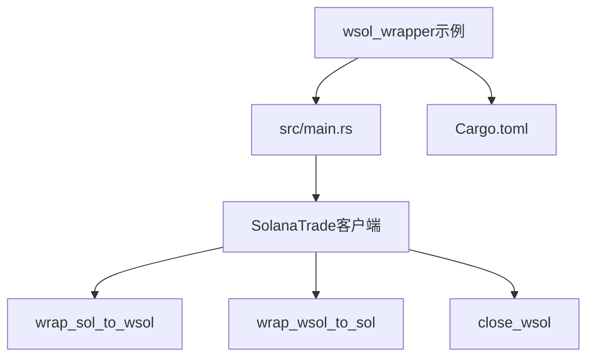
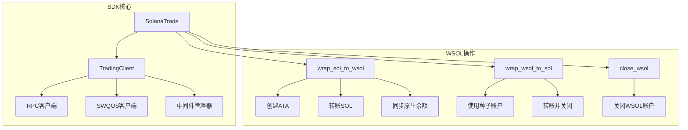
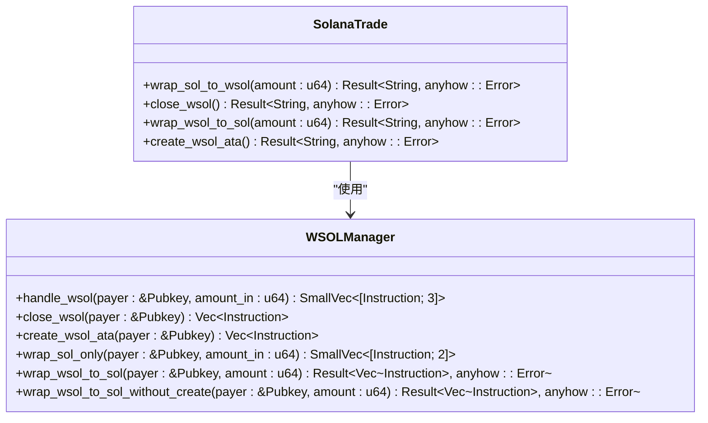
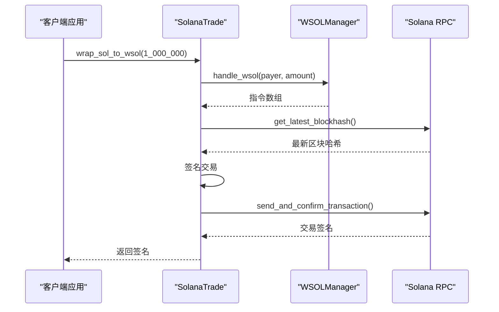
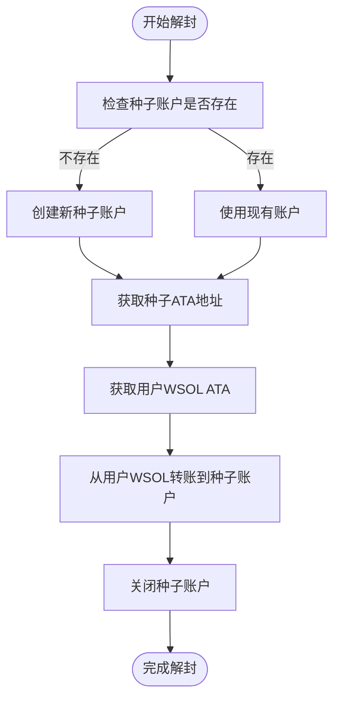
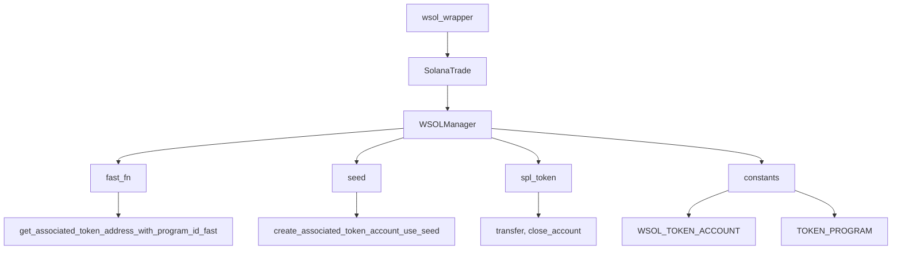

# WSOL封装操作示例详解

<cite>
**本文档引用文件**  
- [main.rs](file://examples/wsol_wrapper/src/main.rs)
- [wsol_manager.rs](file://src/trading/common/wsol_manager.rs)
- [lib.rs](file://src/lib.rs)
- [accounts.rs](file://src/constants/accounts.rs)
- [seed.rs](file://src/common/seed.rs)
</cite>

## 目录
1. [项目结构](#项目结构)
2. [核心组件](#核心组件)
3. [架构概述](#架构概述)
4. [详细组件分析](#详细组件分析)
5. [依赖分析](#依赖分析)
6. [性能与安全性指南](#性能与安全性指南)
7. [故障排除指南](#故障排除指南)

## 项目结构

WSOL封装示例位于`examples/wsol_wrapper`目录中，展示了如何通过Sol-Trade-SDK实现SOL与WSOL之间的高效双向封装与解封。该示例包含一个主程序文件`main.rs`和一个Cargo配置文件，依赖于SDK的核心功能模块。

**图示来源**  
- [main.rs](file://examples/wsol_wrapper/src/main.rs#L1-L89)
- [Cargo.toml](file://examples/wsol_wrapper/Cargo.toml#L1-L11)

**本节来源**  
- [examples/wsol_wrapper](file://examples/wsol_wrapper)

## 核心组件

`wsol_wrapper`示例的核心是`SolanaTrade`客户端提供的三个关键方法：`wrap_sol_to_wsol`、`wrap_wsol_to_sol`和`close_wsol`。这些方法封装了WSOL智能合约的底层交互逻辑，使开发者能够安全高效地进行SOL与WSOL之间的转换操作。

**本节来源**  
- [main.rs](file://examples/wsol_wrapper/src/main.rs#L1-L89)
- [lib.rs](file://src/lib.rs#L614-L761)

## 架构概述

该示例的架构基于Sol-Trade-SDK的交易客户端系统，通过`SolanaTrade`别名访问`TradingClient`功能。系统在初始化时会根据配置自动检查并创建WSOL关联代币账户（ATA），确保后续操作的顺利进行。

**图示来源**  
- [lib.rs](file://src/lib.rs#L50-L81)
- [wsol_manager.rs](file://src/trading/common/wsol_manager.rs#L1-L211)

## 详细组件分析

### WSOL管理器分析

`WSOLManager`的核心功能实现在`wsol_manager.rs`文件中，提供了一系列静态方法来处理SOL与WSOL之间的转换操作。这些方法直接生成Solana指令，由交易客户端负责签名和发送。

#### 核心接口类图

**图示来源**  
- [wsol_manager.rs](file://src/trading/common/wsol_manager.rs#L1-L211)
- [lib.rs](file://src/lib.rs#L614-L761)

#### 封装操作序列图

**图示来源**  
- [wsol_manager.rs](file://src/trading/common/wsol_manager.rs#L11-L37)
- [lib.rs](file://src/lib.rs#L634-L644)

#### 解封操作流程图

**图示来源**  
- [wsol_manager.rs](file://src/trading/common/wsol_manager.rs#L112-L210)
- [lib.rs](file://src/lib.rs#L733-L759)

**本节来源**  
- [wsol_manager.rs](file://src/trading/common/wsol_manager.rs#L1-L211)
- [lib.rs](file://src/lib.rs#L614-L761)

## 依赖分析

WSOL封装功能依赖于多个核心模块和常量定义，形成了一个高效的协作系统。系统通过种子优化技术提高账户创建效率，并利用缓存机制减少RPC调用。

**图示来源**  
- [wsol_manager.rs](file://src/trading/common/wsol_manager.rs#L1-L8)
- [accounts.rs](file://src/constants/accounts.rs#L1-L61)
- [seed.rs](file://src/common/seed.rs#L1-L118)

**本节来源**  
- [wsol_manager.rs](file://src/trading/common/wsol_manager.rs#L1-L211)
- [accounts.rs](file://src/constants/accounts.rs#L1-L61)
- [seed.rs](file://src/common/seed.rs#L1-L118)

## 性能与安全性指南

### 典型使用场景

在流动性提供前的准备操作中，开发者可以使用`wsol_wrapper`示例中的模式来管理资金：

1. **初始化阶段**：创建`SolanaTrade`客户端时，SDK会根据`TradeConfig`配置自动检查并创建WSOL ATA账户
2. **封装阶段**：使用`wrap_sol_to_wsol`方法将SOL转换为WSOL，以便在AMM池中作为流动性提供
3. **部分解封**：使用`wrap_wsol_to_sol`方法将部分WSOL转换回SOL，用于支付交易费用或其他用途
4. **清理阶段**：使用`close_wsol`方法关闭WSOL账户，将剩余余额转换回SOL

### 安全性保障

系统通过以下机制确保操作安全：
- **种子账户优化**：使用确定性种子生成临时账户，避免账户冲突
- **余额一致性检查**：在关闭账户前确保所有资金已正确转移
- **错误处理机制**：每个操作都包含完整的错误处理，确保失败时不会造成资金损失
- **原子操作**：所有转换操作都在单个交易中完成，保证操作的原子性

### 性能优化

系统实现了多项性能优化：
- **指令缓存**：`close_wsol`方法使用指令缓存避免重复计算
- **租金缓存**：使用`AtomicU64`存储租金信息，减少RPC调用
- **快速地址计算**：使用`fast_fn`模块提供高性能的地址计算函数
- **零开销解包**：在可能的情况下使用`Arc::try_unwrap`避免不必要的克隆

**本节来源**  
- [wsol_manager.rs](file://src/trading/common/wsol_manager.rs#L48-L67)
- [seed.rs](file://src/common/seed.rs#L12-L16)
- [lib.rs](file://src/lib.rs#L223-L284)

## 故障排除指南

### 常见问题及解决方案

1. **WSOL ATA创建失败**
   - 检查payer账户是否有足够SOL支付创建费用
   - 确认`create_wsol_ata_on_startup`配置是否正确
   - 检查网络连接和RPC端点可用性

2. **解封操作失败**
   - 确认WSOL账户中有足够余额
   - 检查种子账户是否已被正确创建
   - 验证交易签名是否成功

3. **余额不一致问题**
   - 在关键操作前后查询账户余额进行验证
   - 使用`get_account`方法检查账户状态
   - 确保所有交易都已成功确认

4. **性能问题**
   - 启用`use_seed_optimize`配置以提高账户创建效率
   - 确保租金缓存已正确初始化
   - 考虑使用批量操作减少交易次数

**本节来源**  
- [wsol_manager.rs](file://src/trading/common/wsol_manager.rs#L104-L111)
- [lib.rs](file://src/lib.rs#L627-L633)
- [seed.rs](file://src/common/seed.rs#L17-L26)