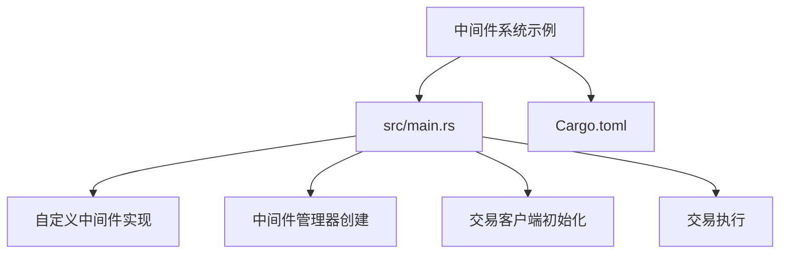
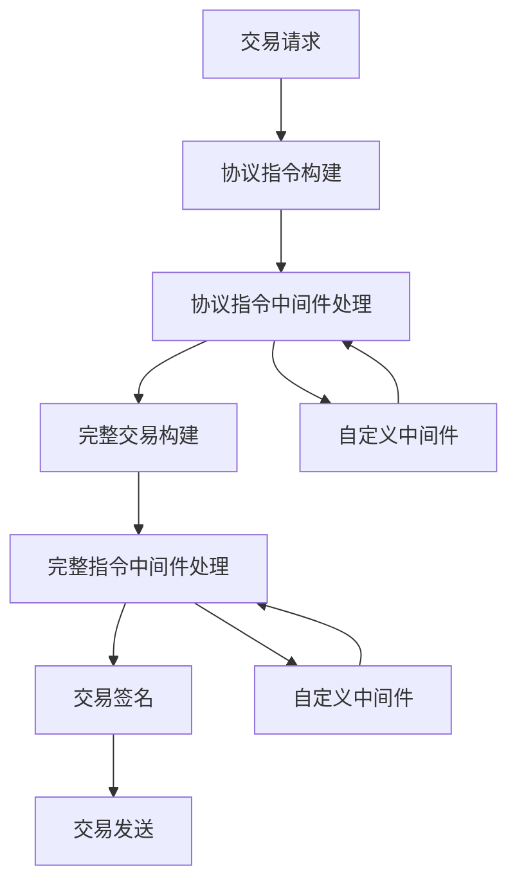
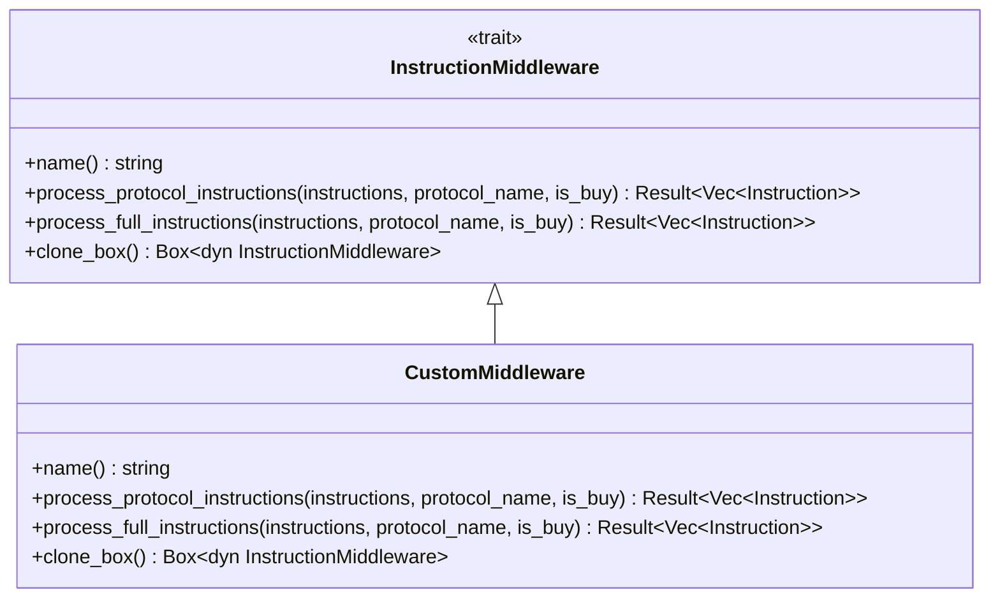
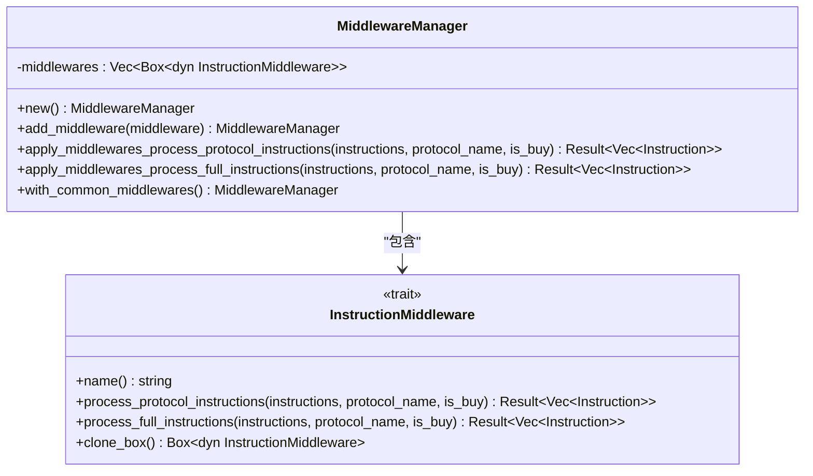
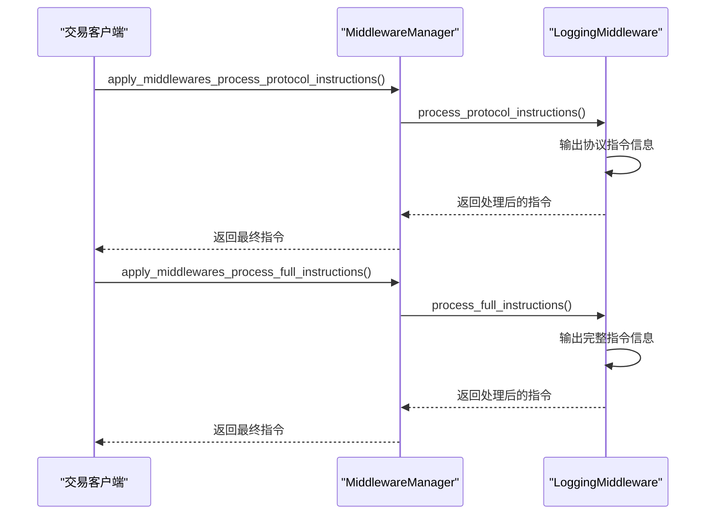
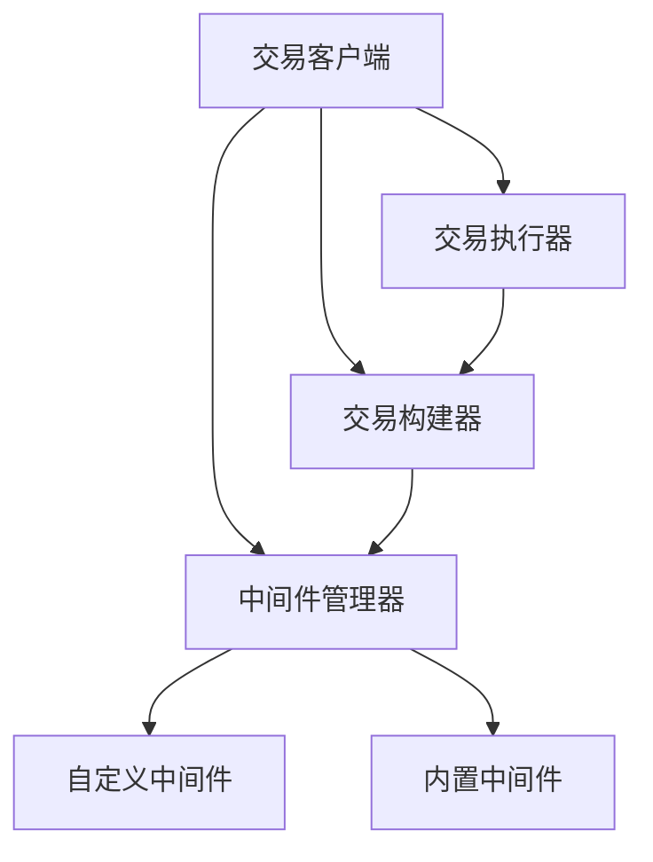
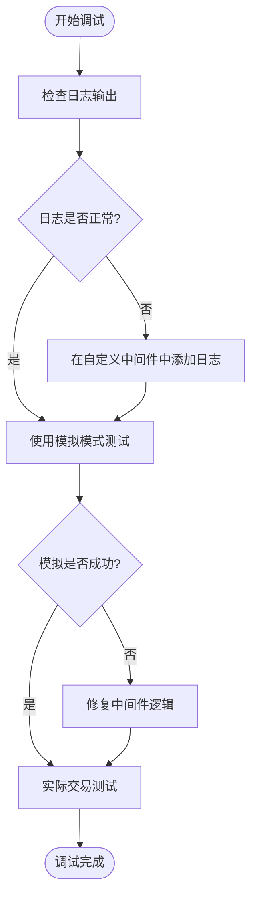

# 中间件系统示例详解

<cite>
**本文档引用文件**  
- [main.rs](file://examples/middleware_system/src/main.rs)
- [traits.rs](file://src/trading/middleware/traits.rs)
- [builtin.rs](file://src/trading/middleware/builtin.rs)
- [transaction_builder.rs](file://src/trading/common/transaction_builder.rs)
- [lib.rs](file://src/lib.rs)
</cite>

## 目录
1. [简介](#简介)
2. [项目结构](#项目结构)
3. [核心组件](#核心组件)
4. [架构概述](#架构概述)
5. [详细组件分析](#详细组件分析)
6. [依赖分析](#依赖分析)
7. [性能考量](#性能考量)
8. [调试指南](#调试指南)
9. [结论](#结论)

## 简介
本文档详细解析Sol-Trade-SDK中的中间件系统示例，展示如何使用中间件机制对交易流程进行拦截和增强。通过分析`middleware_system`示例，说明自定义中间件的实现方式、注册方法以及在交易执行链中的调用顺序。文档涵盖日志记录、交易验证、延迟注入等典型中间件功能的实现，并解释中间件的组合模式与执行生命周期，帮助开发者理解如何扩展交易逻辑而不修改核心代码。同时提供调试技巧和性能开销评估。

## 项目结构
中间件系统示例位于`examples/middleware_system`目录下，是Sol-Trade-SDK中用于演示中间件功能的独立示例。该示例展示了如何创建自定义中间件、将其注册到中间件管理器，并在交易执行过程中应用这些中间件。

**图示来源**  
- [main.rs](file://examples/middleware_system/src/main.rs#L1-L110)

**本节来源**  
- [main.rs](file://examples/middleware_system/src/main.rs#L1-L110)

## 核心组件
中间件系统的核心组件包括`InstructionMiddleware` trait、`MiddlewareManager`结构体以及内置的`LoggingMiddleware`。这些组件共同构成了一个灵活的中间件框架，允许开发者在交易执行的不同阶段插入自定义逻辑。

**本节来源**  
- [traits.rs](file://src/trading/middleware/traits.rs#L1-L116)
- [builtin.rs](file://src/trading/middleware/builtin.rs#L1-L54)

## 架构概述
中间件系统的架构基于责任链模式，允许在交易执行的不同阶段插入多个中间件。每个中间件都可以对交易指令进行处理，从而实现功能的增强和扩展。

**图示来源**  
- [traits.rs](file://src/trading/middleware/traits.rs#L1-L116)
- [transaction_builder.rs](file://src/trading/common/transaction_builder.rs#L1-L122)

## 详细组件分析

### 自定义中间件实现
自定义中间件通过实现`InstructionMiddleware` trait来创建。示例中的`CustomMiddleware`展示了如何创建一个基本的中间件，该中间件可以对协议指令和完整指令进行处理。

**图示来源**  
- [main.rs](file://examples/middleware_system/src/main.rs#L21-L55)
- [traits.rs](file://src/trading/middleware/traits.rs#L7-L45)

### 中间件管理器
`MiddlewareManager`负责管理中间件的生命周期和执行顺序。它允许开发者添加多个中间件，并按添加顺序依次执行它们。

**图示来源**  
- [traits.rs](file://src/trading/middleware/traits.rs#L48-L115)

### 内置日志中间件
`LoggingMiddleware`是一个内置的中间件示例，用于记录交易指令的详细信息。它在处理协议指令和完整指令时都会输出相关信息，便于调试和监控。

**图示来源**  
- [builtin.rs](file://src/trading/middleware/builtin.rs#L5-L54)
- [transaction_builder.rs](file://src/trading/common/transaction_builder.rs#L93-L101)

**本节来源**  
- [main.rs](file://examples/middleware_system/src/main.rs#L21-L55)
- [traits.rs](file://src/trading/middleware/traits.rs#L1-L116)
- [builtin.rs](file://src/trading/middleware/builtin.rs#L1-L54)

## 依赖分析
中间件系统与其他组件有明确的依赖关系，确保了系统的模块化和可扩展性。

**图示来源**  
- [lib.rs](file://src/lib.rs#L1-L762)
- [transaction_builder.rs](file://src/trading/common/transaction_builder.rs#L1-L122)

**本节来源**  
- [lib.rs](file://src/lib.rs#L1-L762)
- [transaction_builder.rs](file://src/trading/common/transaction_builder.rs#L1-L122)

## 性能考量
中间件系统在设计时考虑了性能因素，通过以下方式最小化性能开销：
- 使用`Arc`智能指针减少数据复制
- 在中间件处理过程中避免不必要的内存分配
- 提供高效的中间件执行链
- 支持中间件的条件执行和短路处理

虽然中间件会增加一定的处理开销，但这种开销通常是可以接受的，因为它带来了极大的灵活性和可扩展性。开发者应根据实际需求权衡功能增强与性能开销。

## 调试指南
调试中间件系统时，可以使用以下技巧：
- 利用`LoggingMiddleware`查看交易指令的详细信息
- 在自定义中间件中添加日志输出，跟踪指令处理过程
- 使用模拟模式（simulate）测试中间件逻辑而不实际执行交易
- 检查中间件的执行顺序是否符合预期

**本节来源**  
- [main.rs](file://examples/middleware_system/src/main.rs#L71-L108)
- [builtin.rs](file://src/trading/middleware/builtin.rs#L1-L54)

## 结论
Sol-Trade-SDK的中间件系统提供了一个强大而灵活的机制，允许开发者在不修改核心代码的情况下扩展和增强交易功能。通过实现`InstructionMiddleware` trait，开发者可以创建自定义中间件来处理交易指令，实现日志记录、交易验证、延迟注入等各种功能。

中间件管理器采用责任链模式，确保中间件按预期顺序执行。这种设计不仅提高了代码的可维护性，还为未来的功能扩展提供了便利。开发者可以根据具体需求组合不同的中间件，构建复杂的交易处理逻辑。

总之，中间件系统是Sol-Trade-SDK中一个关键的扩展点，它平衡了功能灵活性和系统性能，为开发者提供了强大的工具来定制交易流程。