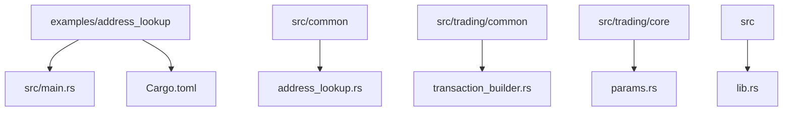
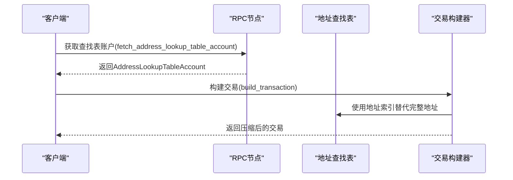
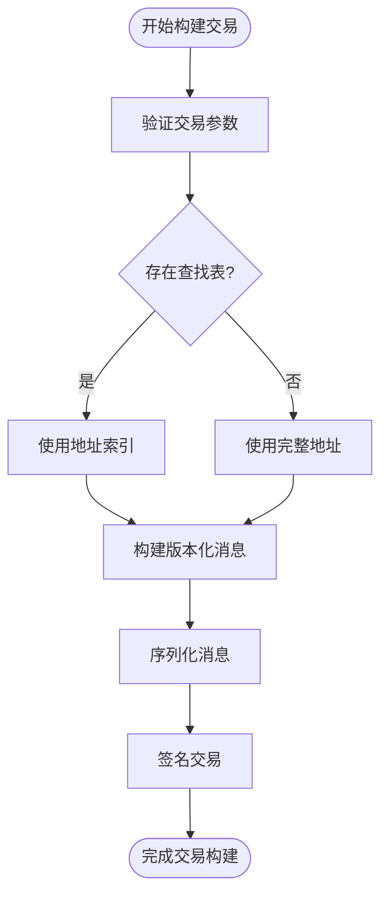

# 地址查找表示例详解

<cite>
**本文档引用的文件**  
- [main.rs](file://examples/address_lookup/src/main.rs)
- [address_lookup.rs](file://src/common/address_lookup.rs)
- [transaction_builder.rs](file://src/trading/common/transaction_builder.rs)
- [params.rs](file://src/trading/core/params.rs)
- [lib.rs](file://src/lib.rs)
</cite>

## 目录
1. [项目结构](#项目结构)
2. [核心组件](#核心组件)
3. [地址查找表集成流程](#地址查找表集成流程)
4. [交易构建器与序列化优化](#交易构建器与序列化优化)
5. [使用场景与管理建议](#使用场景与管理建议)

## 项目结构

**Diagram sources**
- [main.rs](file://examples/address_lookup/src/main.rs)
- [address_lookup.rs](file://src/common/address_lookup.rs)
- [transaction_builder.rs](file://src/trading/common/transaction_builder.rs)
- [params.rs](file://src/trading/core/params.rs)
- [lib.rs](file://src/lib.rs)

**Section sources**
- [main.rs](file://examples/address_lookup/src/main.rs)
- [address_lookup.rs](file://src/common/address_lookup.rs)

## 核心组件

`address_lookup`示例展示了如何通过地址查找表（Address Lookup Table, ALT）优化大规模交易的性能和成本。该机制允许将频繁访问的账户地址预加载到紧凑的查找表中，从而在交易中使用索引而非完整的32字节地址，显著减少交易大小。

在示例中，`fetch_address_lookup_table_account`函数负责从RPC获取指定地址的查找表账户信息。此函数返回一个`AddressLookupTableAccount`结构体，其中包含所有预加载的地址列表，供后续交易使用。

**Section sources**
- [main.rs](file://examples/address_lookup/src/main.rs#L113-L168)
- [address_lookup.rs](file://src/common/address_lookup.rs#L6-L17)

## 地址查找表集成流程

地址查找表的使用流程包括创建、扩展和实际应用三个阶段。在`pumpfun_copy_trade_with_grpc`函数中，首先通过`Pubkey::from_str`指定查找表的公钥，然后调用`fetch_address_lookup_table_account`异步获取该表的账户数据。

获取到的`address_lookup_table_account`被直接传递给`TradeBuyParams`结构体的`address_lookup_table_account`字段。这一集成点使得交易构建器能够在序列化时利用查找表中的地址索引，从而大幅压缩交易体积。

**Diagram sources**
- [main.rs](file://examples/address_lookup/src/main.rs#L123-L154)
- [params.rs](file://src/trading/core/params.rs#L107-L108)

**Section sources**
- [main.rs](file://examples/address_lookup/src/main.rs#L123-L154)
- [params.rs](file://src/trading/core/params.rs#L107-L108)

## 交易构建器与序列化优化

`build_transaction`函数是实现地址查找表优化的核心。当传入`address_lookup_table_account`时，构建器会使用`build_zero_alloc`方法进行零分配构建，利用查找表中的地址索引来生成紧凑的消息格式。

在`build_versioned_transaction`中，`versioned_msg.serialize()`生成的交易消息大小显著减小，因为每个地址仅需1字节索引而非32字节完整地址。这种优化不仅降低了交易费用，还提高了网络传输效率和验证速度。

此外，`SolanaTrade`结构体通过`buy`和`sell`方法统一处理交易参数，确保`address_lookup_table_account`能够无缝传递至底层构建流程，实现端到端的优化。

**Diagram sources**
- [transaction_builder.rs](file://src/trading/common/transaction_builder.rs#L71-L116)
- [lib.rs](file://src/lib.rs#L406-L407)

**Section sources**
- [transaction_builder.rs](file://src/trading/common/transaction_builder.rs#L18-L122)
- [lib.rs](file://src/lib.rs#L369-L456)

## 使用场景与管理建议

地址查找表特别适用于高频交易、批量操作和复杂多跳交易等场景。建议将常用的DEX程序地址、流动性池地址和稳定币地址预加载到查找表中，以最大化优化效果。

管理开销方面，需要定期维护查找表，及时添加新出现的热门代币地址，并移除不再活跃的地址。同时，应评估查找表的生命周期与交易频率的匹配度，避免为低频交易支付额外的维护成本。

与Nonce机制协同使用时，可通过持久化Nonce信息结合查找表来实现高可靠性交易。例如，在`TradeBuyParams`中同时设置`durable_nonce`和`address_lookup_table_account`，既保证交易顺序性又优化交易大小。

**Section sources**
- [main.rs](file://examples/address_lookup/src/main.rs#L127-L130)
- [params.rs](file://src/trading/core/params.rs#L117-L118)
- [lib.rs](file://src/lib.rs#L419-L420)