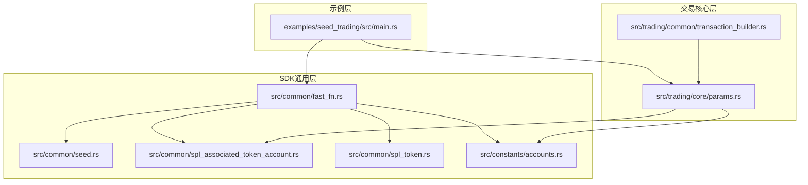
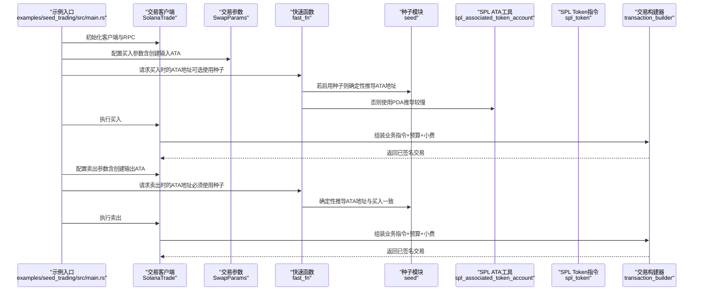
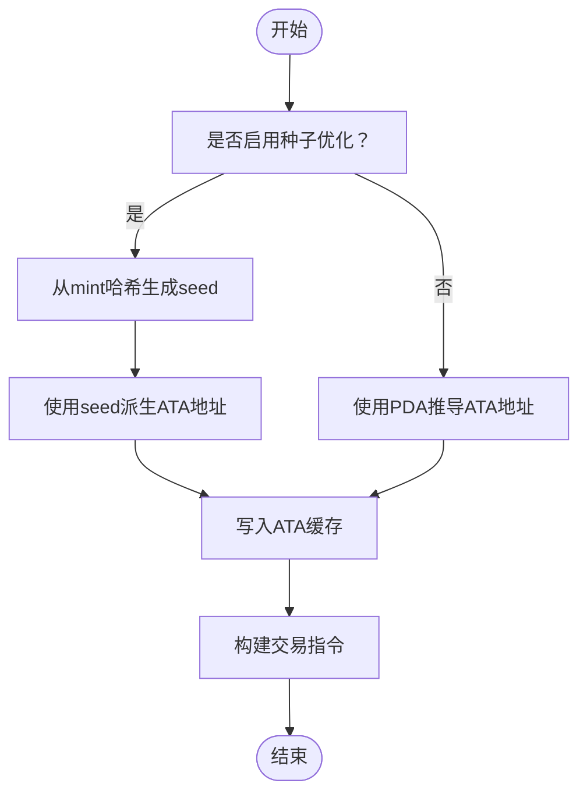
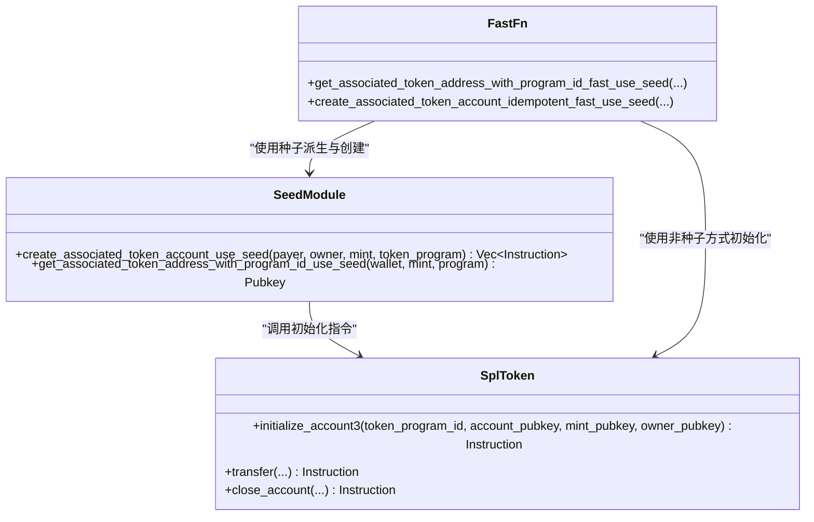
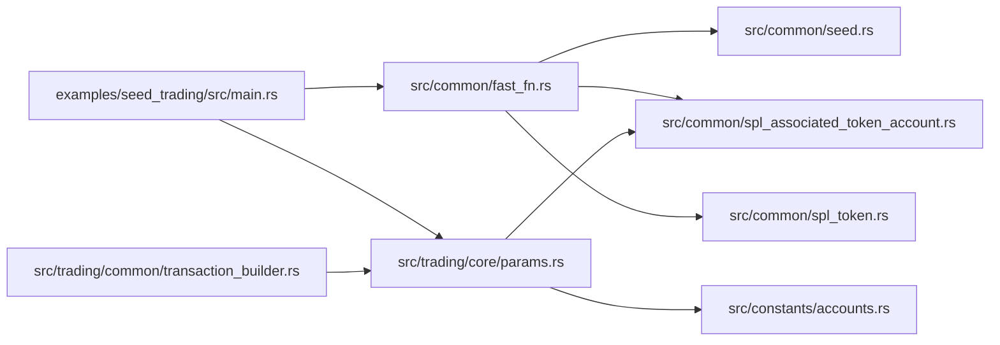

# 种子优化交易示例详解

<cite>
**本文引用的文件**
- [examples/seed_trading/src/main.rs](file://examples/seed_trading/src/main.rs)
- [src/common/fast_fn.rs](file://src/common/fast_fn.rs)
- [src/common/seed.rs](file://src/common/seed.rs)
- [src/common/spl_associated_token_account.rs](file://src/common/spl_associated_token_account.rs)
- [src/common/spl_token.rs](file://src/common/spl_token.rs)
- [src/constants/accounts.rs](file://src/constants/accounts.rs)
- [src/constants/trade.rs](file://src/constants/trade.rs)
- [src/trading/core/params.rs](file://src/trading/core/params.rs)
- [src/trading/common/transaction_builder.rs](file://src/trading/common/transaction_builder.rs)
</cite>

## 目录
1. [引言](#引言)
2. [项目结构](#项目结构)
3. [核心组件](#核心组件)
4. [架构总览](#架构总览)
5. [详细组件分析](#详细组件分析)
6. [依赖关系分析](#依赖关系分析)
7. [性能考量](#性能考量)
8. [故障排查指南](#故障排查指南)
9. [结论](#结论)
10. [附录](#附录)

## 引言
本文件围绕“seed_trading”示例，系统讲解如何通过“种子优化”技术加速关联代币账户（ATA）的创建与复用，从而在高频交易中显著降低交易延迟与Gas费用。文档重点包括：
- 基于确定性种子生成密钥对的原理与优势
- SeedManager 的使用方法与账户预计算策略
- 与 SPL Token 模块的集成方式
- 交易延迟与Gas节省的实际贡献分析
- 安全使用建议与密钥管理最佳实践

## 项目结构
seed_trading 示例位于 examples/seed_trading，核心逻辑通过 SDK 中的 fast_fn 与 seed 模块实现 ATA 地址的确定性推导与指令缓存，配合交易参数配置完成买入与卖出流程。

图表来源
- [examples/seed_trading/src/main.rs](file://examples/seed_trading/src/main.rs#L1-L109)
- [src/common/fast_fn.rs](file://src/common/fast_fn.rs#L1-L310)
- [src/common/seed.rs](file://src/common/seed.rs#L1-L118)
- [src/common/spl_associated_token_account.rs](file://src/common/spl_associated_token_account.rs#L1-L72)
- [src/common/spl_token.rs](file://src/common/spl_token.rs#L1-L78)
- [src/constants/accounts.rs](file://src/constants/accounts.rs#L1-L61)
- [src/trading/core/params.rs](file://src/trading/core/params.rs#L1-L709)
- [src/trading/common/transaction_builder.rs](file://src/trading/common/transaction_builder.rs#L1-L122)

章节来源
- [examples/seed_trading/src/main.rs](file://examples/seed_trading/src/main.rs#L1-L109)
- [src/common/fast_fn.rs](file://src/common/fast_fn.rs#L1-L310)
- [src/common/seed.rs](file://src/common/seed.rs#L1-L118)
- [src/common/spl_associated_token_account.rs](file://src/common/spl_associated_token_account.rs#L1-L72)
- [src/common/spl_token.rs](file://src/common/spl_token.rs#L1-L78)
- [src/constants/accounts.rs](file://src/constants/accounts.rs#L1-L61)
- [src/trading/core/params.rs](file://src/trading/core/params.rs#L1-L709)
- [src/trading/common/transaction_builder.rs](file://src/trading/common/transaction_builder.rs#L1-L122)

## 核心组件
- SeedManager（在 SDK 中体现为 fast_fn 与 seed 模块）：负责 ATA 地址的确定性推导、指令缓存与租金额缓存，避免重复计算与RPC查询。
- SPL Token 集成：提供 Token 与 Token-2022 初始化指令，配合种子创建账户。
- 交易参数与构建：通过 SwapParams 控制是否启用种子优化、是否自动创建/关闭 ATA，交易构建器负责打包与签名。

章节来源
- [src/common/fast_fn.rs](file://src/common/fast_fn.rs#L1-L310)
- [src/common/seed.rs](file://src/common/seed.rs#L1-L118)
- [src/common/spl_token.rs](file://src/common/spl_token.rs#L1-L78)
- [src/trading/core/params.rs](file://src/trading/core/params.rs#L1-L709)

## 架构总览
下图展示了从示例入口到交易执行的关键路径，突出种子优化在 ATA 推导与指令缓存中的作用。

图表来源
- [examples/seed_trading/src/main.rs](file://examples/seed_trading/src/main.rs#L1-L109)
- [src/common/fast_fn.rs](file://src/common/fast_fn.rs#L1-L310)
- [src/common/seed.rs](file://src/common/seed.rs#L1-L118)
- [src/common/spl_associated_token_account.rs](file://src/common/spl_associated_token_account.rs#L1-L72)
- [src/common/spl_token.rs](file://src/common/spl_token.rs#L1-L78)
- [src/trading/common/transaction_builder.rs](file://src/trading/common/transaction_builder.rs#L1-L122)

## 详细组件分析

### SeedManager 使用方法与账户预计算策略
- 确定性种子生成原理
  - 通过 token mint 的哈希片段生成固定 seed 字符串，再以钱包地址、seed、token program 作为参数调用带种子的账户派生函数，得到确定性 ATA 地址。
  - 该方法避免了 PDA 推导所需的系统级查找，显著降低延迟与RPC成本。
- 账户预计算与缓存
  - fast_fn 提供 ATA 缓存与指令缓存，命中缓存时直接返回已计算结果或指令集合，避免重复计算。
  - seed 模块提供租金额缓存与后台更新任务，确保创建账户所需最小余额准确可用。
- 使用建议
  - 在高频交易场景中，务必在买入与卖出两端使用相同的 token program 与 mint，以保证两端推导出的 ATA 地址一致。
  - 对于 wSOL/SOL 这类特殊 mint，不建议使用种子方式，SDK 已内置白名单保护。

图表来源
- [src/common/fast_fn.rs](file://src/common/fast_fn.rs#L1-L310)
- [src/common/seed.rs](file://src/common/seed.rs#L1-L118)

章节来源
- [src/common/fast_fn.rs](file://src/common/fast_fn.rs#L1-L310)
- [src/common/seed.rs](file://src/common/seed.rs#L1-L118)

### 与 SPL Token 模块的集成方式
- 初始化账户
  - 对于 Token-2022 与 Token，分别调用对应的初始化指令，确保账户 owner、mint、程序 ID 正确。
- 关闭账户
  - 提供关闭指令封装，便于在卖出后清理 ATA，减少长期占用。
- 与 ATA 创建的关系
  - 当启用种子优化时，先确定性派生 ATA 地址，再通过系统程序创建账户并初始化，最后返回两条指令（创建+初始化）。

图表来源
- [src/common/spl_token.rs](file://src/common/spl_token.rs#L1-L78)
- [src/common/seed.rs](file://src/common/seed.rs#L1-L118)
- [src/common/fast_fn.rs](file://src/common/fast_fn.rs#L1-L310)

章节来源
- [src/common/spl_token.rs](file://src/common/spl_token.rs#L1-L78)
- [src/common/seed.rs](file://src/common/seed.rs#L1-L118)
- [src/common/fast_fn.rs](file://src/common/fast_fn.rs#L1-L310)

### 示例入口与高频交易优势
- 示例要点
  - 买入阶段启用创建输入 ATA 与关闭输入 ATA，卖出阶段启用创建输出 ATA 与关闭输出 ATA。
  - 卖出前通过“使用种子”的方法精确获取 ATA 地址，确保与买入一致，避免因PDA差异导致的失败。
- 高频交易优势
  - 通过 ATA 缓存与指令缓存，避免重复计算与RPC查询，显著降低交易构建时间。
  - 租金额缓存与后台刷新，减少动态查询带来的抖动。
  - 交易构建器采用零分配消息构建与签名，进一步缩短端到端延迟。

章节来源
- [examples/seed_trading/src/main.rs](file://examples/seed_trading/src/main.rs#L1-L109)
- [src/trading/common/transaction_builder.rs](file://src/trading/common/transaction_builder.rs#L1-L122)

## 依赖关系分析
- 示例依赖 fast_fn 与 seed 模块进行 ATA 地址确定性推导与指令缓存。
- 交易参数模块根据 DEX 类型与 mint 程序选择是否使用种子优化。
- 交易构建器负责组装指令、设置预算、添加小费与签名。

图表来源
- [examples/seed_trading/src/main.rs](file://examples/seed_trading/src/main.rs#L1-L109)
- [src/common/fast_fn.rs](file://src/common/fast_fn.rs#L1-L310)
- [src/common/seed.rs](file://src/common/seed.rs#L1-L118)
- [src/common/spl_associated_token_account.rs](file://src/common/spl_associated_token_account.rs#L1-L72)
- [src/common/spl_token.rs](file://src/common/spl_token.rs#L1-L78)
- [src/trading/core/params.rs](file://src/trading/core/params.rs#L1-L709)
- [src/trading/common/transaction_builder.rs](file://src/trading/common/transaction_builder.rs#L1-L122)
- [src/constants/accounts.rs](file://src/constants/accounts.rs#L1-L61)

章节来源
- [examples/seed_trading/src/main.rs](file://examples/seed_trading/src/main.rs#L1-L109)
- [src/common/fast_fn.rs](file://src/common/fast_fn.rs#L1-L310)
- [src/common/seed.rs](file://src/common/seed.rs#L1-L118)
- [src/common/spl_associated_token_account.rs](file://src/common/spl_associated_token_account.rs#L1-L72)
- [src/common/spl_token.rs](file://src/common/spl_token.rs#L1-L78)
- [src/trading/core/params.rs](file://src/trading/core/params.rs#L1-L709)
- [src/trading/common/transaction_builder.rs](file://src/trading/common/transaction_builder.rs#L1-L122)
- [src/constants/accounts.rs](file://src/constants/accounts.rs#L1-L61)

## 性能考量
- 延迟降低
  - 确定性种子派生替代 PDA 推导，避免系统级查找与RPC往返。
  - ATA 缓存与指令缓存减少重复计算与内存复制。
  - 交易构建器采用零分配消息构建与签名，降低CPU与内存压力。
- Gas 节省
  - 减少RPC查询与系统级查找，间接降低交易大小与单位消耗。
  - 通过租金额缓存与后台刷新，避免因动态查询导致的额外开销。
- 可靠性
  - 租金额缓存使用原子变量与后台定时刷新，保证多线程可见性与准确性。
  - 白名单保护特殊 mint（如 wSOL/SOL），避免错误使用种子。

章节来源
- [src/common/seed.rs](file://src/common/seed.rs#L1-L118)
- [src/common/fast_fn.rs](file://src/common/fast_fn.rs#L1-L310)
- [src/trading/common/transaction_builder.rs](file://src/trading/common/transaction_builder.rs#L1-L122)

## 故障排查指南
- 问题：卖出失败，提示 ATA 地址不匹配
  - 排查：确认买入与卖出两端均使用“使用种子”的方法获取 ATA 地址，并且 token program 一致。
  - 参考：示例中明确要求在卖出前使用“使用种子”的方法获取 ATA。
- 问题：租金额未初始化导致创建账户失败
  - 排查：确保已启动租金额缓存后台更新任务，或手动初始化后再使用。
  - 参考：seed 模块提供后台更新与初始化检查。
- 问题：wSOL/SOL mint 使用种子导致异常
  - 排查：SDK 默认不使用种子方式处理 wSOL/SOL，若强制使用可能引发不一致。
  - 参考：fast_fn 内部白名单保护，避免对特殊 mint 使用种子。

章节来源
- [examples/seed_trading/src/main.rs](file://examples/seed_trading/src/main.rs#L1-L109)
- [src/common/seed.rs](file://src/common/seed.rs#L1-L118)
- [src/common/fast_fn.rs](file://src/common/fast_fn.rs#L1-L310)

## 结论
seed_trading 示例展示了通过“确定性种子派生 + 指令/地址缓存 + 租金额缓存 + 零分配交易构建”的组合拳，在高频交易中显著降低延迟与Gas成本。关键在于：
- 两端一致使用“使用种子”的 ATA 地址推导
- 充分利用缓存与后台刷新机制
- 正确集成 SPL Token 指令与交易构建器
- 遵循白名单保护与安全实践

## 附录
- 常量与默认参数参考
  - 默认滑点、RPC预算与单位价格等可在常量模块中查阅，便于统一配置与调优。
- 交易参数要点
  - open_seed_optimize 字段控制是否启用种子优化
  - create_*_mint_ata/close_*_mint_ata 控制 ATA 生命周期管理

章节来源
- [src/constants/trade.rs](file://src/constants/trade.rs#L1-L9)
- [src/trading/core/params.rs](file://src/trading/core/params.rs#L1-L709)