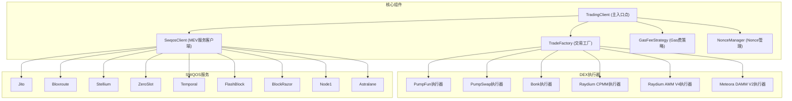
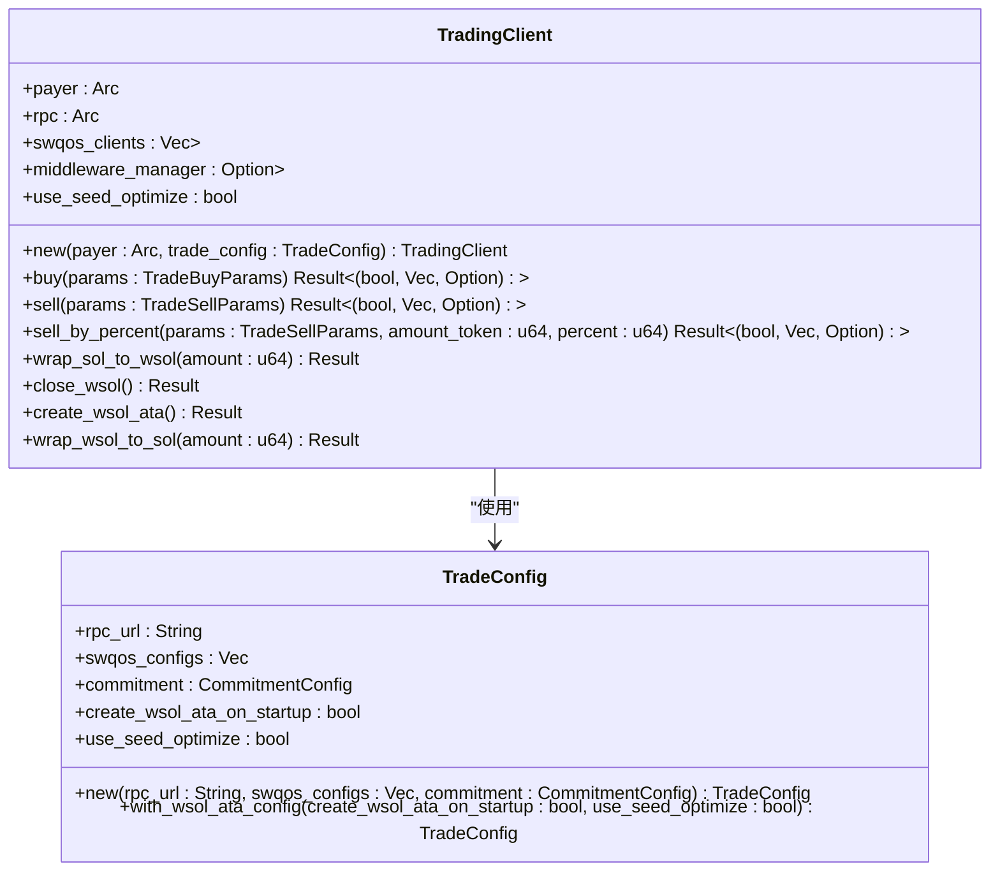
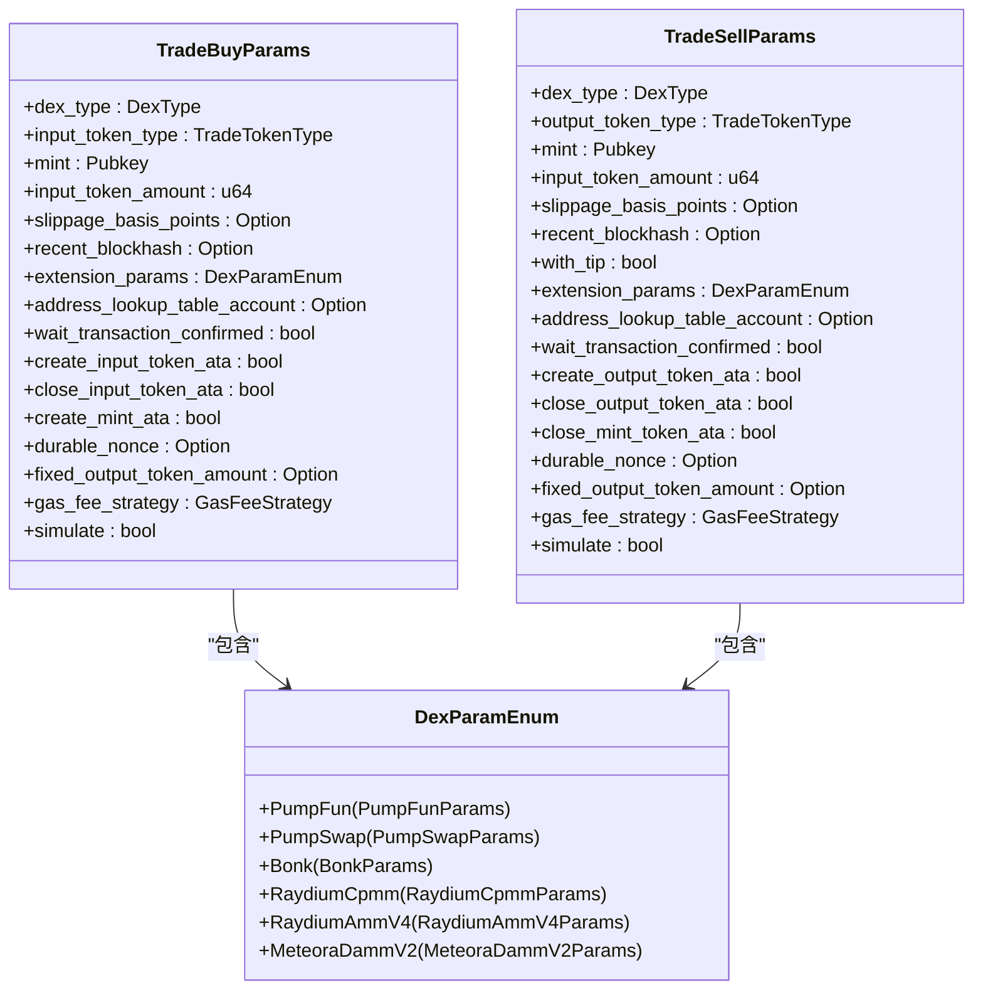
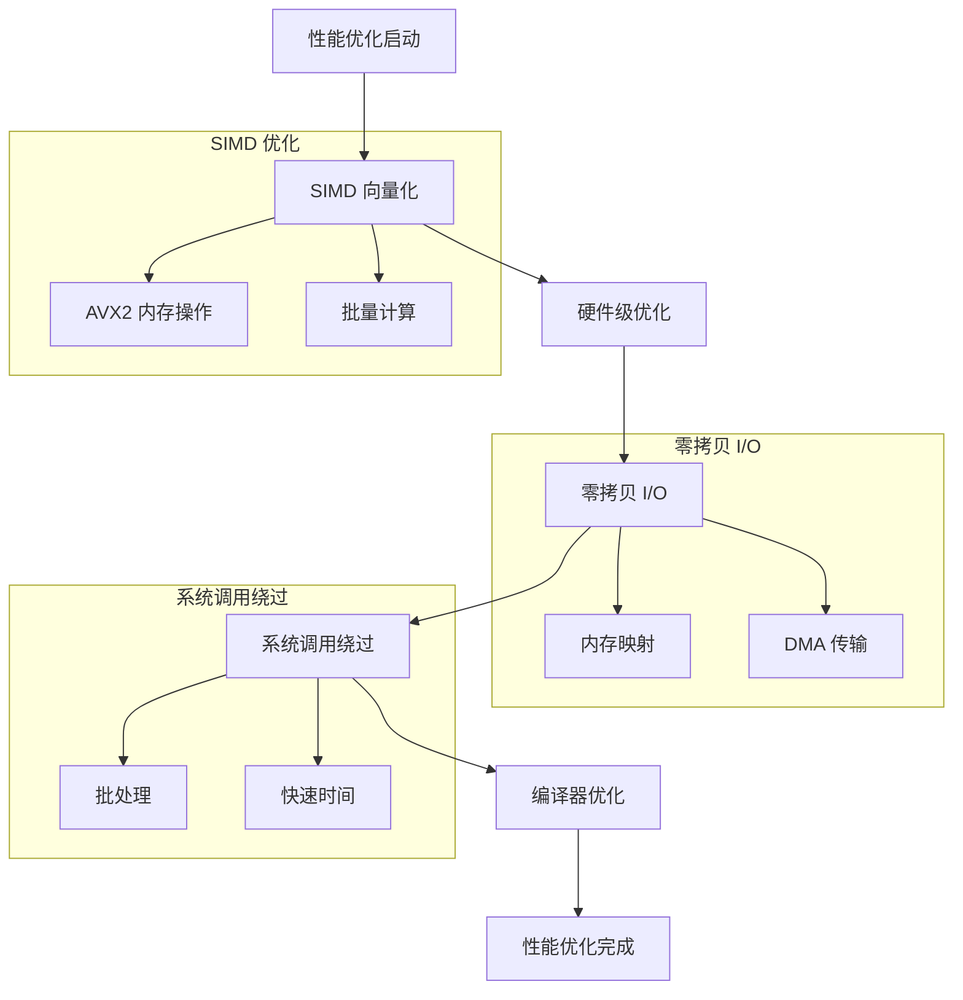
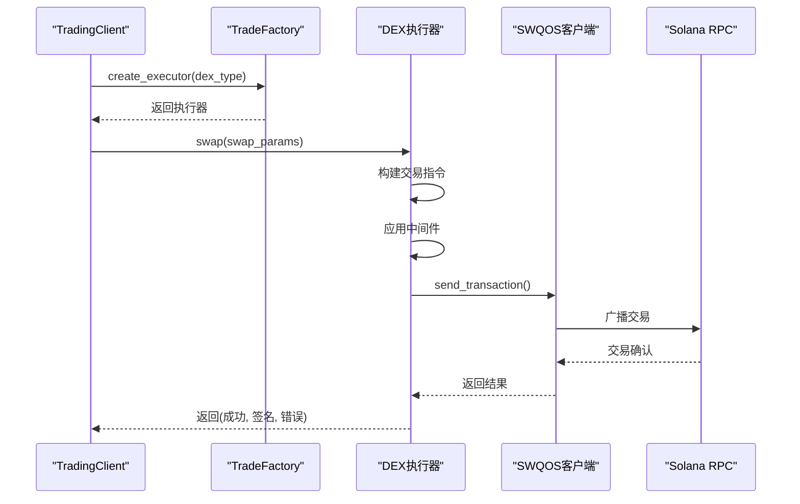
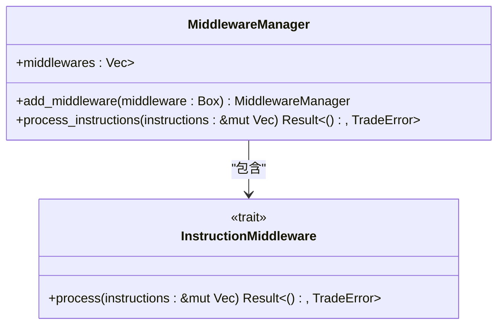
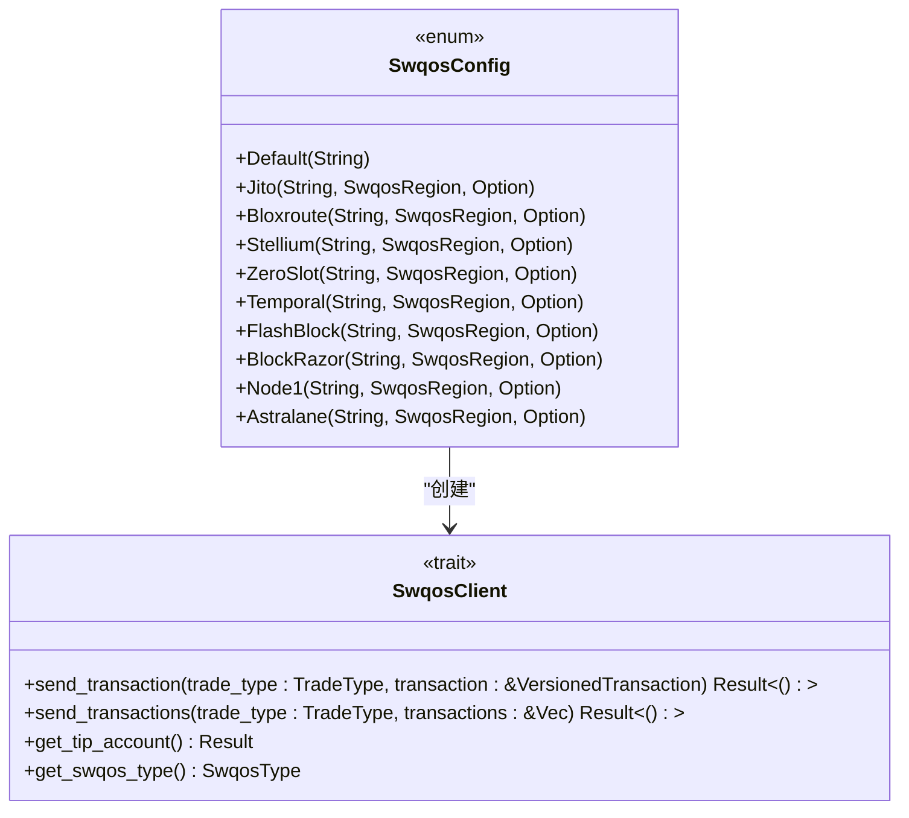

# 项目概述

<cite>
**本文档引用的文件**  
- [README.md](file://README.md)
- [README_CN.md](file://README_CN.md)
- [Cargo.toml](file://Cargo.toml)
- [src/lib.rs](file://src/lib.rs)
- [src/trading/mod.rs](file://src/trading/mod.rs)
- [src/swqos/mod.rs](file://src/swqos/mod.rs)
- [src/perf/mod.rs](file://src/perf/mod.rs)
- [src/trading/factory.rs](file://src/trading/factory.rs)
- [src/common/mod.rs](file://src/common/mod.rs)
</cite>

## 目录
1. [项目简介](#项目简介)
2. [核心架构与设计目标](#核心架构与设计目标)
3. [核心组件分析](#核心组件分析)
4. [性能优化技术](#性能优化技术)
5. [交易执行流程](#交易执行流程)
6. [中间件系统](#中间件系统)
7. [SWQOS服务质量提供商集成](#swqos服务质量提供商集成)
8. [应用场景](#应用场景)
9. [使用示例与文档覆盖](#使用示例与文档覆盖)

## 项目简介

Sol Trade SDK 是一个高性能的 Rust SDK，旨在为 Solana 生态系统中的去中心化交易所（DEX）提供统一、低延迟的交易接口。该项目支持 PumpFun、PumpSwap、Bonk、Raydium 和 Meteora 等主流 DEX 协议，通过统一的交易协议枚举和类型安全的参数抽象，实现了跨平台交易的无缝集成。

SDK 的核心设计目标是为自动化交易策略（如狙击交易、复制交易）提供可靠且高效的基础设施。它通过集成多种 MEV（最大可提取价值）保护服务，确保交易能够在竞争激烈的市场环境中快速确认。项目同时提供中英文文档，满足不同开发者群体的需求。

**Section sources**
- [README.md](file://README.md#L1-L321)
- [README_CN.md](file://README_CN.md#L1-L322)

## 核心架构与设计目标

Sol Trade SDK 采用模块化架构设计，将交易逻辑、网络通信、性能优化和中间件处理分离，确保系统的可维护性和扩展性。其核心设计目标包括：

1. **统一交易接口**：通过 `DexType` 枚举和 `DexParamEnum` 类型安全参数，为不同 DEX 协议提供一致的交易体验。
2. **低延迟优化**：集成 SIMD、零拷贝 I/O、内核旁路等超低延迟技术，最小化交易执行时间。
3. **MEV 保护**：支持 Jito、Bloxroute、Stellium 等多种 SWQOS 服务质量提供商，通过并发交易提高成功率。
4. **模块化中间件**：提供可扩展的中间件系统，允许开发者在交易执行前修改、添加或移除指令。

架构上，SDK 以 `TradingClient` 为核心入口点，协调 DEX 执行器、SWQOS 广播、Nonce 管理和 Gas 费策略等组件。这种设计使得开发者能够专注于交易策略的实现，而无需关心底层复杂的网络和协议细节。

**Diagram sources **
- [src/lib.rs](file://src/lib.rs#L40-L762)
- [src/trading/factory.rs](file://src/trading/factory.rs#L1-L99)
- [src/swqos/mod.rs](file://src/swqos/mod.rs#L1-L344)

## 核心组件分析

### TradingClient 主入口点

`TradingClient` 是 SDK 的核心组件，负责协调所有交易相关操作。它通过 `TradeConfig` 配置对象初始化，包含 RPC 连接、SWQOS 配置和提交级别等关键参数。客户端支持并发交易，能够同时通过多个 MEV 服务发送交易，确保最快的成功交易被确认。

**Diagram sources **
- [src/lib.rs](file://src/lib.rs#L40-L762)

### 交易参数系统

SDK 提供了类型安全的交易参数系统，通过 `TradeBuyParams` 和 `TradeSellParams` 结构体封装所有交易配置。这些参数包括 DEX 类型、输入/输出代币类型、滑点容忍度、地址查找表、Nonce 信息和 Gas 费策略等。

**Diagram sources **
- [src/lib.rs](file://src/lib.rs#L80-L170)

## 性能优化技术

Sol Trade SDK 在性能优化方面采用了多层次的技术栈，确保在高并发交易场景下的低延迟和高吞吐量。

### SIMD 与零拷贝 I/O

通过 `perf` 模块中的 SIMD（单指令多数据）优化，SDK 能够在批量计算和内存操作中实现向量化处理，显著提升计算效率。零拷贝 I/O 技术通过内存映射和 DMA 传输，减少了数据在用户空间和内核空间之间的复制开销。

**Diagram sources **
- [src/perf/mod.rs](file://src/perf/mod.rs#L1-L21)

### 编译器与硬件优化

SDK 在 `Cargo.toml` 中配置了高级编译器优化，包括最高优化级别（opt-level = 3）、瘦 LTO（链接时优化）和增量编译。这些配置在保证编译速度的同时，最大化运行时性能。硬件级优化包括分支预测和缓存预取，进一步减少指令执行延迟。

## 交易执行流程

### 交易协调机制

`TradingClient` 通过 `TradeFactory` 创建特定 DEX 的执行器，并协调 SWQOS 广播、Nonce 管理和 Gas 费策略。交易执行流程如下：

1. **参数验证**：检查交易参数的有效性，确保协议参数与 DEX 类型匹配。
2. **指令构建**：根据 DEX 类型和参数构建交易指令。
3. **中间件处理**：应用配置的中间件对指令进行修改、添加或移除。
4. **交易广播**：通过配置的 SWQOS 客户端并发广播交易。
5. **结果处理**：收集所有交易结果，返回成功状态和交易签名。

**Diagram sources **
- [src/lib.rs](file://src/lib.rs#L369-L572)
- [src/trading/factory.rs](file://src/trading/factory.rs#L1-L99)

## 中间件系统

SDK 提供了强大的中间件系统，允许开发者在交易执行前对指令进行自定义处理。中间件按照添加顺序依次执行，支持修改、添加或移除指令。

**Diagram sources **
- [src/trading/mod.rs](file://src/trading/mod.rs#L1-L10)

## SWQOS服务质量提供商集成

SDK 支持多种 SWQOS 服务质量提供商，包括 Jito、Bloxroute、Stellium、ZeroSlot、Temporal、FlashBlock、BlockRazor、Node1 和 Astralane。这些服务通过 `SwqosConfig` 配置，支持自定义 URL 和区域端点。

**Diagram sources **
- [src/swqos/mod.rs](file://src/swqos/mod.rs#L1-L344)

## 应用场景

### 狙击交易

通过配置低延迟的 SWQOS 服务（如 Jito 或 ZeroSlot），SDK 能够在新代币上线时快速执行买入操作，实现狙击交易策略。

### 复制交易

利用中间件系统，开发者可以监听成功交易并复制其指令，实现跟单交易策略。SDK 支持 PumpFun、PumpSwap 和 Bonk 等平台的复制交易。

### 自动化策略

结合 Gas 费策略和 Durable Nonce，SDK 支持复杂的自动化交易策略，如网格交易、套利交易和止损止盈。

## 使用示例与文档覆盖

### 使用示例

项目提供了丰富的使用示例，涵盖各种交易场景：

- **创建 TradingClient 实例**：[examples/trading_client](https://github.com/0xfnzero/sol-trade-sdk/tree/main/examples/trading_client/src/main.rs)
- **PumpFun 狙击交易**：[examples/pumpfun_sniper_trading](https://github.com/0xfnzero/sol-trade-sdk/tree/main/examples/pumpfun_sniper_trading/src/main.rs)
- **Bonk 复制交易**：[examples/bonk_copy_trading](https://github.com/0xfnzero/sol-trade-sdk/tree/main/examples/bonk_copy_trading/src/main.rs)
- **中间件系统示例**：[examples/middleware_system](https://github.com/0xfnzero/sol-trade-sdk/tree/main/examples/middleware_system/src/main.rs)

### 文档覆盖

项目提供中英文双语文档，确保全球开发者能够无障碍使用。中文文档覆盖了所有核心功能和使用示例，与英文文档保持同步更新。

**Section sources**
- [README.md](file://README.md#L195-L214)
- [README_CN.md](file://README_CN.md#L195-L214)