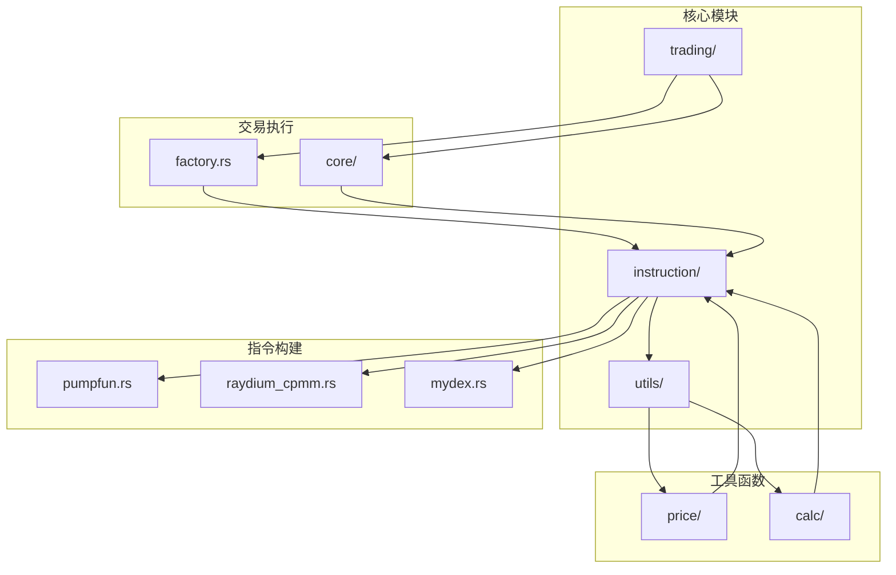
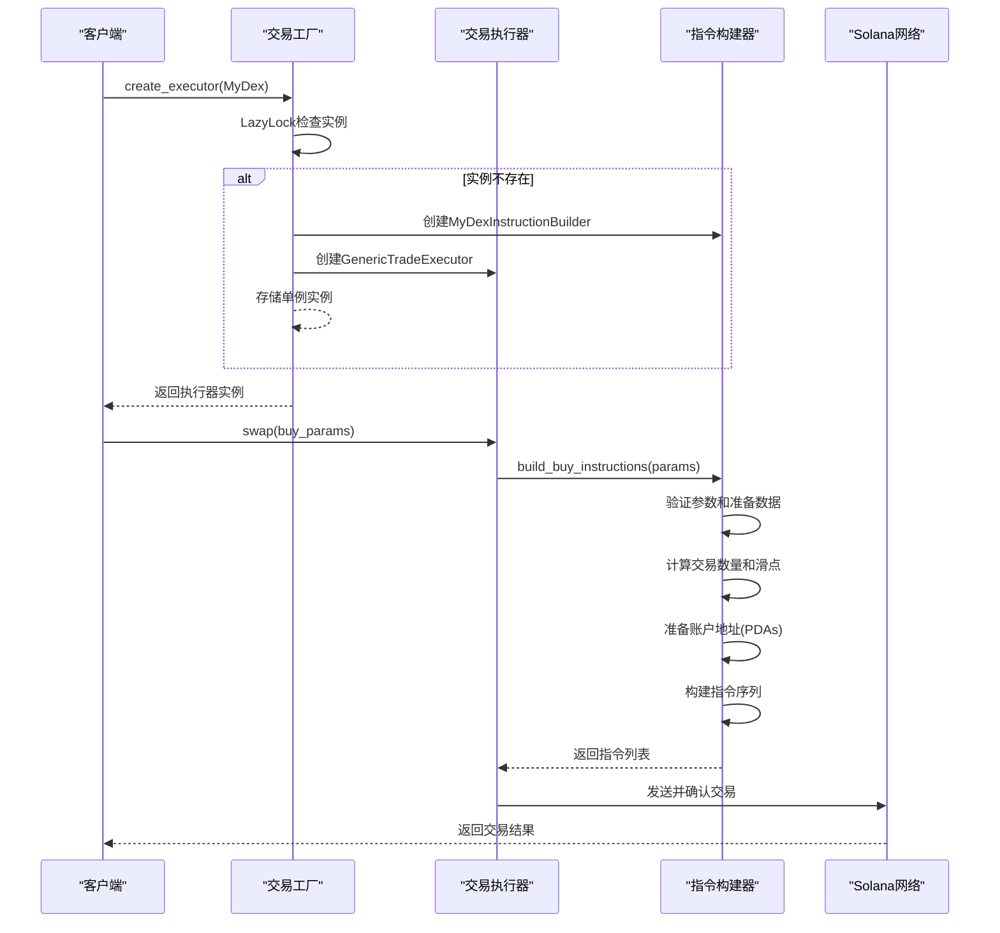
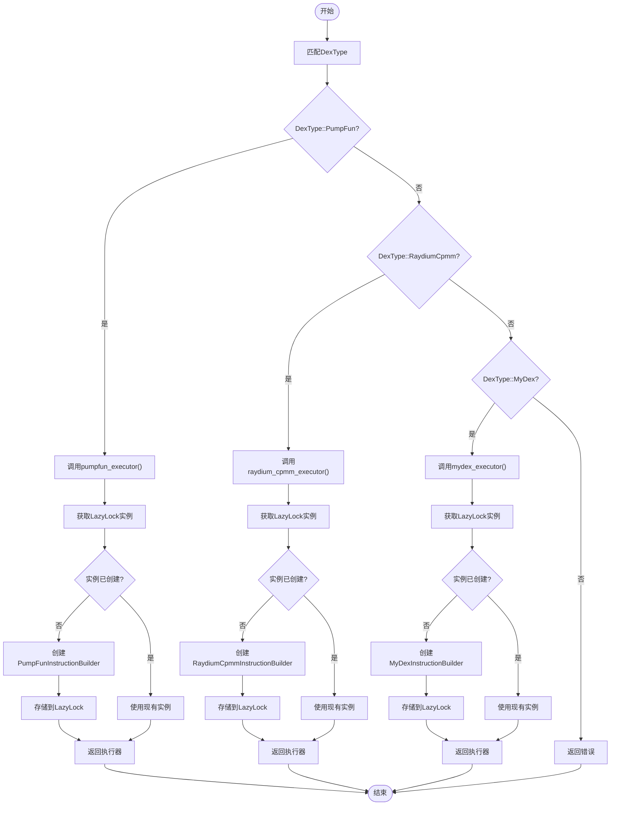
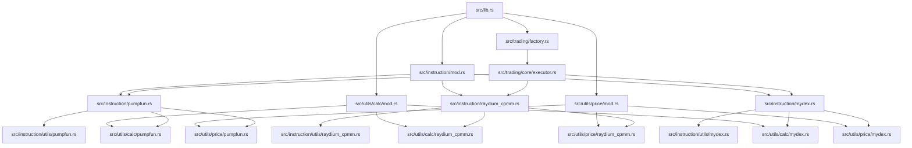

# 添加新DEX支持

<cite>
**本文档中引用的文件**  
- [src/instruction/mydex.rs](file://src/instruction/mydex.rs)
- [src/instruction/mod.rs](file://src/instruction/mod.rs)
- [src/trading/factory.rs](file://src/trading/factory.rs)
- [src/utils/price/mydex.rs](file://src/utils/price/mydex.rs)
- [src/utils/calc/mydex.rs](file://src/utils/calc/mydex.rs)
- [src/instruction/pumpfun.rs](file://src/instruction/pumpfun.rs)
- [src/instruction/raydium_cpmm.rs](file://src/instruction/raydium_cpmm.rs)
- [src/instruction/utils/pumpfun.rs](file://src/instruction/utils/pumpfun.rs)
- [src/instruction/utils/raydium_cpmm.rs](file://src/instruction/utils/raydium_cpmm.rs)
- [src/lib.rs](file://src/lib.rs)
</cite>

## 目录
1. [项目结构](#项目结构)
2. [核心组件](#核心组件)
3. [架构概述](#架构概述)
4. [详细组件分析](#详细组件分析)
5. [依赖分析](#依赖分析)
6. [性能考虑](#性能考虑)
7. [故障排除指南](#故障排除指南)
8. [结论](#结论)

## 项目结构

该Solana交易SDK的项目结构设计清晰，遵循模块化原则，便于扩展新的去中心化交易所（DEX）支持。核心功能分布在`src/`目录下的多个模块中，其中`instruction/`模块负责处理不同DEX的交易指令构建，`trading/`模块管理交易执行逻辑，`utils/`模块提供价格计算和数量计算等辅助功能。



**Diagram sources**
- [src/instruction/mod.rs](file://src/instruction/mod.rs#L1-L7)
- [src/trading/factory.rs](file://src/trading/factory.rs#L1-L99)

**Section sources**
- [src/instruction/mod.rs](file://src/instruction/mod.rs#L1-L7)
- [src/trading/factory.rs](file://src/trading/factory.rs#L1-L99)

## 核心组件

为SDK添加对新DEX的支持涉及多个核心组件的协同工作。主要组件包括指令构建器（InstructionBuilder）、交易工厂（TradeFactory）、价格计算模块和数量计算模块。指令构建器负责实现特定于DEX的交易指令序列，交易工厂负责根据DEX类型创建相应的执行器实例，而价格和数量计算模块则提供交易所需的数学计算支持。

**Section sources**
- [src/trading/factory.rs](file://src/trading/factory.rs#L11-L99)
- [src/trading/core/traits.rs](file://src/trading/core/traits.rs#L1-L26)

## 架构概述

该SDK采用基于工厂模式和策略模式的架构，允许灵活地支持多种DEX协议。核心架构围绕`InstructionBuilder` trait和`TradeFactory`展开，通过枚举类型`DexType`来区分不同的DEX，并使用`LazyLock`确保执行器实例的单例化，从而实现零运行时开销的实例创建。

```mermaid
classDiagram
class InstructionBuilder {
<<trait>>
+build_buy_instructions(params) Result~Vec~Instruction~~
+build_sell_instructions(params) Result~Vec~Instruction~~
}
class TradeExecutor {
<<trait>>
+swap(params) Result~(bool, Vec~Signature~, Option~Error~)~
+protocol_name() &'static str
}
class TradeFactory {
+create_executor(dex_type) Arc~dyn TradeExecutor~
+pumpfun_executor() Arc~dyn TradeExecutor~
+raydium_cpmm_executor() Arc~dyn TradeExecutor~
}
class GenericTradeExecutor {
-instruction_builder Arc~dyn InstructionBuilder~
-protocol_name &'static str
+new(builder, name) Self
}
class PumpFunInstructionBuilder {
+build_buy_instructions(params) Result~Vec~Instruction~~
+build_sell_instructions(params) Result~Vec~Instruction~~
}
class RaydiumCpmmInstructionBuilder {
+build_buy_instructions(params) Result~Vec~Instruction~~
+build_sell_instructions(params) Result~Vec~Instruction~~
}
InstructionBuilder <|.. PumpFunInstructionBuilder
InstructionBuilder <|.. RaydiumCpmmInstructionBuilder
InstructionBuilder <|.. MyDexInstructionBuilder
TradeExecutor <|.. GenericTradeExecutor
TradeFactory --> GenericTradeExecutor : "creates"
GenericTradeExecutor --> PumpFunInstructionBuilder : "uses"
GenericTradeExecutor --> RaydiumCpmmInstructionBuilder : "uses"
GenericTradeExecutor --> MyDexInstructionBuilder : "uses"
note right of TradeFactory
使用DexType枚举和
LazyLock单例模式
实现零开销实例创建
end note
```

**Diagram sources**
- [src/trading/factory.rs](file://src/trading/factory.rs#L11-L99)
- [src/trading/core/traits.rs](file://src/trading/core/traits.rs#L5-L26)
- [src/instruction/pumpfun.rs](file://src/instruction/pumpfun.rs#L24-L291)
- [src/instruction/raydium_cpmm.rs](file://src/instruction/raydium_cpmm.rs#L22-L309)

## 详细组件分析

### 新DEX指令构建器实现

在`src/instruction/`目录下创建新的模块（如`mydex.rs`），实现`InstructionBuilder` trait，定义构建交易指令的逻辑，包括买入、卖出等操作的指令序列。参考`pumpfun.rs`或`raydium_cpmm.rs`中的实现模式，处理特定于该DEX的账户结构、程序ID和指令数据编码。



**Diagram sources**
- [src/instruction/pumpfun.rs](file://src/instruction/pumpfun.rs#L24-L291)
- [src/instruction/raydium_cpmm.rs](file://src/instruction/raydium_cpmm.rs#L22-L309)
- [src/trading/factory.rs](file://src/trading/factory.rs#L27-L36)

**Section sources**
- [src/instruction/pumpfun.rs](file://src/instruction/pumpfun.rs#L24-L291)
- [src/instruction/raydium_cpmm.rs](file://src/instruction/raydium_cpmm.rs#L22-L309)

### 交易工厂扩展

在`src/trading/factory.rs`中更新`TradeFactory`以支持新的`DexType`枚举值（如`MyDex`），并在`create_executor`及对应工厂方法中添加分支，使用`LazyLock`创建单例执行器实例。



**Diagram sources**
- [src/trading/factory.rs](file://src/trading/factory.rs#L27-L99)

**Section sources**
- [src/trading/factory.rs](file://src/trading/factory.rs#L11-L99)

### 价格与数量计算模块

确保新DEX的价格计算逻辑在`src/utils/price/`中实现，并在`calc/`模块中添加相应的数量计算函数。这些模块提供了通用的数学计算功能，如滑点计算、费用计算等。

```mermaid
classDiagram
class PriceCalculator {
<<module>>
+price_base_in_quote(base, quote, base_decimals, quote_decimals) f64
+price_quote_in_base(base, quote, base_decimals, quote_decimals) f64
}
class CalcCommon {
<<module>>
+compute_fee(amount, fee_basis_points) u128
+ceil_div(a, b) u128
+calculate_with_slippage_buy(amount, basis_points) u64
+calculate_with_slippage_sell(amount, basis_points) u64
}
class PumpFunCalc {
<<module>>
+get_buy_token_amount_from_sol_amount(virtual_token_reserves, virtual_sol_reserves, real_token_reserves, creator, sol_amount) u64
+get_sell_sol_amount_from_token_amount(virtual_token_reserves, virtual_sol_reserves, creator, token_amount) u64
}
class RaydiumCpmmCalc {
<<module>>
+compute_swap_amount(base_reserve, quote_reserve, is_base_in, amount_in, slippage_basis_points) SwapResult
}
class MyDexCalc {
<<module>>
+mydex_specific_calculation(params) Result~u64~
}
CalcCommon --> PumpFunCalc
CalcCommon --> RaydiumCpmmCalc
CalcCommon --> MyDexCalc
PriceCalculator --> PumpFunCalc
PriceCalculator --> RaydiumCpmmCalc
PriceCalculator --> MyDexCalc
note right of CalcCommon
提供通用计算函数
如滑点、费用计算
end note
note right of PriceCalculator
提供价格计算函数
基于储备量计算
end note
```

**Diagram sources**
- [src/utils/price/common.rs](file://src/utils/price/common.rs#L1-L48)
- [src/utils/calc/common.rs](file://src/utils/calc/common.rs#L1-L68)
- [src/utils/calc/pumpfun.rs](file://src/utils/calc/pumpfun.rs)
- [src/utils/calc/raydium_cpmm.rs](file://src/utils/calc/raydium_cpmm.rs)

**Section sources**
- [src/utils/price/common.rs](file://src/utils/price/common.rs#L1-L48)
- [src/utils/calc/common.rs](file://src/utils/calc/common.rs#L1-L68)

## 依赖分析

该SDK的依赖关系清晰，各模块职责分明。`instruction/`模块依赖于`utils/`模块中的计算函数，`trading/`模块依赖于`instruction/`模块来获取交易指令，而`factory.rs`作为协调者，连接了所有组件。



**Diagram sources**
- [src/instruction/mod.rs](file://src/instruction/mod.rs#L1-L7)
- [src/trading/factory.rs](file://src/trading/factory.rs#L3-L7)
- [src/utils/price/mod.rs](file://src/utils/price/mod.rs#L1-L8)
- [src/utils/calc/mod.rs](file://src/utils/calc/mod.rs#L1-L6)

**Section sources**
- [src/instruction/mod.rs](file://src/instruction/mod.rs#L1-L7)
- [src/trading/factory.rs](file://src/trading/factory.rs#L3-L7)
- [src/utils/price/mod.rs](file://src/utils/price/mod.rs#L1-L8)
- [src/utils/calc/mod.rs](file://src/utils/calc/mod.rs#L1-L6)

## 性能考虑

该SDK在设计上充分考虑了性能优化。通过使用`LazyLock`实现单例模式，避免了重复创建执行器实例的开销。同时，利用`const fn`和内联函数（`#[inline]`）优化关键路径的性能，减少函数调用开销。此外，通过预计算和缓存PDA（程序派生地址），减少了运行时的计算负担。

## 故障排除指南

在添加新DEX支持时，常见的问题包括：
1. **指令构建失败**：检查账户地址（特别是PDA）是否正确生成，确保所有必需的账户都已包含在指令中。
2. **交易执行失败**：验证程序ID和指令数据编码是否正确，确保滑点设置合理。
3. **计算结果不准确**：确认价格和数量计算函数的输入参数正确，特别是小数位数（decimals）的处理。
4. **集成测试失败**：确保测试环境配置正确，包括RPC端点、支付密钥和测试代币余额。

## 结论

为该Solana交易SDK添加对新DEX的支持是一个结构化的过程，涉及创建新的指令构建器模块、扩展交易工厂、实现价格和数量计算函数，并进行充分的集成测试。通过遵循现有的设计模式和代码结构，可以高效地集成新的DEX协议，同时保持代码的可维护性和性能。