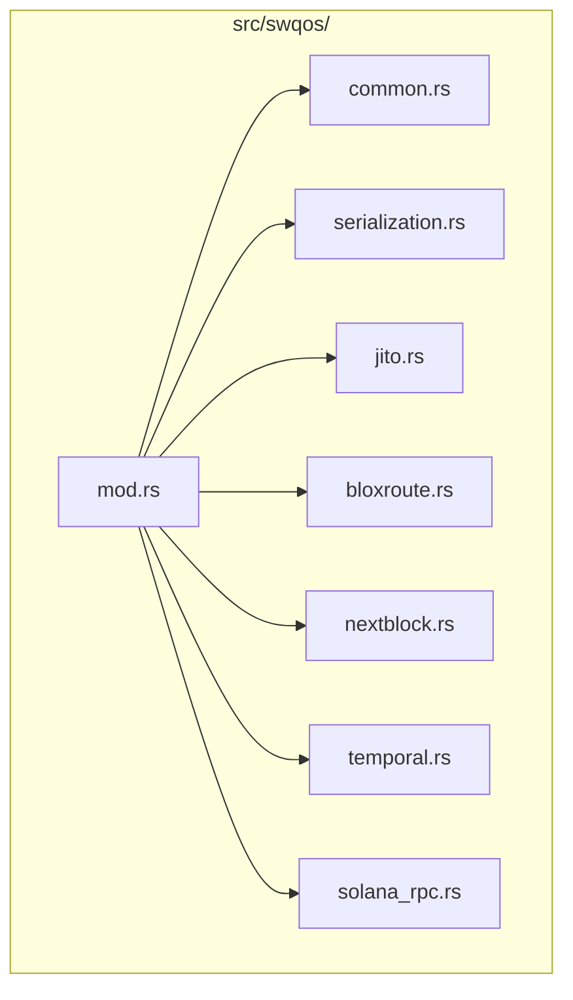
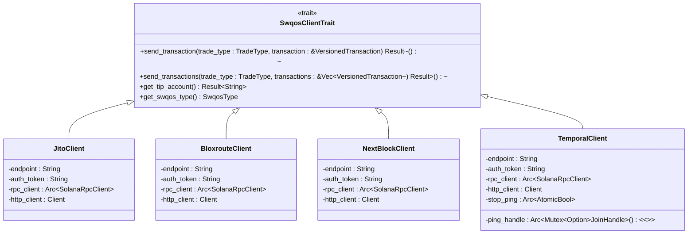
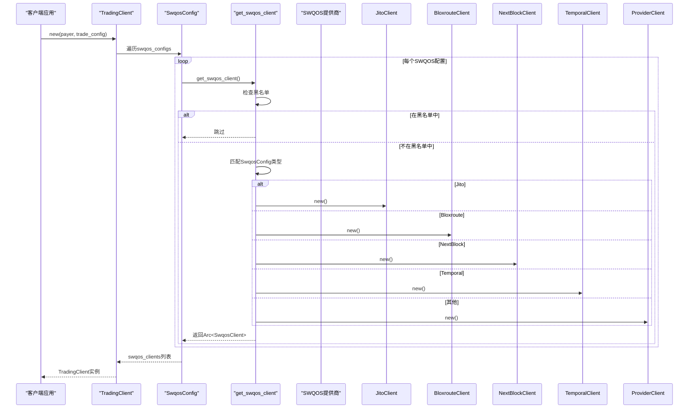
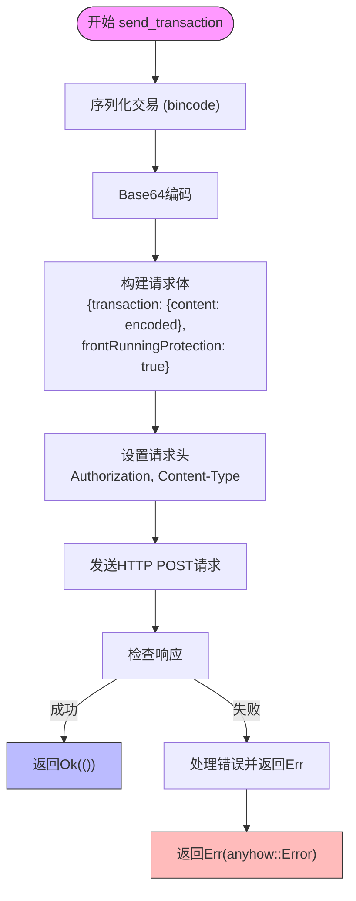
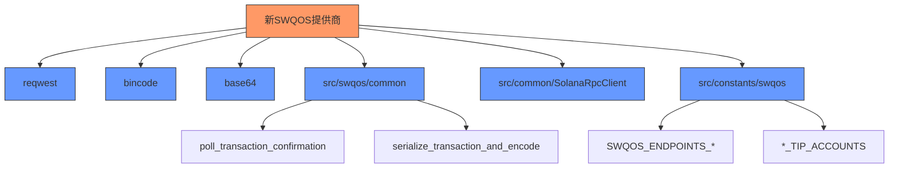

# 集成新SWQOS提供商

<cite>
**本文档中引用的文件**
- [mod.rs](file://src/swqos/mod.rs)
- [common.rs](file://src/swqos/common.rs)
- [jito.rs](file://src/swqos/jito.rs)
- [bloxroute.rs](file://src/swqos/bloxroute.rs)
- [nextblock.rs](file://src/swqos/nextblock.rs)
- [temporal.rs](file://src/swqos/temporal.rs)
- [serialization.rs](file://src/swqos/serialization.rs)
- [solana_rpc.rs](file://src/swqos/solana_rpc.rs)
- [swqos.rs](file://src/constants/swqos.rs)
</cite>

## 目录
1. [简介](#简介)
2. [项目结构](#项目结构)
3. [核心组件](#核心组件)
4. [架构概述](#架构概述)
5. [详细组件分析](#详细组件分析)
6. [依赖分析](#依赖分析)
7. [性能考虑](#性能考虑)
8. [故障排除指南](#故障排除指南)
9. [结论](#结论)

## 简介
本文档旨在指导开发者如何将新的Solana优质交易服务（SWQOS）提供商集成到SDK中。通过分析现有代码库，我们将详细介绍创建新提供商、实现核心接口、配置系统集成以及性能优化的完整流程。

## 项目结构
Solana交易SDK的`src/swqos/`目录包含了所有SWQOS提供商的实现。该目录采用模块化设计，每个提供商都有独立的Rust文件（如`jito.rs`、`bloxroute.rs`），并通过`mod.rs`文件统一导出。这种结构确保了代码的可维护性和可扩展性。

**图示来源**
- [mod.rs](file://src/swqos/mod.rs#L1-L344)

**本节来源**
- [mod.rs](file://src/swqos/mod.rs#L1-L344)

## 核心组件
集成新SWQOS提供商的核心在于实现`SwqosClientTrait` trait，该trait定义了与提供商API交互的基本方法。`SwqosClientTrait`包含两个核心异步方法：`send_transaction`用于发送单个交易，`send_transactions`用于发送交易批次。此外，`get_tip_account`方法用于获取小费账户，`get_swqos_type`用于标识提供商类型。

**图示来源**
- [mod.rs](file://src/swqos/mod.rs#L127-L133)
- [jito.rs](file://src/swqos/jito.rs#L19-L24)
- [bloxroute.rs](file://src/swqos/bloxroute.rs#L18-L23)
- [nextblock.rs](file://src/swqos/nextblock.rs#L18-L23)
- [temporal.rs](file://src/swqos/temporal.rs#L35-L43)

**本节来源**
- [mod.rs](file://src/swqos/mod.rs#L127-L133)
- [jito.rs](file://src/swqos/jito.rs#L19-L24)
- [bloxroute.rs](file://src/swqos/bloxroute.rs#L18-L23)
- [nextblock.rs](file://src/swqos/nextblock.rs#L18-L23)
- [temporal.rs](file://src/swqos/temporal.rs#L35-L43)

## 架构概述
SWQOS系统的架构围绕`SwqosConfig`枚举和`get_swqos_client`工厂方法构建。`SwqosConfig`定义了所有支持的提供商及其配置参数，而`get_swqos_client`方法根据配置动态创建相应的客户端实例。该系统还包含一个黑名单机制（`SWQOS_BLACKLIST`），允许禁用特定提供商。

**图示来源**
- [mod.rs](file://src/swqos/mod.rs#L177-L343)
- [lib.rs](file://src/lib.rs#L199-L215)

**本节来源**
- [mod.rs](file://src/swqos/mod.rs#L177-L343)
- [lib.rs](file://src/lib.rs#L199-L215)

## 详细组件分析

### 创建新提供商
要集成新的SWQOS提供商，首先需要在`src/swqos/`目录下创建一个新的Rust文件（例如`myprovider.rs`）。该文件应包含一个结构体，用于存储提供商的配置信息，如API端点、认证令牌和HTTP客户端。

**本节来源**
- [jito.rs](file://src/swqos/jito.rs#L19-L24)
- [bloxroute.rs](file://src/swqos/bloxroute.rs#L18-L23)

### 实现SwqosClientTrait
新提供商必须实现`SwqosClientTrait` trait。核心是`send_transaction`异步方法，该方法负责处理交易序列化、Base64编码，并通过HTTP客户端发送到提供商的API端点。参考`common.rs`中的`send_nb_transaction`函数，正确设置请求头（如Authorization、Content-Type）和请求体结构（包含交易内容和防抢跑选项）。

**图示来源**
- [common.rs](file://src/swqos/common.rs#L172-L211)
- [jito.rs](file://src/swqos/jito.rs#L68-L126)
- [bloxroute.rs](file://src/swqos/bloxroute.rs#L64-L110)

**本节来源**
- [common.rs](file://src/swqos/common.rs#L172-L211)
- [jito.rs](file://src/swqos/jito.rs#L68-L126)
- [bloxroute.rs](file://src/swqos/bloxroute.rs#L64-L110)

### 配置系统集成
在实现提供商客户端后，需要在配置系统中添加对应的枚举类型和路由逻辑。这包括在`SwqosConfig`枚举中添加新的变体，并在`get_swqos_client`方法中添加相应的匹配分支。同时，需要在`constants/swqos.rs`中定义提供商的端点和小费账户。

**本节来源**
- [mod.rs](file://src/swqos/mod.rs#L148-L176)
- [mod.rs](file://src/swqos/mod.rs#L224-L343)
- [swqos.rs](file://src/constants/swqos.rs#L142-L261)

### 错误处理机制
确保错误处理机制完善，能将网络错误和API响应错误转换为统一的`TradeError`。`TradeError`结构体包含错误码、错误消息和指令索引，便于开发者诊断问题。在`send_transaction`方法中，应使用`anyhow::Result`进行错误传播，并在必要时转换为`TradeError`。

**本节来源**
- [common.rs](file://src/swqos/common.rs#L19-L41)
- [jito.rs](file://src/swqos/jito.rs#L116-L120)
- [bloxroute.rs](file://src/swqos/bloxroute.rs#L100-L104)

## 依赖分析
SWQOS系统依赖于多个外部库和内部模块。主要外部依赖包括`reqwest`用于HTTP客户端，`bincode`用于高性能序列化，`base64`用于Base64编码。内部依赖包括`common`模块中的`SolanaRpcClient`和`poll_transaction_confirmation`函数，以及`constants`模块中的端点和小费账户常量。

**图示来源**
- [Cargo.toml]
- [jito.rs](file://src/swqos/jito.rs#L1-L15)
- [bloxroute.rs](file://src/swqos/bloxroute.rs#L1-L14)
- [common.rs](file://src/swqos/common.rs#L1-L18)

**本节来源**
- [Cargo.toml]
- [jito.rs](file://src/swqos/jito.rs#L1-L15)
- [bloxroute.rs](file://src/swqos/bloxroute.rs#L1-L14)
- [common.rs](file://src/swqos/common.rs#L1-L18)

## 性能考虑
为了确保高性能交易，新SWQOS提供商的实现应遵循以下性能调优建议：
- **连接池配置**：使用`reqwest::ClientBuilder`配置连接池，设置合理的空闲超时和最大空闲连接数。
- **超时设置**：为HTTP请求设置合理的超时时间，避免长时间阻塞。
- **重试策略**：实现智能重试策略，避免在网络波动时频繁重试。
- **序列化优化**：使用`bincode`进行高性能序列化，并考虑使用`zero_alloc`序列化器减少内存分配。

**本节来源**
- [jito.rs](file://src/swqos/jito.rs#L50-L63)
- [bloxroute.rs](file://src/swqos/bloxroute.rs#L47-L59)
- [serialization.rs](file://src/swqos/serialization.rs#L17-L67)

## 故障排除指南
在集成新SWQOS提供商时，可能会遇到以下常见问题：
- **认证失败**：检查API令牌是否正确，并确保请求头中正确设置了`Authorization`字段。
- **端点不可达**：验证API端点URL是否正确，并检查网络连接。
- **交易提交失败**：检查请求体结构是否符合提供商API文档要求。
- **确认超时**：调整`poll_transaction_confirmation`的超时时间，以适应网络状况。

**本节来源**
- [common.rs](file://src/swqos/common.rs#L56-L170)
- [jito.rs](file://src/swqos/jito.rs#L113-L124)
- [bloxroute.rs](file://src/swqos/bloxroute.rs#L97-L108)

## 结论
通过遵循本文档的指导，开发者可以成功地将新的SWQOS提供商集成到SDK中。关键步骤包括创建新文件、实现`SwqosClientTrait`、配置系统集成和确保完善的错误处理。遵循性能调优建议可以进一步提高交易效率和可靠性。